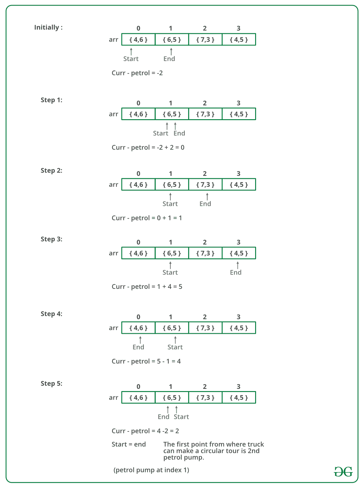

# 找到第一个参观所有汽油泵的循环游

> 原文:[https://www . geesforgeks . org/find-a-tour-the-tours-all-station/](https://www.geeksforgeeks.org/find-a-tour-that-visits-all-stations/)

假设有一个圆。那个圆圈上有 n 个汽油泵。给你两组数据。

1.  每个汽油泵的汽油量。
2.  从那个汽油泵到下一个汽油泵的距离。

计算卡车能够完成圆圈的第一个点(卡车将停在每个汽油泵处，它有无限的容量)。预期时间复杂度为 0(n)。假设 1 升汽油，卡车可以行驶 1 个单位的距离。
例如，假设有 4 个汽油泵，其汽油量和到下一个汽油泵值对的距离分别为{4，6}、{6，5}、{7，3}和{4，5}。卡车可以循环行驶的第一点是第二个汽油泵。输出应为“start = 1”(第二个汽油泵的索引)。

一个**简单的解决方案**就是把每一个汽油泵都当成一个起点，看看有没有可能的巡回赛。如果我们找到了一个可行的解决方案的起点，我们就返回那个起点。这个解决方案最差的时间复杂度是 O(n^2).
一个有效的方法是**使用队列**来存储当前的旅游。我们首先将第一个汽油泵排队，我们继续将汽油泵排队，直到我们完成旅程，或者当前的汽油量变为负值。如果数量变成负数，那么我们继续将汽油泵排出队列，直到队列变空。
我们没有创建单独的队列，而是使用给定的数组本身作为队列。我们维护两个索引变量 start 和 end，它们分别代表队列的后部和前部。

下图是上述方法的模拟运行:



下面是上述方法的实现:

## C++

```
// C++ program to find circular tour for a truck
#include <bits/stdc++.h>
using namespace std;

// A petrol pump has petrol and distance to next petrol pump
class petrolPump
{
    public:
    int petrol;
    int distance;
};

// The function returns starting point if there is a possible solution,
// otherwise returns -1
int printTour(petrolPump arr[], int n)
{
    // Consider first petrol pump as a starting point
    int start = 0;
    int end = 1;

    int curr_petrol = arr[start].petrol - arr[start].distance;

    /* Run a loop while all petrol pumps are not visited.
    And we have reached first petrol pump again with 0 or more petrol */
    while (end != start || curr_petrol < 0)
    {
        // If current amount of petrol in truck becomes less than 0, then
        // remove the starting petrol pump from tour
        while (curr_petrol < 0 && start != end)
        {
            // Remove starting petrol pump. Change start
            curr_petrol -= arr[start].petrol - arr[start].distance;
            start = (start + 1) % n;

            // If 0 is being considered as start again, then there is no
            // possible solution
            if (start == 0)
            return -1;
        }

        // Add a petrol pump to current tour
        curr_petrol += arr[end].petrol - arr[end].distance;

        end = (end + 1) % n;
    }

    // Return starting point
    return start;
}

// Driver code
int main()
{
    petrolPump arr[] = {{6, 4}, {3, 6}, {7, 3}};

    int n = sizeof(arr)/sizeof(arr[0]);
    int start = printTour(arr, n);

    (start == -1)? cout<<"No solution": cout<<"Start = "<<start;

    return 0;
}

// This code is contributed by rathbhupendra
```

## C

```
// C program to find circular tour for a truck
#include <stdio.h>

// A petrol pump has petrol and distance to next petrol pump
struct petrolPump
{
  int petrol;
  int distance;
};

// The function returns starting point if there is a possible solution,
// otherwise returns -1
int printTour(struct petrolPump arr[], int n)
{
    // Consider first petrol pump as a starting point
    int start = 0;
    int end =  1;

    int curr_petrol = arr[start].petrol - arr[start].distance;

    /* Run a loop while all petrol pumps are not visited.
      And we have reached first petrol pump again with 0 or more petrol */
    while (end != start || curr_petrol < 0)
    {
        // If current amount of petrol in truck becomes less than 0, then
        // remove the starting petrol pump from tour
        while (curr_petrol < 0 && start != end)
        {
            // Remove starting petrol pump. Change start
            curr_petrol -= arr[start].petrol - arr[start].distance;
            start = (start + 1)%n;

            // If 0 is being considered as start again, then there is no
            // possible solution
            if (start == 0)
               return -1;
        }

        // Add a petrol pump to current tour
        curr_petrol += arr[end].petrol - arr[end].distance;

        end = (end + 1)%n;
    }

    // Return starting point
    return start;
}

// Driver program to test above functions
int main()
{
    struct petrolPump arr[] = {{6, 4}, {3, 6}, {7, 3}};

    int n = sizeof(arr)/sizeof(arr[0]);
    int start = printTour(arr, n);

    (start == -1)? printf("No solution"): printf("Start = %d", start);

    return 0;
}
```

## Java 语言(一种计算机语言，尤用于创建网站)

```
//Java program to find circular tour for a truck

public class Petrol
{
    // A petrol pump has petrol and distance to next petrol pump
    static class petrolPump
    {
        int petrol;
        int distance;

        // constructor
        public petrolPump(int petrol, int distance)
        {
            this.petrol = petrol;
            this.distance = distance;
        }
    }

    // The function returns starting point if there is a possible solution,
    // otherwise returns -1
    static int printTour(petrolPump arr[], int n)
    { 
        int start = 0;
        int end = 1;
        int curr_petrol = arr[start].petrol - arr[start].distance;

        // If current amount of petrol in truck becomes less than 0, then
        // remove the starting petrol pump from tour
        while(end != start || curr_petrol < 0)
        {

            // If current amount of petrol in truck becomes less than 0, then
            // remove the starting petrol pump from tour
            while(curr_petrol < 0 && start != end)
            {
                // Remove starting petrol pump. Change start
                curr_petrol -= arr[start].petrol - arr[start].distance;
                start = (start + 1) % n;

                // If 0 is being considered as start again, then there is no
                // possible solution
                if(start == 0)
                    return -1;
            }
            // Add a petrol pump to current tour
            curr_petrol += arr[end].petrol - arr[end].distance;

            end = (end + 1)%n;
        }

        // Return starting point
        return start;
    }

    // Driver program to test above functions
    public static void main(String[] args)
    {

        petrolPump[] arr = {new petrolPump(6, 4),
                            new petrolPump(3, 6),
                            new petrolPump(7, 3)};

        int start = printTour(arr, arr.length);

        System.out.println(start == -1 ? "No Solution" : "Start = " + start);

    }

}
//This code is contributed by Sumit Ghosh
```

## 计算机编程语言

```
# Python program to find circular tour for a truck
# In this approach we will start the tour from the first petrol pump
# then while moving to the next pumps in the loop we will store the cumulative
# information that whether we have a deficit of petrol at the current pump or not
# If there is a deficit then we will add it to the deficit value calculated
# till the previous petrol pump and then update the starting point to the next pump
# and reset the petrol available in the truck as 0

# This function return starting point if there is a possible
# solution otherwise returns -1
def printTour(arr,n):

    # Consider first petrol pump as starting point
    start = 0
    # These two variable will keep tracking if there is
    # surplus(s) or deficit(d) of petrol in the truck
    s = 0          # petrol available the truck till now
    d = 0        # deficit of petrol till visiting this petrol pump

    # Start from the first petrol pump and complete one loop
    # of visiting all the petrol pumps and keep updating s and d at each pump
    for i in range(n):
      s += arr[i][0] - arr[i][1]
      if s < 0:            # the truck has a deficit of petrol
        start = i+1        # change the starting point
        d += s            # storing the deficit of petrol till current petrol pump
        s = 0            # starting again from new station

    # when we reach first petrol pump again and sum of the petrol available at the truck
    # and the petrol deficit till now is 0 or more petrol then return the starting point
    # else return -1
    return start if (s+d)>=0 else -1

# Driver program to test above function
arr = [[6,4], [3,6], [7,3]]
start = printTour(arr,3)
if start == -1:
  print("No Solution Possible !!!")
else:
  print("start = {}".format(start))

# This code is contributed by Antara Das(anny)
```

## C#

```
// C# program to find circular
// tour for a truck
using System;

class GFG
{
    // A petrol pump has petrol and
    // distance to next petrol pump
    public class petrolPump
    {
        public int petrol;
        public int distance;

        // constructor
        public petrolPump(int petrol,
                          int distance)
        {
            this.petrol = petrol;
            this.distance = distance;
        }
    }

    // The function returns starting point
    // if there is a possible solution,
    // otherwise returns -1
    public static int printTour(petrolPump[] arr,
                                int n)
    {
        int start = 0;
        int end = 1;
        int curr_petrol = arr[start].petrol -
                          arr[start].distance;

        // If current amount of petrol in 
        // truck becomes less than 0, then
        // remove the starting petrol pump from tour
        while (end != start || curr_petrol < 0)
        {

            // If current amount of petrol in
            // truck becomes less than 0, then
            // remove the starting petrol pump from tour
            while (curr_petrol < 0 && start != end)
            {
                // Remove starting petrol pump.
                // Change start
                curr_petrol -= arr[start].petrol -
                               arr[start].distance;
                start = (start + 1) % n;

                // If 0 is being considered as
                // start again, then there is no
                // possible solution
                if (start == 0)
                {
                    return -1;
                }
            }

            // Add a petrol pump to current tour
            curr_petrol += arr[end].petrol -
                           arr[end].distance;

            end = (end + 1) % n;
        }

        // Return starting point
        return start;
    }

    // Driver Code
    public static void Main(string[] args)
    {
        petrolPump[] arr = new petrolPump[]
        {
            new petrolPump(6, 4),
            new petrolPump(3, 6),
            new petrolPump(7, 3)
        };

        int start = printTour(arr, arr.Length);

        Console.WriteLine(start == -1 ? "No Solution" :
                                   "Start = " + start);
    }
}

// This code is contributed by Shrikant13
```

## java 描述语言

```
<script>
    // JavaScript program to find circular tour for a truck

    // A petrol pump has petrol and distance to next petrol pump
    class petrolPump {
        constructor(petrol, distance) {
            this.petrol = petrol;
            this.distance = distance;
        }
    };

    // The function returns starting point if there is a possible solution,
    // otherwise returns -1
    const printTour = (arr, n) => {
        // Consider first petrol pump as a starting point
        let start = 0;
        let end = 1;

        let curr_petrol = arr[start].petrol - arr[start].distance;

        /* Run a loop while all petrol pumps are not visited.
        And we have reached first petrol pump again with 0 or more petrol */
        while (end != start || curr_petrol < 0) {
            // If current amount of petrol in truck becomes less than 0, then
            // remove the starting petrol pump from tour
            while (curr_petrol < 0 && start != end) {
                // Remove starting petrol pump. Change start
                curr_petrol -= arr[start].petrol - arr[start].distance;
                start = (start + 1) % n;

                // If 0 is being considered as start again, then there is no
                // possible solution
                if (start == 0)
                    return -1;
            }

            // Add a petrol pump to current tour
            curr_petrol += arr[end].petrol - arr[end].distance;

            end = (end + 1) % n;
        }

        // Return starting point
        return start;
    }

    // Driver code

    let arr = [new petrolPump(6, 4), new petrolPump(3, 6), new petrolPump(7, 3)];
    let n = arr.length;
    let start = printTour(arr, n);

    (start == -1) ? document.write("No solution") : document.write(`Start = ${start}`);

// This code is contributed by rakeshsahni

</script>
```

**输出:**

```
start = 2
```

**时间复杂度:**我们每一个汽油泵都是正好拜访一次，所以时间复杂度为 **O(n)**

**辅助空间:** O(1)

另一个有效的解决方案是找出第一个汽油泵，其中汽油量大于或等于到达下一个汽油泵所需的距离。现在我们将该汽油泵标记为**开始**，现在我们检查是否可以完成到达终点的旅程。如果在中间，在任何一个汽油泵处，汽油量小于到达下一个汽油泵所需的距离，那么我们可以说我们无法从**开始**完成循环游。我们再次尝试找出我们可以开始旅程的下一个点，即汽油量大于或等于要行驶距离的下一个汽油泵，我们将其标记为**开始**。我们不需要看标有 **start** 的初始汽油泵和新的 **start** 之间的任何汽油泵，因为我们知道，如果我们从任何中间汽油泵开始，我们都不能完成旅程，因为最终我们将到达一个点，在那里汽油量小于距离。现在我们重复这个过程，直到我们到达最后一个汽油泵，并根据需要更新我们的**启动**。到达最后一个汽油泵后，我们尝试从最后一个到达第一个汽油泵，假设我们还有剩余的汽油量 **curr_petrol** 。现在我们再次从第一个汽油泵开始行驶，利用我们的 **curr_petrol** 并尝试到达 **start** 。如果我们能够到达**起点**，那么我们可以得出结论**起点**可以成为我们的起点。

下面是上述方法的实现:

## C++

```
// C++ program to find circular tour for a truck
#include <bits/stdc++.h>
using namespace std;

// A petrol pump has petrol and distance to next petrol pump
class petrolPump {
public:
    int petrol;
    int distance;
};

// The function returns starting point if there is a
// possible solution, otherwise returns -1
int printTour(petrolPump arr[], int n)
{
    int start;

    for (int i = 0; i < n; i++) {
        // Identify the first petrol pump from where we
        // might get a full circular tour
        if (arr[i].petrol >= arr[i].distance) {
            start = i;
            break;
        }
    }

    // To store the excess petrol
    int curr_petrol = 0;

    int i;

    for (i = start; i < n;) {

        curr_petrol += (arr[i].petrol - arr[i].distance);

        // If at any point remaining petrol is less than 0,
        // it means that we cannot start our journey from
        // current start
        if (curr_petrol < 0) {

            // We move to the next petrol pump
            i++;

            // We try to identify the next petrol pump from
            // where we might get a full circular tour
            for (; i < n; i++) {
                if (arr[i].petrol >= arr[i].distance) {

                    start = i;

                    // Reset rem_petrol
                    curr_petrol = 0;

                    break;
                }
            }
        }

        else {
            // Move to the next petrolpump if curr_petrol is
            // >= 0
            i++;
        }
    }

    // If remaining petrol is less than 0 while we reach the
    // first petrol pump, it means no circular tour is
    // possible
    if (curr_petrol < 0) {
        return -1;
    }

    for (int j = 0; j < start; j++) {

        curr_petrol += (arr[j].petrol - arr[j].distance);

        // If remaining petrol is less than 0 at any point
        // before we reach initial start, it means no
        // circular tour is possible
        if (curr_petrol < 0) {
            return -1;
        }
    }

    // If we have successfully reached intial_start, it
    // means can get a circular tour from final_start, hence
    // return it
    return start;
}
// Driver code
int main()
{
    petrolPump arr[] = { { 6, 4 }, { 3, 6 }, { 7, 3 } };

    int n = sizeof(arr) / sizeof(arr[0]);
    int start = printTour(arr, n);

    (start == -1) ? cout << "No solution"
                  : cout << "Start = " << start;

    return 0;
}

// This code is contributed by supratik_mitra
```

## C

```
// C program to find circular tour for a truck
#include <stdio.h>

// A petrol pump has petrol and distance to next petrol pump
struct petrolPump {
    int petrol;
    int distance;
};

// The function returns starting point if there is a
// possible solution, otherwise returns -1
int printTour(struct petrolPump arr[], int n)
{
    int start;

    for (int i = 0; i < n; i++) {
        // Identify the first petrol pump from where we
        // might get a full circular tour
        if (arr[i].petrol >= arr[i].distance) {
            start = i;
            break;
        }
    }

    // To store the excess petrol
    int curr_petrol = 0;

    int i;

    for (i = start; i < n;) {

        curr_petrol += (arr[i].petrol - arr[i].distance);

        // If at any point remaining petrol is less than 0,
        // it means that we cannot start our journey from
        // current start
        if (curr_petrol < 0) {

            // We move to the next petrol pump
            i++;

            // We try to identify the next petrol pump from
            // where we might get a full circular tour
            for (; i < n; i++) {
                if (arr[i].petrol >= arr[i].distance) {

                    start = i;

                    // Reset rem_petrol
                    curr_petrol = 0;

                    break;
                }
            }
        }

        else
        {

            // Move to the next petrolpump if curr_petrol is
            // >= 0
            i++;
        }
    }

    // If remaining petrol is less than 0 while we reach the
    // first petrol pump, it means no circular tour is
    // possible
    if (curr_petrol < 0) {
        return -1;
    }

    for (int j = 0; j < start; j++) {

        curr_petrol += (arr[j].petrol - arr[j].distance);

        // If remaining petrol is less than 0 at any point
        // before we reach initial start, it means no
        // circular tour is possible
        if (curr_petrol < 0) {
            return -1;
        }
    }

    // If we have successfully reached intial_start, it
    // means can get a circular tour from final_start, hence
    // return it
    return start;
}

// Driver code
int main()
{
    struct petrolPump arr[]
        = { { 6, 4 }, { 3, 6 }, { 7, 3 } };

    int n = sizeof(arr) / sizeof(arr[0]);
    int start = printTour(arr, n);

    (start == -1) ? printf("No solution")
                  : printf("Start = %d", start);

    return 0;
}

// This code is contributed by jainlovely450
```

## Java 语言(一种计算机语言，尤用于创建网站)

```
// Java program to find circular tour for a truck
public class Circular
{

    // A petrol pump has petrol and distance to next petrol
    // pump
    static class petrolPump {
        int petrol;
        int distance;

        public petrolPump(int petrol, int distance)
        {
            this.petrol = petrol;
            this.distance = distance;
        }
    }

    // The function returns starting point if there is a
    // possible solution, otherwise returns -1
    static int printTour(petrolPump arr[], int n)
    {
        int start = 0;

        for (int i = 0; i < n; i++) {
            // Identify the first petrol pump from where we
            // might get a full circular tour
            if (arr[i].petrol >= arr[i].distance) {
                start = i;
                break;
            }
        }

        // To store the excess petrol
        int curr_petrol = 0;
        int i;
        for (i = start; i < n;) {

            curr_petrol
                += (arr[i].petrol - arr[i].distance);

            // If at any point remaining petrol is less than
            // 0, it means that we cannot start our journey
            // from current start
            if (curr_petrol < 0) {
                // We move to the next petrol pump
                i++;

                // We try to identify the next petrol pump
                // from where we might get a full circular
                // tour
                for (; i < n; i++) {
                    if (arr[i].petrol >= arr[i].distance) {

                        start = i;

                        // Reset rem_petrol
                        curr_petrol = 0;

                        break;
                    }
                }
            }

            else {
                // Move to the next petrolpump if
                // curr_petrol is
                // >= 0
                i++;
            }
        }

        // If remaining petrol is less than 0 while we reach
        // the first petrol pump, it means no circular tour
        // is possible
        if (curr_petrol < 0) {
            return -1;
        }

        for (int j = 0; j < start; j++) {

            curr_petrol
                += (arr[j].petrol - arr[j].distance);

            // If remaining petrol is less than 0 at any
            // point before we reach initial start, it means
            // no circular tour is possible
            if (curr_petrol < 0) {
                return -1;
            }
        }

        // If we have successfully reached intial_start, it
        // means can get a circular tour from final_start,
        // hence return it
        return start;
    }

    // Driver code
    public static void main(String[] args)
    {

        petrolPump arr[]
            = { new petrolPump(6, 4), new petrolPump(3, 6),
                new petrolPump(7, 3) };

        int n = arr.length;
        int start = printTour(arr, n);

        System.out.println(start == -1
                               ? "No solution"
                               : "Start = " + start);
    }
}

// This code is contributed by jainlovely450
```

## 蟒蛇 3

```
# Python program to find circular tour for a truck

# A petrol pump has petrol and distance to next petrol pump
class petrolPump:
    def __init__(self, petrol, distance):
        self.petrol = petrol
        self.distance = distance

# The function returns starting point if there is a
# possible solution, otherwise returns -1
def printTour(arr, n):
    start = 0

    for i in range(n):

        # Identify the first petrol pump from where we
        # might get a full circular tour
        if arr[i].petrol >= arr[i].distance:
            start = i
            break

    # To store the excess petrol
    curr_petrol = 0
    for i in range(start, n):
        curr_petrol += (arr[i].petrol - arr[i].distance)

        # If at any point remaining petrol is less than 0,
        # it means that we cannot start our journey from
        # current start
        if(curr_petrol < 0):

            # We move to the next petrol pump
            i += 1

            # We try to identify the next petrol pump from
            # where we might get a full circular tour
            while(i < n):
                if(arr[i].petrol >= arr[i].distance):
                    start = i

                    # Reset rem_petrol
                    curr_petrol = 0
                    break
                i += 1

        else:
            # Move to the next petrolpump if curr_petrol is
            # >= 0
            i += 1

    ''' If remaining petrol is less than 0 while we reach the
     first petrol pump, it means no circular tour is
     possible '''
    if(curr_petrol < 0):
        return -1

    for i in range(start):
        curr_petrol += (arr[i].petrol - arr[i].distance)

        ''' If remaining petrol is less than 0 at any point
         before we reach initial start, it means no
         circular tour is possible '''
        if(curr_petrol < 0):
            return -1

    ''' If we have successfully reached intial_start, it
     means can get a circular tour from final_start, hence
     return it '''
    return start

# Driver code
arr = [petrolPump(6, 4), petrolPump(3, 6), petrolPump(7, 3)]
start = printTour(arr, len(arr))
if start == -1:
    print("No solution")
else:
    print("Start = {}".format(start))

# This code is contributed by jainlovely450
```

## java 描述语言

```
<script>
    // JavaScript program to find circular tour for a truck

    // A petrol pump has petrol and distance to next petrol pump
    class petrolPump {
        constructor(petrol, distance) {
            this.petrol = petrol;
            this.distance = distance;
        }
    };

    // The function returns starting point if there is a
    // possible solution, otherwise returns -1
    const printTour = (arr, n) => {
        let start;

        for (let i = 0; i < n; i++)
        {

            // Identify the first petrol pump from where we
            // might get a full circular tour
            if (arr[i].petrol >= arr[i].distance) {
                start = i;
                break;
            }
        }

        // To store the excess petrol
        let curr_petrol = 0;
        let i;

        for (i = start; i < n;)
        {

            curr_petrol += (arr[i].petrol - arr[i].distance);

            // If at any point remaining petrol is less than 0,
            // it means that we cannot start our journey from
            // current start
            if (curr_petrol < 0) {

                // We move to the next petrol pump
                i++;

                // We try to identify the next petrol pump from
                // where we might get a full circular tour
                for (; i < n; i++) {
                    if (arr[i].petrol >= arr[i].distance) {

                        start = i;

                        // Reset rem_petrol
                        curr_petrol = 0;

                        break;
                    }
                }
            }

            else {
                // Move to the next petrolpump if curr_petrol is
                // >= 0
                i++;
            }
        }

        // If remaining petrol is less than 0 while we reach the
        // first petrol pump, it means no circular tour is
        // possible
        if (curr_petrol < 0) {
            return -1;
        }

        for (let j = 0; j < start; j++) {

            curr_petrol += (arr[j].petrol - arr[j].distance);

            // If remaining petrol is less than 0 at any point
            // before we reach initial start, it means no
            // circular tour is possible
            if (curr_petrol < 0) {
                return -1;
            }
        }

        // If we have successfully reached intial_start, it
        // means can get a circular tour from final_start, hence
        // return it
        return start;
    }

    // Driver code
    let arr = [new petrolPump(6, 4), new petrolPump(3, 6), new petrolPump(7, 3)];
    let n = arr.length;

    let start = printTour(arr, n);

    (start == -1) ? document.write("No solution") : document.write(`Start = ${start}`);

    // This code is contributed by rakeshsahni
</script>
```

**输出:**

```
start = 2
```

**时间复杂度:** O(n)

**辅助空间:** O(1)

另一种更简单的方法是，每当容量变得小于零时，将容量值存储在某个变量中。

在这种情况下，您只需要遍历数组一次，而以前的方法需要遍历每个索引两次。

以下是上述想法的实现

## C++

```
// C++ program to find circular tour for a truck
#include <bits/stdc++.h>
using namespace std;

// A petrol pump has petrol and distance to next petrol pump
class petrolPump {
public:
    int petrol;
    int distance;
};

// The function returns starting point if there is a
// possible solution, otherwise returns -1
int printTour(petrolPump p[], int n)
{
    // deficit is used to store the value of the capacity as
    // soon as the value of capacity becomes negative so as
    // not to traverse the array twice in order to get the
    // solution
    int start = 0, deficit = 0;
    int capacity = 0;
    for (int i = 0; i < n; i++) {
        capacity += p[i].petrol - p[i].distance;
        if (capacity < 0) {
            // If this particular step is not done then the
            // between steps would be redundant
            start = i + 1;
            deficit += capacity;
            capacity = 0;
        }
    }
    return (capacity + deficit > 0) ? start : -1;
}
// Driver code
int main()
{
    petrolPump arr[] = { { 6, 4 }, { 3, 6 }, { 7, 3 } };

    int n = sizeof(arr) / sizeof(arr[0]);
    int start = printTour(arr, n);

    (start == -1) ? cout << "No solution"
                  : cout << "Start = " << start;

    return 0;
}

// This code is contributed by aditya kumar
```

如果发现有不正确的地方，请写评论，或者想分享更多关于以上讨论话题的信息