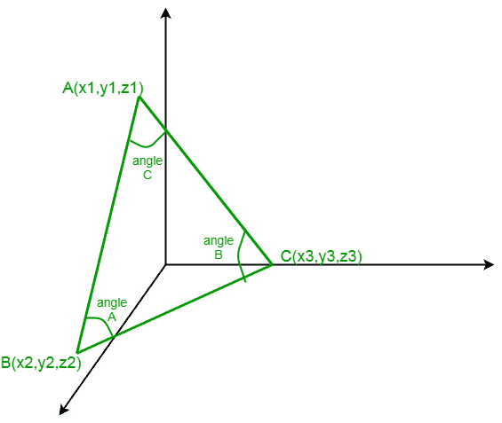
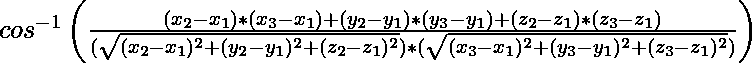
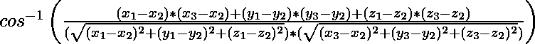

# 在 3D 中找到三角形的所有角度

> 原文:[https://www . geesforgeks . org/find-3d 中三角形的所有角度/](https://www.geeksforgeeks.org/find-all-angles-of-a-triangle-in-3d/)

给定三维三角形的 3 个顶点的坐标，即 A(x1，y1，z1)，B(x2，y2，z2)，C(x3，y3，z3)。任务是找出由上述坐标构成的三角形的所有角度。
**例:**

```
Input: 
x1 = -1, y1 = 3, z1 = 2
x2 = 2, y2 = 3, z2 = 5
x3 = 3, y3 = 5, z3 = -2

Output:
angle A =  90.0 degree
angle B =  54.736 degree
angle C =  35.264 degree
```



**进场:**
求角 A 求 AB 和 AC 的方向比:
AB = x2-x1、y2-y1、z2-z1 的方向比
AC = x3-x1、y3-y1、z3-z1 的方向比
然后角 A = 
求角 B 求 BA 和 BC 的方向比:
BA = x1-x2、y1-y2、z1-z2 的方向比
BC = x3-x2、y3-y2 的方向比， z3-z2
然后角 B = 
求角 C 求 CB 和 CA 的方向比:
CB = x2-x3、y2-y3、z2-z3
CA = x1-x3、y1-y3、z1-z3
然后角 C = 
**以下是上述方法的实现:**

## C++

```
//CPP program for finding all angles of a triangle
#include<bits/stdc++.h>
#include<cmath>
using namespace std;

// function for finding the angle
float angle_triangle(int x1, int x2, int x3,
            int y1, int y2, int y3, int z1, int z2, int z3)
{

    int num = (x2-x1)*(x3-x1)+(y2-y1)*(y3-y1)+(z2-z1)*(z3-z1) ;

    float den = sqrt(pow((x2-x1),2)+pow((y2-y1),2)+pow((z2-z1),2))*\
                sqrt(pow((x3-x1),2)+pow((y3-y1),2)+pow((z3-z1),2)) ;

    float angle = acos(num / den)*(180.0/3.141592653589793238463) ;

    return angle ;
}

// Driver code
int main()
{
int x1 = -1;
int y1 = 3;
int z1 = 2;
int x2 = 2;
int y2 = 3;
int z2 = 5;
int x3 = 3;
int y3 = 5;
int z3 = -2;
float angle_A = angle_triangle(x1, x2, x3, y1, y2,
                                y3, z1, z2, z3);
float angle_B = angle_triangle(x2, x3, x1, y2, y3,
                                y1, z2, z3, z1);
float angle_C = angle_triangle(x3, x2, x1, y3,
                            y2, y1, z3, z2, z1);
cout<<"Angles are :"<<endl;
cout<<setprecision(3);
cout<<"angle A = "<<angle_A<<" degree"<<endl;
cout<<"angle B = "<<angle_B<<" degree"<<endl;
cout<<"angle C = "<<angle_C<< " degree"<<endl;
}
```

## Java 语言(一种计算机语言，尤用于创建网站)

```
//Java program for finding all angles of a triangle

class GFG{
// function for finding the angle
static double angle_triangle(int x1, int x2, int x3,
            int y1, int y2, int y3, int z1, int z2, int z3)
{

    int num = (x2-x1)*(x3-x1)+(y2-y1)*(y3-y1)+(z2-z1)*(z3-z1) ;

    double den = Math.sqrt(Math.pow((x2-x1),2)+
                Math.pow((y2-y1),2)+Math.pow((z2-z1),2))*
                Math.sqrt(Math.pow((x3-x1),2)+
                Math.pow((y3-y1),2)+Math.pow((z3-z1),2)) ;

    double angle = Math.acos(num / den)*(180.0/3.141592653589793238463) ;

    return angle ;
}

// Driver code
public static void main(String[] args)
{
int x1 = -1;
int y1 = 3;
int z1 = 2;
int x2 = 2;
int y2 = 3;
int z2 = 5;
int x3 = 3;
int y3 = 5;
int z3 = -2;
double angle_A = angle_triangle(x1, x2, x3, y1,
                            y2, y3, z1, z2, z3);
double angle_B = angle_triangle(x2, x3, x1,
                            y2, y3, y1, z2, z3, z1);
double angle_C = angle_triangle(x3, x2, x1,
                            y3, y2, y1, z3, z2, z1);
System.out.println("Angles are :");
System.out.println("angle A = "+angle_A+" degree");
System.out.println("angle B = "+angle_B+" degree");
System.out.println("angle C = "+angle_C+" degree");
}
}
// This code is contributed by mits
```

## 蟒蛇 3

```
# Python Code for finding all angles of a triangle
import math

# function for finding the angle
def angle_triangle(x1, x2, x3, y1, y2, y3, z1, z2, z3):

    num = (x2-x1)*(x3-x1)+(y2-y1)*(y3-y1)+(z2-z1)*(z3-z1)

    den = math.sqrt((x2-x1)**2+(y2-y1)**2+(z2-z1)**2)*\
                math.sqrt((x3-x1)**2+(y3-y1)**2+(z3-z1)**2)

    angle = math.degrees(math.acos(num / den))

    return round(angle, 3)

# driver code    
x1 = -1
y1 = 3
z1 = 2
x2 = 2
y2 = 3
z2 = 5
x3 = 3
y3 = 5
z3 = -2
angle_A = angle_triangle(x1, x2, x3, y1, y2, y3, z1, z2, z3)
angle_B = angle_triangle(x2, x3, x1, y2, y3, y1, z2, z3, z1)
angle_C = angle_triangle(x3, x2, x1, y3, y2, y1, z3, z2, z1)
print("Angles are :")
print("angle A = ", angle_A, "degree")
print("angle B = ", angle_B, "degree")
print("angle C = ", angle_C, "degree")
```

## C#

```
// C# program for finding all
// angles of a triangle
using System;

class GFG
{

// function for finding the angle
static double angle_triangle(int x1, int x2, int x3,
                             int y1, int y2, int y3,
                             int z1, int z2, int z3)
{

    int num = (x2 - x1) * (x3 - x1) +
              (y2 - y1) * (y3 - y1) +
              (z2 - z1) * (z3 - z1);

    double den = Math.Sqrt(Math.Pow((x2 - x1), 2) +
                           Math.Pow((y2 - y1), 2) +
                           Math.Pow((z2 - z1), 2)) *
                 Math.Sqrt(Math.Pow((x3 - x1), 2) +
                           Math.Pow((y3 - y1), 2) +
                           Math.Pow((z3 - z1), 2));

    double angle = Math.Acos(num / den) *
                   (180.0/3.141592653589793238463);

    return angle ;
}

// Driver code
public static void Main()
{
    int x1 = -1, y1 = 3, z1 = 2;
    int x2 = 2, y2 = 3, z2 = 5;
    int x3 = 3, y3 = 5, z3 = -2;
    double angle_A = angle_triangle(x1, x2, x3,
                                    y1, y2, y3,
                                    z1, z2, z3);
    double angle_B = angle_triangle(x2, x3, x1,
                                    y2, y3, y1,
                                    z2, z3, z1);
    double angle_C = angle_triangle(x3, x2, x1,
                                    y3, y2, y1,
                                    z3, z2, z1);
    Console.WriteLine("Angles are :");
    Console.WriteLine("angle A = " + angle_A +
                                   " degree");
    Console.WriteLine("angle B = " + angle_B +
                                   " degree");
    Console.WriteLine("angle C = " + angle_C +
                                   " degree");
}
}

// This code is contributed by 29AjayKumar
```

## 服务器端编程语言（Professional Hypertext Preprocessor 的缩写）

```
<?php
// PHP program for finding all
// angles of a triangle

// function for finding the angle
function angle_triangle($x1, $x2, $x3,
                        $y1, $y2, $y3,
                        $z1, $z2, $z3)
{

    $num = ($x2 - $x1) * ($x3 - $x1) +
           ($y2 - $y1) * ($y3 - $y1) +
           ($z2 - $z1) * ($z3 - $z1);

    $den = sqrt(pow(($x2 - $x1), 2) +
                pow(($y2 - $y1), 2) +
                pow(($z2 - $z1), 2)) *
           sqrt(pow(($x3 - $x1), 2) +
                pow(($y3 - $y1), 2) +
                pow(($z3 - $z1), 2));

    $angle = acos($num / $den) *
                 (180.0 / 3.141592653589793238463);

    return $angle ;
}

// Driver code
$x1 = -1; $y1 = 3; $z1 = 2;
$x2 = 2; $y2 = 3; $z2 = 5;
$x3 = 3; $y3 = 5; $z3 = -2;
$angle_A = angle_triangle($x1, $x2, $x3, $y1, $y2,
                          $y3, $z1, $z2, $z3);
$angle_B = angle_triangle($x2, $x3, $x1, $y2, $y3,
                          $y1, $z2, $z3, $z1);
$angle_C = angle_triangle($x3, $x2, $x1, $y3,
                          $y2, $y1, $z3, $z2, $z1);
echo "Angles are :\n";
echo "angle A = " . round($angle_A, 3) . " degree\n";
echo "angle B = " . round($angle_B, 3) . " degree\n";
echo "angle C = " . round($angle_C, 3) . " degree\n";

// This code is contributed by mits
?>
```

## java 描述语言

```
<script>
//Javascript program for finding all angles of a triangle

// function for finding the angle
function angle_triangle(x1,x2,x3,y1,y2,y3,z1,z2,z3)
{
    let num = (x2-x1)*(x3-x1)+(y2-y1)*(y3-y1)+(z2-z1)*(z3-z1) ;

    let den = Math.sqrt(Math.pow((x2-x1),2)+
                Math.pow((y2-y1),2)+Math.pow((z2-z1),2))*
                Math.sqrt(Math.pow((x3-x1),2)+
                Math.pow((y3-y1),2)+Math.pow((z3-z1),2)) ;

    let angle = Math.acos(num / den)*(180.0/3.141592653589793238463) ;

    return angle ;
}

// Driver code
let x1 = -1;
let y1 = 3;
let z1 = 2;
let x2 = 2;
let y2 = 3;
let z2 = 5;
let x3 = 3;
let y3 = 5;
let z3 = -2;
let angle_A = angle_triangle(x1, x2, x3, y1,
                            y2, y3, z1, z2, z3);
let angle_B = angle_triangle(x2, x3, x1,
                            y2, y3, y1, z2, z3, z1);
let angle_C = angle_triangle(x3, x2, x1,
                            y3, y2, y1, z3, z2, z1);
document.write("Angles are :<br>");
document.write("angle A = "+angle_A+" degree<br>");
document.write("angle B = "+angle_B.toFixed(3)+" degree<br>");
document.write("angle C = "+angle_C.toFixed(3)+" degree<br>");

// This code is contributed by rag2127
</script>
```

**Output:** 

```
Angles are :
angle A =  90.0 degree
angle B =  54.736 degree
angle C =  35.264 degree
```