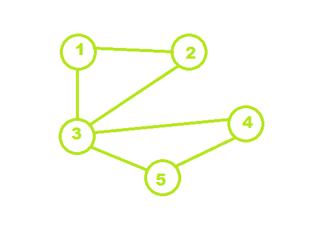

# 在无向图中找到所有大小为 K 的小集团

> 原文:[https://www . geeksforgeeks . org/find-all-cliques-of-size-k-in-an-directed-graph/](https://www.geeksforgeeks.org/find-all-cliques-of-size-k-in-an-undirected-graph/)

给定一个有 **N** 节点和 **E** 边的无向图以及一个值 **K** ，任务是打印形成 **K** 大小[团](https://en.wikipedia.org/wiki/Clique_problem)的所有节点集。
团是图的完全子图。
**举例:**

> 
> 
> **输入:** N = 5，边[] = { {1，2}，{2，3}，{3，1}，{4，3}，{4，5}，{5，3} }，K = 3
> **输出:** 1 2 3，3 4 5
> **解释:**从图像上看，1- > 2- > 3 和 3- > 4- > 5 是两个完整的子图。
> **输入:** N = 4，边[] = { {1，2}，{2，3}，{3，1}，{4，3} }，k = 3
> **输出:** 1 2 3
> 说明:子图 1- > 2- > 3 从给定的图形成一个完整的子图。

**方法:**思路是用[递归](https://www.geeksforgeeks.org/recursion/)解决上述问题。找到度大于或等于(K-1)的所有顶点，并检查 K 个顶点的哪个子集形成团。当另一个边被添加到当前列表时，检查通过添加该边，列表是否仍然形成团。
可以按照以下步骤计算结果:

*   形成一个递归函数，该函数有三个参数:起始节点、当前节点集的长度和所需的节点长度。
*   起始索引类似于不能向当前集合添加少于该索引的节点。所以从那个索引到 n 循环。
*   如果发现在向当前集合添加节点之后，该节点集合仍然是团。如果是，则添加该节点，并使用新添加节点的参数索引+ 1、当前集合的长度+1 和所需长度调用递归函数。
*   如果达到所需长度，将打印节点。

以下是上述方法的实现:

## C++

```
// C++ implementation of the approach
#include <bits/stdc++.h>
using namespace std;

const int MAX = 100;

// Stores the vertices
int store[MAX], n;

// Graph
int graph[MAX][MAX];

// Degree of the vertices
int d[MAX];

// Function to check if the given set of vertices
// in store array is a clique or not
bool is_clique(int b)
{
    // Run a loop for all the set of edges
    // for the select vertex
    for (int i = 1; i < b; i++) {
        for (int j = i + 1; j < b; j++)

            // If any edge is missing
            if (graph[store[i]][store[j]] == 0)
                return false;
    }
    return true;
}

// Function to print the clique
void print(int n)
{
    for (int i = 1; i < n; i++)
        cout << store[i] << " ";
    cout << ", ";
}

// Function to find all the cliques of size s
void findCliques(int i, int l, int s)
{
    // Check if any vertices from i+1 can be inserted
    for (int j = i + 1; j <= n - (s - l); j++)

        // If the degree of the graph is sufficient
        if (d[j] >= s - 1) {

            // Add the vertex to store
            store[l] = j;

            // If the graph is not a clique of size k
            // then it cannot be a clique
            // by adding another edge
            if (is_clique(l + 1))

                // If the length of the clique is
                // still less than the desired size
                if (l < s)

                    // Recursion to add vertices
                    findCliques(j, l + 1, s);

                // Size is met
                else
                    print(l + 1);
        }
}

// Driver code
int main()
{
    int edges[][2] = { { 1, 2 },
                       { 2, 3 },
                       { 3, 1 },
                       { 4, 3 },
                       { 4, 5 },
                       { 5, 3 } },
        k = 3;
    int size = sizeof(edges) / sizeof(edges[0]);
    n = 5;

    for (int i = 0; i < size; i++) {
        graph[edges[i][0]][edges[i][1]] = 1;
        graph[edges[i][1]][edges[i][0]] = 1;
        d[edges[i][0]]++;
        d[edges[i][1]]++;
    }

    findCliques(0, 1, k);

    return 0;
}
```

## Java 语言(一种计算机语言，尤用于创建网站)

```
// Java implementation of the approach
class GFG
{

static int MAX = 100;

// Stores the vertices
static int []store = new int[MAX];
static int n;

// Graph
static int [][]graph = new int [MAX][MAX];

// Degree of the vertices
static int []d = new int[MAX];

// Function to check if the given set of vertices
// in store array is a clique or not
static boolean is_clique(int b)
{
    // Run a loop for all the set of edges
    // for the select vertex
    for (int i = 1; i < b; i++)
    {
        for (int j = i + 1; j < b; j++)

            // If any edge is missing
            if (graph[store[i]][store[j]] == 0)
                return false;
    }
    return true;
}

// Function to print the clique
static void print(int n)
{
    for (int i = 1; i < n; i++)
        System.out.print(store[i] + " ");
    System.out.print(", ");
}

// Function to find all the cliques of size s
static void findCliques(int i, int l, int s)
{
    // Check if any vertices from i+1 can be inserted
    for (int j = i + 1; j <= n - (s - l); j++)

        // If the degree of the graph is sufficient
        if (d[j] >= s - 1)
        {

            // Add the vertex to store
            store[l] = j;

            // If the graph is not a clique of size k
            // then it cannot be a clique
            // by adding another edge
            if (is_clique(l + 1))

                // If the length of the clique is
                // still less than the desired size
                if (l < s)

                    // Recursion to add vertices
                    findCliques(j, l + 1, s);

                // Size is met
                else
                    print(l + 1);
        }
}

// Driver code
public static void main(String[] args)
{
    int edges[][] = { { 1, 2 },
                    { 2, 3 },
                    { 3, 1 },
                    { 4, 3 },
                    { 4, 5 },
                    { 5, 3 } },
    k = 3;
    int size = edges.length;
    n = 5;

    for (int i = 0; i < size; i++)
    {
        graph[edges[i][0]][edges[i][1]] = 1;
        graph[edges[i][1]][edges[i][0]] = 1;
        d[edges[i][0]]++;
        d[edges[i][1]]++;
    }

    findCliques(0, 1, k);
}
}

// This code is contributed by 29AjayKumar
```

## 蟒蛇 3

```
# Python3 implementation of the approach
import numpy as np

MAX = 100;

# Stores the vertices
store = [0]* MAX;

# Graph
graph = np.zeros((MAX, MAX));

# Degree of the vertices
d = [0] * MAX;

# Function to check if the given set of vertices
# in store array is a clique or not
def is_clique(b) :

    # Run a loop for all the set of edges
    # for the select vertex
    for i in range(1, b) :
        for j in range(i + 1, b) :

            # If any edge is missing
            if (graph[store[i]][store[j]] == 0) :
                return False;

    return True;

# Function to print the clique
def print_cli(n) :

    for i in range(1, n) :
        print(store[i], end = " ");
    print(",", end=" ");

# Function to find all the cliques of size s
def findCliques(i, l, s) :

    # Check if any vertices from i+1 can be inserted
    for j in range( i + 1, n -(s - l) + 1) :

        # If the degree of the graph is sufficient
        if (d[j] >= s - 1) :

            # Add the vertex to store
            store[l] = j;

            # If the graph is not a clique of size k
            # then it cannot be a clique
            # by adding another edge
            if (is_clique(l + 1)) :

                # If the length of the clique is
                # still less than the desired size
                if (l < s) :

                    # Recursion to add vertices
                    findCliques(j, l + 1, s);

                # Size is met
                else :
                    print_cli(l + 1);

# Driver code
if __name__ == "__main__" :

    edges = [ [ 1, 2 ],
              [ 2, 3 ],
              [ 3, 1 ],
              [ 4, 3 ],
              [ 4, 5 ],
              [ 5, 3 ] ];
    k = 3;
    size = len(edges);
    n = 5;

    for i in range(size) :
        graph[edges[i][0]][edges[i][1]] = 1;
        graph[edges[i][1]][edges[i][0]] = 1;
        d[edges[i][0]] += 1;
        d[edges[i][1]] += 1;

    findCliques(0, 1, k);

# This code is contributed by AnkitRai01
```

## C#

```
// C# implementation of the approach
using System;

class GFG
{

    static int MAX = 100;

    // Stores the vertices
    static int []store = new int[MAX];
    static int n;

    // Graph
    static int [,]graph = new int [MAX, MAX];

    // Degree of the vertices
    static int []d = new int[MAX];

    // Function to check if the given set of vertices
    // in store array is a clique or not
    static bool is_clique(int b)
    {
        // Run a loop for all the set of edges
        // for the select vertex
        for (int i = 1; i < b; i++)
        {
            for (int j = i + 1; j < b; j++)

                // If any edge is missing
                if (graph[store[i], store[j]] == 0)
                    return false;
        }
        return true;
    }

    // Function to print the clique
    static void print(int n)
    {
        for (int i = 1; i < n; i++)
            Console.Write(store[i] + " ");
        Console.Write(", ");
    }

    // Function to find all the cliques of size s
    static void findCliques(int i, int l, int s)
    {
        // Check if any vertices from i+1 can be inserted
        for (int j = i + 1; j <= n - (s - l); j++)

            // If the degree of the graph is sufficient
            if (d[j] >= s - 1)
            {

                // Add the vertex to store
                store[l] = j;

                // If the graph is not a clique of size k
                // then it cannot be a clique
                // by adding another edge
                if (is_clique(l + 1))

                    // If the length of the clique is
                    // still less than the desired size
                    if (l < s)

                        // Recursion to add vertices
                        findCliques(j, l + 1, s);

                    // Size is met
                    else
                        print(l + 1);
            }
    }

    // Driver code
    public static void Main()
    {
        int [,]edges = { { 1, 2 },
                        { 2, 3 },
                        { 3, 1 },
                        { 4, 3 },
                        { 4, 5 },
                        { 5, 3 } };
        int k = 3;
        int size = edges.GetLength(0);
        n = 5;

        for (int i = 0; i < size; i++)
        {
            graph[edges[i, 0], edges[i, 1]] = 1;
            graph[edges[i, 1], edges[i, 0]] = 1;
            d[edges[i, 0]]++;
            d[edges[i, 1]]++;
        }

        findCliques(0, 1, k);
    }
}

// This code is contributed by AnkitRai01
```

## java 描述语言

```
<script>
    // JavaScript implementation of the approach
    const MAX = 100;

    // Stores the vertices
    let store = new Array(MAX).fill(0), n = 0;

    // Graph
    let graph = new Array(MAX).fill(0).map(() => new Array(MAX).fill(0));

    // Degree of the vertices
    let d = new Array(MAX).fill(0);

    // Function to check if the given set of vertices
    // in store array is a clique or not
    const is_clique = (b) => {

        // Run a loop for all the set of edges
        // for the select vertex
        for (let i = 1; i < b; i++) {
            for (let j = i + 1; j < b; j++)

                // If any edge is missing
                if (graph[store[i]][store[j]] == 0)
                    return false;
        }
        return true;
    }

    // Function to print the clique
    const print = (n) => {
        for (let i = 1; i < n; i++)
            document.write(`${store[i]} `);
        document.write(", ");
    }

    // Function to find all the cliques of size s
    const findCliques = (i, l, s) => {

        // Check if any vertices from i+1 can be inserted
        for (let j = i + 1; j <= n - (s - l); j++)

            // If the degree of the graph is sufficient
            if (d[j] >= s - 1) {

                // Add the vertex to store
                store[l] = j;

                // If the graph is not a clique of size k
                // then it cannot be a clique
                // by adding another edge
                if (is_clique(l + 1))

                    // If the length of the clique is
                    // still less than the desired size
                    if (l < s)

                        // Recursion to add vertices
                        findCliques(j, l + 1, s);

                    // Size is met
                    else
                        print(l + 1);
            }
    }

    // Driver code
    const edges = [
        [1, 2],
        [2, 3],
        [3, 1],
        [4, 3],
        [4, 5],
        [5, 3]
    ];

    let k = 3;
    let size = edges.length;
    n = 5;

    for (let i = 0; i < size; i++) {
        graph[edges[i][0]][edges[i][1]] = 1;
        graph[edges[i][1]][edges[i][0]] = 1;
        d[edges[i][0]]++;
        d[edges[i][1]]++;
    }

    findCliques(0, 1, k);

    // This code is contributed by rakeshsahni

</script>
```

**Output:** 

```
1 2 3 , 3 4 5 ,
```