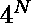
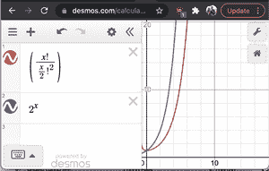

# 找出第一半位和第二半位总和相同的所有偶数长度二进制序列

> 原文:[https://www . geeksforgeeks . org/find-所有偶数长度二进制序列具有相同的第一和第二半比特之和/](https://www.geeksforgeeks.org/find-all-even-length-binary-sequences-with-same-sum-of-first-and-second-half-bits/)

给定一个数字 n，找出长度为 2n 的所有二进制序列，使得前 n 位的和与后 n 位的和相同。
示例:

```
Input:  N = 2
Output: 
0101 1111 1001 0110 0000 1010 

Input:  N = 3
Output:  
011011 001001 011101 010001 101011 111111
110011 101101 100001 110101 001010 011110 
010010 001100 000000 010100 101110 100010 
110110 100100 
```

其思想是固定第一位和最后一位，然后对剩余的 2*(n-1)位重复。当我们修复第一个和最后一个位时，有四种可能性–

1.  第一位和最后一位为 1，两侧剩余的 n–1 位也应该具有相同的总和。
2.  第一位和最后一位为 0，两侧剩余的 n–1 位也应该具有相同的总和。
3.  第一位为 1，最后一位为 0，左侧剩余 n-1 位的总和应比右侧 n-1 位的总和少 1。
4.  第一位为 0，最后一位为 1，左侧剩余 n-1 位的总和应比右侧 n-1 位的总和多 1。

以下是上述想法的实现–

## C++

```
// C++ program to print even length binary sequences
// whose sum of first and second half bits is same
#include <bits/stdc++.h>
using namespace std;

// Function to print even length binary sequences
// whose sum of first and second half bits is same

// diff --> difference between sums of first n bits
// and last n bits
// out --> output array
// start --> starting index
// end --> ending index
void findAllSequences(int diff, char* out, int start, int end)
{
    // We can't cover difference of more than n with 2n bits
    if (abs(diff) > (end - start + 1) / 2)
        return;

    // if all bits are filled
    if (start > end)
    {
        // if sum of first n bits and last n bits are same
        if (diff == 0)
            cout << out << " ";
        return;
    }

    // fill first bit as 0 and last bit as 1
    out[start] = '0', out[end] = '1';
    findAllSequences(diff + 1, out, start + 1, end - 1);

    // fill first and last bits as 1
    out[start] = out[end] = '1';
    findAllSequences(diff, out, start + 1, end - 1);

    // fill first and last bits as 0
    out[start] = out[end] = '0';
    findAllSequences(diff, out, start + 1, end - 1);

    // fill first bit as 1 and last bit as 0
    out[start] = '1', out[end] = '0';
    findAllSequences(diff - 1, out, start + 1, end - 1);
}

// Driver program
int main()
{
    // input number
    int n = 2;

    // allocate string containing 2*n characters
    char out[2 * n + 1];

    // null terminate output array
    out[2 * n] = '\0';

    findAllSequences(0, out, 0, 2*n - 1);

    return 0;
}
```

## Java 语言(一种计算机语言，尤用于创建网站)

```
// Java program to print even length binary
// sequences whose sum of first and second
// half bits is same
import java.io.*;
import java.util.*;

class GFG
{
    // Function to print even length binary sequences
    // whose sum of first and second half bits is same

    // diff --> difference between sums of first n bits
    // and last n bits
    // out --> output array
    // start --> starting index
    // end --> ending index
    static void findAllSequences(int diff, char out[],
                                     int start, int end)
    {
        // We can't cover difference of more
        // than n with 2n bits
        if (Math.abs(diff) > (end - start + 1) / 2)
            return;

        // if all bits are filled
        if (start > end)
        {
            // if sum of first n bits and
            // last n bits are same
            if (diff == 0)
            {
                System.out.print(out);
                System.out.print(" ");
            }   
            return;
        }

        // fill first bit as 0 and last bit as 1
        out[start] = '0';
        out[end] = '1';
        findAllSequences(diff + 1, out, start + 1, end - 1);

        // fill first and last bits as 1
        out[start] = out[end] = '1';
        findAllSequences(diff, out, start + 1, end - 1);

        // fill first and last bits as 0
        out[start] = out[end] = '0';
        findAllSequences(diff, out, start + 1, end - 1);

        // fill first bit as 1 and last bit as 0
        out[start] = '1';
        out[end] = '0';
        findAllSequences(diff - 1, out, start + 1, end - 1);
    }

    // Driver program
    public static void main (String[] args)
    {
        // input number
        int n = 2;

        // allocate string containing 2*n characters
        char[] out = new char[2 * n + 1];

        // null terminate output array
        out[2 * n] = '\0';

        findAllSequences(0, out, 0, 2*n - 1);
    }
}

// This code is contributed by Pramod Kumar
```

## 蟒蛇 3

```
# Python3 program to print even length binary sequences
# whose sum of first and second half bits is same

# Function to print even length binary sequences
# whose sum of first and second half bits is same

# diff --> difference between sums of first n bits
# and last n bits
# out --> output array
# start --> starting index
# end --> ending index
def findAllSequences(diff, out, start, end):

    # We can't cover difference of more than n with 2n bits
    if (abs(diff) > (end - start + 1) // 2):
        return;

    # if all bits are filled
    if (start > end):
        # if sum of first n bits and last n bits are same
        if (diff == 0):
            print(''.join(list(out)),end=" ");
        return;

    # fill first bit as 0 and last bit as 1
    out[start] = '0';
    out[end] = '1';
    findAllSequences(diff + 1, out, start + 1, end - 1);

    # fill first and last bits as 1
    out[start] = out[end] = '1';
    findAllSequences(diff, out, start + 1, end - 1);

    # fill first and last bits as 0
    out[start] = out[end] = '0';
    findAllSequences(diff, out, start + 1, end - 1);

    # fill first bit as 1 and last bit as 0
    out[start] = '1';
    out[end] = '0';
    findAllSequences(diff - 1, out, start + 1, end - 1);

# Driver program

# input number
n = 2;

# allocate string containing 2*n characters
out=[""]*(2*n);

findAllSequences(0, out, 0, 2*n - 1);

# This code is contributed by mits
```

## C#

```
// C# program to print even length binary
// sequences whose sum of first and second
// half bits is same
using System;

class GFG {

    // Function to print even length binary
    // sequences whose sum of first and
    // second half bits is same

    // diff --> difference between sums of
    // first n bits
    // and last n bits
    // out --> output array
    // start --> starting index
    // end --> ending index
    static void findAllSequences(int diff,
            char []outt, int start, int end)
    {

        // We can't cover difference of
        // more than n with 2n bits
        if (Math.Abs(diff) > (end - start
                                   + 1) / 2)
            return;

        // if all bits are filled
        if (start > end)
        {

            // if sum of first n bits and
            // last n bits are same
            if (diff == 0)
            {
                Console.Write(outt);
                Console.Write(" ");
            }
            return;
        }

        // fill first bit as 0 and last bit
        // as 1
        outt[start] = '0';
        outt[end] = '1';
        findAllSequences(diff + 1, outt,
                        start + 1, end - 1);

        // fill first and last bits as 1
        outt[start] = outt[end] = '1';
        findAllSequences(diff, outt,
                        start + 1, end - 1);

        // fill first and last bits as 0
        outt[start] = outt[end] = '0';
        findAllSequences(diff, outt,
                         start + 1, end - 1);

        // fill first bit as 1 and last
        // bit as 0
        outt[start] = '1';
        outt[end] = '0';
        findAllSequences(diff - 1, outt,
                         start + 1, end - 1);
    }

    // Driver program
    public static void Main ()
    {

        // input number
        int n = 2;

        // allocate string containing 2*n
        // characters
        char []outt = new char[2 * n + 1];

        // null terminate output array
        outt[2 * n] = '\0';

        findAllSequences(0, outt, 0, 2*n - 1);
    }
}

// This code is contributed by nitin mittal.
```

## 服务器端编程语言（Professional Hypertext Preprocessor 的缩写）

```
<?php
// PHP program to print even length binary sequences
// whose sum of first and second half bits is same

// Function to print even length binary sequences
// whose sum of first and second half bits is same

// diff --> difference between sums of first n bits
// and last n bits
// out --> output array
// start --> starting index
// end --> ending index
function findAllSequences($diff, $out, $start, $end)
{
    // We can't cover difference of more than n with 2n bits
    if (abs($diff) > (int)(($end - $start + 1) / 2))
        return;

    // if all bits are filled
    if ($start > $end)
    {
        // if sum of first n bits and last n bits are same
        if ($diff == 0)
            print(implode("",$out)." ");
        return;
    }

    // fill first bit as 0 and last bit as 1
    $out[$start] = '0';
    $out[$end] = '1';
    findAllSequences($diff + 1, $out, $start + 1, $end - 1);

    // fill first and last bits as 1
    $out[$start] = $out[$end] = '1';
    findAllSequences($diff, $out, $start + 1, $end - 1);

    // fill first and last bits as 0
    $out[$start] = $out[$end] = '0';
    findAllSequences($diff, $out, $start + 1, $end - 1);

    // fill first bit as 1 and last bit as 0
    $out[$start] = '1';
    $out[$end] = '0';
    findAllSequences($diff - 1, $out, $start + 1, $end - 1);
}

// Driver program

    // input number
    $n = 2;

    // allocate string containing 2*n characters
    $out=array_fill(0,2*$n,"");

    findAllSequences(0, $out, 0, 2*$n - 1);

// This code is contributed by chandan_jnu
?>
```

## java 描述语言

```
<script>

    // JavaScript program to print even length binary
    // sequences whose sum of first and second
    // half bits is same

    // Function to print even length binary
    // sequences whose sum of first and
    // second half bits is same

    // diff --> difference between sums of
    // first n bits
    // and last n bits
    // out --> output array
    // start --> starting index
    // end --> ending index
    function findAllSequences(diff, outt, start, end)
    {

        // We can't cover difference of
        // more than n with 2n bits
        if (Math.abs(diff) > parseInt((end - start + 1) / 2, 10))
            return;

        // if all bits are filled
        if (start > end)
        {

            // if sum of first n bits and
            // last n bits are same
            if (diff == 0)
            {
                document.write(outt.join(""));
                document.write(" ");
            }
            return;
        }

        // fill first bit as 0 and last bit
        // as 1
        outt[start] = '0';
        outt[end] = '1';
        findAllSequences(diff + 1, outt, start + 1, end - 1);

        // fill first and last bits as 1
        outt[start] = outt[end] = '1';
        findAllSequences(diff, outt, start + 1, end - 1);

        // fill first and last bits as 0
        outt[start] = outt[end] = '0';
        findAllSequences(diff, outt, start + 1, end - 1);

        // fill first bit as 1 and last
        // bit as 0
        outt[start] = '1';
        outt[end] = '0';
        findAllSequences(diff - 1, outt, start + 1, end - 1);
    }

    // input number
    let n = 2;

    // allocate string containing 2*n
    // characters
    let outt = new Array(2 * n + 1);

    // null terminate output array
    outt[2 * n] = '\0';

    findAllSequences(0, outt, 0, 2*n - 1);

</script>
```

**输出:**

```
0101 1111 1001 0110 0000 1010 
```

**时间复杂度:** O((  )* N)

4^N 是因为 4 次递归调用，而 n(从 2N 简化而来)是因为打印 2N 大小的字符串所花费的时间

**辅助空间:** O(N)

还有一种方法，我们生成长度为 n 的所有可能的字符串，并将它们存储在代表它们总和的索引处的列表中。然后，我们遍历每个列表，并通过打印每个字符串来生成 2n 大小的字符串，列表中的所有其他字符串加起来都是相同的值。

## 蟒蛇 3

```
def findAllSequences(n):
    sumToString = [[] for x in range(n+1)] # list of strings where index represents sum
    generateSequencesWithSum(n, sumToString, [], 0)
    permuteSequences(sumToString)

def generateSequencesWithSum(n, sumToString, sequence, sumSoFar):
    #Base case, if there are no more binary digits to include
    if n == 0:
        sumToString[sumSoFar].append("".join(sequence)) #add permutation to list of sequences with sum corresponding to index
        return
    #Generate sequence +0
    sequence.append("0")
    generateSequencesWithSum(n-1, sumToString, sequence, sumSoFar)
    sequence.pop()
    #Generate sequence +1
    sequence.append("1")
    generateSequencesWithSum(n-1, sumToString, sequence, sumSoFar+1)
    sequence.pop()

def permuteSequences(sumToString):
    #There are 2^n substring in this list of lists
    for sumIndexArr in sumToString:
        # Append
        for sequence1 in sumIndexArr:
            for sequence2 in sumIndexArr:
                print(sequence1 + sequence2)

findAllSequences(2)

#Contribution by Xavier Jean Baptiste
```

**输出:**

```
0000 0101 0110 1001 1010 1111
```

**时间复杂度分析:**

**生成序列带 sum**= 0((2<sup>N</sup>)* N)

*   2 <sup>N</sup> :我们生成大小为 N 的二进制字符串的所有排列
*   n:将字符列表转换为字符串并存储为数组。这是在基本情况下完成的。

**permuteSequences**= O((2<sup>N</sup>)* N！/(N/2)！ <sup>2</sup> * N)

*   2 <sup>N</sup> :我们遍历所有生成的大小为 N 的字符串
*   n！/(N/2)！ <sup>2</sup> :这个解释起来有点挑战

让我们以 N = 2 为例。我们的大小为 n 的可能序列的数组是:

<figure class="table">

| 数组索引 | Zero | one | Two |
| 字符串列表 | 00 | 01,10 | Eleven |

在索引表示和的字符串列表中，我们使用“n 选择 k”公式得到 2n 大小的字符串的个数。在我们的例子中，它是 nCk *nCk，其中 k 代表 2n 大小的字符串的每一半中的 1 的数量:

k = 0，我们有(2C0)^2 = 1 字符串(0000)

k = 1，我们有(2C1)^2 弦= 4 弦(0101 0110 1001 1010)

k = 2，我们有(2c2)^2 = 1 字符串(1111)

当 k = N/2 时，我们得到最长的字符串列表，因此 <sub>N</sub> C <sub>N/2</sub> = N！/[(N/2)！*(N–N/2)！]简化为 <sub>N</sub> C <sub>N/2</sub> = N！/(N/2)！ <sup>2</sup>

因此，对于每个元素，我们最多只能迭代 <sub>N</sub> C <sub>N/2</sub> 来形成长度为 2N 的字符串

没有形式证明，如果我们把 2^N 和 n 作图！/(N/2)！ <sup>2</sup> ，我们看到 2 <sup>N</sup> 的增速比后者快。因此 O(2 <sup>N</sup> * N！/(N/2)<sup>2</sup>)<O(2<sup>N</sup>* 2<sup>N</sup>)= O(2<sup>2n</sup>)= O(4<sup>N</sup>)



2^x 和 nC(n/2)图

*   我们必须打印每一串 2N 大小的

最后，我们可以忽略用 Sum 生成序列的时间复杂性，因为 permuteSequence 是主导项

**时间复杂度:** O(2 <sup>N</sup> * N！/(N/2)！ <sup>2</sup> * N)(优于 O((4^N 第一种解决方案)* N，详见上文解释)

**辅助空间** : O(2 <sup>N</sup> )因为我们存储所有大小为 N 的二进制字符串排列

本文由**阿迪蒂亚·戈尔**供稿，**泽维尔·让·巴蒂斯特**改进。如果你喜欢 GeeksforGeeks 并想投稿，你也可以使用[write.geeksforgeeks.org](https://write.geeksforgeeks.org)写一篇文章或者把你的文章邮寄到 review-team@geeksforgeeks.org。看到你的文章出现在极客博客主页上，帮助其他极客。
如果发现有不正确的地方，或者想分享更多关于上述话题的信息，请写评论。

</figure>