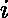

# 找出给定数组中所有好的索引

> 原文:[https://www . geesforgeks . org/find-all-good-indexs-in-the-the-给定数组/](https://www.geeksforgeeks.org/find-all-good-indices-in-the-given-array/)

给定整数数组 A[]。任务是打印该数组的所有**索引** ，以便在从数组中移除第 i <sup>个</sup>元素后，该数组成为一个**好数组**。
**注** :

*   如果数组中有一个元素等于所有其他元素的和，那么这个数组就是好的。
*   阵列考虑基于 1 的索引。

**示例** :

> **输入** : A[] = { 8，3，5，2 }
> **输出** : 1 4
> **解释** : A[] = [8，3，5，2]
> 如果去掉 A[1]，数组看起来像[3，5，2]就不错了，因为 5 = 3+2。
> 如果去掉 A[4]，数组看起来像[8，3，5]就不错了，因为 8 = 3+5。
> 因此优良指数为 1 和 4。
> **输入** : A[] = { 2，2，2 }
> **输出** : 1 2 3
> 移除任意索引处的任意元素将使数组良好。

**进场:**

1.  [创建数组 A[]的散列](https://www.geeksforgeeks.org/hashing-data-structure/)，该散列[存储每个元素的频率](https://www.geeksforgeeks.org/find-frequency-number-array/)和具有 A 的每个元素的和的变量和
2.  迭代数组，为每个移除索引 I 处的元素。
3.  去掉一个元素后，剩余数组的和为 K，其中 K =和–A[I]。
4.  我们必须在剩余的数组中找到一个元素 **K/2** 才能使它变好。现在设 K = K/2。
5.  现在剩下的数组将是好的，当且仅当以下条件成立时。
    *   如果 A[i] == K 和 hash(K) > 1 **或**如果 A[i]！= K 和 hash(K) > 0。
6.  打印所有这些索引。

以下是上述方法的实现:

## C++

```
// C++ program to find all good indices
// in the given array

#include <bits/stdc++.h>
using namespace std;

// Function to find all good indices
// in the given array
void niceIndices(int A[], int n)
{
    int sum = 0;

    // hash to store frequency
    // of each element
    map<int, int> m;

    // Storing frequency of each element
    // and calculating sum simultaneously
    for (int i = 0; i < n; ++i) {
        m[A[i]]++;
        sum += A[i];
    }

    for (int i = 0; i < n; ++i) {
        int k = sum - A[i];
        if (k % 2 == 0) {
            k = k >> 1;

            // check if array is good after
            // removing i-th index element
            if (m.find(k) != m.end()) {

                if ((A[i] == k && m[k] > 1) || (A[i] != k))
                    // print good indices
                    cout << (i + 1) << " ";
            }
        }
    }
}

// Driver Code
int main()
{
    int A[] = { 8, 3, 5, 2 };
    int n = sizeof(A) / sizeof(A[0]);

    niceIndices(A, n);

    return 0;
}
```

## Java 语言(一种计算机语言，尤用于创建网站)

```
// Java program to find all good indices
// in the given array
import java.util.*;
class Solution
{

// Function to find all good indices
// in the given array
static void niceIndices(int A[], int n)
{
    int sum = 0;

    // hash to store frequency
    // of each element
    Map<Integer, Integer> m=new HashMap<Integer, Integer>();

    // Storing frequency of each element
    // and calculating sum simultaneously
    for (int i = 0; i < n; ++i) {

        m.put(A[i],(m.get(A[i])==null)?0:m.get(A[i])+1);
        sum += A[i];
    }

    for (int i = 0; i < n; ++i) {
        int k = sum - A[i];
        if (k % 2 == 0) {
            k = k >> 1;

            // check if array is good after
            // removing i-th index element
            if (m.containsKey(k)) {

                if ((A[i] == k && m.get(k) > 1) || (A[i] != k))
                    // print good indices
                    System.out.print( (i + 1) +" ");
            }
        }
    }
}

// Driver Code
public static void main(String args[])
{
    int A[] = { 8, 3, 5, 2 };
    int n = A.length;

    niceIndices(A, n);

}
}
//contributed by Arnab Kundu
```

## 蟒蛇 3

```
# Python3 program to find all good
# indices in the given array
from collections import defaultdict

# Function to find all good indices
# in the given array
def niceIndices(A, n):

    Sum = 0

    # hash to store frequency
    # of each element
    m = defaultdict(lambda:0)

    # Storing frequency of each element
    # and calculating sum simultaneously
    for i in range(n):
        m[A[i]] += 1
        Sum += A[i]

    for i in range(n):
        k = Sum - A[i]

        if k % 2 == 0:

            k = k >> 1

            # check if array is good after
            # removing i-th index element
            if k in m:

                if ((A[i] == k and m[k] > 1) or
                    (A[i] != k)):

                    # print good indices
                    print((i + 1), end = " ")

# Driver Code   
if __name__ == "__main__":

    A = [8, 3, 5, 2]
    n = len(A)

    niceIndices(A, n)

# This code is contributed by Rituraj Jain
```

## C#

```
// C# program to find all good indices
// in the given array
using System;
using System.Collections.Generic;

class GFG
{

// Function to find all good indices
// in the given array
static void niceIndices(int []A, int n)
{
    int sum = 0;

    // hash to store frequency
    // of each element
    Dictionary<int,int> mp = new Dictionary<int,int>();

    // Storing frequency of each element
    // and calculating sum simultaneously

    for (int i = 0 ; i < n; i++)
    {
        if(mp.ContainsKey(A[i]))
        {
            var val = mp[A[i]];
            mp.Remove(A[i]);
            mp.Add(A[i], val + 1);
            sum += A[i];
        }
        else
        {
            mp.Add(A[i], 0);
            sum += A[i];
        }
    }

    for (int i = 0; i < n; ++i)
    {
        int k = sum - A[i];
        if (k % 2 == 0)
        {
            k = k >> 1;

            // check if array is good after
            // removing i-th index element
            if (mp.ContainsKey(k))
            {

                if ((A[i] == k && mp[k] > 1) || (A[i] != k))
                    // print good indices
                    Console.Write( (i + 1) +" ");
            }
        }
    }
}

// Driver Code
public static void Main(String []args)
{
    int []A = { 8, 3, 5, 2 };
    int n = A.Length;

    niceIndices(A, n);

}
}

/* This code is contributed by PrinciRaj1992 */
```

## java 描述语言

```
<script>

// Javascript program to find all good indices
// in the given array

// Function to find all good indices
// in the given array
function niceIndices(A, n)
{
    var sum = 0;

    // hash to store frequency
    // of each element
    var m = new Map();

    // Storing frequency of each element
    // and calculating sum simultaneously
    for (var i = 0; i < n; ++i) {
        if(m.has(A[i]))
            m.set(A[i], m.get(A[i])+1)
        else
            m.set(A[i], 1)
        sum += A[i];
    }

    for (var i = 0; i < n; ++i) {
        var k = sum - A[i];
        if (k % 2 == 0) {
            k = k >> 1;

            // check if array is good after
            // removing i-th index element
            if (m.has(k)) {

                if ((A[i] == k && m.get(k) > 1) || (A[i] != k))
                    // print good indices
                    document.write(i + 1 + " ");
            }
        }
    }
}

// Driver Code
var A = [8, 3, 5, 2];
var n = A.length;
niceIndices(A, n);

// This code is contributed by importantly.
</script>
```

**Output:** 

```
1 4
```

**时间复杂度:** O(N*log(N))