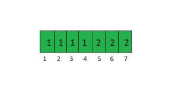

# 从给定集合中的每个节点找到所有可到达的节点

> 原文:[https://www . geeksforgeeks . org/find-所有可到达的节点-从给定集合中的每个节点存在/](https://www.geeksforgeeks.org/find-all-reachable-nodes-from-every-node-present-in-a-given-set/)

给定一个无向图和一组顶点，从给定集合中的每个顶点找到所有可达节点。

考虑下面有两个断开组件的无向图。


```
arr[] = {1 , 2 , 5}
Reachable nodes from 1 are  1, 2, 3, 4
Reachable nodes from 2 are 1, 2, 3, 4
Reachable nodes from 5 are 5, 6, 7
```

**方法 1(简单)**

一个直接的解决方案是对集合中的每个节点进行 [BFS 遍历](https://www.geeksforgeeks.org/breadth-first-traversal-for-a-graph/)，然后找到所有可到达的节点。
假设我们需要找到 n 个节点的可达节点，这个解的时间复杂度为 O(n*(V+E))，其中 V 是图中的节点数，E 是图中的边数。请注意，我们需要调用 BFS 作为每个节点的单独调用，而不使用先前遍历的访问数组，因为同一顶点可能需要打印多次。这似乎是一个有效的解决方案，但考虑当 E =θ(V<sup>2</sup>)和 n = V 时，时间复杂度变为 O(V <sup>3</sup> )的情况。

**方法 2(高效)**

由于给定的图是无向图，因此属于同一组件的所有顶点都具有相同的可达节点集。所以我们跟踪顶点和组件映射。图中的每个组件都被分配了一个数字，这个组件中的每个顶点都被分配了这个数字。为此，我们使用访问数组，该数组用于跟踪 BFS 的访问顶点。

```
For a node u, 
if visit[u] is 0 then
    u has not been visited before
else // if not zero then
   visit[u] represents the component number. 

For any two nodes u and v belonging to same 
component, visit[u] is equal to visit[v]
```

要存储可到达的节点，请使用一个以关键字作为组件编号，以值作为存储所有可到达节点的向量的地图 **m** 。

要查找某个节点的可达节点 **u** 返回 **m【访问【u】】**
请看下面的伪代码，以了解如何分配组件号。

```
componentNum = 0
for i=1 to n    
    If visit[i] is NOT 0 then
        componentNum++ 

        // bfs() returns a list (or vector)
        // for given vertex 'i'
        list = bfs(i, componentNum)
        m[visit[i]]] = list
```

对于示例中显示的图表，访问数组将是。



对于节点 1、2、3 和 4，组件号为 1。对于节点 5、6 和 7，组件号是 2。

上述想法的实施

## C++

```
// C++ program to find all the reachable nodes
// for every node present in arr[0..n-1].
#include <bits/stdc++.h>
using namespace std;

// This class represents a directed graph using
// adjacency list representation
class Graph
{
public:
    int V;    // No. of vertices

    // Pointer to an array containing adjacency lists
    list<int> *adj;

    Graph(int );  // Constructor

    void addEdge(int, int);

    vector<int> BFS(int, int, int []);
};

Graph::Graph(int V)
{
    this->V = V;
    adj = new list<int>[V+1];
}

void Graph::addEdge(int u, int v)
{
    adj[u].push_back(v); // Add w to v’s list.
    adj[v].push_back(u); // Add v to w’s list.
}

vector<int> Graph::BFS(int componentNum, int src,
                                    int visited[])
{
    // Mark all the vertices as not visited
    // Create a queue for BFS
    queue<int> queue;

    queue.push(src);

    // Assign Component Number
    visited[src] = componentNum;

    // Vector to store all the reachable nodes from 'src'
    vector<int> reachableNodes;

    while(!queue.empty())
    {
        // Dequeue a vertex from queue
        int u = queue.front();
        queue.pop();

        reachableNodes.push_back(u);

        // Get all adjacent vertices of the dequeued
        // vertex u. If a adjacent has not been visited,
        // then mark it visited nd enqueue it
        for (auto itr = adj[u].begin();
                itr != adj[u].end(); itr++)
        {
            if (!visited[*itr])
            {
                // Assign Component Number to all the
                // reachable nodes
                visited[*itr] = componentNum;
                queue.push(*itr);
            }
        }
    }
    return reachableNodes;
}

// Display all the Reachable Nodes from a node 'n'
void displayReachableNodes(int n,
            unordered_map <int, vector<int> > m)
{
    vector<int> temp = m[n];
    for (int i=0; i<temp.size(); i++)
        cout << temp[i] << " ";

    cout << endl;
}

// Find all the reachable nodes for every element
// in the arr
void findReachableNodes(Graph g, int arr[], int n)
{
    // Get the number of nodes in the graph
    int V = g.V;

    // Take a integer visited array and initialize
    // all the elements with 0
    int visited[V+1];
    memset(visited, 0, sizeof(visited));

    // Map to store list of reachable Nodes for a
    // given node.
    unordered_map <int, vector<int> > m;

    // Initialize component Number with 0
    int componentNum = 0;

    // For each node in arr[] find reachable
    // Nodes
    for (int i = 0 ; i < n ; i++)
    {
        int u = arr[i];

        // Visit all the nodes of the component
        if (!visited[u])
        {
            componentNum++;

            // Store the reachable Nodes corresponding to
            // the node 'i'
            m[visited[u]] = g.BFS(componentNum, u, visited);
        }

        // At this point, we have all reachable nodes
        // from u, print them by doing a look up in map m.
        cout << "Reachable Nodes from " << u <<" are\n";
        displayReachableNodes(visited[u], m);
    }
}

// Driver program to test above functions
int main()
{
    // Create a graph given in the above diagram
    int V = 7;
    Graph g(V);
    g.addEdge(1, 2);
    g.addEdge(2, 3);
    g.addEdge(3, 4);
    g.addEdge(3, 1);
    g.addEdge(5, 6);
    g.addEdge(5, 7);

    // For every ith element in the arr
    // find all reachable nodes from query[i]
    int arr[] = {2, 4, 5};

    // Find number of elements in Set
    int n = sizeof(arr)/sizeof(int);

    findReachableNodes(g, arr, n);

    return 0;
}
```

## 蟒蛇 3

```
# Python3 program to find all the reachable nodes
# for every node present in arr[0..n-1]
from collections import deque

def addEdge(v, w):

    global visited, adj
    adj[v].append(w)
    adj[w].append(v)

def BFS(componentNum, src):

    global visited, adj

    # Mark all the vertices as not visited
    # Create a queue for BFS
    #a =  visited
    queue = deque()

    queue.append(src)

    # Assign Component Number
    visited[src] = 1

    # Vector to store all the reachable
    # nodes from 'src'
    reachableNodes = []
    #print("0:",visited)

    while (len(queue) > 0):

        # Dequeue a vertex from queue
        u = queue.popleft()

        reachableNodes.append(u)

        # Get all adjacent vertices of the dequeued
        # vertex u. If a adjacent has not been visited,
        # then mark it visited nd enqueue it
        for itr in adj[u]:
            if (visited[itr] == 0):

                # Assign Component Number to all the
                # reachable nodes
                visited[itr] = 1
                queue.append(itr)

    return reachableNodes

# Display all the Reachable Nodes
# from a node 'n'
def displayReachableNodes(m):

    for i in m:
        print(i, end = " ")

    print()

def findReachableNodes(arr, n):

    global V, adj, visited

    # Get the number of nodes in the graph

    # Map to store list of reachable Nodes for a
    # given node.
    a = []

    # Initialize component Number with 0
    componentNum = 0

    # For each node in arr[] find reachable
    # Nodes
    for i in range(n):
        u = arr[i]

        # Visit all the nodes of the component
        if (visited[u] == 0):
            componentNum += 1

            # Store the reachable Nodes corresponding
            # to the node 'i'
            a = BFS(componentNum, u)

        # At this point, we have all reachable nodes
        # from u, prthem by doing a look up in map m.
        print("Reachable Nodes from ", u, " are")
        displayReachableNodes(a)

# Driver code
if __name__ == '__main__':

    V = 7
    adj = [[] for i in range(V + 1)]
    visited = [0 for i in range(V + 1)]
    addEdge(1, 2)
    addEdge(2, 3)
    addEdge(3, 4)
    addEdge(3, 1)
    addEdge(5, 6)
    addEdge(5, 7)

    # For every ith element in the arr
    # find all reachable nodes from query[i]
    arr = [ 2, 4, 5 ]

    # Find number of elements in Set
    n = len(arr)

    findReachableNodes(arr, n)

# This code is contributed by mohit kumar 29
```

**输出:**

```
Reachable Nodes from 2 are
2 1 3 4 
Reachable Nodes from 4 are
2 1 3 4 
Reachable Nodes from 5 are
5 6 7
```

**时间复杂度分析:**
n =给定集合的大小
E =边数
V =节点数
O(V+E)对于 BFS
在最坏的情况下，所有的 V 节点都显示给定集合中存在的每个节点，即图中只有一个组件，因此需要 O(n*V)时间。
最坏情况时间复杂度:O(V+E) + O(n*V)

本文由 **Chirag Agarwal** 供稿。如果你喜欢 GeeksforGeeks 并想投稿，你也可以使用[contribute.geeksforgeeks.org](http://www.contribute.geeksforgeeks.org)写一篇文章或者把你的文章邮寄到 contribute@geeksforgeeks.org。看到你的文章出现在极客博客主页上，帮助其他极客。
如果你发现任何不正确的地方，或者你想分享更多关于上面讨论的话题的信息，请写评论。