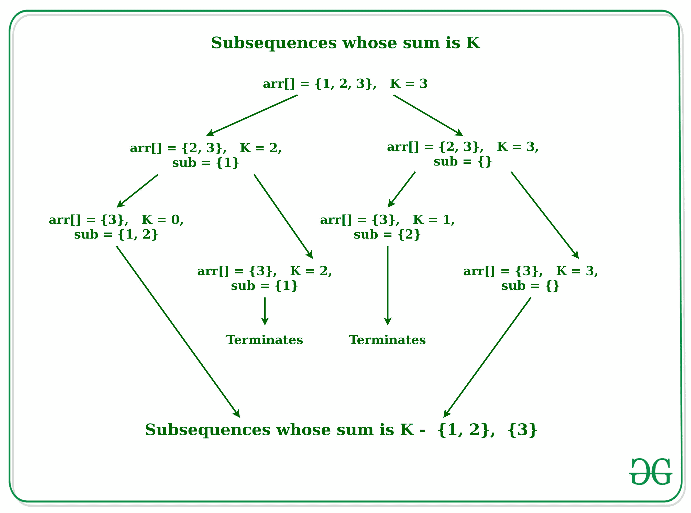

# 求和等于 K 的所有子序列

> 原文:[https://www . geesforgeks . org/find-all-subseries-with-sum-equal-to-k/](https://www.geeksforgeeks.org/find-all-subsequences-with-sum-equals-to-k/)

给定一个长度为 **N** 的数组**arr【】**和一个数字 **K** ，任务是找到元素之和为 **K** 的数组的所有[子序列](https://www.geeksforgeeks.org/subarraysubstring-vs-subsequence-and-programs-to-generate-them/)

**示例:**

> **输入:** arr[] = {1，2，3}，K = 3
> **输出:**
> 1 2
> 3
> 
> **输入:** arr[] = {17，18，6，11，2，4}，K = 6
> **输出:**
> 2 4
> 6



**方法:**
想法是使用[锯齿状数组](https://www.geeksforgeeks.org/jagged-array-in-java/)来存储不同长度数组的子序列。对于数组中的每个元素，主要有两种选择，要么包含在子序列中，要么不包含在子序列中。如果数组中的每个元素都包含了这个元素，则通过减少元素的总和来应用它，否则搜索子序列而不包含它。

下面是上述方法的实现:

## C++

```
// C++ implementation to find all the
// subsequence whose sum is K

#include <bits/stdc++.h>
using namespace std;

// Utility function to find the subsequences
// whose sum of the element is K
int subsetSumToK(int arr[], int n,
            int output[][50], int k){

    // Base Case
    if (n == 0) {
        if (k == 0) {
            output[0][0] = 0;
            return 1;
        }
        else {
            return 0;
        }
    }

    // Array to store the subsequences
    // which includes the element arr[0]
    int output1[1000][50];

    // Array to store the subsequences
    // which not includes the element arr[0]
    int output2[1000][50];

    // Recursive call to find the subsequences
    // which includes the element arr[0]
    int size1 = subsetSumToK(arr + 1,
        n - 1, output1, k - arr[0]);

    // Recursive call to find the subsequences
    // which not includes the element arr[0]
    int size2 = subsetSumToK(arr + 1, n - 1,
                                output2, k);

    int i, j;

    // Loop to update the results of the
    // Recursive call of the function
    for (i = 0; i < size1; i++) {

        // Incremeing the length of
        // jagged array because it includes
        // the arr[0] element of the array
        output[i][0] = output1[i][0] + 1;

        // In the first column of the jagged
        // array put the arr[0] element
        output[i][1] = arr[0];
    }

    // Loop to update the subsequence
    // in the output array
    for (i = 0; i < size1; i++) {
        for (j = 1; j <= output1[i][0]; j++) {
            output[i][j + 1] = output1[i][j];
        }
    }

    // Loop to update the subsequences
    // which do not include the arr[0] element
    for (i = 0; i < size2; i++) {
        for (j = 0; j <= output2[i][0]; j++) {
            output[i + size1][j] = output2[i][j];
        }
    }

    return size1 + size2;
}

// Function to find the subsequences
// whose sum of the element is K
void countSubsequences(int arr[], int n,
            int output[][50], int k)
{  
    int size = subsetSumToK(arr, n, output, k);

    for (int i = 0; i < size; i++) {
        for (int j = 1; j <= output[i][0]; j++) {
            cout << output[i][j] << " ";
        }
        cout << endl;
    }   
}

// Driver Code
int main()
{
    int arr[] = {5, 12, 3, 17, 1, 18, 15, 3, 17};
    int length = 9, output[1000][50], k = 6;

    countSubsequences(arr, length, output, k);

    return 0;
}
```

## Java 语言(一种计算机语言，尤用于创建网站)

```
// Java implementation to find all the
// sub-sequences whose sum is K

import java.util.*;
public class SubsequenceSumK {

    // Function to find the subsequences
    // with given sum
    public static void subSequenceSum(
        ArrayList<ArrayList<Integer>> ans,
        int a[], ArrayList<Integer> temp,
                        int k, int start)
    {
        // Here we have used ArrayList
        // of ArrayList in in Java for
        // implementation of Jagged Array

        // if k < 0 then the sum of
        // the current subsequence
        // in temp is greater than K
        if(start > a.length || k < 0)
            return ;

        // if(k==0) means that the sum
        // of this subsequence
        // is equal to K
        if(k == 0)
        {
            ans.add(
             new ArrayList<Integer>(temp)
             );
            return ;
        }
        else {
            for (int i = start;
                 i < a.length; i++) {

                // Adding a new
                // element into temp
                temp.add(a[i]);

                // After selecting an
                // element from the
                // array we subtract K
                // by that value
                subSequenceSum(ans, a,
                   temp, k - a[i],i+1);

                // Remove the lastly
                // added element
                temp.remove(temp.size() - 1);
            }
        }
    }

    // Driver Code
    public static void main(String args[])
    {
        int arr[] = {5, 12, 3, 17, 1,
                     18, 15, 3, 17};
        int k = 6;
        ArrayList<ArrayList<Integer>> ans;
        ans= new ArrayList<
                  ArrayList<Integer>>();
        subSequenceSum(ans, arr,
            new ArrayList<Integer>(), k, 0);

        // Loop to print the subsequences
        for(int i = 0; i < ans.size();
         i++){
            for(int j = 0;
              j < ans.get(i).size(); j++){
                System.out.print(
                    ans.get(i).get(j));
                System.out.print(" ");
            }
            System.out.println();
        }
    }
}
```

## 蟒蛇 3

```
# Python3 implementation to find all the
# subsequence whose sum is K

# Utility function to find the subsequences
# whose sum of the element is K
def subsetSumToK(arr, n, output, k):

    # Base Case
    if (n == 0):
        if (k == 0):
            output[0][0] = 0;
            return 1;
        else:
            return 0;

    # Array to store the subsequences
    # which includes the element arr[0]   
    output1 = [[0 for j in range(50)] for i in range(1000)]

    # Array to store the subsequences
    # which not includes the element arr[0]
    output2 = [[0 for j in range(50)] for i in range(1000)]

    # Recursive call to find the subsequences
    # which includes the element arr[0]
    size1 = subsetSumToK(arr[1:], n - 1, output1, k - arr[0]);

    # Recursive call to find the subsequences
    # which not includes the element arr[0]
    size2 = subsetSumToK(arr[1:], n - 1, output2, k)

    # Loop to update the results of the
    # Recursive call of the function
    for i in range(size1):

        # Incremeing the length of
        # jagged array because it includes
        # the arr[0] element of the array
        output[i][0] = output1[i][0] + 1;

        # In the first column of the jagged
        # array put the arr[0] element
        output[i][1] = arr[0];

    # Loop to update the subsequence
    # in the output array
    for i in range(size1):
        for j in range(1, output1[i][0]+1):  
            output[i][j + 1] = output1[i][j];

    # Loop to update the subsequences
    # which do not include the arr[0] element
    for i in range(size2):
        for j in range(output2[i][0] + 1):
            output[i + size1][j] = output2[i][j];

    return size1 + size2;

# Function to find the subsequences
# whose sum of the element is K
def countSubsequences(arr, n, output, k):
    size = subsetSumToK(arr, n, output, k);
    for i in range(size):    
        for j in range(1, output[i][0] + 1):
            print(output[i][j], end = ' ')
        print()

# Driver Code
if __name__=='__main__':

    arr = [5, 12, 3, 17, 1, 18, 15, 3, 17]
    length = 9
    output = [[0 for j in range(50)] for i in range(1000)]
    k = 6;

    countSubsequences(arr, length, output, k);

  # This code is contributed by rutvik_56.
```

## C#

```
// C# implementation to find all the
// subsequence whose sum is K
using System;
using System.Collections;
using System.Collections.Generic;

class GFG{

// Function to find the subsequences
// with given sum
public static void subSequenceSum(
    List<List<int>> ans, int[] a,
    List<int> temp, int k, int start)
{

    // Here we have used ArrayList
    // of ArrayList in in Java for 
    // implementation of Jagged Array

    // If k < 0 then the sum of
    // the current subsequence
    // in temp is greater than K
    if (start > a.Length || k < 0)
        return;

    // If (k==0) means that the sum 
    // of this subsequence
    // is equal to K
    if (k == 0)
    {
        ans.Add(new List<int>(temp));
        return;
    }
    else
    {
        for(int i = start;
                i < a.Length; i++)
        {

            // Adding a new 
            // element into temp
            temp.Add(a[i]);

            // After selecting an
            // element from the
            // array we subtract K
            // by that value
            subSequenceSum(ans, a, 
               temp, k - a[i], i + 1);

            // Remove the lastly 
            // added element
            temp.RemoveAt(temp.Count - 1);
        }
    }
}

// Driver code
static public void Main ()
{
    int[] arr = { 5, 12, 3, 17, 1,
                  18, 15, 3, 17 };
    int k = 6;

    List<List<int>> ans = new List<List<int>>();

    subSequenceSum(ans, arr,
    new List<int>(), k, 0);

    // Loop to print the subsequences
    for(int i = 0; i < ans.Count; i++)
    {
        for(int j = 0; j < ans[i].Count; j++)
        {
            Console.Write(ans[i][j] + " ");
        }
        Console.WriteLine();
    } 
}
}

// This code is contributed by offbeat
```

## java 描述语言

```
<script>
    // Javascript implementation to find all the
    // subsequence whose sum is K

    // Utility function to find the subsequences
    // whose sum of the element is K
    function subsetSumToK(arr, n, output, k){

        // Base Case
        if (n == 0) {
            if (k == 0) {
                output[0][0] = 0;
                return 1;
            }
            else {
                return 0;
            }
        }

        // Array to store the subsequences
        // which includes the element arr[0]
        let output1 = new Array(1000);

        // Array to store the subsequences
        // which not includes the element arr[0]
        let output2 = new Array(1000);

        for(let i = 0; i < 1000; i++)
        {
            output1[i] = new Array(50);
            output2[i] = new Array(50);
        }

        // Recursive call to find the subsequences
        // which includes the element arr[0]
        let size1 = subsetSumToK(arr + 1, n - 1, output1, k - arr[0]);

        // Recursive call to find the subsequences
        // which not includes the element arr[0]
        let size2 = subsetSumToK(arr + 1, n - 1, output2, k);

        let i, j;

        // Loop to update the results of the
        // Recursive call of the function
        for (i = 0; i < size1; i++) {

            // Incremeing the length of
            // jagged array because it includes
            // the arr[0] element of the array
            output[i][0] = output1[i][0] + 1;

            // In the first column of the jagged
            // array put the arr[0] element
            output[i][1] = arr[0];
        }

        // Loop to update the subsequence
        // in the output array
        for (i = 0; i < size1; i++) {
            for (j = 1; j <= output1[i][0]; j++) {
                output[i][j + 1] = output1[i][j];
            }
        }

        // Loop to update the subsequences
        // which do not include the arr[0] element
        for (i = 0; i < size2; i++) {
            for (j = 0; j <= output2[i][0]; j++) {
                output[i + size1][j] = output2[i][j];
            }
        }

        return size1 + size2;
    }

    // Function to find the subsequences
    // whose sum of the element is K
    function countSubsequences(arr, n, output, k)
    { 
        let size = subsetSumToK(arr, n, output, k);
        let outPut = [[5,1], [3,3]];

        for (let i = 0; i < 2; i++) {
            for (let j = 0; j < 2; j++) {
                document.write(outPut[i][j] + " ");
            }
            document.write("</br>");
        }  
    }

    let arr = [5, 12, 3, 17, 1, 18, 15, 3, 17];
    let length = 9, k = 6;
    let output = new Array(1000);
    for(let i = 0; i < 1000; i++)
    {
      output[i] = new Array(50);
    }

    countSubsequences(arr, length, output, k);

// This code is contributed by mukesh07.
</script>
```

**Output:** 

```
5 1 
3 3
```