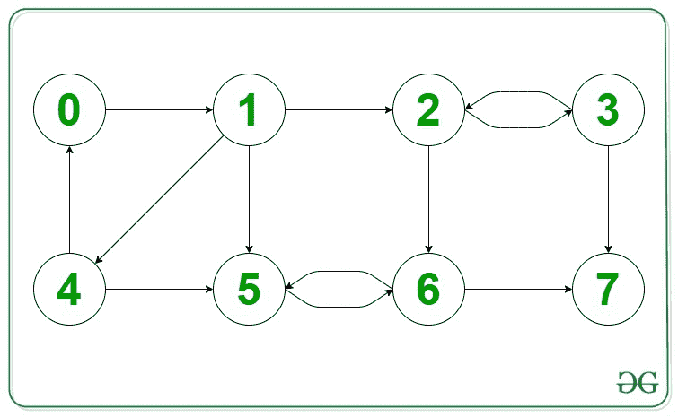

# 找到一个图的所有母顶点

> 原文:[https://www . geeksforgeeks . org/find-所有图的母顶点/](https://www.geeksforgeeks.org/find-all-the-mother-vertices-of-a-graph/)

**母顶点:**一个[图](https://www.geeksforgeeks.org/graph-data-structure-and-algorithms/)中的母顶点 G = (V，E)是一个顶点 V，这样 G 中的所有其他顶点都可以通过从 v 开始的路径到达[。图中可以有零个、一个或多个母顶点。我们需要找到给定图中的所有母顶点。](https://www.geeksforgeeks.org/find-if-there-is-a-path-between-two-vertices-in-a-given-graph/)

**示例:**

> **输入:**给定下图
> **输出:** 0 1 4
> **解释:**在给定的图中，母顶点是 0、1 和 4，因为从这些顶点到每个顶点都有一条路径。



[推荐:请先在{IDE}上尝试您的方法，然后再继续解决方案。](https://practice.geeksforgeeks.org/problems/kill-captain-america0228/1)

**天真的方法:**
一个简单的方法是对所有的顶点执行 [DFS](https://www.geeksforgeeks.org/depth-first-traversal-for-a-graph/) 或 [BFS](https://www.geeksforgeeks.org/breadth-first-traversal-for-a-graph/) ，并找出我们是否能从那个顶点到达所有的顶点。

***时间复杂度*** : *O(V(E+V))*

**高效方法:**

*   使用这个[算法](https://www.geeksforgeeks.org/find-a-mother-vertex-in-a-graph/)在给定的图 G 中找到任何母顶点 **v** 。
*   如果存在一个母顶点，那么构成[强连通分量](https://www.geeksforgeeks.org/strongly-connected-components/)并包含 **v** 的图 G 的顶点集就是图的所有母顶点集。

**上面的想法是怎么运作的？**
如果一个图存在一个母顶点，那么所有的母顶点都是包含母顶点的强连通分支的顶点，因为如果 **v** 是一个母顶点，并且存在一条从 **u** - > **v** 的路径，那么 **u** 也必须是一个母顶点。

下面是上述方法的实现:

## C++

```
// C++ program to find all the mother vertices
#include <bits/stdc++.h>
using namespace std;

// This function does DFS traversal
// from given node u, and marks the
// visited nodes in the visited array
void dfs_helper(int u, vector<vector<int> >& adj,
                bool visited[])
{
    if (visited[u])
        return;

    visited[u] = true;

    for (auto v : adj[u]) {
        if (!visited[v])
            dfs_helper(v, adj, visited);
    }
}

// Function that stores the adjacency
// list of the transpose graph of the
// given graph in the trans_adj vector
void getTransposeGraph(vector<vector<int> >& adj,
                       vector<vector<int> >& trans_adj)
{
    for (int u = 0; u < adj.size(); u++) {
        for (auto v : adj[u]) {
            trans_adj[v].push_back(u);
        }
    }
}

// Initializes all elements of visited
// array with value false
void initialize_visited(bool visited[], int n)
{
    for (int u = 0; u < n; u++)
        visited[u] = false;
}

// Returns the list of mother
// vertices. If the mother vertex
// does not exists returns -1
vector<int> findAllMotherVertices(vector<vector<int> >& adj)
{
    int n = adj.size();
    bool visited[n];

    // Find any mother vertex
      // in given graph, G
    initialize_visited(visited, n);
    int last_dfs_called_on = -1;

    for (int u = 0; u < n; u++) {
        if (!visited[u]) {
            dfs_helper(u, adj, visited);
            last_dfs_called_on = u;
        }
    }

    // Check if we can reach
       // all vertices from
    // last_dfs_called_on node
    initialize_visited(visited, n);
    dfs_helper(last_dfs_called_on, adj, visited);

    for (int u = 0; u < n; u++) {

          // Check of the mother vertex
        // exist else return -1
          if (!visited[u]) {
            vector<int> emptyVector;
            emptyVector.push_back(-1);

            return emptyVector;
        }
    }

    // Now in G_transpose, do DFS
    // from that mother vertex,
    // and we will only reach the
      // other mother vertices of G
    int motherVertex = last_dfs_called_on;

    // trans_adj is the transpose
    // of the given Graph
    vector<vector<int> > trans_adj(n);

    // Function call to get
      // the transpose graph
    getTransposeGraph(adj, trans_adj);

    // DFS from that mother vertex
    // in the transpose graph and the
    // visited nodes are all the
    // mother vertices of the given
    // graph G
    initialize_visited(visited, n);
    dfs_helper(motherVertex, trans_adj, visited);

    // Vector to store the list
      // of mother vertices
    vector<int> ans;

    for (int u = 0; u < n; u++) {
        if (visited[u])
            ans.push_back(u);
    }

    // Return the required list
    return ans;
}

// Driver Code
int main()
{
    // No. of nodes
    int V = 8;
    vector<vector<int> > adj(V);

    adj[0].push_back(1);
    adj[1].push_back(2);
    adj[1].push_back(4);
    adj[1].push_back(5);
    adj[2].push_back(3);
    adj[2].push_back(6);
    adj[3].push_back(2);
    adj[3].push_back(7);
    adj[4].push_back(0);
    adj[4].push_back(5);
    adj[5].push_back(6);
    adj[6].push_back(5);
    adj[6].push_back(7);

    // Function call to find the mother vertices
    vector<int> motherVertices = findAllMotherVertices(adj);

    // Print answer
    if (motherVertices[0] == -1)
        cout << "No mother vertex exists";
    else {
        cout << "All Mother vertices of the graph are : ";
        for (int v : motherVertices)
            cout << v << " ";
    }

    return 0;
}
```

## Java 语言(一种计算机语言，尤用于创建网站)

```
// Java program to find all the mother vertices
import java.util.*;

class GFG{

// This function does DFS traversal
// from given node u, and marks the
// visited nodes in the visited array
static void dfs_helper(int u, Vector<Integer>[] adj,
                boolean visited[])
{
    if (visited[u])
        return;

    visited[u] = true;

    for (int v : adj[u]) {
        if (!visited[v])
            dfs_helper(v, adj, visited);
    }
}

// Function that stores the adjacency
// list of the transpose graph of the
// given graph in the trans_adj vector
static void getTransposeGraph(Vector<Integer>[] adj,
        Vector<Integer>[] trans_adj)
{
    for (int u = 0; u < adj.length; u++) {
        for (int v : adj[u]) {
            trans_adj[v].add(u);
        }
    }
}

// Initializes all elements of visited
// array with value false
static void initialize_visited(boolean visited[], int n)
{
    for (int u = 0; u < n; u++)
        visited[u] = false;
}

// Returns the list of mother
// vertices. If the mother vertex
// does not exists returns -1
static Vector<Integer> findAllMotherVertices(Vector<Integer>[] adj)
{
    int n = adj.length;
    boolean []visited = new boolean[n];

    // Find any mother vertex
      // in given graph, G
    initialize_visited(visited, n);
    int last_dfs_called_on = -1;

    for (int u = 0; u < n; u++) {
        if (!visited[u]) {
            dfs_helper(u, adj, visited);
            last_dfs_called_on = u;
        }
    }

    // Check if we can reach
       // all vertices from
    // last_dfs_called_on node
    initialize_visited(visited, n);
    dfs_helper(last_dfs_called_on, adj, visited);

    for (int u = 0; u < n; u++) {

          // Check of the mother vertex
        // exist else return -1
          if (!visited[u]) {
            Vector<Integer> emptyVector = new Vector<Integer>();
            emptyVector.add(-1);

            return emptyVector;
        }
    }

    // Now in G_transpose, do DFS
    // from that mother vertex,
    // and we will only reach the
      // other mother vertices of G
    int motherVertex = last_dfs_called_on;

    // trans_adj is the transpose
    // of the given Graph
    Vector<Integer> []trans_adj = new Vector[n];
    for (int i = 0; i < trans_adj.length; i++)
        trans_adj[i] = new Vector<Integer>();

    // Function call to get
      // the transpose graph
    getTransposeGraph(adj, trans_adj);

    // DFS from that mother vertex
    // in the transpose graph and the
    // visited nodes are all the
    // mother vertices of the given
    // graph G
    initialize_visited(visited, n);
    dfs_helper(motherVertex, trans_adj, visited);

    // Vector to store the list
      // of mother vertices
    Vector<Integer> ans = new Vector<Integer>();

    for (int u = 0; u < n; u++) {
        if (visited[u])
            ans.add(u);
    }

    // Return the required list
    return ans;
}

// Driver Code
public static void main(String[] args)
{
    // No. of nodes
    int V = 8;
    Vector<Integer>[] adj = new Vector[V];
    for (int i = 0; i < adj.length; i++)
        adj[i] = new Vector<Integer>();
    adj[0].add(1);
    adj[1].add(2);
    adj[1].add(4);
    adj[1].add(5);
    adj[2].add(3);
    adj[2].add(6);
    adj[3].add(2);
    adj[3].add(7);
    adj[4].add(0);
    adj[4].add(5);
    adj[5].add(6);
    adj[6].add(5);
    adj[6].add(7);

    // Function call to find the mother vertices
    Vector<Integer> motherVertices = findAllMotherVertices(adj);

    // Print answer
    if (motherVertices.get(0) == -1)
        System.out.print("No mother vertex exists");
    else {
        System.out.print("All Mother vertices of the graph are : ");
        for (int v : motherVertices)
            System.out.print(v+ " ");
    }

}
}

// This code is contributed by 29AjayKumar
```

## java 描述语言

```
<script>
// Javascript program to find all the mother vertices

// This function does DFS traversal
// from given node u, and marks the
// visited nodes in the visited array
function dfs_helper(u, adj, visited) {
  if (visited[u]) return;

  visited[u] = true;

  for (let v of adj[u]) {
    if (!visited[v]) dfs_helper(v, adj, visited);
  }
}

// Function that stores the adjacency
// list of the transpose graph of the
// given graph in the trans_adj vector
function getTransposeGraph(adj, trans_adj) {
  for (let u = 0; u < adj.length; u++) {
    for (let v of adj[u]) {
      trans_adj[v].push(u);
    }
  }
}

// Initializes all elements of visited
// array with value false
function initialize_visited(visited, n) {
  for (let u = 0; u < n; u++) visited[u] = false;
}

// Returns the list of mother
// vertices. If the mother vertex
// does not exists returns -1
function findAllMotherVertices(adj) {
  let n = adj.length;
  let visited = new Array(n);

  // Find any mother vertex
  // in given graph, G
  initialize_visited(visited, n);
  let last_dfs_called_on = -1;

  for (let u = 0; u < n; u++) {
    if (!visited[u]) {
      dfs_helper(u, adj, visited);
      last_dfs_called_on = u;
    }
  }

  // Check if we can reach
  // all vertices from
  // last_dfs_called_on node
  initialize_visited(visited, n);
  dfs_helper(last_dfs_called_on, adj, visited);

  for (let u = 0; u < n; u++) {
    // Check of the mother vertex
    // exist else return -1
    if (!visited[u]) {
      let emptyVector = [];
      emptyVector.push(-1);

      return emptyVector;
    }
  }

  // Now in G_transpose, do DFS
  // from that mother vertex,
  // and we will only reach the
  // other mother vertices of G
  let motherVertex = last_dfs_called_on;

  // trans_adj is the transpose
  // of the given Graph
  let trans_adj = new Array(n).fill(0).map(() => []);

  // Function call to get
  // the transpose graph
  getTransposeGraph(adj, trans_adj);

  // DFS from that mother vertex
  // in the transpose graph and the
  // visited nodes are all the
  // mother vertices of the given
  // graph G
  initialize_visited(visited, n);
  dfs_helper(motherVertex, trans_adj, visited);

  // Vector to store the list
  // of mother vertices
  let ans = [];

  for (let u = 0; u < n; u++) {
    if (visited[u]) ans.push(u);
  }

  // Return the required list
  return ans;
}

// Driver Code

// No. of nodes
let V = 8;
let adj = new Array(V).fill(0).map(() => []);

adj[0].push(1);
adj[1].push(2);
adj[1].push(4);
adj[1].push(5);
adj[2].push(3);
adj[2].push(6);
adj[3].push(2);
adj[3].push(7);
adj[4].push(0);
adj[4].push(5);
adj[5].push(6);
adj[6].push(5);
adj[6].push(7);

// Function call to find the mother vertices
let motherVertices = findAllMotherVertices(adj);

// Print answer
if (motherVertices[0] == -1) document.write("No mother vertex exists");
else {
  document.write("All Mother vertices of the graph are : ");
  for (let v of motherVertices) document.write(v + " ");
}

// This code is contributed by _saurabh_jaiswal.
</script>
```

**Output**

```
All Mother vertices of the graph are : 0 1 4 
```

**时间复杂度:***O(V+E)*
T5】空间复杂度: *O(V+E)*