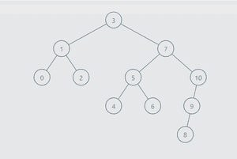

# 在 BST | Set 2

中找到所有给定和的对

> 原文:[https://www . geesforgeks . org/find-all-the-pairs-with-given-sum-in-a-BST-set-2/](https://www.geeksforgeeks.org/find-all-the-pairs-with-given-sum-in-a-bst-set-2/)

给定一个[二叉查找树](https://www.geeksforgeeks.org/binary-search-tree-set-1-search-and-insertion/)和一个整数**和**，任务是从树中找出和等于给定整数**和**的所有对。
我们在[这个](https://www.geeksforgeeks.org/find-a-pair-with-given-sum-in-bst/)帖子里讨论过类似的问题。

**示例:**

```
Input:      
              2
            /   \
           1     6
                / \
               5   7
              /
             3
             \
              4
sum = 8
Output:
1 7
2 6
3 5

Input:      
              2
            /   \
           1     3
                  \
                   4
sum = 5
Output:
1 4
2 3
```

**逼近:**从边、左、右依次遍历树，将左右两边的值分别存储到[数组列表](https://www.geeksforgeeks.org/arraylist-in-java/) **左列表**和**右列表**中。到达叶节点后，从各自的数组列表中取出左侧最后一个值和右侧最后一个值。会有三个条件:

1.  **左侧值+右侧值<求和:**删除 LeftList 的最后一个值，并使左侧执行到右侧，因为在树中从左侧移动到右侧时，节点的值会增加。
2.  **左侧值+右侧值>求和:**删除 RightList 的最后一个值，将右侧执行移到左侧，因为在树中从右侧移到左侧时，节点的值会减少。
3.  **左侧值+右侧值=总和:**删除两个列表的最后一个值，左侧执行到右侧，右侧执行到左侧。

下面是上述方法的实现:

## C++

```
// C++ implementation of the
// above approach
#include<bits/stdc++.h>
using namespace std;
struct Node
{
  int data;
  Node *left, *right,
       *root;

  Node(int data)
  {
    this -> data = data;
    left = NULL;
    right = NULL;
    root = NULL;
  }
};

// Function to add a node
// to the BST
Node* AddNode(Node *root,
              int data)
{
  // If the tree is empty,
  // return a new node
  if (root == NULL)
  {
    root = new Node(data);
    return root;
  }

  // Otherwise, recur down
  // the tree
  if (root -> data < data)
    root -> right = AddNode(root -> right,
                            data);

  else if (root -> data > data)
    root -> left = AddNode(root -> left,
                           data);

  return root;
}

// Function to find the
// target pairs
void TargetPair(Node *node,
                int tar)
{
  // LeftList which stores
  // the left side values
  vector<Node*> LeftList;

  // RightList which stores
  // the right side values
  vector<Node*> RightList;

  // curr_left pointer is used
  // for left side execution and
  // curr_right pointer is used
  // for right side execution
  Node *curr_left = node;
  Node *curr_right = node;

  while (curr_left != NULL ||
         curr_right != NULL ||
         LeftList.size() > 0 &&
         RightList.size() > 0)
  {
    // Storing the left side
    // values into LeftList
    // till leaf node not found
    while (curr_left != NULL)
    {
      LeftList.push_back(curr_left);
      curr_left = curr_left -> left;
    }

    // Storing the right side
    // values into RightList
    // till leaf node not found
    while (curr_right != NULL)
    {
      RightList.push_back(curr_right);
      curr_right = curr_right -> right;
    }

    // Last node of LeftList
    Node *LeftNode =
          LeftList[LeftList.size() - 1];

    // Last node of RightList
    Node *RightNode =
          RightList[RightList.size() - 1];

    int leftVal = LeftNode -> data;
    int rightVal = RightNode -> data;

    // To prevent repetition
    // like 2, 6 and 6, 2
    if (leftVal >= rightVal)
      break;

    // Delete the last value of LeftList
    // and make the execution to the
    // right side
    if (leftVal + rightVal < tar)
    {
      LeftList.pop_back();
      curr_left = LeftNode -> right;
    }

    // Delete the last value of RightList
    // and make the execution to the left
    // side
    else if (leftVal + rightVal > tar)
    {
      RightList.pop_back();
      curr_right = RightNode -> left;
    }

    // (left value + right value) = target
    // then print the left value and right value
    // Delete the last value of left and right list
    // and make the left execution to right side
    // and right side execution to left side
    else
    {
      cout << LeftNode -> data << " " <<
              RightNode -> data << endl;

      RightList.pop_back();
      LeftList.pop_back();
      curr_left = LeftNode -> right;
      curr_right = RightNode -> left;
    }
  }
}

// Driver code
int main()
{
  Node *root = NULL;
  root  = AddNode(root, 2);
  root = AddNode(root, 6);
  root = AddNode(root, 5);
  root = AddNode(root, 3);
  root = AddNode(root, 4);
  root = AddNode(root, 1);
  root = AddNode(root, 7);
  int sum = 8;
  TargetPair(root, sum);
}

// This code is contributed by Rutvik_56
```

## Java 语言(一种计算机语言，尤用于创建网站)

```
// Java implementation of the approach
import java.util.*;
public class GFG {

    // A binary tree node
    public static class Node {
        int data;
        Node left, right, root;

        Node(int data)
        {
            this.data = data;
        }
    }

    // Function to add a node to the BST
    public static Node AddNode(Node root, int data)
    {

        // If the tree is empty, return a new node
        if (root == null) {
            root = new Node(data);
            return root;
        }

        // Otherwise, recur down the tree
        if (root.data < data)
            root.right = AddNode(root.right, data);

        else if (root.data > data)
            root.left = AddNode(root.left, data);

        return root;
    }

    // Function to find the target pairs
    public static void TargetPair(Node node, int tar)
    {

        // LeftList which stores the left side values
        ArrayList<Node> LeftList = new ArrayList<>();

        // RightList which stores the right side values
        ArrayList<Node> RightList = new ArrayList<>();

        // curr_left pointer is used for left side execution and
        // curr_right pointer is used for right side execution
        Node curr_left = node;
        Node curr_right = node;

        while (curr_left != null || curr_right != null
               || LeftList.size() > 0 && RightList.size() > 0) {

            // Storing the left side values into LeftList
            // till leaf node not found
            while (curr_left != null) {
                LeftList.add(curr_left);
                curr_left = curr_left.left;
            }

            // Storing the right side values into RightList
            // till leaf node not found
            while (curr_right != null) {
                RightList.add(curr_right);
                curr_right = curr_right.right;
            }

            // Last node of LeftList
            Node LeftNode = LeftList.get(LeftList.size() - 1);

            // Last node of RightList
            Node RightNode = RightList.get(RightList.size() - 1);

            int leftVal = LeftNode.data;
            int rightVal = RightNode.data;

            // To prevent repetition like 2, 6 and 6, 2
            if (leftVal >= rightVal)
                break;

            // Delete the last value of LeftList and make
            // the execution to the right side
            if (leftVal + rightVal < tar) {
                LeftList.remove(LeftList.size() - 1);
                curr_left = LeftNode.right;
            }

            // Delete the last value of RightList and make
            // the execution to the left side
            else if (leftVal + rightVal > tar) {
                RightList.remove(RightList.size() - 1);
                curr_right = RightNode.left;
            }

            // (left value + right value) = target
            // then print the left value and right value
            // Delete the last value of left and right list
            // and make the left execution to right side
            // and right side execution to left side
            else {
                System.out.println(LeftNode.data + " " + RightNode.data);

                RightList.remove(RightList.size() - 1);
                LeftList.remove(LeftList.size() - 1);
                curr_left = LeftNode.right;
                curr_right = RightNode.left;
            }
        }
    }

    // Driver code
    public static void main(String[] b)
    {

        Node root = null;
        root = AddNode(root, 2);
        root = AddNode(root, 6);
        root = AddNode(root, 5);
        root = AddNode(root, 3);
        root = AddNode(root, 4);
        root = AddNode(root, 1);
        root = AddNode(root, 7);
        int sum = 8;
        TargetPair(root, sum);
    }
}
```

## 蟒蛇 3

```
# Python3 implementation of the approach

# A binary tree node
class Node:

    def __init__(self, key):

        self.data = key
        self.left = None
        self.right = None

# Function to append a node to the BST
def AddNode(root, data):

    # If the tree is empty, return a new node
    if (root == None):
        root = Node(data)
        return root

    # Otherwise, recur down the tree
    if (root.data < data):
        root.right = AddNode(root.right, data)

    elif (root.data > data):
        root.left = AddNode(root.left, data)

    return root

# Function to find the target pairs
def TargetPair(node, tar):

    # LeftList which stores the left side values
    LeftList = []

    # RightList which stores the right side values
    RightList = []

    # curr_left pointer is used for left
    # side execution and curr_right pointer
    # is used for right side execution
    curr_left = node
    curr_right = node

    while (curr_left != None or
          curr_right != None or
          len(LeftList) > 0 and
          len(RightList) > 0):

        # Storing the left side values into
        # LeftList till leaf node not found
        while (curr_left != None):
            LeftList.append(curr_left)
            curr_left = curr_left.left

        # Storing the right side values into
        # RightList till leaf node not found
        while (curr_right != None):
            RightList.append(curr_right)
            curr_right = curr_right.right

        # Last node of LeftList
        LeftNode = LeftList[-1]

        # Last node of RightList
        RightNode = RightList[-1]

        leftVal = LeftNode.data
        rightVal = RightNode.data

        # To prevent repetition like 2, 6 and 6, 2
        if (leftVal >= rightVal):
            break

        # Delete the last value of LeftList and
        # make the execution to the right side
        if (leftVal + rightVal < tar):
            del LeftList[-1]
            curr_left = LeftNode.right

        # Delete the last value of RightList and
        # make the execution to the left side
        elif (leftVal + rightVal > tar):
            del RightList[-1]
            curr_right = RightNode.left

        # (left value + right value) = target
        # then print the left value and right value
        # Delete the last value of left and right list
        # and make the left execution to right side
        # and right side execution to left side
        else:
            print(LeftNode.data, RightNode.data)

            del RightList[-1]
            del LeftList[-1]

            curr_left = LeftNode.right
            curr_right = RightNode.left

# Driver code
if __name__ == '__main__':

    root = None
    root = AddNode(root, 2)
    root = AddNode(root, 6)
    root = AddNode(root, 5)
    root = AddNode(root, 3)
    root = AddNode(root, 4)
    root = AddNode(root, 1)
    root = AddNode(root, 7)

    sum = 8

    TargetPair(root, sum)

# This code is contributed by mohit kumar 29
```

## C#

```
// C# program to implement
// the above approach
using System.Collections.Generic;
using System;

class GFG
{

    // A binary tree node
    public class Node
    {
        public int data;
        public Node left, right, root;

        public Node(int data)
        {
            this.data = data;
        }
    }

    // Function to add a node to the BST
    public static Node AddNode(Node root, int data)
    {

        // If the tree is empty, return a new node
        if (root == null)
        {
            root = new Node(data);
            return root;
        }

        // Otherwise, recur down the tree
        if (root.data < data)
            root.right = AddNode(root.right, data);

        else if (root.data > data)
            root.left = AddNode(root.left, data);

        return root;
    }

    // Function to find the target pairs
    public static void TargetPair(Node node, int tar)
    {

        // LeftList which stores the left side values
        List<Node> LeftList = new List<Node>();

        // RightList which stores the right side values
        List<Node> RightList = new List<Node>();

        // curr_left pointer is used for left side execution and
        // curr_right pointer is used for right side execution
        Node curr_left = node;
        Node curr_right = node;

        while (curr_left != null || curr_right != null
            || LeftList.Count > 0 && RightList.Count > 0)
        {

            // Storing the left side values into LeftList
            // till leaf node not found
            while (curr_left != null)
            {
                LeftList.Add(curr_left);
                curr_left = curr_left.left;
            }

            // Storing the right side values into RightList
            // till leaf node not found
            while (curr_right != null)
            {
                RightList.Add(curr_right);
                curr_right = curr_right.right;
            }

            // Last node of LeftList
            Node LeftNode = LeftList[LeftList.Count - 1];

            // Last node of RightList
            Node RightNode = RightList[RightList.Count - 1];

            int leftVal = LeftNode.data;
            int rightVal = RightNode.data;

            // To prevent repetition like 2, 6 and 6, 2
            if (leftVal >= rightVal)
                break;

            // Delete the last value of LeftList and make
            // the execution to the right side
            if (leftVal + rightVal < tar)
            {
                LeftList.RemoveAt(LeftList.Count - 1);
                curr_left = LeftNode.right;
            }

            // Delete the last value of RightList and make
            // the execution to the left side
            else if (leftVal + rightVal > tar)
            {
                RightList.RemoveAt(RightList.Count - 1);
                curr_right = RightNode.left;
            }

            // (left value + right value) = target
            // then print the left value and right value
            // Delete the last value of left and right list
            // and make the left execution to right side
            // and right side execution to left side
            else
            {
                Console.WriteLine(LeftNode.data + " " + RightNode.data);

                RightList.RemoveAt(RightList.Count - 1);
                LeftList.RemoveAt(LeftList.Count - 1);
                curr_left = LeftNode.right;
                curr_right = RightNode.left;
            }
        }
    }

    // Driver code
    public static void Main(String[] b)
    {

        Node root = null;
        root = AddNode(root, 2);
        root = AddNode(root, 6);
        root = AddNode(root, 5);
        root = AddNode(root, 3);
        root = AddNode(root, 4);
        root = AddNode(root, 1);
        root = AddNode(root, 7);
        int sum = 8;
        TargetPair(root, sum);
    }
}

/* This code contributed by PrinciRaj1992 */
```

## java 描述语言

```
<script>

// Javascript implementation of the approach

// A binary tree node
class Node
{
    constructor(data)
    {
        this.data = data;
        this.left = this.right = null;
    }
}

// Function to add a node to the BST
function AddNode(root, data)
{

    // If the tree is empty, return a new node
    if (root == null)
    {
        root = new Node(data);
        return root;
    }

    // Otherwise, recur down the tree
    if (root.data < data)
        root.right = AddNode(root.right, data);

    else if (root.data > data)
        root.left = AddNode(root.left, data);

    return root;
}

// Function to find the target pairs
function TargetPair(node, tar)
{
    // LeftList which stores the
    // left side values
    let LeftList = [];

    // RightList which stores
    // the right side values
    let RightList = [];

    // curr_left pointer is used for left
    // side execution and curr_right pointer
    // is used for right side execution
    let curr_left = node;
    let curr_right = node;

    while (curr_left != null || curr_right != null ||
           LeftList.length > 0 && RightList.length > 0)
    {

        // Storing the left side values into
        // LeftList till leaf node not found
        while (curr_left != null)
        {
            LeftList.push(curr_left);
            curr_left = curr_left.left;
        }

        // Storing the right side values into
        // RightList till leaf node not found
        while (curr_right != null)
        {
            RightList.push(curr_right);
            curr_right = curr_right.right;
        }

        // Last node of LeftList
        let LeftNode = LeftList[LeftList.length - 1];

        // Last node of RightList
        let RightNode = RightList[RightList.length - 1];

        let leftVal = LeftNode.data;
        let rightVal = RightNode.data;

        // To prevent repetition like 2, 6 and 6, 2
        if (leftVal >= rightVal)
            break;

        // Delete the last value of LeftList and make
        // the execution to the right side
        if (leftVal + rightVal < tar)
        {
            LeftList.pop();
            curr_left = LeftNode.right;
        }

        // Delete the last value of RightList and make
        // the execution to the left side
        else if (leftVal + rightVal > tar)
        {
            RightList.pop();
            curr_right = RightNode.left;
        }

        // (left value + right value) = target
        // then print the left value and right value
        // Delete the last value of left and right list
        // and make the left execution to right side
        // and right side execution to left side
        else
        {
            document.write(LeftNode.data + " " +
                           RightNode.data + "<br>");

            RightList.pop();
            LeftList.pop();
            curr_left = LeftNode.right;
            curr_right = RightNode.left;
        }
    }
}

// Driver code
let root = null;
root = AddNode(root, 2);
root = AddNode(root, 6);
root = AddNode(root, 5);
root = AddNode(root, 3);
root = AddNode(root, 4);
root = AddNode(root, 1);
root = AddNode(root, 7);
let sum = 8;

TargetPair(root, sum);

// This code is contributed by patel2127

</script>
```

**Output**

```
1 7
2 6
3 5
```

**使用堆栈接近 2:**

给定一个 BST，打印 BST 中存在目标和的所有对。BST 不包含任何副本。



**高于英国标准时间:**

```
Input :
sum = 10
Output:
0 10
1 9
2 8
3 7
4 6
```

```
Input:
sum = 9
Output:
0 9
1 8
2 7
3 6
4 5
```

下面讨论的方法类似于使用双指针技术在排序数组中查找对。

这里使用的思想与用于在 O(n)时间内找到具有目标和的对的双指针算法相同

1.创建两个堆栈

I)为了秩序。

ii)用于反向 Inorder。

2.现在从每个堆栈中逐个填充

3.

I)如果 sum == k，我们将和相加，使 find1 和 find2 为假，得到新元素

ii)如果总和< k，我们将总和相加，使 find1 为假。

iii)如果 sum == k，我们将求和并使 find2 为假。

4.当 curr1->数据> curr2->数据时的中断条件。

下面是实现。

## C++

```
#include <bits/stdc++.h>
using namespace std;

struct TreeNode
{
    int data;
    TreeNode *right;
    TreeNode *left;
    TreeNode(int data)
    {
        this->data = data;
        this->right = NULL;
        this->left = NULL;
    }
};
TreeNode *insertNode(int data, TreeNode *root)
{
    if (root == NULL)
    {
        TreeNode *node = new TreeNode(data);
        return node;
    }
    else if (data > root->data)
    {
        root->right = insertNode(data, root->right);
    }
    else if (data <= root->data)
    {
        root->left = insertNode(data, root->left);
    }
    return root;
}
// The idea used here is same as the two pointer algorithm for find pair with target sum in O(n) time

// 1\. Create Two stacks
//     i) for inorder
//     ii) for revInorder
// 2\. Now populating one by one from each stack
// 3.
//     i) if sum == k we add to the sum and make find1 and find2 to false to get new elements
//     ii) if sum < k we add to the sum and make find1 to false.
//     iii) if sum == k we add to the sum and make find2 to false.
// 4\. breaking condition when element of curr1 > curr2

void allPairs(TreeNode *root, int k)
{
    stack<TreeNode *> s1; //inorder
    stack<TreeNode *> s2; // revInorder

    TreeNode *root1 = root, *root2 = root;
    TreeNode *curr1 = NULL, *curr2 = NULL;

    bool find1 = false, find2 = false; //markers to get new elements

    while (1)
    {
        // standard code for iterative inorder traversal using stack approach
        if (find1 == false)
        {
            while (root1 != NULL)
            {
                s1.push(root1);
                root1 = root1->left;
            }
            curr1 = s1.top();
            s1.pop();
            root1 = curr1->right;
            find1 = true;
        }
        // standard code for iterative reverse inorder traversal using stack approach
        if (find2 == false)
        {
            while (root2 != NULL)
            {
                s2.push(root2);
                root2 = root2->right;
            }
            curr2 = s2.top();
            s2.pop();
            root2 = curr2->left;
            find2 = true;
        }
        // breaking condition
        if (curr1->data >= curr2->data)
        {
            break;
        }
        // means we need next elements so make find1 and find2 to  false to get next elements
        if (curr1->data + curr2->data == k)
        {
            cout << curr1->data << " " << curr2->data << "\n";
            find1 = false;
            find2 = false;
        }
        // means we need greater element so make find1 to false to get next greater
        else if (curr1->data + curr2->data < k)
        {
            find1 = false;
        }
        // means we need smaller element so make find2 to false to get next smaller
        else //if (curr1->data + curr2->data > k)
        {
            find2 = false;
        }
    }
}

int main()
{
    TreeNode *root = NULL;

    int n = 11;
    int tree[] = {3, 1, 7, 0, 2, 5, 10, 4, 6, 9, 8};
    for (int i = 0; i < 11; i++)
    {
        root = insertNode(tree[i], root);
    }
    allPairs(root, 10);
}
```

## 蟒蛇 3

```
class TreeNode:
    def __init__(self,data):
        self.data = data
        self.right = None
        self.left = None

def insertNode(data, root):

    if (root == None):

        node = TreeNode(data)
        return node
    elif (data > root.data):
        root.right = insertNode(data, root.right)

    elif (data <= root.data):

        root.left = insertNode(data, root.left)

    return root

# The idea used here is same as the two pointer algorithm for find pair with target sum in O(n) time

#  1\. Create Two stacks
#      i) for inorder
#      ii) for revInorder
#  2\. Now populating one by one from each stack
#  3.
#      i) if sum == k we add to the sum and make find1 and find2 to false to get new elements
#      ii) if sum < k we add to the sum and make find1 to false.
#      iii) if sum == k we add to the sum and make find2 to false.
#  4\. breaking condition when element of curr1 > curr2

def allPairs(root, k):
    s1=[] #inorder
    s2=[] #revInorder

    root1 = root; root2 = root
    curr1 = None; curr2 = None

    find1 = False; find2 = False #markers to get new elements

    while True:

        # standard code for iterative inorder traversal using stack approach
        if (find1 == False):

            while (root1 != None):           
                s1.append(root1)
                root1 = root1.left

            curr1 = s1[-1]
            s1.pop()
            root1 = curr1.right
            find1 = True
        #standard code for iterative reverse inorder traversal using stack approach
        if (find2 == False):

            while (root2 != None):
                s2.append(root2)
                root2 = root2.right
            curr2 = s2[-1]
            s2.pop()
            root2 = curr2.left
            find2 = True
        # breaking condition
        if (curr1.data >= curr2.data):
            break
        # means we need next elements so make find1 and find2 to  false to get next elements
        if (curr1.data + curr2.data == k):
            print("{} {}".format(curr1.data,curr2.data))
            find1 = False
            find2 = False
        # means we need greater element so make find1 to false to get next greater
        elif (curr1.data + curr2.data < k):
            find1 = False
        # means we need smaller element so make find2 to false to get next smaller
        elif (curr1.data + curr2.data > k):
            find2 = False

if __name__ == '__main__':
    root = None
    n = 11
    tree = [3, 1, 7, 0, 2, 5, 10, 4, 6, 9, 8]
    for i in range(11):
        root = insertNode(tree[i], root)
    allPairs(root, 10)
```

**Output**

```
0 10
1 9
2 8
3 7
4 6
```

**时间复杂度:**O(N)
T3】辅助空间: O(N)