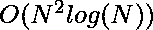

# 在 O(NlogN)

中找到所有子阵列上所有唯一的最大和第二大元素对

> 原文:[https://www . geesforgeks . org/find-all-unique-对-最大和第二大元素-覆盖所有子数组-in-onlogn/](https://www.geeksforgeeks.org/find-all-unique-pairs-of-maximum-and-second-maximum-elements-over-all-sub-arrays-in-onlogn/)

让分别代表数组的第二个最大值和最大值元素的有序对。我们需要找到给定数组的所有这样的唯一对整体连续子数组。

**示例:**

> **输入:** Arr = [ 1，2，3，4，5 ]
> **输出:** (1，2) (2，3) (3，4) (4，5)
> 
> **输入:** Arr = [ 1，1，2 ]
> **输出:** (1，1) (1，2)
> 
> **输入:** Arr = [ 1，2，6，4，5 ]
> **输出:** (1，2) (2，6) (4，5) (4，6) (5，6)

**<u>蛮力进场</u> :**

*   解决这个问题的一个简单方法是扫描每个子阵列，并找到该子阵列中的最大和第二大元素
*   这可以在时间内完成
*   然后，我们可以将每一对插入一个集合中，以确保消除重复，然后打印它们
*   每次插入操作都要花费，将最后的复杂性推到

## C++14

```
// C++ implementation
#include <bits/stdc++.h>
using namespace std;

// Function to return the set of pairs
set<pair<int, int> > pairs(vector<int>& arr)
{
    set<pair<int, int> > pairs;

    // find all subarrays
    for (int i = 0; i < arr.size() - 1; ++i) {
        int maximum = max(arr[i], arr[i + 1]),
            secondmax = min(arr[i], arr[i + 1]);

        for (int j = i + 1; j < arr.size(); ++j) {
            // update max and second max
            if (arr[j] > maximum) {
                secondmax = maximum;
                maximum = arr[j];
            }
            if (arr[j] < maximum && arr[j] > secondmax) {
                secondmax = arr[j];
            }

            // insert a pair in set
            pairs.insert(make_pair(secondmax, maximum));
        }
    }
    return pairs;
}

int main()
{
    vector<int> vec = { 1, 2, 6, 4, 5 };

    set<pair<int, int> > st = pairs(vec);
    cout << "Total Number of valid pairs is :"
         << (int)st.size() << "\n";
    for (auto& x : st) {
        cout << "(" << x.first << ", " << x.second << ") ";
    }
    return 0;
}
```

## Java 语言(一种计算机语言，尤用于创建网站)

```
// Java implementation
import java.util.HashSet;
import java.util.Set;

class Pair implements Comparable<Pair> {
    int first, second;

    public Pair(int first, int second)
    {
        this.first = first;
        this.second = second;
    }

    @Override public int hashCode()
    {
        return 31 * first + second;
    }

    public boolean equals(Object p)
    {
        Pair pair = (Pair)p;

        if (this.first != pair.first)
            return false;

        return this.second == pair.second;
    }

    @Override public int compareTo(Pair p)
    {
        if (this.first == p.first) {
            return this.second - p.second;
        }
        return this.first - p.first;
    }
}

class GFG {

    // Function to return the set of pairs
    static Set<Pair> pairs(int[] arr)
    {
        Set<Pair> pairs = new HashSet<>();

        // Find all subarrays
        for (int i = 0; i < arr.length - 1; ++i) {
            int maximum = Math.max(arr[i], arr[i + 1]),
                secondmax = Math.min(arr[i], arr[i + 1]);

            for (int j = i + 1; j < arr.length; ++j) {

                // Update max and second max
                if (arr[j] > maximum) {
                    secondmax = maximum;
                    maximum = arr[j];
                }
                if (arr[j] < maximum
                    && arr[j] > secondmax) {
                    secondmax = arr[j];
                }

                // Insert a pair in set
                pairs.add(new Pair(secondmax, maximum));
            }
        }
        return pairs;
    }

    // Driver Code
    public static void main(String[] args)
    {
        int[] vec = { 1, 2, 6, 4, 5 };

        Set<Pair> st = pairs(vec);
        System.out.println("Total Number of "
                           + "valid pairs is :"
                           + st.size());

        for (Pair x : st) {
            System.out.printf("(%d, %d)\n", x.first,
                              x.second);
        }
    }
}

// This code is contributed by sanjeev2552
```

## 蟒蛇 3

```
# python3 implementation

# Function to return the set of pairs
def SetofPairs(arr):

    pairs = set()
    n = len(arr)     # length of array

    # find all subarrays
    for i in range(n - 1):
        maximum = max(arr[i], arr[i + 1])
        secondmax = min(arr[i], arr[i + 1])
        for j in range(i + 1, n):

            # update max and second max
            if (arr[j] > maximum):
                secondmax = maximum
                maximum = arr[j]
            if (arr[j] < maximum and arr[j] > secondmax):
                secondmax = arr[j]

            # add a pair in set
            pairs.add((secondmax, maximum))
    return pairs

# Driver code
if __name__ == "__main__":

    vec = [1, 2, 6, 4, 5]
    st = SetofPairs(vec)
    print("Total Number of valid pairs is :", len(st))

    for x in st:
        print(x, end = " ")

        # This code is contributed by sunilsoni10220001022000.
```

## java 描述语言

```
<script>

// JavaScript implementation

// Function to return the set of pairs
function pairs(arr)
{
    var pairs = new Set();

    // find all subarrays
    for (var i = 0; i < arr.length - 1; ++i) {
        var maximum = Math.max(arr[i], arr[i + 1]),
            secondmax = Math.min(arr[i], arr[i + 1]);

        for (var j = i + 1; j < arr.length; ++j) {
            // update max and second max
            if (arr[j] > maximum) {
                secondmax = maximum;
                maximum = arr[j];
            }
            if (arr[j] < maximum && arr[j] > secondmax) {
                secondmax = arr[j];
            }

            // insert a pair in set
            pairs.add([secondmax, maximum].toString());
        }
    }
    return pairs;
}

var vec = [1, 2, 6, 4, 5 ];
var st = pairs(vec);
document.write( "Total Number of valid pairs is :" +
st.size + "<br>");
[...st].sort().forEach(x => {
    x = x.split(',');
    document.write( "(" + x[0] + ", " + x[1] + ") ")
})

</script>
```

**输出:**

```
Total Number of valid pairs is :5
(1, 2) (2, 6) (4, 5) (4, 6) (5, 6)
```

**复杂度分析:**

*   **时间复杂度:** O(N^2 对数(n))。
    插入器械包需要 N 次。最多可以有 N^2 子阵列。所以时间复杂度是 O(N^2 对数 n)。
*   **辅助空间:** O(n^2).
    因为需要额外的空间来存储一组元素。

**<u>高效进场</u> :**

*   通过观察一个元素只能和右边最接近的大于的元素形成对，可以将寻找对的复杂度降低到。
*   要了解为什么会出现这种情况，请考虑下一个示例中的 = 。

```
 Arr = {1, 4, 5, 3, 2, 1}
```

*   可以看到是右边最近的元素，大于。考虑子阵![[4, 5]          ](img/bb19a503c949d9161fb15e90bfd88b19.png "Rendered by QuickLaTeX.com")组成一对。
*   以开头的其他子数组必须包含。考虑其中一个，如果子阵列中存在另一个元素，那么将是该子阵列的配对。
*   否则将形成或，其中是子阵列中右侧的最大元素。
*   在任何情况下，都不能与右侧的任何元素成对。
*   利用这种观察，我们可以使用堆栈实现逻辑，这将对生成的复杂性降低到。
*   每一对都可以插入到一个消除重复的集合中，从而给出最后的时间复杂度

下面是上述方法的实现:

## C++

```
// C++ implementation of the above approach
#include <bits/stdc++.h>
using namespace std;

// Function to return the set of pairs
set<pair<int, int>>
     pairs(vector<int>& arr)
{
    stack<int> st;
    set<pair<int, int>> pairs;

    // Push first element into stack
    st.push(arr[0]);

    // For each element 'X' in arr,
    // pop the stack while top Element
    // is smaller than 'X' and form a pair.
    // If the stack is not empty after
    // the previous operation, create
    // a pair. Push X into the stack.

    for (int i = 1; i < arr.size(); ++i) {
        while (!st.empty() &&
                arr[i] > st.top()) {
            pairs.insert(make_pair(st.top(),
                                    arr[i]));
            st.pop();
        }
        if (!st.empty()) {
            pairs.insert(make_pair(min(st.top(),
                                       arr[i]),
                                   max(st.top(),
                                      arr[i])));
        }
        st.push(arr[i]);
    }
    return pairs;
}

int main()
{
    vector<int> vec = { 1, 2, 6, 4, 5 };

    set<pair<int, int> > st = pairs(vec);
    cout << "Total Number of valid pairs is :"
                   << (int)st.size() << "\n";
    for (auto& x : st) {
        cout << "(" << x.first << ", "
                       << x.second << ") ";
    }
    return 0;
}
```

## Java 语言(一种计算机语言，尤用于创建网站)

```
// Java implementation of the above approach
import java.util.*;

class GFG{

static class pair
{
    int first, second;

    public pair(int first, int second) 
    {
        this.first = first;
        this.second = second;
    }

    @Override
    public int hashCode()
    {
        final int prime = 31;
        int result = 1;
        result = prime * result + first;
        result = prime * result + second;
        return result;
    }

    @Override
    public boolean equals(Object obj)
    {
        if (this == obj)
            return true;
        if (obj == null)
            return false;
        if (getClass() != obj.getClass())
            return false;

        pair other = (pair) obj;
        if (first != other.first)
            return false;
        if (second != other.second)
            return false;
        return true;
    } 
}

// Function to return the set of pairs
static HashSet<pair> pairs(int[] arr)
{
    Stack<Integer> st = new Stack<Integer>();
    HashSet<pair> pairs = new HashSet<pair>();

    // Push first element into stack
    st.add(arr[0]);

    // For each element 'X' in arr,
    // pop the stack while top Element
    // is smaller than 'X' and form a pair.
    // If the stack is not empty after
    // the previous operation, create
    // a pair. Push X into the stack.
    for(int i = 1; i < arr.length; ++i)
    {
        while (!st.isEmpty() && arr[i] > st.peek())
        {
            pairs.add(new pair(st.peek(),
                               arr[i]));
            st.pop();
        }
        if (!st.isEmpty())
        {
            pairs.add(new pair(Math.min(st.peek(),
                                        arr[i]),
                               Math.max(st.peek(),
                                        arr[i])));
        }
        st.add(arr[i]);
    }
    return pairs;
}

// Driver code
public static void main(String[] args)
{
    int [] vec = { 1, 2, 6, 4, 5 };

    HashSet<pair> st = pairs(vec);
    System.out.print("Total Number of valid pairs is :"  +
                     (int)st.size() + "\n");
    for(pair x : st)
    {
        System.out.print("(" +  x.first+ ", " +
                                x.second + ") ");
    }
}
}

// This code is contributed by 29AjayKumar
```

## 蟒蛇 3

```
# Python3 implementation of the above approach

# Function to return the set of pairs
def pairs(arr) :

    st = [];
    pairs = [];

    # Push first element into stack
    st.append(arr[0]);

    # For each element 'X' in arr,
    # pop the stack while top Element
    # is smaller than 'X' and form a pair.
    # If the stack is not empty after
    # the previous operation, create
    # a pair. Push X into the stack.
    for i in range(1, len(arr) ) :
        while len(st) != 0 and arr[i] > st[-1] :
            pairs.append((st[-1], arr[i]));
            st.pop();

        if len(st) != 0 :
            pairs.append((min(st[-1], arr[i]),
                        max(st[-1], arr[i])));

        st.append(arr[i]);

    return pairs;

# Driver code
if __name__ == "__main__" :

    vec = [ 1, 2, 6, 4, 5 ];
    st = pairs(vec);
    print("Total Number of valid pairs is :",len(st));

    for x in st :
        print("(" ,x[0], ", ",x[1], ")",end=" ");

# This code is contributed by AnkitRai01
```

**Output:** 

```
Total Number of valid pairs is :5
(1, 2) (2, 6) (4, 5) (4, 6) (5, 6)
```

**复杂度分析:**

*   **时间复杂度:** O(N log(N))。
    每一对都可以插入到一个集合中以消除重复，从而给出最终的时间复杂度 O(N log N)
*   **辅助空间:** O(N)。
    因为需要额外的空间来存储一组元素。