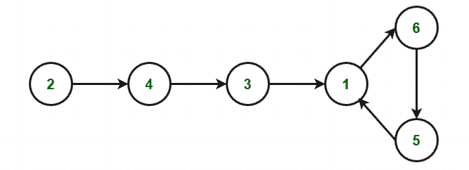

# 在只读数组中找到多个重复元素中的任意一个|集合 2

> 原文:[https://www . geesforgeks . org/find-只读数组集合中多个重复元素中的任意一个-2/](https://www.geeksforgeeks.org/find-any-one-of-the-multiple-repeating-elements-in-read-only-array-set-2/)

给定大小为 **N + 1** 的只读[数组](https://www.geeksforgeeks.org/introduction-to-arrays/) **arr[]** ，在数组中找到多个重复元素之一，其中数组只包含介于 **1** 和 **N** 之间的整数。
**注意:**只读数组意味着数组的内容不能修改。

**示例:**

> **输入:** N = 5，arr[] = {1，1，2，3，5，4}
> **输出:** 1
> **说明:**
> 1 是数组中唯一重复的数字。
> 
> **输入:** N = 10，arr[] = {10，1，2，3，5，4，9，8，5，6，4}
> **输出:** 5
> **说明:**
> 5 是数组中重复出现的数字之一。

在[之前的帖子](https://www.geeksforgeeks.org/find-one-multiple-repeating-elements-read-array/)中，我们讨论了同一篇文章的一个空间复杂度 *O(N)和 O(sqrt(N))* 。

**方法:**该方法基于[弗洛伊德的龟兔算法](//www.geeksforgeeks.org/detect-loop-in-a-linked-list/) ( **循环检测算法**)。

*   使用函数 **f(x) = arr[x]** 构建序列:

> arr[0]，arr[arr[0]]，arr[arr[arr[0]]，arr[arr[arr[0]]]……。

*   序列中的每个新元素都是前一个元素索引处的 **arr[]** 中的一个元素。
*   从 **x = arr[0]** 开始，会产生一个有周期的链表。
*   循环出现是因为 **arr[]** 包含重复元素(至少一个)。重复值是循环的入口。下面是一个展示循环如何存在的例子:
    **例如:**让数组 arr[] = {2，6，4，1，3，1，5}

<figure class="table">

| 指数 | Zero | one | Two | three | four | five | six |
| arrive） | Two | six | four | one | three | one | five |

</figure>

从索引 0 开始，遍历如下:

> arr[0]=**2**–>arr[2]=**4**–>arr[4]=**3**–>arr[3]=**1**–>arr[1]=**6**–>arr[6]=**5**–>arr[5]=**1**。

序列形成循环，如下所示:



*   算法由两部分组成，使用两个指针，通常称为**乌龟**和**野兔**。
*   **野兔= arr[arr[野兔]]** 的速度是**乌龟= arr[乌龟]** 的两倍。
*   因为兔子跑得快，所以它会是第一个进入周期并开始绕周期跑的兔子。
*   在某个时刻，乌龟也进入了这个循环，由于它移动的比较慢，兔子在某个交叉点追上了乌龟。
*   请注意，在一般情况下，交叉点不是循环入口，而是两者在循环中间的某个地方相交。
*   将乌龟移动到序列的起点，野兔保持在周期内，两者以相同的速度移动，即**乌龟= arr【乌龟】**和**野兔= arr【野兔】**。现在它们在重复元素处相交。

下面是上述方法的实现:

## C++

```
// C++ code for the above approach
#include <bits/stdc++.h>
using namespace std;

// Function to find the duplicate
// value in the given array arr[]
void findDuplicate(int arr[])
{

    // Initialise variables
    int tortoise = arr[0];
    int hare = arr[0];

    // Loop till we find the
    // duplicate element
    while (1) {

        tortoise = arr[tortoise];

        // Hare moves with twice
        // the speed of tortoise
        hare = arr[arr[hare]];
        if (tortoise == hare)
            break;
    }

    tortoise = arr[0];

    // Loop to get start point
    // of the cycle as start
    // point will be the duplicate
    // element
    while (tortoise != hare) {
        tortoise = arr[tortoise];
        hare = arr[hare];
    }

    // Print the duplicate element
    cout << tortoise;
}

// Driver Code
int main()
{
    // Given array
    int arr[] = { 2, 6, 4, 1, 3, 1, 5 };

    // Function Call
    findDuplicate(arr);

    return 0;
}
```

## Java 语言(一种计算机语言，尤用于创建网站)

```
// Java code for the above approach
class GFG{

// Function to find the duplicate
// value in the given array arr[]
static void findDuplicate(int arr[])
{

    // Initialise variables
    int tortoise = arr[0];
    int hare = arr[0];

    // Loop till we find the
    // duplicate element
    while (true)
    {
        tortoise = arr[tortoise];

        // Hare moves with twice
        // the speed of tortoise
        hare = arr[arr[hare]];
        if (tortoise == hare)
            break;
    }

    tortoise = arr[0];

    // Loop to get start point
    // of the cycle as start
    // point will be the duplicate
    // element
    while (tortoise != hare)
    {
        tortoise = arr[tortoise];
        hare = arr[hare];
    }

    // Print the duplicate element
    System.out.print(tortoise);
}

// Driver Code
public static void main (String []args)
{

    // Given array
    int arr[] = { 2, 6, 4, 1, 3, 1, 5 };

    // Function Call
    findDuplicate(arr);
}
}

// This code is contributed by chitranayal
```

## 蟒蛇 3

```
# Python3 program for the above approach

# Function to find the duplicate
# value in the given array arr[]
def findDuplicate(arr):

    # Initialise variables
    tortoise = arr[0]
    hare = arr[0]

    # Loop till we find the
    # duplicate element
    while (1):

        tortoise = arr[tortoise]

        # Hare moves with twice
        # the speed of tortoise
        hare = arr[arr[hare]]
        if (tortoise == hare):
            break

    tortoise = arr[0]

    # Loop to get start point
    # of the cycle as start
    # point will be the duplicate
    # element
    while (tortoise != hare):
        tortoise = arr[tortoise]
        hare = arr[hare]

    # Print the duplicate element
    print (tortoise)

# Driver Code

# Given array
arr = [ 2, 6, 4, 1, 3, 1, 5 ]

# Function Call
findDuplicate(arr)

# This code is contributed by PratikBasu
```

## C#

```
// C# program for the above approach
using System;

class GFG{

// Function to find the duplicate
// value in the given array []arr
static void findDuplicate(int []arr)
{

    // Initialise variables
    int tortoise = arr[0];
    int hare = arr[0];

    // Loop till we find the
    // duplicate element
    while (true)
    {
        tortoise = arr[tortoise];

        // Hare moves with twice
        // the speed of tortoise
        hare = arr[arr[hare]];
        if (tortoise == hare)
            break;
    }

    tortoise = arr[0];

    // Loop to get start point
    // of the cycle as start
    // point will be the duplicate
    // element
    while (tortoise != hare)
    {
        tortoise = arr[tortoise];
        hare = arr[hare];
    }

    // Print the duplicate element
    Console.Write(tortoise);
}

// Driver Code
public static void Main(String []args)
{

    // Given array
    int []arr = { 2, 6, 4, 1, 3, 1, 5 };

    // Function Call
    findDuplicate(arr);
}
}

// This code is contributed by Amit Katiyar
```

## java 描述语言

```
<script>

// JavaScript code for the above approach

// Function to find the duplicate
// value in the given array arr[]
function findDuplicate(arr)
{

    // Initialise variables
    let tortoise = arr[0];
    let hare = arr[0];

    // Loop till we find the
    // duplicate element
    while (true)
    {
        tortoise = arr[tortoise];

        // Hare moves with twice
        // the speed of tortoise
        hare = arr[arr[hare]];

        if (tortoise == hare)
            break;
    }

    tortoise = arr[0];

    // Loop to get start point
    // of the cycle as start
    // point will be the duplicate
    // element
    while (tortoise != hare)
    {
        tortoise = arr[tortoise];
        hare = arr[hare];
    }

    // Print the duplicate element
    document.write(tortoise);
}

// Driver Code

// Given array
let arr = [ 2, 6, 4, 1, 3, 1, 5 ];

// Function Call
findDuplicate(arr);

// This code is contributed by sanjoy_62  

</script>
```

**Output:** 

```
1
```

**时间复杂度:***O(N)*
T5】辅助空间: *O(1)*