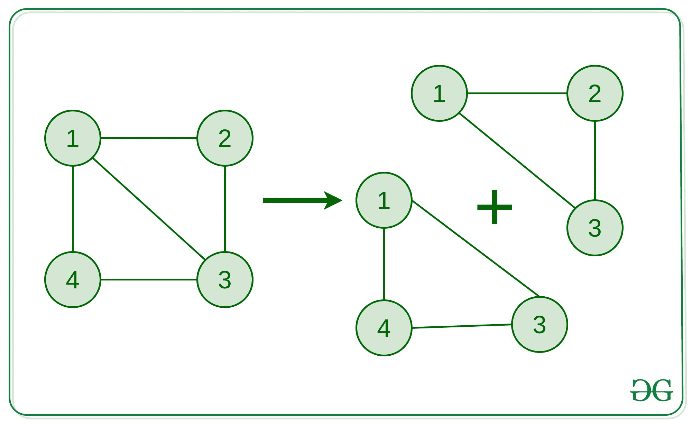
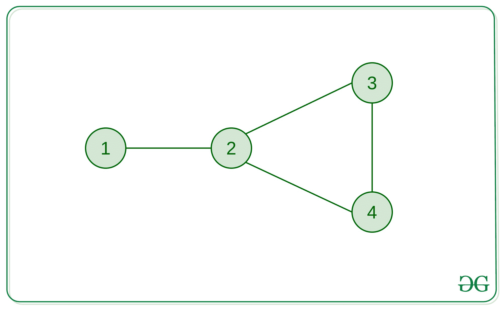
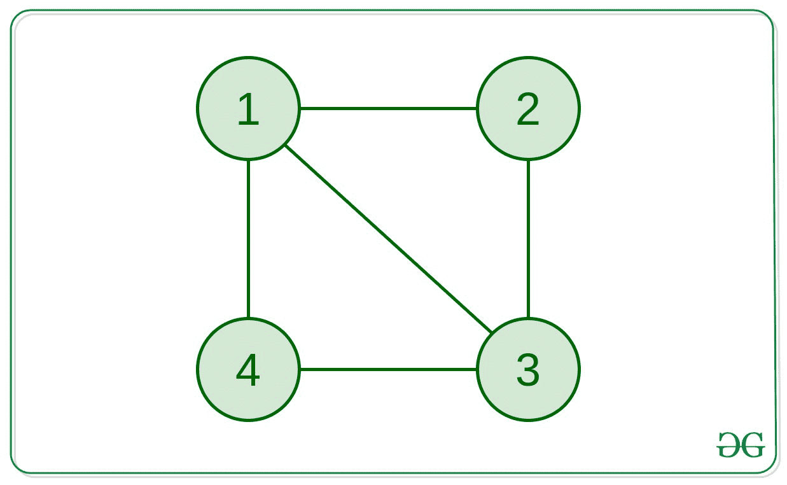

# 在无向未加权图中找到任意简单循环

> 原文:[https://www . geesforgeks . org/find-any-simple-in-an-directed-unweighted-graph/](https://www.geeksforgeeks.org/find-any-simple-cycle-in-an-undirected-unweighted-graph/)

给定一个无向且未加权的连通[图](https://www.geeksforgeeks.org/graph-data-structure-and-algorithms/)，在该图中找出一个简单的循环(如果存在的话)。

**简单循环:**

> 简单循环是图形中没有重复顶点(除了开始和结束顶点)的循环。
> 
> 基本上，如果一个周期不能分解成两个或两个以上的周期，那么它就是一个简单的周期。
> 为了更好的理解，参考下图:
> 
> 
> 
> 上图中的图形解释了周期 1 -> 2 -> 3 -> 4 -> 1 如何不是一个简单的周期
> ，因为它可以被分解成 2 个简单的周期 1 - > 3 - > 4 - > 1 和 1 - > 2 - > 3 - > 1。

**示例:**

> **输入:**边[] = {(1，2)，(2，3)，(2，4)，(3，4)}
> 
> 
> 
> **输出:** 2 = > 3 = > 4 = > 2
> **说明:**
> 这个图只有一个长度为 3 的循环，是一个简单的循环。
> 
> **输入:**边[] = {(1，2)，(2，3)，(3，4)，(1，4)，(1，3)}
> 
> 
> 
> **输出:** 1 = > 3 = > 4 = > 1

**方法:**想法是[检查图形是否包含周期](https://www.geeksforgeeks.org/detect-cycle-in-a-graph/)。这可以通过简单地使用 [DFS](https://www.geeksforgeeks.org/depth-first-traversal-for-a-graph/) 来实现。
现在，如果图中包含一个循环，我们可以从 DFS 本身得到该循环的**结束顶点**(比如 a 和 b)。现在，如果我们从 a 到 b 运行一个 [BFS](https://www.geeksforgeeks.org/breadth-first-traversal-for-a-graph/) (忽略 a 和 b 之间的直接边)，我们将能够得到从 a 到 b 的最短路径，这将给我们包含 **a** 和 **b** 点的**最短循环的路径。使用父数组可以很容易地跟踪路径。**这个最短的周期将是一个简单的周期**。**

#### **最短周期将是简单周期的证明:**

我们可以用矛盾来证明。假设在这个循环中存在另一个简单的循环。这意味着内部简单循环的长度更短，因此可以说从 a 到 b 的路径更短。但是我们已经利用 BFS 找到了从 a 到 b 的最短路径。因此，不存在更短的路径，找到的路径是最短的。所以，在我们发现的循环中，没有内部循环存在。
因此，这个循环是一个**简单循环**。

下面是上述方法的实现:

## C++

```
// C++ implementation to find the
// simple cycle in the given path

#include <bits/stdc++.h>
using namespace std;
#define MAXN 1005

// Declaration of the Graph
vector<vector<int> > adj(MAXN);

// Declaration of visited array
vector<bool> vis(MAXN);
int a, b;

// Function to add edges
// connecting 'a' and 'b'
// to the graph
void addedge(int a, int b)
{
    adj[a].push_back(b);
    adj[b].push_back(a);
}

// Function to detect if the
// graph contains a cycle or not
bool detect_cycle(int node, int par)
{
    // Marking the current node visited
    vis[node] = 1;
    // Traversing to the childs
    // of the current node
    // Simple DFS approach
    for (auto child : adj[node]) {
        if (vis[child] == 0) {
            if (detect_cycle(child, node))
                return true;
        }

        // Checking for a back-edge
        else if (child != par) {
            // A cycle is detected
            // Marking the end-vertices
            // of the cycle
            a = child;
            b = node;
            return true;
        }
    }
    return false;
}

vector<int> simple_cycle;

// Function to get the simple cycle from the
// end-vertices of the cycle we found from DFS
void find_simple_cycle(int a, int b)
{
    // Parent array to get the path
    vector<int> par(MAXN, -1);

    // Queue for BFS
    queue<int> q;
    q.push(a);
    bool ok = true;
    while (!q.empty()) {
        int node = q.front();
        q.pop();
        vis[node] = 1;
        for (auto child : adj[node]) {
            if (node == a && child == b)
                // Ignoring the direct edge
                // between a and b
                continue;

            if (vis[child] == 0) {
                // Updating the parent array
                par[child] = node;

                if (child == b) {
                    // If b is reached,
                    // we've found the
                    // shortest path from
                    // a to b already
                    ok = false;
                    break;
                }
                q.push(child);
                vis[child] = 1;
            }
        }
        // If required task is done
        if (ok == false)
            break;
    }

    // Cycle starting from a
    simple_cycle.push_back(a);
    int x = b;

    // Until we reach a again
    while (x != a) {
        simple_cycle.push_back(x);
        x = par[x];
    }
}

// Driver Code
int main()
{

    // Creating the graph
    addedge(1, 2);
    addedge(2, 3);
    addedge(3, 4);
    addedge(4, 1);
    addedge(1, 3);

    if (detect_cycle(1, -1) == true) {
        // If cycle is present

        // Resetting the visited array
        // for simple cycle finding
        vis = vector<bool>(MAXN, false);
        find_simple_cycle(a, b);

        // Printing the simple cycle
        cout << "A simple cycle: ";
        for (auto& node : simple_cycle) {
            cout << node << " => ";
        }
        cout << a;
        cout << "\n";
    }
    else {
        cout << "The Graph doesn't "
             << "contain a cycle.\n";
    }

    return 0;
}
```

## Java 语言(一种计算机语言，尤用于创建网站)

```
// Java implementation to
// find the simple cycle
// in the given path
import java.util.*;
class GFG{

  static final int MAXN = 1005;

// Declaration of the
// Graph
static Vector<Integer> []adj =
              new Vector[MAXN];

// Declaration of visited
// array
static boolean []vis =
       new boolean[MAXN];
static int a, b;

// Function to add edges
// connecting 'a' and 'b'
// to the graph
static void addedge(int a,
                    int b)
{
  adj[a].add(b);
  adj[b].add(a);
}

// Function to detect if the
// graph contains a cycle or not
static boolean detect_cycle(int node,
                            int par)
{
  // Marking the current
  // node visited
  vis[node] = true;

  // Traversing to the childs
  // of the current node
  // Simple DFS approach
  for (int child : adj[node])
  {
    if (vis[child] == false)
    {
      if (detect_cycle(child,
                       node))
        return true;
    }

    // Checking for a back-edge
    else if (child != par)
    {
      // A cycle is detected
      // Marking the end-vertices
      // of the cycle
      a = child;
      b = node;
      return true;
    }
  }
  return false;
}

static Vector<Integer> simple_cycle =
              new Vector<>();

// Function to get the simple
// cycle from the end-vertices
//of the cycle we found from DFS
static void find_simple_cycle(int a,
                              int b)
{
  // Parent array to get the path
  int []par = new int[MAXN];

  // Queue for BFS
  Queue<Integer> q =
        new LinkedList<>();
  q.add(a);
  boolean ok = true;

  while (!q.isEmpty())
  {
    int node = q.peek();
    q.remove();
    vis[node] = true;

    for (int child : adj[node])
    {
      if (node == a &&
          child == b)
        // Ignoring the direct edge
        // between a and b
        continue;

      if (vis[child] == false)
      {
        // Updating the parent
        // array
        par[child] = node;

        if (child == b)
        {
          // If b is reached,
          // we've found the
          // shortest path from
          // a to b already
          ok = false;
          break;
        }
        q.add(child);
        vis[child] = true;
      }
    }
    // If required task
    // is done
    if (ok == false)
      break;
  }

  // Cycle starting from a
  simple_cycle.add(a);
  int x = b;

  // Until we reach
  // a again
  while (x != a)
  {
    simple_cycle.add(x);
    x = par[x];
  }
}

// Driver Code
public static void main(String[] args)
{
  for (int i = 0; i < adj.length; i++)
    adj[i] = new Vector<Integer>();

  // Creating the graph
  addedge(1, 2);
  addedge(2, 3);
  addedge(3, 4);
  addedge(4, 1);
  addedge(1, 3);

  if (detect_cycle(1, -1) == true)
  {
    // If cycle is present
    // Resetting the visited array
    // for simple cycle finding
    Arrays.fill(vis, false);
    find_simple_cycle(a, b);

    // Printing the simple cycle
    System.out.print("A simple cycle: ");

    for (int node : simple_cycle)
    {
      System.out.print(node + " => ");
    }
    System.out.print(a);
    System.out.print("\n");
  }
  else
  {
    System.out.print("The Graph doesn't " +
                     "contain a cycle.\n");
  }
}
}

// This code is contributed by shikhasingrajput
```

## 蟒蛇 3

```
# Python3 implementation to find the
# simple cycle in the given path

MAXN = 1005

# Declaration of the Graph
adj = [[] for i in range(MAXN)]

# Declaration of visited array
vis = [False for i in range(MAXN)]
aa = 0
bb = 0

# Function to add edges
# connecting 'a' and 'b'
# to the graph
def addedge(a, b):

    adj[a].append(b);
    adj[b].append(a);

# Function to detect if the
# graph contains a cycle or not
def detect_cycle(node, par):
    global aa, bb

    # Marking the current node visited
    vis[node] = True;

    # Traversing to the childs
    # of the current node
    # Simple DFS approach
    for child in adj[node]:

        if (vis[child] == False):
            if (detect_cycle(child, node)):
                return True;

        # Checking for a back-edge
        elif (child != par):

            # A cycle is detected
            # Marking the end-vertices
            # of the cycle
            aa = child;
            bb = node;
            return True;

    return False;

simple_cycle = []

# Function to get the simple cycle from the
# end-vertices of the cycle we found from DFS
def find_simple_cycle(a, b):

    # Parent array to get the path
    par = [0 for i in range(MAXN)]

    # Queue for BFS
    q = []
    q.append(a);
    ok = True;
    while(len(q) != 0):

        node = q[0];
        q.pop(0);
        vis[node] = True;

        for child in adj[node]:

            if (node == a and child == b):

                # Ignoring the direct edge
                # between a and b
                continue;

            if (vis[child] == False):

                # Updating the parent array
                par[child] = node;

                if (child == b):

                    # If b is reached,
                    # we've found the
                    # shortest path from
                    # a to b already
                    ok = False;
                    break;

                q.append(child);
                vis[child] = True;

        # If required task is done
        if (ok == False):
            break;

    # Cycle starting from a
    simple_cycle.append(a);
    x = b;

    # Until we reach a again
    while (x != a):
        simple_cycle.append(x);
        x = par[x];

# Driver Code
if __name__=='__main__':

    # Creating the graph
    addedge(1, 2);
    addedge(2, 3);
    addedge(3, 4);
    addedge(4, 1);
    addedge(1, 3);

    if (detect_cycle(1, -1) == True):
        # If cycle is present

        # Resetting the visited array
        # for simple cycle finding
        for i in range(MAXN):
            vis[i] = False
        find_simple_cycle(aa, bb);

        # Printing the simple cycle
        print("A simple cycle: ", end = '')
        for node in simple_cycle:
            print(node, end = " => ")
        print(aa)

    else:
        print("The Graph doesn't contain a cycle.")

        # This code is contributed by rutvik_56
```

## C#

```
// C# implementation to
// find the simple cycle
// in the given path
using System;
using System.Collections.Generic;

class GFG{

static readonly int MAXN = 1005;

// Declaration of the
// Graph
static List<int> []adj = new List<int>[MAXN];

// Declaration of visited
// array
static bool []vis = new bool[MAXN];

static int a, b;

// Function to add edges
// connecting 'a' and 'b'
// to the graph
static void addedge(int a, int b)
{
  adj[a].Add(b);
  adj[b].Add(a);
}

// Function to detect if the
// graph contains a cycle or not
static bool detect_cycle(int node,
                         int par)
{

  // Marking the current
  // node visited
  vis[node] = true;

  // Traversing to the childs
  // of the current node
  // Simple DFS approach
  foreach(int child in adj[node])
  {
    if (vis[child] == false)
    {
      if (detect_cycle(child,
                       node))
        return true;
    }

    // Checking for a back-edge
    else if (child != par)
    {

      // A cycle is detected
      // Marking the end-vertices
      // of the cycle
      a = child;
      b = node;
      return true;
    }
  }
  return false;
}

static List<int> simple_cycle = new List<int>();

// Function to get the simple
// cycle from the end-vertices
//of the cycle we found from DFS
static void find_simple_cycle(int a,
                              int b)
{

  // Parent array to get the path
  int []par = new int[MAXN];

  // Queue for BFS
  Queue<int> q = new Queue<int>();

  q.Enqueue(a);
  bool ok = true;

  while (q.Count != 0)
  {
    int node = q.Peek();
    q.Dequeue();
    vis[node] = true;

    foreach(int child in adj[node])
    {
      if (node == a &&
          child == b)

        // Ignoring the direct edge
        // between a and b
        continue;

      if (vis[child] == false)
      {

        // Updating the parent
        // array
        par[child] = node;

        if (child == b)
        {

          // If b is reached,
          // we've found the
          // shortest path from
          // a to b already
          ok = false;
          break;
        }
        q.Enqueue(child);
        vis[child] = true;
      }
    }

    // If required task
    // is done
    if (ok == false)
      break;
  }

  // Cycle starting from a
  simple_cycle.Add(a);
  int x = b;

  // Until we reach
  // a again
  while (x != a)
  {
    simple_cycle.Add(x);
    x = par[x];
  }
}

// Driver Code
public static void Main(String[] args)
{
  for(int i = 0; i < adj.Length; i++)
    adj[i] = new List<int>();

  // Creating the graph
  addedge(1, 2);
  addedge(2, 3);
  addedge(3, 4);
  addedge(4, 1);
  addedge(1, 3);

  if (detect_cycle(1, -1) == true)
  {

    // If cycle is present
    // Resetting the visited array
    // for simple cycle finding
    for(int i = 0; i < vis.Length; i++)
        vis[i] = false;

    find_simple_cycle(a, b);

    // Printing the simple cycle
    Console.Write("A simple cycle: ");

    foreach(int node in simple_cycle)
    {
      Console.Write(node + " => ");
    }
    Console.Write(a);
    Console.Write("\n");
  }
  else
  {
    Console.Write("The Graph doesn't " +
                  "contain a cycle.\n");
  }
}
}

// This code is contributed by gauravrajput1
```

## java 描述语言

```
<script>

// Javascript implementation to
// find the simple cycle
// in the given path

var MAXN = 1005;

// Declaration of the
// Graph
var adj = Array.from(Array(MAXN), ()=>Array());

// Declaration of visited
// array
var vis = Array(MAXN).fill(false);

var a, b;

// Function to add edges
// connecting 'a' and 'b'
// to the graph
function addedge(a, b)
{
  adj[a].push(b);
  adj[b].push(a);
}

// Function to detect if the
// graph contains a cycle or not
function detect_cycle(node, par)
{

  // Marking the current
  // node visited
  vis[node] = true;

  // Traversing to the childs
  // of the current node
  // Simple DFS approach
  for(var child of adj[node])
  {
    if (vis[child] == false)
    {
      if (detect_cycle(child,
                       node))
        return true;
    }

    // Checking for a back-edge
    else if (child != par)
    {

      // A cycle is detected
      // Marking the end-vertices
      // of the cycle
      a = child;
      b = node;
      return true;
    }
  }
  return false;
}

var simple_cycle = [];

// Function to get the simple
// cycle from the end-vertices
//of the cycle we found from DFS
function find_simple_cycle(a, b)
{

  // Parent array to get the path
  var par = Array(MAXN);

  // Queue for BFS
  var q = [];

  q.push(a);
  var ok = true;

  while (q.length != 0)
  {
    var node = q[0];
    q.shift();
    vis[node] = true;

    for(var child of adj[node])
    {
      if (node == a &&
          child == b)

        // Ignoring the direct edge
        // between a and b
        continue;

      if (vis[child] == false)
      {

        // Updating the parent
        // array
        par[child] = node;

        if (child == b)
        {

          // If b is reached,
          // we've found the
          // shortest path from
          // a to b already
          ok = false;
          break;
        }
        q.push(child);
        vis[child] = true;
      }
    }

    // If required task
    // is done
    if (ok == false)
      break;
  }

  // Cycle starting from a
  simple_cycle.push(a);
  var x = b;

  // Until we reach
  // a again
  while (x != a)
  {
    simple_cycle.push(x);
    x = par[x];
  }
}

// Driver Code

// Creating the graph
addedge(1, 2);
addedge(2, 3);
addedge(3, 4);
addedge(4, 1);
addedge(1, 3);

if (detect_cycle(1, -1) == true)
{

  // If cycle is present
  // Resetting the visited array
  // for simple cycle finding
  for(var i = 0; i < vis.length; i++)
      vis[i] = false;

  find_simple_cycle(a, b);
  // Printing the simple cycle
  document.write("A simple cycle: ");

  for(var node of simple_cycle)
  {
    document.write(node + " => ");
  }
  document.write(a);
  document.write("<br>");
}
else
{
  document.write("The Graph doesn't " +
                "contain a cycle.<br>");
}

</script>
```

**Output:** 

```
A simple cycle: 1 => 4 => 3 => 1
```