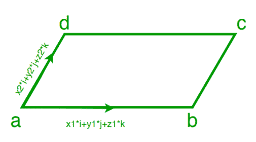

# 给定相邻两条边的向量求平行四边形的面积

> 原文:[https://www . geeksforgeeks . org/find-平行四边形面积-如果给定两个相邻边的向量/](https://www.geeksforgeeks.org/find-area-of-parallelogram-if-vectors-of-two-adjacent-sides-are-given/)

给定平行四边形两个相邻边的(xi+yj+zk)形式的两个向量。任务是找出平行四边形的面积。
**例:**

> **输入:**
> x1 = 3，y1 = 1，z1 = -2
> x2 = 1，y2 = -3，z2 = 4
> **输出:**面积= 17.3205081
> **输入:**
> x1 = 1，y1 = 3，z1 = 2
> x2 = 1，y2 = -3，z2 = 4
> **输出:**面积= 19.07878404



**方法:**假设我们有两个向量 a(x1*i+y1*j+z1*k)和 b(x2*i+y2*j+z2*k)，我们知道平行四边形的面积由:
给出

> 平行四边形的面积=向量 a 和 b 的叉积的大小，即|axb|
> 我们知道 a X b =(y1 * z2–y2 * Z1)* I –( x1 * z2–x2 * Z1)* j+(x1 * y2–x2 * y1)* k
> 然后面积=
> 

## C++

```
// C++ code to calculate area of
// parallelogram if vectors of
// 2 adjacent sides are given

#include<bits/stdc++.h>
using namespace std ;

// Function to calculate area of parallelogram 
float area(float x1, float y1, float z1, float x2,
            float y2, float z2)
    {
        float area = sqrt(pow((y1 * z2 - y2 * z1),2)
                        + pow((x1 * z2 - x2 * z1),2) +
                         pow((x1 * y2 - x2 * y1),2));
        return area;
    }

// Driver Code
int main()
{
    float x1 = 3;
    float y1 = 1;
    float z1 = -2;
    float x2 = 1;
    float y2 = -3;
    float z2 = 4;
    float a = area(x1, y1, z1, x2, y2, z2);
    cout << "Area = " << a;
    return 0;
// This code is contributed
// by Amber_Saxena.
}
```

## Java 语言(一种计算机语言，尤用于创建网站)

```
// Java code to calculate area of 
// parallelogram if vectors of
// 2 adjacent sides are given

public class GFG {

    // Function to calculate area of parallelogram  
    static float area(float x1, float y1, float z1, float x2,
                float y2, float z2)
        { 
            float area =(float) Math.sqrt(Math.pow((y1 * z2 - y2 * z1),2)
                            + Math.pow((x1 * z2 - x2 * z1),2) +
                             Math.pow((x1 * y2 - x2 * y1),2));
            return area;
        } 

    // Driver code
    public static void main (String args[]){
         float x1 = 3;
            float y1 = 1;
            float z1 = -2;
            float x2 = 1;
            float y2 = -3;
            float z2 = 4;
            float a = area(x1, y1, z1, x2, y2, z2);
            System.out.println("Area = " + a) ;

    }

// This code is contributed by ANKITRAI1
}
```

## 计算机编程语言

```
# Python code to calculate area of
# parallelogram if vectors of
# 2 adjacent sides are given

import math

# to calculate area of parallelogram
def area(x1, y1, z1, x2, y2, z2):
    area = math.sqrt((y1 * z2 - y2 * z1) ** 2
           + (x1 * z2 - x2 * z1) ** 2 +
           (x1 * y2 - x2 * y1) ** 2)
    return area

# main function
def main():
    x1 = 3
    y1 = 1
    z1 = -2
    x2 = 1
    y2 = -3
    z2 = 4
    a = area(x1, y1, z1, x2, y2, z2)
    print("Area = ", a)

# driver code   
if __name__=="__main__":
    main()
```

## C#

```
// C# code to calculate area of
// parallelogram if vectors of
// 2 adjacent sides are given
using System;

class GFG
{

// Function to calculate area
// of parallelogram
static float area(float x1, float y1,
                  float z1, float x2,
                  float y2, float z2)
{
    float area = (float) Math.Sqrt(Math.Pow((y1 * z2 - y2 * z1), 2) +
                                   Math.Pow((x1 * z2 - x2 * z1), 2) +
                                   Math.Pow((x1 * y2 - x2 * y1), 2));
    return area;
}

// Driver code
public static void Main ()
{
    float x1 = 3;
    float y1 = 1;
    float z1 = -2;
    float x2 = 1;
    float y2 = -3;
    float z2 = 4;
    float a = area(x1, y1, z1, x2, y2, z2);
    Console.Write("Area = " + a) ;
}
}

// This code is contributed
// by ChitraNayal
```

## 服务器端编程语言（Professional Hypertext Preprocessor 的缩写）

```
<?php
// PHP code to calculate area of
// parallelogram if vectors of
// 2 adjacent sides are given

// Function to calculate area
// of parallelogram
function area($x1, $y1, $z1,
              $x2, $y2, $z2)
{
        $area = sqrt(pow(($y1 * $z2 - $y2 * $z1), 2) +
                     pow(($x1 * $z2 - $x2 * $z1), 2) +
                     pow(($x1 * $y2 - $x2 * $y1), 2));
        return $area;
}

// Driver Code
$x1 = 3; $y1 = 1; $z1 = -2;
$x2 = 1; $y2 = -3; $z2 = 4;
$a = area($x1, $y1, $z1,
          $x2, $y2, $z2);
echo ("Area = ");
echo ($a);

// This code is contributed
// by Shivi_Aggarwal
?>
```

## java 描述语言

```
<script>

// Javascript code to calculate area of
// parallelogram if vectors of
// 2 adjacent sides are given

// Function to calculate area
// of parallelogram
function area(x1, y1, z1,
              x2, y2, z2)
{
        area = Math.sqrt(Math.pow((y1 * z2 - y2 * z1), 2) +
                     Math.pow((x1 * z2 - x2 * z1), 2) +
                     Math.pow((x1 * y2 - x2 * y1), 2));
        return area;
}

// Driver Code
let x1 = 3;
let y1 = 1;
let z1 = -2;
let x2 = 1;
let y2 = -3;
let z2 = 4;
a = area(x1, y1, z1,
          x2, y2, z2);
document.write ("Area = ");
document.write (a);

// This code is contributed by Bobby

</script>
```

**Output:** 

```
Area =  17.320508075688775
```