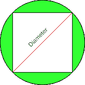

# 给定内切圆面积时求圆的面积

> 原文:[https://www . geesforgeks . org/find-内接正方形面积给定时的圆形面积/](https://www.geeksforgeeks.org/find-area-of-the-circle-when-the-area-of-inscribed-square-is-given/)

给定圆内接正方形的面积为 **N** ，任务是计算正方形内接的圆的面积。

**示例:**

> **输入** : N = 4
> **输出:** 6.283
> 
> **输入:**N = 10
> T3】输出: 15.707

**接近**:

考虑下图:



*   假设正方形的面积是“A”
*   正方形的边由= A**(1/2)给出
*   正方形的两边和圆的直径形成一个直角三角形
*   三角形的斜边就是圆的直径
*   圆“D”的直径计算公式为((A * A) + (A * A))**(1/2)
*   圆“r”的半径由 D/2 给出
*   圆的合成面积是* r * r

下面是上述方法的实现:

## C++

```
#include <iostream>
#include<math.h>
#include <iomanip>
using namespace std;

// Function to calculate the area of circle
double areaOfCircle(double a)
{
    // declaring pi
    double pi=2*acos(0.0);

    // Side of the square
    double side = pow(a,(1.0 / 2));

    // Diameter of circle
    double D =pow( ((side * side) + (side * side)) ,(1.0 / 2));

    // Radius of circle
    double R = D / 2;

    // Area of circle
    double Area = pi * (R * R);

    return Area;

}
 //Driver Code
int main() {

    double areaOfSquare = 4;
    cout<<setprecision(15)<<areaOfCircle(areaOfSquare);
    return 0;
}
// This code is contributed by ANKITKUMAR34
```

## Java 语言(一种计算机语言，尤用于创建网站)

```
// Java code for the above approach
import java.util.*;

class GFG
{

    // Function to calculate the area of circle
    static double areaOfCircle(double a)
    {

        // Side of the square
        double side = Math.pow(a, (1.0 / 2));

        // Diameter of circle
        double D = Math.pow(((side * side) + (side * side)),
                            (1.0 / 2));

        // Radius of circle
        double R = D / 2;

        // Area of circle
        double Area = Math.PI * (R * R);

        return Area;
    }

    // Driver Code
    public static void main(String[] args)
    {
        double areaOfSquare = 4;
        System.out.println(areaOfCircle(areaOfSquare));
    }
}

// This code is contribute by Potta Lokesh
```

## 蟒蛇 3

```
# Python program for the above approach
import math

# Function to calculate the area of circle
def areaOfCircle(a):

    # Side of the square
    side = a**(1 / 2)

    # Diameter of circle
    D = ((side * side) + (side * side))**(1 / 2)

    # Radius of circle
    R = D / 2

    # Area of circle
    Area = math.pi * (R * R)

    return Area

# Driver Code
areaOfSquare = 4
print(areaOfCircle(areaOfSquare))
```

## C#

```
// C# code for the above approach
using System;

class GFG
{

    // Function to calculate the area of circle
    static double areaOfCircle(double a)
    {

        // Side of the square
        double side = Math.Pow(a, (1.0 / 2));

        // Diameter of circle
        double D = Math.Pow(((side * side) + (side * side)),
                            (1.0 / 2));

        // Radius of circle
        double R = D / 2;

        // Area of circle
        double Area = Math.PI * (R * R);

        return Area;
    }

    // Driver Code
    public static void Main()
    {
        double areaOfSquare = 4;
        Console.Write(areaOfCircle(areaOfSquare));
    }
}

// This code is contribute by Samim Hossain Mondal.
```

## java 描述语言

```
<script>

// Function to calculate the area of circle
function areaOfCircle(a) {
  // declaring pi
  let pi = 2 * Math.acos(0.0);

  // Side of the square
  let side = Math.pow(a, (1.0 / 2));

  // Diameter of circle
  let D = Math.pow(((side * side) + (side * side)), (1.0 / 2));

  // Radius of circle
  let R = D / 2;

  // Area of circle
  let Area = Math.PI * (R * R);

  return Area;

}
//Driver Code

let areaOfSquare = 4;
document.write(areaOfCircle(areaOfSquare));

// This code is contributed by gfgking
</script>
```

**Output**

```
6.283185307179588
```

***时间复杂度*** : O(1)
***辅助空间:*** O(1)