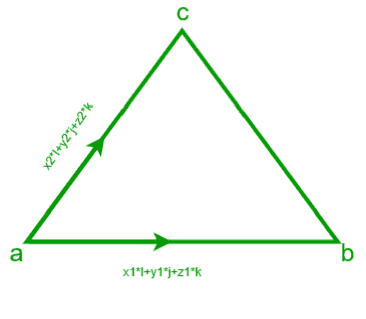

# 如果给定相邻两条边的两个向量

，求三角形的面积

> 原文:[https://www . geeksforgeeks . org/find-如果给定了两个相邻边的两个向量的三角形面积/](https://www.geeksforgeeks.org/find-area-of-triangle-if-two-vectors-of-two-adjacent-sides-are-given/)

给定三角形两个相邻边的(xi+yj+zk)形式的两个向量。任务是找出三角形的面积。
**例:**

> **输入:**
> x1 = -2，y1 = 0，z1 = -5
> x2 = 1，y2 = -2，z2 =-1
> T5】输出:面积= 6.422616289332565
> **输入:**
> x1 = -2，y1 = 1，z1 = 5
> x2 = 1，y2 = 3，z2 = -1
> **输出:**面积= 1



**方法:**假设我们有两个向量 a(x1*i+y1*j+z1*k)和 b(x2*i+y2*j+z2*k)，我们知道三角形的面积由:
给出

> 三角形的面积=(向量 a 和 b 的叉积的大小)/ 2 即|axb| / 2
> 我们知道一个 X b =(y1 * z2–y2 * Z1)* I –( x1 * z2–x2 * Z1)* j+(x1 * y2–x2 * y1)* k
> 然后面积=
> 

## C++

```
// C++ program to calculate area of 
// triangle if vectors of
// 2 adjacent sides are given

#include<bits/stdc++.h>
using namespace std ;

// function to calculate area of triangle 
float area(int x1, int y1, int z1, int x2, int y2, int z2)
{
    float area = sqrt(pow((y1 * z2 - y2 * z1),2)
             + pow((x1 * z2 - x2 * z1),2) +
               pow((x1 * y2 - x2 * y1),2)) ;

         area = area / 2;
    return area ;

}

// Driver Code
int main()
{
    int    x1 = -2 ;
    int y1 = 0 ;
    int z1 = -5 ;
    int x2 = 1 ;
    int y2 = -2 ;
    int z2 = -1 ;
    float  a = area(x1, y1, z1, x2, y2, z2) ; 
    cout << "Area = " << a << endl;

    return 0;
// This code is contributed by ANKITRAI1
}
```

## Java 语言(一种计算机语言，尤用于创建网站)

```
// Java program to calculate area of
// triangle if vectors of
// 2 adjacent sides are given
import java.util.*;

class solution
{
// function to calculate area of triangle
static float area(int x1, int y1, int z1, int x2, int y2, int z2)
{
  double a =Math.pow((y1 * z2 - y2 * z1),2)
            + Math.pow((x1 * z2 - x2 * z1),2) +
                Math.pow((x1 * y2 - x2 * y1),2);
float area = (float)Math.sqrt(a) ;

    area = area / 2;
    return area ;
}

//Driver program
public static void main(String arr[])
{
    int x1 = -2 ;
    int y1 = 0 ;
    int z1 = -5 ;
    int x2 = 1 ;
    int y2 = -2 ;
    int z2 = -1 ;
    float a = area(x1, y1, z1, x2, y2, z2) ;
    System.out.println("Area= "+a);
}

}
//This code is contributed by
//Surendra_Gangwar
```

## 蟒蛇 3

```
# Python code to calculate area of
# triangle if vectors of
# 2 adjacent sides are given
import math

# to calculate area of triangle
def area(x1, y1, z1, x2, y2, z2):
    area = math.sqrt((y1 * z2 - y2 * z1) ** 2
           + (x1 * z2 - x2 * z1) ** 2 +
           (x1 * y2 - x2 * y1) ** 2)
    area = area / 2
    return area

# main function
def main():
    x1 = -2
    y1 = 0
    z1 = -5
    x2 = 1
    y2 = -2
    z2 = -1
    a = area(x1, y1, z1, x2, y2, z2)
    print("Area = ", a)

# driver code   
if __name__=="__main__":
    main()
```

## C#

```
// C# program to calculate area 
// of triangle if vectors of
// 2 adjacent sides are given
using System;
class GFG
{
// function to calculate area of triangle
static float area(int x1, int y1, int z1,
                  int x2, int y2, int z2)
{
double a = Math.Pow((y1 * z2 - y2 * z1), 2) +
           Math.Pow((x1 * z2 - x2 * z1), 2) +
           Math.Pow((x1 * y2 - x2 * y1), 2);
float area = (float)Math.Sqrt(a) ;

    area = area / 2;
    return area ;
}

// Driver Code
public static void Main()
{
    int x1 = -2;
    int y1 = 0;
    int z1 = -5;
    int x2 = 1;
    int y2 = -2;
    int z2 = -1;
    float a = area(x1, y1, z1, x2, y2, z2);
    Console.WriteLine("Area = " + a);
}
}

// This code is contributed
// by inder_verma
```

## 服务器端编程语言（Professional Hypertext Preprocessor 的缩写）

```
<?php
// PHP program to calculate area
// of triangle if vectors of
// 2 adjacent sides are given

// function to calculate area of triangle
function area($x1, $y1, $z1,
              $x2, $y2, $z2)
{
    $area = sqrt(pow(($y1 * $z2 - $y2 * $z1), 2) +
                 pow(($x1 * $z2 - $x2 * $z1), 2) +
                 pow(($x1 * $y2 - $x2 * $y1), 2));

        $area = $area / 2;
    return $area ;

}

// Driver Code
$x1 = -2 ;
$y1 = 0 ;
$z1 = -5 ;
$x2 = 1 ;
$y2 = -2 ;
$z2 = -1 ;
$a = area($x1, $y1, $z1, $x2, $y2, $z2);
echo "Area = ".$a ."\n";                        

// This code is contributed by ChitraNayal
?>
```

## java 描述语言

```
<script>

// Javascript program to calculate area of 
// triangle if vectors of
// 2 adjacent sides are given

// function to calculate area of triangle 
function area( x1,  y1,  z1,  x2,  y2,  z2)
{
    let area = Math.sqrt(Math.pow((y1 * z2 - y2 * z1),2)
             + Math.pow((x1 * z2 - x2 * z1),2) +
               Math.pow((x1 * y2 - x2 * y1),2)) ;

         area = area / 2;
    return area ;

}

// Driver Code

    let    x1 = -2 ;
    let y1 = 0 ;
    let z1 = -5 ;
    let x2 = 1 ;
    let y2 = -2 ;
    let z2 = -1 ;
    let  a = area(x1, y1, z1, x2, y2, z2) ; 

    document.write( "Area= " +a);

// This code contributed by aashish1995

</script>
```

**Output:** 

```
Area =  6.422616289332565
```