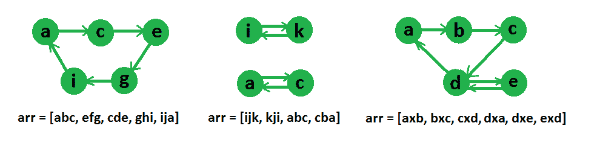

# 查找字符串数组是否可以链接成一个圆|集合 2

> 原文:[https://www . geesforgeks . org/find-array-strings-can-chained-form-circle-set-2/](https://www.geeksforgeeks.org/find-array-strings-can-chained-form-circle-set-2/)

给定一个字符串数组，找出给定的字符串是否可以链接成一个圆。如果 X 的最后一个字符与 Y 的第一个字符相同，则可以将一个字符串 X 放在圆中的另一个字符串 Y 之前

**示例:**

```
Input: arr[] = {"geek", "king"}
Output: Yes, the given strings can be chained.
Note that the last character of first string is same
as first character of second string and vice versa is
also true.

Input: arr[] = {"for", "geek", "rig", "kaf"}
Output: Yes, the given strings can be chained.
The strings can be chained as "for", "rig", "geek" 
and "kaf"

Input: arr[] = {"aab", "bac", "aaa", "cda"}
Output: Yes, the given strings can be chained.
The strings can be chained as "aaa", "aab", "bac" 
and "cda"

Input: arr[] = {"aaa", "bbb", "baa", "aab"};
Output: Yes, the given strings can be chained.
The strings can be chained as "aaa", "aab", "bbb" 
and "baa"

Input: arr[] = {"aaa"};
Output: Yes

Input: arr[] = {"aaa", "bbb"};
Output: No

Input  : arr[] = ["abc", "efg", "cde", "ghi", "ija"]
Output : Yes
These strings can be reordered as, “abc”, “cde”, “efg”,
“ghi”, “ija”

Input : arr[] = [“ijk”, “kji”, “abc”, “cba”]
Output : No
```

## [我们强烈建议您点击此处进行练习，然后再进入解决方案。](https://practice.geeksforgeeks.org/problem-page.php?pid=995)

我们已经在下面的帖子中讨论了解决这个问题的一种方法。
[查找字符串数组是否可以链接成一个圆|集合 1](https://www.geeksforgeeks.org/given-array-strings-find-strings-can-chained-form-circle/)

在这篇文章中，讨论了另一种方法。我们把这个问题当作图的问题来解决，其中顶点将是字符串的第一个和最后一个字符，如果两个顶点是同一字符串的第一个和最后一个字符，我们将在它们之间画一条边，所以图中的边数将与数组中的字符串数相同。
下图中给出了一些字符串数组的图形表示，



现在，在图表示之后可以清楚地看到，如果图顶点之间的循环是可能的，那么我们可以对字符串重新排序，否则不行。如上图的例子所示，循环可以在第一个和第三个字符串数组中找到，但不能在第二个字符串数组中找到。现在为了检查**这个图是否可以有一个穿过所有顶点**的循环，我们将检查两个条件，

1.  每个顶点的度数和外倾角应该相同。
2.  图应该是强连通的。

第一个条件可以通过为每个字符保留两个数组来轻松检查。对于检查一个图是否有一个穿过所有顶点的环，与检查完全有向图是否强连通是一样的，因为如果它有一个穿过所有顶点的环，那么我们可以从任何其他顶点到达任何顶点，也就是说，这个图将是强连通的，并且同样的参数也可以为 reverse 语句给出。

现在，为了检查第二个条件，我们将从任何字符运行一个 DFS，并访问所有可到达的顶点，现在，如果图有一个循环，那么在这个 DFS 之后，所有的顶点都应该被访问，如果所有的顶点都被访问，那么我们将返回真，否则返回假，因此**访问单个 DFS 中的所有顶点标志着字符串之间可能的顺序**。

## C++

```
// C++ code to check if cyclic order is possible among strings
// under given constrainsts
#include <bits/stdc++.h>
using namespace std;
#define M 26

//    Utility method for a depth first search among vertices
void dfs(vector<int> g[], int u, vector<bool> &visit)
{
    visit[u] = true;
    for (int i = 0; i < g[u].size(); ++i)
        if(!visit[g[u][i]])
            dfs(g, g[u][i], visit);
}

//    Returns true if all vertices are strongly connected
// i.e. can be made as loop
bool isConnected(vector<int> g[], vector<bool> &mark, int s)
{
    // Initialize all vertices as not visited
    vector<bool> visit(M, false);

    //    perform a dfs from s
    dfs(g, s, visit);

    //    now loop through all characters
    for (int i = 0; i < M; i++)
    {
        /*  I character is marked (i.e. it was first or last
            character of some string) then it should be
            visited in last dfs (as for looping, graph
            should be strongly connected) */
        if (mark[i] && !visit[i])
            return false;
    }

    //    If we reach that means graph is connected
    return true;
}

//    return true if an order among strings is possible
bool possibleOrderAmongString(string arr[], int N)
{
    // Create an empty graph
    vector<int> g[M];

    // Initialize all vertices as not marked
    vector<bool> mark(M, false);

    // Initialize indegree and outdegree of every
    // vertex as 0.
    vector<int> in(M, 0), out(M, 0);

    // Process all strings one by one
    for (int i = 0; i < N; i++)
    {
        // Find first and last characters
        int f = arr[i].front() - 'a';
        int l = arr[i].back() - 'a';

        // Mark the characters
        mark[f] = mark[l] = true;

        //    increase indegree and outdegree count
        in[l]++;
        out[f]++;

        // Add an edge in graph
        g[f].push_back(l);
    }

    // If for any character indegree is not equal to
    // outdegree then ordering is not possible
    for (int i = 0; i < M; i++)
        if (in[i] != out[i])
            return false;

    return isConnected(g, mark, arr[0].front() - 'a');
}

//    Driver code to test above methods
int main()
{
    // string arr[] = {"abc", "efg", "cde", "ghi", "ija"};
    string arr[] = {"ab", "bc", "cd", "de", "ed", "da"};
    int N = sizeof(arr) / sizeof(arr[0]);

    if (possibleOrderAmongString(arr, N) == false)
        cout << "Ordering not possible\n";
    else
        cout << "Ordering is possible\n";
    return 0;
}
```

## Java 语言(一种计算机语言，尤用于创建网站)

```
// Java code to check if cyclic order is
// possible among strings under given constrainsts
import java.io.*;
import java.util.*;

class GFG{

// Return true if an order among strings is possible    
public static boolean possibleOrderAmongString(
    String s[], int n)
{
    int m = 26;
    boolean mark[] = new boolean[m];
    int in[] = new int[26];
    int out[] = new int[26];

    ArrayList<
    ArrayList<Integer>> adj = new ArrayList<
                                  ArrayList<Integer>>();
    for(int i = 0; i < m; i++)
        adj.add(new ArrayList<>());

    // Process all strings one by one
    for(int i = 0; i < n; i++) 
    {

        // Find first and last characters
        int f = (int)(s[i].charAt(0) - 'a');
        int l = (int)(s[i].charAt(
                 s[i].length() - 1) - 'a');

        // Mark the characters
        mark[f] = mark[l] = true;

        // Increase indegree and outdegree count
        in[l]++;
        out[f]++;

        // Add an edge in graph
        adj.get(f).add(l);
    }

    // If for any character indegree is not equal to
    // outdegree then ordering is not possible
    for(int i = 0; i < m; i++)
    {
        if (in[i] != out[i])
            return false;
    }
    return isConnected(adj, mark, 
                       s[0].charAt(0) - 'a');
}

// Returns true if all vertices are strongly 
// connected i.e. can be made as loop
public static boolean isConnected(
    ArrayList<ArrayList<Integer>> adj,
    boolean mark[], int src)
{
    boolean visited[] = new boolean[26];

    // Perform a dfs from src
    dfs(adj, visited, src);
    for(int i = 0; i < 26; i++)
    {

        /*  I character is marked (i.e. it was first or
         last character of some string) then it should
         be visited in last dfs (as for looping, graph
         should be strongly connected) */
        if (mark[i] && !visited[i])
            return false;
    }

    // If we reach that means graph is connected
    return true;
}

// Utility method for a depth first 
// search among vertices
public static void dfs(ArrayList<ArrayList<Integer>> adj,
                       boolean visited[], int src)
{
    visited[src] = true;
    for(int i = 0; i < adj.get(src).size(); i++)
        if (!visited[adj.get(src).get(i)])
            dfs(adj, visited, adj.get(src).get(i));
}

// Driver code
public static void main(String[] args)
{
    String s[] = { "ab", "bc", "cd", "de", "ed", "da" };
    int n = s.length;

    if (possibleOrderAmongString(s, n))
        System.out.println("Ordering is possible");
    else
        System.out.println("Ordering is not possible");
}
}

// This code is contributed by parascoding
```

## 蟒蛇 3

```
# Python3 code to check if 
# cyclic order is possible 
# among strings under given 
# constrainsts
M = 26

# Utility method for a depth 
# first search among vertices 
def dfs(g, u, visit):
    visit[u] = True

    for i in range(len(g[u])):
        if(not visit[g[u][i]]):
            dfs(g, g[u][i], visit)

# Returns true if all vertices 
# are strongly connected i.e. 
# can be made as loop 
def isConnected(g, mark, s):

    # Initialize all vertices 
    # as not visited 
    visit = [False for i in range(M)]

    # Perform a dfs from s
    dfs(g, s, visit)

    # Now loop through 
    # all characters 
    for i in range(M):

        # I character is marked 
        # (i.e. it was first or last 
        # character of some string) 
        # then it should be visited
        # in last dfs (as for looping, 
        # graph should be strongly 
        # connected) */
        if(mark[i] and (not visit[i])):
            return False

    # If we reach that means 
    # graph is connected 
    return True

# return true if an order among 
# strings is possible 
def possibleOrderAmongString(arr, N):

    # Create an empty graph 
    g = {}

    # Initialize all vertices 
    # as not marked 
    mark = [False for i in range(M)]

    # Initialize indegree and 
    # outdegree of every 
    # vertex as 0.
    In = [0 for i in range(M)]
    out = [0 for i in range(M)]

    # Process all strings 
    # one by one 
    for i in range(N):

        # Find first and last 
        # characters 
        f = (ord(arr[i][0]) - 
             ord('a'))
        l = (ord(arr[i][-1]) - 
             ord('a'))

        # Mark the characters 
        mark[f] = True
        mark[l] = True

        # Increase indegree 
        # and outdegree count 
        In[l] += 1
        out[f] += 1

        if f not in g:
            g[f] = []

        # Add an edge in graph 
        g[f].append(l)

    # If for any character 
    # indegree is not equal to 
    # outdegree then ordering 
    # is not possible 
    for i in range(M):
        if(In[i] != out[i]):
            return False

    return isConnected(g, mark, 
                       ord(arr[0][0]) - 
                       ord('a'))

# Driver code
arr = ["ab", "bc", 
       "cd", "de", 
       "ed", "da"]
N = len(arr)
if(possibleOrderAmongString(arr, N) == 
   False):
    print("Ordering not possible")
else:
    print("Ordering is possible")

# This code is contributed by avanitrachhadiya2155
```

## C#

```
// C# code to check if cyclic order is
// possible among strings under given constrainsts
using System;
using System.Collections.Generic;
class GFG {

    // Return true if an order among strings is possible   
    static bool possibleOrderAmongString(string[] s, int n)
    {
        int m = 26;
        bool[] mark = new bool[m];
        int[] In = new int[26];
        int[] Out = new int[26];

        List<List<int>> adj = new List<List<int>>();
        for(int i = 0; i < m; i++)
            adj.Add(new List<int>());

        // Process all strings one by one
        for(int i = 0; i < n; i++)
        {

            // Find first and last characters
            int f = (int)(s[i][0] - 'a');
            int l = (int)(s[i][s[i].Length - 1] - 'a');

            // Mark the characters
            mark[f] = mark[l] = true;

            // Increase indegree and outdegree count
            In[l]++;
            Out[f]++;

            // Add an edge in graph
            adj[f].Add(l);
        }

        // If for any character indegree is not equal to
        // outdegree then ordering is not possible
        for(int i = 0; i < m; i++)
        {
            if (In[i] != Out[i])
                return false;
        }
        return isConnected(adj, mark,
                           s[0][0] - 'a');
    }

    // Returns true if all vertices are strongly
    // connected i.e. can be made as loop
    public static bool isConnected(
        List<List<int>> adj,
        bool[] mark, int src)
    {
        bool[] visited = new bool[26];

        // Perform a dfs from src
        dfs(adj, visited, src);
        for(int i = 0; i < 26; i++)
        {

            /*  I character is marked (i.e. it was first or
             last character of some string) then it should
             be visited in last dfs (as for looping, graph
             should be strongly connected) */
            if (mark[i] && !visited[i])
                return false;
        }

        // If we reach that means graph is connected
        return true;
    }

    // Utility method for a depth first
    // search among vertices
    public static void dfs(List<List<int>> adj,
                           bool[] visited, int src)
    {
        visited[src] = true;
        for(int i = 0; i < adj[src].Count; i++)
            if (!visited[adj[src][i]])
                dfs(adj, visited, adj[src][i]);
    }

  static void Main() {
    string[] s = { "ab", "bc", "cd", "de", "ed", "da" };
    int n = s.Length;

    if (possibleOrderAmongString(s, n))
        Console.Write("Ordering is possible");
    else
        Console.Write("Ordering is not possible");
  }
}

// This code is contributed by divyesh072019.
```

## java 描述语言

```
<script>
    // Javascript code to check if cyclic order is
    // possible among strings under given constrainsts

    // Return true if an order among strings is possible  
    function possibleOrderAmongString(s, n)
    {
        let m = 26;
        let mark = new Array(m);
        mark.fill(false);
        let In = new Array(26);
        In.fill(0);
        let Out = new Array(26);
        Out.fill(0);

        let adj = [];
        for(let i = 0; i < m; i++)
            adj.push([]);

        // Process all strings one by one
        for(let i = 0; i < n; i++)
        {

            // Find first and last characters
            let f = (s[i][0].charCodeAt() - 'a'.charCodeAt());
            let l = (s[i][s[i].length - 1].charCodeAt() - 'a'.charCodeAt());

            // Mark the characters
            mark[f] = mark[l] = true;

            // Increase indegree and outdegree count
            In[l]++;
            Out[f]++;

            // Add an edge in graph
            adj[f].push(l);
        }

        // If for any character indegree is not equal to
        // outdegree then ordering is not possible
        for(let i = 0; i < m; i++)
        {
            if (In[i] != Out[i])
                return false;
        }
        return isConnected(adj, mark, s[0][0].charCodeAt() - 'a'.charCodeAt());
    }

    // Returns true if all vertices are strongly
    // connected i.e. can be made as loop
    function isConnected(adj, mark, src)
    {
        let visited = new Array(26);
        visited.fill(false);

        // Perform a dfs from src
        dfs(adj, visited, src);
        for(let i = 0; i < 26; i++)
        {

            /*  I character is marked (i.e. it was first or
             last character of some string) then it should
             be visited in last dfs (as for looping, graph
             should be strongly connected) */
            if (mark[i] && !visited[i])
                return false;
        }

        // If we reach that means graph is connected
        return true;
    }

    // Utility method for a depth first
    // search among vertices
    function dfs(adj, visited, src)
    {
        visited[src] = true;
        for(let i = 0; i < adj[src].length; i++)
            if (!visited[adj[src][i]])
                dfs(adj, visited, adj[src][i]);
    }

    let s = [ "ab", "bc", "cd", "de", "ed", "da" ];
    let n = s.length;

    if (possibleOrderAmongString(s, n))
        document.write("Ordering is possible");
    else
        document.write("Ordering is not possible");

    // This code is contributed by decode2207.
</script>
```

**输出:**

```
Ordering is possible
```

本文由 [**乌卡什·特里维迪**](https://in.linkedin.com/in/utkarsh-trivedi-253069a7) 供稿。如果你喜欢 GeeksforGeeks 并想投稿，你也可以使用[write.geeksforgeeks.org](http://www.write.geeksforgeeks.org)写一篇文章或者把你的文章邮寄到 review-team@geeksforgeeks.org。看到你的文章出现在极客博客主页上，帮助其他极客。
如果发现有不正确的地方，或者想分享更多关于上述话题的信息，请写评论。