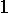
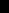
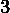
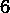
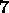

# 在大小为 4 的组中使用不同的元素异或来查找数组

> 原文:[https://www . geeksforgeeks . org/find-array-use-differential-xor-of-elements-in-group-of-size-4/](https://www.geeksforgeeks.org/find-array-using-different-xors-of-elements-in-groups-of-size-4/)

给定大小为 **N** (N 是 4 的倍数)的异或查询的数组 **q[]** ，该数组描述相同大小的数组如下:

> q[0–3]描述 arr[0–3]，q[4–7]描述 arr[4–7]等等……
> 如果 arr[0–3]= { a1，a2，a3，a4}那么
> q[0–3]= { a<sub>1</sub>⊕a<sub>2</sub>⊕a<sub>3</sub>，a<sub>1</sub>⊕a<sub>2</sub>⊕a<sub>4</sub>，a 【T14

任务是在只给出**q【】**的情况下，找到原数组**arr【】**的值。
**例:**

> **输入:**q = { 4、1、7、 0 }
> T3【输出】2 5 3 6【5】a<sub>1】</sub>a<sub>a<sub>3】= 4 2、T28、T29、T30、a、T31、4、T32、1、7、0 = 6、T33、T34 输入:T35、q = { 4、1、7、0、8、5、1</sub></sub>

**方法:**从异或的性质来看， **a ⊕ a = 0** 和 **a ⊕ 0 = a** 。
**(a⊕b⊕c)⊕(b⊕c⊕d)= a⊕d**(as(b⊕c)⊕(b↑c)= 0)
因此我们将数组分成 4 个元素的组，对于每个组(a，b，c，d)，我们将给出以下查询的结果
:

1.  b 和 c
2.  b 是 d
3.  那 c 和 d 呢
4.  b-c-d 型管管管管管管管管管管管管管管管管管管管管管管管管管管管管管管管管管管管管管管管管管管管管管管管管管管管管管管管管

> 作为(a ⊕ b ⊕ c) ⊕ (b ⊕ c ⊕ d) = a ⊕ d ，
> 使用这个 **(a ⊕ d)** 我们可以通过以下方式从**查询 2 和 3** 得到 **b** 和**c**:
> **(a⊕b⊕d)⊕(a⊕d)= b**
> t15】(a⊕c⊕d)⊕(a⊕d) = c
> 然后使用 **b** 和 **c** 我们可以从**查询 1** 得到 **a** ，从**查询 4** 得到 **d** ，具体如下:
> t31(a⊕b⊕c)⊕(b)⊕(c)= at33】t34(b⊕c⊕d)⊕(b)⊕(c) (a 、a 、a 、a )然后(a 、a 、a 、a 等。)

以下是上述方法的实现:

## C++

```
// C++ implementation of the approach
#include <bits/stdc++.h>
using namespace std;

// Utility function to print the contents of the array
void printArray(int arr[], int n)
{
    for (int i = 0; i < n; i++)
        cout << arr[i] << " ";
}

// Function to find the required array
void findArray(int q[], int n)
{
    int arr[n], ans;
    for (int k = 0, j = 0; j < n / 4; j++) {
        ans = q[k] ^ q[k + 3];
        arr[k + 1] = q[k + 1] ^ ans;
        arr[k + 2] = q[k + 2] ^ ans;
        arr[k] = q[k] ^ ((arr[k + 1]) ^ (arr[k + 2]));
        arr[k + 3] = q[k + 3] ^ (arr[k + 1] ^ arr[k + 2]);
        k += 4;
    }

    // Print the array
    printArray(arr, n);
}

// Driver code
int main()
{
    int q[] = { 4, 1, 7, 0 };
    int n = sizeof(q) / sizeof(q[0]);
    findArray(q, n);
    return 0;
}
```

## Java 语言(一种计算机语言，尤用于创建网站)

```
// Java implementation of the approach
class GFG
{

    // Utility function to print
    // the contents of the array
    static void printArray(int []arr, int n)
    {
        for (int i = 0; i < n; i++)
            System.out.print(arr[i] + " ");
    }

    // Function to find the required array
    static void findArray(int []q, int n)
    {
        int ans;
        int []arr = new int[n];
        for (int k = 0, j = 0;
                        j < n / 4; j++)
        {
            ans = q[k] ^ q[k + 3];
            arr[k + 1] = q[k + 1] ^ ans;
            arr[k + 2] = q[k + 2] ^ ans;
            arr[k] = q[k] ^ ((arr[k + 1]) ^
                             (arr[k + 2]));
            arr[k + 3] = q[k + 3] ^ (arr[k + 1] ^
                                     arr[k + 2]);
            k += 4;
        }

        // Print the array
        printArray(arr, n);
    }

    // Driver code
    public static void main(String args[])
    {
        int []q = { 4, 1, 7, 0 };
        int n = q.length;
        findArray(q, n);
    }
}

// This code is contributed
// by Akanksha Rai
```

## 蟒蛇 3

```
# Python 3 implementation of the approach

# Utility function to print the
# contents of the array
def printArray(arr, n):
    for i in range(n):
        print(arr[i], end = " ")

# Function to find the required array
def findArray(q, n):
    arr = [None] * n
    k = 0
    for j in range(int(n / 4)):
        ans = q[k] ^ q[k + 3]
        arr[k + 1] = q[k + 1] ^ ans
        arr[k + 2] = q[k + 2] ^ ans
        arr[k] = q[k] ^ ((arr[k + 1]) ^
                         (arr[k + 2]))
        arr[k + 3] = q[k + 3] ^ (arr[k + 1] ^
                                 arr[k + 2])
        k += 4

    # Print the array
    printArray(arr, n)

# Driver code
if __name__ == '__main__':
    q = [4, 1, 7, 0]
    n = len(q)
    findArray(q, n)

# This code is contributed by
# Surendra_Gangwar
```

## C#

```
// C# implementation of the approach
using System;

class GFG
{

    // Utility function to print
    // the contents of the array
    static void printArray(int []arr, int n)
    {
        for (int i = 0; i < n; i++)
            Console.Write(arr[i] + " ");
    }

    // Function to find the required array
    static void findArray(int []q, int n)
    {
        int ans;
        int []arr = new int[n] ;
        for (int k = 0, j = 0; j < n / 4; j++)
        {
            ans = q[k] ^ q[k + 3];
            arr[k + 1] = q[k + 1] ^ ans;
            arr[k + 2] = q[k + 2] ^ ans;
            arr[k] = q[k] ^ ((arr[k + 1]) ^ (arr[k + 2]));
            arr[k + 3] = q[k + 3] ^ (arr[k + 1] ^ arr[k + 2]);
            k += 4;
        }

        // Print the array
        printArray(arr, n);
    }

    // Driver code
    public static void Main()
    {
        int []q = { 4, 1, 7, 0 };
        int n = q.Length ;
        findArray(q, n);
    }
}

// This code is contributed by Ryuga
```

## 服务器端编程语言（Professional Hypertext Preprocessor 的缩写）

```
<?php
// PHP implementation of the approach

// Utility function to print
// the contents of the array
function printArray($arr, $n)
{
    for ($i = 0; $i < $n; $i++)
        echo($arr[$i] ." ");
}

// Function to find the required array
function findArray($q, $n)
{
    $ans;
    $arr = array($n);
    for ($k = 0, $j = 0; $j < $n / 4; $j++)
    {
        $ans = $q[$k] ^ $q[$k + 3];
        $arr[$k + 1] = $q[$k + 1] ^ $ans;
        $arr[$k + 2] = $q[$k + 2] ^ $ans;
        $arr[$k] = $q[$k] ^ (($arr[$k + 1]) ^
                            ($arr[$k + 2]));
        $arr[$k + 3] = $q[$k + 3] ^ ($arr[$k + 1] ^
                                    $arr[$k + 2]);
        $k += 4;
    }

    // Print the array
    printArray($arr, $n);
}

// Driver code
{
    $q = array( 4, 1, 7, 0 );
    $n = sizeof($q);
    findArray($q, $n);
}

// This code is contributed
// by Code_Mech.
```

## java 描述语言

```
<script>

// Javascript implementation
// of the approach

// Utility function to print the
// contents of the array
function printArray(arr, n)
{
    for (let i = 0; i < n; i++)
        document.write(arr[i] + " ");
}

// Function to find the required array
function findArray(q, n)
{
    let arr = new Array(n), ans;
    for (let k = 0, j = 0; j <
    parseInt(n / 4); j++)
    {
        ans = q[k] ^ q[k + 3];
        arr[k + 1] = q[k + 1] ^ ans;

        arr[k + 2] = q[k + 2] ^ ans;

        arr[k] = q[k] ^ ((arr[k + 1]) ^
        (arr[k + 2]));

        arr[k + 3] = q[k + 3] ^ (arr[k + 1] ^
        arr[k + 2]);

        k += 4;
    }

    // Print the array
    printArray(arr, n);
}

// Driver code
    let q = [ 4, 1, 7, 0 ];
    let n = q.length;
    findArray(q, n);

</script>
```

**Output:** 

```
2 5 3 6
```

**时间复杂度:**O(N)
T3】辅助空间: O(N)