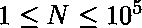
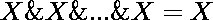

# 查找所有可能子阵列的按位“与”(&)

> 原文:[https://www . geeksforgeeks . org/find-所有可能子数组的逐位和/](https://www.geeksforgeeks.org/find-bitwise-and-of-all-possible-sub-arrays/)

给定一个数组**一个**大小的 **N** 其中。任务是找到所有可能的 **A** 子阵列的**和**，然后找到所有这些结果的**和**。

**示例:**

```
Input : 1 2 3
Output : 0
All possible subarrays are 
{1}, {2}, {3}, {1, 2}, {2, 3} and {1, 2, 3}
ANDs of these subarrays are 1, 2, 3, 0, 2, 0.
AND of these ANDs is 0.

Input : 100 500 1000
Output : 96 
```

**方法:**
**天真的解决方案**是找到所有子阵列的**和**，然后打印它们结果的**和**。这将导致 O(N <sup>2</sup> )解。

**最优解:**利用的性质，即一个元素出现多少次并不重要，它的**和** ing 只算一次。因此，我们的问题简化为只找到数组中所有元素的**和**。

下面是上述方法的实现。

## C++

```
// C++ program to find of all the sub-arrays
#include <bits/stdc++.h>
using namespace std;

// function to return AND of sub-arrays
int AND(int a[], int n)
{
    int ans = a[0];
    for (int i = 0; i < n; ++i)
        ans &= a[i]; 
    return ans;
}

// Driver program
int main()
{
    int a[] = { 1, 2, 3 };

    // size of the array
    int n = sizeof(a) / sizeof(a[0]);

    // print and of all subarrays
    cout << AND(a, n);

    return 0;
}
```

## Java 语言(一种计算机语言，尤用于创建网站)

```
//Java program to find of all the sub-arrays
public class GFG {

    //function to return AND of sub-arrays
    static int AND(int a[], int n)
    {
     int ans = a[0];
     for (int i = 0; i < n; ++i)
         ans &= a[i]; 
     return ans;
    }

    // Driver code
    public static void main(String[] args) {

        int a[] = { 1, 2, 3 };

         // size of the array
         int n = a.length;

         // print and of all subarrays
         System.out.println(AND(a, n));
    }
}
```

## 蟒蛇 3

```
# Python 3 Program  to find of all the sub-arrays

# function to return AND of sub-arrays
def AND(a, n) :

    ans = a[0]
    for i in range(n) :
        ans &= a[i]

    return ans

# Driver Code
if __name__ == "__main__" :

    a = [ 1, 2, 3]

    # size of the array
    n = len(a)

    # print and of all subarrays
    print(AND(a, n))

# This code is contributed by ANKITRAI1
```

## C#

```
//C# program to find of all the sub-arrays 

using System;

public class GFG {

    //function to return AND of sub-arrays
    static int AND(int []a, int n)
    {
     int ans = a[0];
     for (int i = 0; i < n; ++i) 
         ans &= a[i];  
     return ans;
    }

    // Driver code
    public static void Main() {

        int []a = { 1, 2, 3 };

         // size of the array
         int n = a.Length;

         // print and of all subarrays
         Console.WriteLine(AND(a, n));
    }
}
```

## 服务器端编程语言（Professional Hypertext Preprocessor 的缩写）

```
<?php
// PHP program to find of
// all the sub-arrays

// function to return AND
// of sub-arrays
function ANDS(&$a, $n)
{
    $ans = $a[0];
    for ($i = 0; $i < $n; ++$i)
        $ans &= $a[$i];
    return $ans;
}

// Driver Code
$a = array( 1, 2, 3 );

// size of the array
$n = sizeof($a);

// print and of all subarrays
echo ANDS($a, $n);

// This code is contributed
// by Shivi_Aggarwal
?>
```

## java 描述语言

```
<script>
//Javascript program to find of all the sub-arrays

    //function to return AND of sub-arrays
    function AND(a,n)
    {
        let ans = a[0];
     for (let i = 0; i < n; ++i)
         ans &= a[i]; 
     return ans;
    }

    // Driver code
    let a=[ 1, 2, 3 ];
    // size of the array
    let n = a.length;
    // print and of all subarrays
    document.write(AND(a, n));

// This code is contributed by rag2127
</script>
```

**输出:**

```
0
```

**时间复杂度:**T2【O(N)T4】