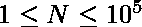
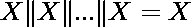

# 查找所有可能的子阵列的按位“或”

> 原文:[https://www . geeksforgeeks . org/find-所有可能子数组的按位或/](https://www.geeksforgeeks.org/find-bitwise-or-of-all-possible-sub-arrays/)

给定一个数组**一个**大小 **N** 在哪里，。任务是找到所有可能的 **A** 子阵列的 **OR** ，然后找到所有这些结果的 **OR** 。
**举例:**

```
Input : 1 4 6
Output : 7
All possible subarrays are 
{1}, {1, 4}, {4, 6} and {1, 4, 6}
ORs of these subarrays are 1, 5, 6
and 7\. OR of these ORs is 7.

Input : 10 100 1000
Output : 1006
```

**方法:**在 [SET 1](https://www.geeksforgeeks.org/find-bitwise-and-of-all-possible-sub-arrays/) 中，我们已经看到了如何找到所有可能的子阵列的按位“与”。类似的方法也适用于此。
天真的解决方案是找到所有子阵列的**或**，然后输出其结果的**或**。这将导致 O(N <sup>2</sup> )解。
**高效解决方案:**利用的性质，即一个元素出现多少次都不重要，它的 or 只算一次。因此，我们的问题归结为找到数组中所有元素的**或**。
**以下是上述办法的实施情况。**T22】

## C++

```
// C++ program to find OR of all the sub-arrays
#include <bits/stdc++.h>
using namespace std;

// function to return OR of sub-arrays
int OR(int a[], int n)
{
    int ans = a[0];
    for (int i = 1; i < n; ++i)
         ans |= a[i];   

    return ans;
}

// Driver program
int main()
{
    int a[] = { 1, 4, 6 };
    int n = sizeof(a) / sizeof(a[0]);

    // print OR of all subarrays
    cout << OR(a, n);

    return 0;
}
```

## Java 语言(一种计算机语言，尤用于创建网站)

```
// Java program to find OR of
// all the sub-arrays
class GFG
{

// function to return OR
// of sub-arrays
static int OR(int a[],int n)
{
    int ans = a[0];
    int i;
    for(i = 1; i < n; i++)
    {
        ans |= a[i];
    }
    return ans;
}

// Driver Code
public static void main(String args[])
{
    int a[] = { 1, 4, 6};

    int n = a.length;

    // print OR of all subarrays
    System.out.println(OR(a, n));
}
}

// This code is contributed
// by ANKITRAI1
```

## 蟒蛇 3

```
# Python3 program to find OR of all the sub-arrays

# function to return OR of sub-arrays
def OR(a, n):

    ans = a[0]
    for i in range(1,n):
        ans |= a[i]

    return ans

# Driver Code
if __name__=='__main__':
    a = [1, 4, 6]
    n = len(a)

# print OR of all subarrays
    print(OR(a, n))

# This code is contributed
# by Shashank_Sharma
```

## C#

```
// C# program to find OR of
// all the sub-arrays
using System;

class GFG
{

// function to return OR
// of sub-arrays
static int OR(int[] a, int n)
{
    int ans = a[0];
    int i;
    for(i = 1; i < n; i++)
    {
        ans |= a[i];
    }
    return ans;
}

// Driver Code
public static void Main()
{
    int[] a = { 1, 4, 6};

    int n = a.Length;

    // print OR of all subarrays
    Console.Write(OR(a, n));
}
}

// This code is contributed
// by ChitraNayal
```

## 服务器端编程语言（Professional Hypertext Preprocessor 的缩写）

```
<?php
// PHP program to find OR
// of all the sub-arrays

// function to return OR
// of sub-arrays
function O_R($a, $n)
{
    $ans = $a[0];
    for ($i = 1; $i < $n; ++$i)
        $ans |= $a[$i];

    return $ans;
}

// Driver Code
$a = array( 1, 4, 6 );
$n = count($a);

// print OR of all subarrays
echo O_R($a, $n);

// This code is contributed
// by inder_verma
?>
```

## java 描述语言

```
<script>

// Javascript program to find OR of all the sub-arrays

// function to return OR of sub-arrays
function OR(a, n)
{
    var ans = a[0];
    for (var i = 1; i < n; ++i)
         ans |= a[i];   

    return ans;
}

var a = [ 1, 4, 6 ];
var n = a.length;

    // print OR of all subarrays
 document.write(OR(a, n));

// This code is contributed by SoumikMondal

</script>
```

**输出:**

```
7
```

**时间复杂度:**T2【O(N)T4】