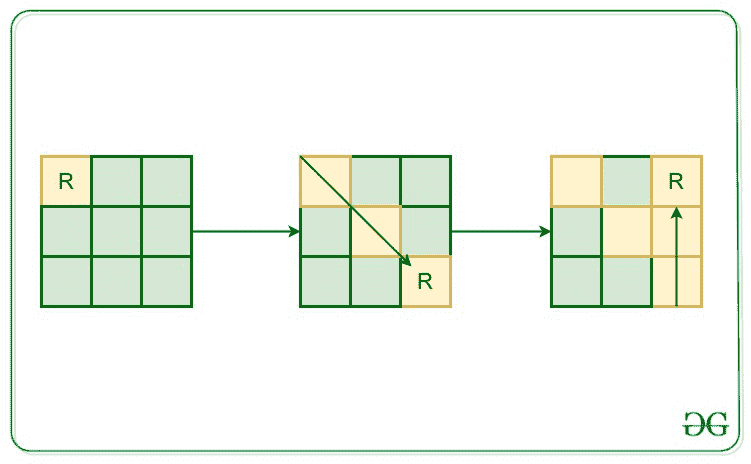

# 在矩阵中查找机器人在给定动作中未访问的单元

> 原文:[https://www . geeksforgeeks . org/find-矩阵中机器人给定动作不可访问的细胞/](https://www.geeksforgeeks.org/find-cells-in-matrix-that-are-not-visited-by-robot-for-given-movements/)

给定一个整数 **N，**表示矩阵的大小为 **N*N.** 在矩阵的左上角(0，0)放置一个机器人，机器人的移动方向被给出为(N，S，W，E，NE，NW，SE，SW，分别表示北，南，西，东，东北，西北，东南，西南)，并且在特定方向上的移动持续时间也被给出。任务是在所有风结束机器人完成移动后，找到矩阵的**未访问单元**。

**注意:**机器人只能访问一个细胞一次。如果机器人在任何时候都不能移动，那么它将停留在当前位置。此外，机器人每秒钟可以移动一次。

**示例:**

> **输入:** N = 3，move[] = {(0，SE)，(2，N)}
> **输出:** 4
> **解释:**
> 
> 
> 
> **输入:**
> N = 5，move[] =
> {(0，SE)、
> (1，NE)、
> (2，E)、
> (6，SW)、
> (15，N)、
> (20，W)}
> **输出:**
> 13
> **解释:**
> 机器人运动后，有 13 个细胞未被访问。

**方法:**思路是用[递归](https://www.geeksforgeeks.org/recursion/)来解决这个问题。最初，将机器人的当前位置设置为(0，0)。按照给定的方向开始机器人的移动，并将单元格标记为矩阵中已访问的单元格。最后，在机器人标记完成移动后，对矩阵中未标记为已访问的单元进行计数

下面的代码实现了上面讨论的方法:

## C++

```
// C++ implementation to find the
// unvisited cells of the matrix

#include <bits/stdc++.h>

using namespace std;

// Dimension
// of the board
int n;

// Current location
// of the robot
int curr_i = 0, curr_j = 0;

// Function to move the robot
void moveRobot(
    int n, int i,
    int j, int dx,
    int dy, int& duration,
    vector<vector<bool> >& visited)
{

    // if the robot tends to move
    // out of the board
    // or tends to visit an
    // already visited position
    // or the wind direction is changed
    if (i < 0 || i >= n || j < 0 || j >= n
        || visited[i][j] == true
        || duration == 0) {

        // the robot can't move further
        // under the influence of
        // current wind direction
        return;
    }

    // Change the current location
    // and mark the current
    // position as visited
    curr_i = i;
    curr_j = j;
    visited[i][j] = true;

    // One second passed
    // visiting this position
    duration--;

    moveRobot(n, i + dx, j + dy, dx,
              dy, duration, visited);
}

// Function to find the unvisited
// cells of the matrix after movement
void findUnvisited(
    int p,
    vector<pair<int, string> > periods)
{
    // nXn matrix to store the
    // visited state of positions
    vector<vector<bool> > visited;

    // map to store the wind directions
    unordered_map<string, vector<int> > mp
        = { { "N", { -1, 0 } },
            { "S", { 1, 0 } },
            { "E", { 0, 1 } },
            { "W", { 0, -1 } },
            { "NE", { -1, 1 } },
            { "NW", { -1, -1 } },
            { "SE", { 1, 1 } },
            { "SW", { 1, -1 } } };

    // Initially all of the
    // positions are unvisited
    for (int i = 0; i < n; i++) {
        visited.push_back(vector<bool>{});
        for (int j = 0; j < n; j++) {
            visited[i].push_back(false);
        }
    }

    for (int i = 0; i < p; i++) {
        string dir = periods[i].second;
        int dx = mp[dir][0];
        int dy = mp[dir][1];

        // duration for the which the
        // current direction of wind exists
        int duration;

        if (i < p - 1) {
            // difference of the start time
            // of current wind direction
            // and start time of the
            // upcoming wind direction
            duration
                = periods[i + 1].first
                  - periods[i].first;
        }
        else {
            // the maximum time for which
            // a robot can move is
            // equal to the diagonal
            // length of the square board
            duration = sqrt(2) * n;
        }

        // If its possible to move
        // the robot once in the
        // direction of wind, then
        // move it once and call the
        // recursive function for
        // further movements
        int next_i = curr_i + dx;
        int next_j = curr_j + dy;

        if (next_i >= 0
            && next_i < n
            && next_j >= 0
            && next_j < n
            && visited[next_i][next_j] == false
            && duration > 0) {
            moveRobot(n, next_i,
                      next_j, dx, dy,
                      duration, visited);
        }
    }

    // Variable to store the
    // number of unvisited positions
    int not_visited = 0;

    // traverse over the matrix and
    // keep counting the unvisited positions
    for (int i = 0; i < n; i++) {
        for (int j = 0; j < n; j++) {
            if (visited[i][j] == false) {
                not_visited++;
            }
        }
    }

    cout << not_visited << "\n";
}

// Driver Code
int main()
{

    // Dimension of the board
    n = 5;

    // number of periods
    int p = 6;

    // vector of pairs
    vector<pair<int, string> > periods(p);
    periods[0] = { 0, "SE" };
    periods[1] = { 1, "NE" };
    periods[2] = { 2, "E" };
    periods[3] = { 6, "SW" };
    periods[4] = { 15, "N" };
    periods[5] = { 20, "W" };

    // Function Call
    findUnvisited(p, periods);
    return 0;
}
```

## Java 语言(一种计算机语言，尤用于创建网站)

```
// Java implementation to find the
// unvisited cells of the matrix
import java.util.*;
import java.awt.Point;

class pair{ 
 int x;
 String y;
}

public class Main
{
    // Dimension
    // of the board
    static int n;

    // Current location
    // of the robot
    static int curr_i = 0, curr_j = 0;
    static int duration;

    // nXn matrix to store the
    // visited state of positions
    static Vector<Vector<Boolean>> visited = new Vector<Vector<Boolean>>();

    // Function to move the robot
    static void moveRobot(int n, int i, int j, int dx, int dy)
    {

        // if the robot tends to move
        // out of the board
        // or tends to visit an
        // already visited position
        // or the wind direction is changed
        if (i < 0 || i >= n || j < 0 || j >= n
            || visited.get(i).get(j) == true
            || duration == 0) {

            // the robot can't move further
            // under the influence of
            // current wind direction
            return;
        }

        // Change the current location
        // and mark the current
        // position as visited
        curr_i = i;
        curr_j = j;
        visited.get(i).set(j, true);

        // One second passed
        // visiting this position
        duration--;

        moveRobot(n, i + dx, j + dy, dx, dy);
    }

    // Function to find the unvisited
    // cells of the matrix after movement
    static void findUnvisited(int p, Vector<pair> periods)
    {
        // map to store the wind directions
        int[] array = new int[]{-1, 0};
        Vector<Integer> l = new Vector<Integer>();
        l.add(-1);
        l.add(0);
        HashMap<String, Vector<Integer>> mp = new HashMap<String, Vector<Integer>>();
        mp.put("N", l);
        l.clear();
        l.add(1);
        l.add(0);
        mp.put("S", l);
        l.clear();
        l.add(0);
        l.add(1);
        mp.put("E", l);
        l.clear();
        l.add(0);
        l.add(-1);
        mp.put("W", l);
        l.clear();
        l.add(-1);
        l.add(1);
        mp.put("NE", l);
        l.clear();
        l.add(-1);
        l.add(-1);
        mp.put("NW", l);
        l.clear();
        l.add(1);
        l.add(1);
        mp.put("SE", l);
        l.clear();
        l.add(1);
        l.add(-1);
        mp.put("SW", l);

        // Initially all of the
        // positions are unvisited
        for (int i = 0; i < n; i++) {
            visited.add(new Vector<Boolean>());
            for (int j = 0; j < n; j++) {
                visited.get(i).add(false);
            }
        }

        for (int i = 0; i < p; i++) {
            String dir = periods.get(i).y;
            int dx = mp.get(dir).get(0);
            int dy = mp.get(dir).get(1);

            // duration for the which the
            // current direction of wind exists
            int duration;

            if (i < p - 1)
            {

                // difference of the start time
                // of current wind direction
                // and start time of the
                // upcoming wind direction
                duration
                    = periods.get(i + 1).x
                      - periods.get(i).x;
            }
            else {
                // the maximum time for which
                // a robot can move is
                // equal to the diagonal
                // length of the square board
                duration = (int)Math.sqrt(2) * n;
            }

            // If its possible to move
            // the robot once in the
            // direction of wind, then
            // move it once and call the
            // recursive function for
            // further movements
            int next_i = curr_i + dx;
            int next_j = curr_j + dy;

            if (next_i >= 0
                && next_i < n
                && next_j >= 0
                && next_j < n
                && visited.get(next_i).get(next_j) == false
                && duration > 0) {
                moveRobot(n, next_i, next_j, dx, dy);
            }
        }

        // Variable to store the
        // number of unvisited positions
        int not_visited = 0;

        // traverse over the matrix and
        // keep counting the unvisited positions
        for (int i = 0; i < n; i++) {
            for (int j = 0; j < n; j++) {
                if (visited.get(i).get(j) == false) {
                    not_visited++;
                }
            }
        }

        System.out.print(not_visited/2+1);
    }

    public static void main(String[] args) {
        // Dimension of the board
        n = 5;

        // number of periods
        int p = 6;

        // vector of pairs
        Vector<pair> periods = new Vector<pair>();
        pair p1 = new pair();
        p1.x = 0;
        p1.y = "SE";
        periods.add(p1);
        p1 = new pair();
        p1.x = 1;
        p1.y = "NE";
        periods.add(p1);
        p1 = new pair();
        p1.x = 2;
        p1.y = "E";
        periods.add(p1);
        p1 = new pair();
        p1.x = 6;
        p1.y = "SW";
        periods.add(p1);
        p1 = new pair();
        p1.x = 15;
        p1.y = "N";
        periods.add(p1);
        p1 = new pair();
        p1.x = 1;
        p1.y = "NE";
        periods.add(p1);
        p1 = new pair();
        p1.x = 20;
        p1.y = "W";
        periods.add(p1);

        // Function Call
        findUnvisited(p, periods);
    }
}

// This code is contributed by rameshtravel07.
```

## 蟒蛇 3

```
# Python3 implementation to find the
# unvisited cells of the matrix
import math

# Dimension
# of the board
n = 5

# Current location
# of the robot
curr_i, curr_j = 0, 0
duration = 0

# nXn matrix to store the
# visited state of positions
visited = []

# Function to move the robot
def moveRobot(n, i, j, dx, dy):
    global curr_i, curr_j, duration, visited
    # if the robot tends to move
    # out of the board
    # or tends to visit an
    # already visited position
    # or the wind direction is changed
    if i < 0 or i >= n or j < 0 or j >= n or visited[i][j] == True or duration == 0:
        # the robot can't move further
        # under the influence of
        # current wind direction
        return

    # Change the current location
    # and mark the current
    # position as visited
    curr_i = i
    curr_j = j
    visited[i][j] = True

    # One second passed
    # visiting this position
    duration-=1

    moveRobot(n, i + dx, j + dy, dx, dy)

# Function to find the unvisited
# cells of the matrix after movement
def findUnvisited(p, periods):
    global n, curr_i, curr_j, duration, visited

    # map to store the wind directions
    mp = {}
    mp["N"] = [-1, 0]
    mp["S"] = [1, 0]
    mp["E"] = [0, 1]
    mp["W"] = [0, -1]
    mp["NE"] = [ -1, 1 ]
    mp["NW"] = [-1, -1]
    mp["SE"] = [1, 1]
    mp["SW"] = [1, -1]

    # Initially all of the
    # positions are unvisited
    for i in range(n):
        visited.append([])
        for j in range(n):
            visited[i].append(False)

    for i in range(p):
        Dir = periods[i][1]
        dx = mp[Dir][0]
        dy = mp[Dir][1]

        if i < p - 1:
            # difference of the start time
            # of current wind direction
            # and start time of the
            # upcoming wind direction
            duration = periods[i + 1][0] - periods[i][0]
        else:
            # the maximum time for which
            # a robot can move is
            # equal to the diagonal
            # length of the square board
            duration = math.sqrt(2) * n

        # If its possible to move
        # the robot once in the
        # direction of wind, then
        # move it once and call the
        # recursive function for
        # further movements
        next_i = curr_i + dx
        next_j = curr_j + dy

        if next_i >= 0 and next_i < n and next_j >= 0 and next_j < n and visited[next_i][next_j] == False and duration > 0:
            moveRobot(n, next_i, next_j, dx, dy)

    # Variable to store the
    # number of unvisited positions
    not_visited = 0

    # traverse over the matrix and
    # keep counting the unvisited positions
    for i in range(n):
        for j in range(n):
            if visited[i][j] == False:
                not_visited += 1

    print(not_visited)

# Dimension of the board
n = 5;

# number of periods
p = 6

# vector of pairs
periods = []
for i in range(p):
    periods.append([])
periods[0] = [ 0, "SE" ]
periods[1] = [ 1, "NE" ]
periods[2] = [ 2, "E" ]
periods[3] = [ 6, "SW"]
periods[4] = [ 15, "N"]
periods[5] = [ 20, "W"]

# Function Call
findUnvisited(p, periods)

# This code is contributed by divyeshrabadiya07.
```

## C#

```
// C# implementation to find the
// unvisited cells of the matrix
using System;
using System.Collections.Generic;
class GFG {

    // Dimension
    // of the board
    static int n;

    // Current location
    // of the robot
    static int curr_i = 0, curr_j = 0;
    static int duration;

    // nXn matrix to store the
    // visited state of positions
    static List<List<bool>> visited = new List<List<bool>>();

    // Function to move the robot
    static void moveRobot(int n, int i, int j, int dx, int dy)
    {

        // if the robot tends to move
        // out of the board
        // or tends to visit an
        // already visited position
        // or the wind direction is changed
        if (i < 0 || i >= n || j < 0 || j >= n
            || visited[i][j] == true
            || duration == 0) {

            // the robot can't move further
            // under the influence of
            // current wind direction
            return;
        }

        // Change the current location
        // and mark the current
        // position as visited
        curr_i = i;
        curr_j = j;
        visited[i][j] = true;

        // One second passed
        // visiting this position
        duration--;

        moveRobot(n, i + dx, j + dy, dx, dy);
    }

    // Function to find the unvisited
    // cells of the matrix after movement
    static void findUnvisited(int p, List<Tuple<int,string>> periods)
    {
        // map to store the wind directions
        Dictionary<string, List<int>> mp = new Dictionary<string, List<int>>();
        mp["N"] = new List<int>(new int[]{-1, 0});
        mp["S"] = new List<int>(new int[]{1, 0});
        mp["E"] = new List<int>(new int[]{0, 1});
        mp["W"] = new List<int>(new int[]{0, -1});
        mp["NE"] = new List<int>(new int[]{-1, 1});
        mp["NW"] = new List<int>(new int[]{-1, -1});
        mp["SE"] = new List<int>(new int[]{1, 1});
        mp["SW"] = new List<int>(new int[]{1, -1});

        // Initially all of the
        // positions are unvisited
        for (int i = 0; i < n; i++) {
            visited.Add(new List<bool>());
            for (int j = 0; j < n; j++) {
                visited[i].Add(false);
            }
        }

        for (int i = 0; i < p; i++) {
            string dir = periods[i].Item2;
            int dx = mp[dir][0];
            int dy = mp[dir][1];

            // duration for the which the
            // current direction of wind exists
            int duration;

            if (i < p - 1) {
                // difference of the start time
                // of current wind direction
                // and start time of the
                // upcoming wind direction
                duration
                    = periods[i + 1].Item1
                      - periods[i].Item1;
            }
            else {
                // the maximum time for which
                // a robot can move is
                // equal to the diagonal
                // length of the square board
                duration = (int)Math.Sqrt(2) * n;
            }

            // If its possible to move
            // the robot once in the
            // direction of wind, then
            // move it once and call the
            // recursive function for
            // further movements
            int next_i = curr_i + dx;
            int next_j = curr_j + dy;

            if (next_i >= 0
                && next_i < n
                && next_j >= 0
                && next_j < n
                && visited[next_i][next_j] == false
                && duration > 0) {
                moveRobot(n, next_i, next_j, dx, dy);
            }
        }

        // Variable to store the
        // number of unvisited positions
        int not_visited = 0;

        // traverse over the matrix and
        // keep counting the unvisited positions
        for (int i = 0; i < n; i++) {
            for (int j = 0; j < n; j++) {
                if (visited[i][j] == false) {
                    not_visited++;
                }
            }
        }

        Console.Write(not_visited/2+1);
    }

  static void Main() {
    // Dimension of the board
    n = 5;

    // number of periods
    int p = 6;

    // vector of pairs
    List<Tuple<int, string>> periods = new List<Tuple<int, string>>();
    periods.Add(new Tuple<int,string>(0, "SE"));
    periods.Add(new Tuple<int,string>(1, "NE"));
    periods.Add(new Tuple<int,string>(2, "E"));
    periods.Add(new Tuple<int,string>(6, "SW"));
    periods.Add(new Tuple<int,string>(15, "N"));
    periods.Add(new Tuple<int,string>(20, "W"));

    // Function Call
    findUnvisited(p, periods);
  }
}

// This code is contributed by mukesh07.
```

## java 描述语言

```
<script>
    // Javascript implementation to find the
    // unvisited cells of the matrix

    // Dimension
    // of the board
    let n;

    // Current location
    // of the robot
    let curr_i = 0, curr_j = 0;
    let duration;

    // nXn matrix to store the
      // visited state of positions
    let visited = [];

    // Function to move the robot
    function moveRobot(n, i, j, dx, dy)
    {

        // if the robot tends to move
        // out of the board
        // or tends to visit an
        // already visited position
        // or the wind direction is changed
        if (i < 0 || i >= n || j < 0 || j >= n
            || visited[i][j] == true
            || duration == 0) {

            // the robot can't move further
            // under the influence of
            // current wind direction
            return;
        }

        // Change the current location
        // and mark the current
        // position as visited
        curr_i = i;
        curr_j = j;
        visited[i][j] = true;

        // One second passed
        // visiting this position
        duration--;

        moveRobot(n, i + dx, j + dy, dx, dy);
    }

    // Function to find the unvisited
    // cells of the matrix after movement
    function findUnvisited(p, periods)
    {
        // map to store the wind directions
        let mp = new Map();
        mp["N"] = [-1, 0];
        mp["S"] = [1, 0];
        mp["E"] = [0, 1];
        mp["W"] = [0, -1];
        mp["NE"] = [ -1, 1 ];
        mp["NW"] = [-1, -1];
        mp["SE"] = [1, 1];
        mp["SW"] = [1, -1];

        // Initially all of the
        // positions are unvisited
        for (let i = 0; i < n; i++) {
            visited.push([]);
            for (let j = 0; j < n; j++) {
                visited[i].push(false);
            }
        }

        for (let i = 0; i < p; i++) {
            let dir = periods[i][1];
            let dx = mp[dir][0];
            let dy = mp[dir][1];

            // duration for the which the
            // current direction of wind exists
            let duration;

            if (i < p - 1) {
                // difference of the start time
                // of current wind direction
                // and start time of the
                // upcoming wind direction
                duration
                    = periods[i + 1][0]
                      - periods[i][0];
            }
            else {
                // the maximum time for which
                // a robot can move is
                // equal to the diagonal
                // length of the square board
                duration = Math.sqrt(2) * n;
            }

            // If its possible to move
            // the robot once in the
            // direction of wind, then
            // move it once and call the
            // recursive function for
            // further movements
            let next_i = curr_i + dx;
            let next_j = curr_j + dy;

            if (next_i >= 0
                && next_i < n
                && next_j >= 0
                && next_j < n
                && visited[next_i][next_j] == false
                && duration > 0) {
                moveRobot(n, next_i, next_j, dx, dy);
            }
        }

        // Variable to store the
        // number of unvisited positions
        let not_visited = 0;

        // traverse over the matrix and
        // keep counting the unvisited positions
        for (let i = 0; i < n; i++) {
            for (let j = 0; j < n; j++) {
                if (visited[i][j] == false) {
                    not_visited++;
                }
            }
        }

        document.write(not_visited);
    }

    // Dimension of the board
    n = 5;

    // number of periods
    let p = 6;

    // vector of pairs
    let periods = [];
    for(let i = 0; i < p; i++)
    {
        periods.push([]);
    }
    periods[0] = [ 0, "SE" ];
    periods[1] = [ 1, "NE" ];
    periods[2] = [ 2, "E" ];
    periods[3] = [ 6, "SW"];
    periods[4] = [ 15, "N"];
    periods[5] = [ 20, "W"];

    // Function Call
    findUnvisited(p, periods);

// This code is contributed by suresh07.
</script>
```

**Output:** 

```
13
```