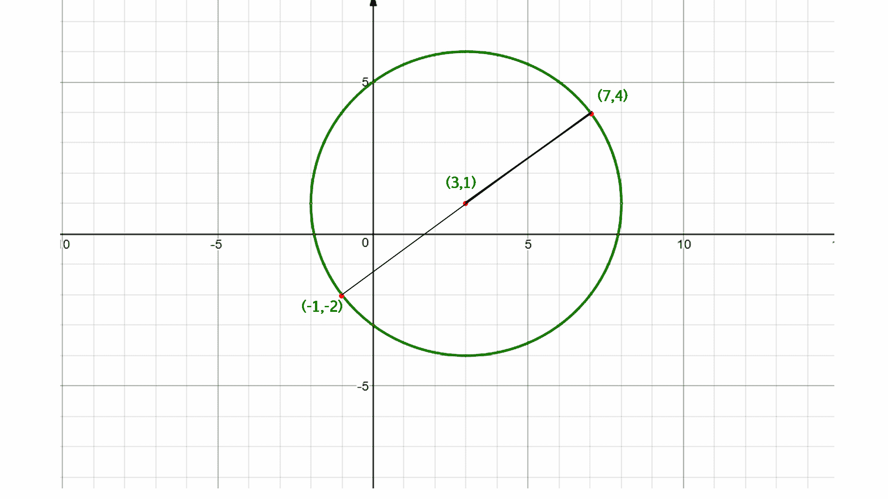

# 利用直径的端点

找到圆心

> 原文:[https://www . geesforgeks . org/find-center-circle-use-endpoints-diameter/](https://www.geeksforgeeks.org/find-center-circle-using-endpoints-diameter/)

给定圆(x1，y1)和(x2，y2)直径的两个端点，求圆的中心。
**例:**

```
Input  : x1 = -9, y1 = 3, and 
         x2 = 5, y2 = –7
Output : -2, –2

Input  :  x1 = 5, y1 = 3 and 
          x2 = –10 y2 = 4
Output : –2.5, 3.5
```

**中点公式:**
两点的中点，(x1，y2)和(x2，y2)是:**M =((x<sub>1</sub>+x<sub>2</sub>)/2、(y<sub>1</sub>+y<sub>2</sub>)/2)**
圆心是其直径的中点，所以我们用中点公式计算其直径的中点。



## C++

```
// C++ program to find the
// center of the circle
#include <iostream>
using namespace std;

// function to find the
// center of the circle
void center(int x1, int x2,
            int y1, int y2)
{

    cout << (float)(x1 + x2) / 2 << 
          ", " << (float)(y1 + y2) / 2;
}

// Driven Program
int main()
{
    int x1 = -9, y1 = 3, x2 = 5, y2 = -7;
    center(x1, x2, y1, y2);
    return 0;
}
```

## Java 语言(一种计算机语言，尤用于创建网站)

```
// Java program to find the
// center of the circle
class GFG {

    // function to find the
    // center of the circle
    static void center(int x1, int x2, 
                            int y1, int y2) 
    {

        System.out.print((float)(x1 + x2) / 2 
            + ", " + (float)(y1 + y2) / 2);
    }

    // Driver Program to test above function
    public static void main(String arg[]) {

        int x1 = -9, y1 = 3, x2 = 5, y2 = -7;
        center(x1, x2, y1, y2);
    }
}

// This code is contributed by Anant Agarwal.
```

## 蟒蛇 3

```
# Python3 program to find 
# the center of the circle

# Function to find the
# center of the circle
def center(x1, x2, y1, y2) :

    print(int((x1 + x2) / 2), end= "")
    print(",", int((y1 + y2) / 2) )

# Driver Code
x1 = -9; y1 = 3; x2 = 5; y2 = -7
center(x1, x2, y1, y2) 

# This code is contributed by Smitha Dinesh Semwal
```

## C#

```
// C# program to find the
// center of the circle
using System;

class GFG {

    // function to find the
    // center of the circle
    static void center(int x1, int x2, 
                            int y1, int y2) 
    {

        Console.WriteLine((float)(x1 + x2) / 2
                + ", " + (float)(y1 + y2) / 2);
    }

    // Driver Program to test above function
    public static void Main() {

        int x1 = -9, y1 = 3, x2 = 5, y2 = -7;
        center(x1, x2, y1, y2);
    }
}

// This code is contributed by vt_m.
```

## 服务器端编程语言（Professional Hypertext Preprocessor 的缩写）

```
<?php
// PHP program to find the
// center of the circle

// function to find the
// center of the circle
function center($x1, $x2, $y1, $y2)
{

    echo((float)($x1 + $x2) / 2 . ", " .
                (float)($y1 + $y2) / 2);
}

// Driven Code
$x1 = -9; $y1 = 3; $x2 = 5; $y2 = -7;
center($x1, $x2, $y1, $y2);

// This code is contributed by Ajit.
?>
```

## java 描述语言

```
<script>

// javascript program to find the
// center of the circle

// function to find the
    // center of the circle
    function center(x1, x2, 
                     y1, y2) 
    {

        document.write((x1 + x2) / 2 
            + ", " + (y1 + y2) / 2);
    }

// Driver Function

         let x1 = -9, y1 = 3, x2 = 5, y2 = -7;
        center(x1, x2, y1, y2);

    // This code is contributed by susmitakundugoaldanga.
</script>
```

**输出:**

```
-2, -2
```