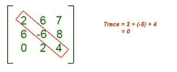

# 求方阵的特征多项式

> 原文:[https://www . geesforgeks . org/find-特征-方阵多项式/](https://www.geeksforgeeks.org/find-characteristic-polynomial-of-a-square-matrix/)

线性代数中，方阵的**特征多项式是在矩阵相似性下不变的多项式，以[特征值](https://www.geeksforgeeks.org/eigen-values-and-eigen-vectors/)为根。它的系数中有行列式和矩阵的迹。**

3×3 矩阵的特征多项式可以用公式计算

> ***x<sup>3</sup>–(矩阵的迹)*x <sup>2</sup> +(对角线上的未成年人之和)* x–矩阵的行列式= 0***

**示例:**

> **输入:** mat[][] = { { 0，1，2 }，{ 1，0，-1 }，{ 2，-1，0 } }
> T3】输出:x^3–6x+4

**逼近** ***:*** 让我们分解公式，一个一个地找出每个术语的值:

*******矩阵*******

****矩阵的迹沿对角线的元素之和。****

****

**矩阵的轨迹****** 

*******矩阵的次元素*******

****[***矩阵的行列式***](https://www.geeksforgeeks.org/determinant-of-a-matrix/)****

******求方阵特征多项式的程序******

## ****C++****

```
**// C++ code to calculate
// characterstic polynomial of 3x3 matrix
#include <bits/stdc++.h>
using namespace std;
#define N 3

// Trace
int findTrace(int mat[N][N], int n)
{
    int sum = 0;
    for (int i = 0; i < n; i++)
        sum += mat[i][i];
    return sum;
}

// Sum of minors along diagonal
int sum_of_minors(int mat[N][N], int n)
{
    return (
        (mat[2][2] * mat[1][1] - mat[2][1] * mat[1][2])
        + (mat[2][2] * mat[0][0] - mat[2][0] * mat[0][2])
        + (mat[1][1] * mat[0][0] - mat[1][0] * mat[0][1]));
}

// Function to get cofactor of mat[p][q]
// in temp[][]. n is current dimension of mat[][]
// Cofactor will be used for calculating determinant
void getCofactor(int mat[N][N], int temp[N][N], int p,
                 int q, int n)
{
    int i = 0, j = 0;

    // Looping for each element of the matrix
    for (int row = 0; row < n; row++) {
        for (int col = 0; col < n; col++) {

            // Copying into temporary matrix only those
            // element which are not in given row and
            // column
            if (row != p && col != q) {
                temp[i][j++] = mat[row][col];

                // Row is filled, so increase row index
                // and reset col index
                if (j == n - 1) {
                    j = 0;
                    i++;
                }
            }
        }
    }
}

// Function for calculating
// determinant of matrix
int determinantOfMatrix(int mat[N][N], int n)
{

    // Initialize result
    int D = 0;

    // Base case : if matrix
    // contains single element
    if (n == 1)
        return mat[0][0];

    // To store cofactors
    int temp[N][N];

    // To store sign multiplier
    int sign = 1;

    // Iterate for each element of first row
    for (int f = 0; f < n; f++) {

        // Getting Cofactor of mat[0][f]
        getCofactor(mat, temp, 0, f, n);
        D += sign * mat[0][f]
             * determinantOfMatrix(temp, n - 1);

        // Terms are to be added with alternate sign
        sign = -sign;
    }

    return D;
}

// Driver Code
int main()
{

    // Given matrix
    int mat[N][N]
        = { { 0, 1, 2 }, { 1, 0, -1 }, { 2, -1, 0 } };
    int trace = findTrace(mat, 3);
    int s_o_m = sum_of_minors(mat, 3);
    int det = determinantOfMatrix(mat, 3);

    cout << "x^3";
    if (trace != 0) {
        trace < 0 ? cout << " + " << trace * -1 << "x^2"
                  : cout << " - " << trace << "x^2";
    }
    if (s_o_m != 0) {
        s_o_m < 0 ? cout << " - " << s_o_m * -1 << "x"
                  : cout << " + " << s_o_m << "x";
    }
    if (det != 0) {
        det < 0 ? cout << " + " << det * -1
                : cout << " - " << det;
    }

    return 0;
}**
```

## ****java 描述语言****

```
**<script>
      // JavaScript code for the above approach
      let N = 3

      // Trace
      function findTrace(mat, n) {
          let sum = 0;
          for (let i = 0; i < n; i++)
              sum += mat[i][i];
          return sum;
      }

      // Sum of minors along diagonal
      function sum_of_minors(mat, n) {
          return (
              (mat[2][2] * mat[1][1] - mat[2][1] * mat[1][2])
              + (mat[2][2] * mat[0][0] - mat[2][0] * mat[0][2])
              + (mat[1][1] * mat[0][0] - mat[1][0] * mat[0][1]));
      }

      // Function to get cofactor of mat[p][q]
      // in temp[][]. n is current dimension of mat[][]
      // Cofactor will be used for calculating determinant
      function getCofactor(mat, temp, p,
          q, n) {
          let i = 0, j = 0;

          // Looping for each element of the matrix
          for (let row = 0; row < n; row++) {
              for (let col = 0; col < n; col++) {

                  // Copying into temporary matrix only those
                  // element which are not in given row and
                  // column
                  if (row != p && col != q) {
                      temp[i][j++] = mat[row][col];

                      // Row is filled, so increase row index
                      // and reset col index
                      if (j == n - 1) {
                          j = 0;
                          i++;
                      }
                  }
              }
          }
      }

      // Function for calculating
      // determinant of matrix
      function determinantOfMatrix(mat, n) {

          // Initialize result
          let D = 0;

          // Base case : if matrix
          // contains single element
          if (n == 1)
              return mat[0][0];

          // To store cofactors
          let temp = new Array(n)
          for (let i = 0; i < temp.length; i++) {
              temp[i] = new Array(n)
          }

          // To store sign multiplier
          let sign = 1;

          // Iterate for each element of first row
          for (let f = 0; f < n; f++) {

              // Getting Cofactor of mat[0][f]
              getCofactor(mat, temp, 0, f, n);
              D += sign * mat[0][f]
                  * determinantOfMatrix(temp, n - 1);

              // Terms are to be added with alternate sign
              sign = -sign;
          }

          return D;
      }

      // Driver Code

      // Given matrix
      let mat
          = [[0, 1, 2], [1, 0, -1], [2, -1, 0]];
      let trace = findTrace(mat, 3);
      let s_o_m = sum_of_minors(mat, 3);
      let det = determinantOfMatrix(mat, 3);

      document.write("x^3");
      if (trace != 0) {
          trace < 0 ? document.write(" + " + trace * -1 + "x^2")
              : document.write(" - " + trace + "x^2");
      }
      if (s_o_m != 0) {
          s_o_m < 0 ? document.write(" - " + s_o_m * -1 + "x")
              : document.write(" + " + s_o_m + "x");
      }
      if (det != 0) {
          det < 0 ? document.write(" + " + det * -1)
              : document.write(" - " + det);
      }

// This code is contributed by Potta Lokesh
  </script>**
```

******Output**

```
x^3 - 6x + 4
```**** 

*******时间复杂度:** O(N <sup>3</sup> ，其中 N 是正方形矩阵的大小*
*T8】辅助空间: O(N)*****