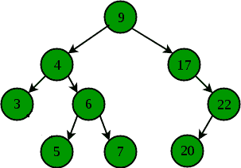

# 找到二叉查找树最接近的元素

> 原文:[https://www . geesforgeks . org/find-最近元素-二进制-搜索-树/](https://www.geeksforgeeks.org/find-closest-element-binary-search-tree/)

给定一个[二叉查找树](https://www.geeksforgeeks.org/binary-search-tree-set-1-search-and-insertion/)和一个目标节点 k，任务是找到与给定目标值 k 具有最小绝对差的节点



**示例:**

```
// For above binary search tree
Input  :  k = 4
Output :  4

Input  :  k = 18
Output :  17

Input  :  k = 12
Output :  9

```

这个问题的一个简单解决方案是将给定二叉查找树的有序遍历存储在一个辅助数组中，然后通过取每个元素的绝对差，在线性时间内找到与给定目标值 K 具有最小绝对差的节点。

这个问题的一个**有效解决方案**就是利用 BST 的特性。下面是解决这个问题的算法:

*   如果目标值 K 出现在给定的 [BST](https://www.geeksforgeeks.org/binary-search-tree-set-1-search-and-insertion/) 中，那么它是具有最小绝对差的节点。
*   如果目标值 K 小于当前节点的值，则移动到左边的子节点。
*   If target value K is greater than the value of current node then move to the right child.

    ## C++

    ```
    // Recursive C++ program to find key closest to k
    // in given Binary Search Tree.
    #include<bits/stdc++.h>
    using namespace std;

    /* A binary tree node has key, pointer to left child
    and a pointer to right child */
    struct Node
    {
        int key;
        struct Node* left, *right;
    };

    /* Utility that allocates a new node with the
      given key and NULL left and right pointers. */
    struct Node* newnode(int key)
    {
        struct Node* node = new (struct Node);
        node->key = key;
        node->left = node->right  = NULL;
        return (node);
    }

    // Function to find node with minimum absolute
    // difference with given K
    // min_diff   --> minimum difference till now
    // min_diff_key  --> node having minimum absolute
    //                   difference with K
    void maxDiffUtil(struct Node *ptr, int k, int &min_diff,
                                          int &min_diff_key)
    {
        if (ptr == NULL)
            return ;

        // If k itself is present
        if (ptr->key == k)
        {
            min_diff_key = k;
            return;
        }

        // update min_diff and min_diff_key by checking
        // current node value
        if (min_diff > abs(ptr->key - k))
        {
            min_diff = abs(ptr->key - k);
            min_diff_key = ptr->key;
        }

        // if k is less than ptr->key then move in
        // left subtree else in right subtree
        if (k < ptr->key)
            maxDiffUtil(ptr->left, k, min_diff, min_diff_key);
        else
            maxDiffUtil(ptr->right, k, min_diff, min_diff_key);
    }

    // Wrapper over maxDiffUtil()
    int maxDiff(Node *root, int k)
    {
        // Initialize minimum difference
        int min_diff = INT_MAX, min_diff_key = -1;

        // Find value of min_diff_key (Closest key
        // in tree with k)
        maxDiffUtil(root, k, min_diff, min_diff_key);

        return min_diff_key;
    }

    // Driver program to run the case
    int main()
    {
        struct Node *root = newnode(9);
        root->left    = newnode(4);
        root->right   = newnode(17);
        root->left->left = newnode(3);
        root->left->right = newnode(6);
        root->left->right->left = newnode(5);
        root->left->right->right = newnode(7);
        root->right->right = newnode(22);
        root->right->right->left = newnode(20);
        int k = 18;
        cout << maxDiff(root, k);
        return 0;
    }
    ```

    ## Java 语言(一种计算机语言，尤用于创建网站)

    ```
    // Recursive Java program to find key closest to k
    // in given Binary Search Tree.

     class solution
     {

         static int min_diff, min_diff_key;

    /*  A binary tree node has key, pointer to left child
    and a pointer to right child */
    static class Node
    {
        int key;

         Node  left,  right;
    };

    /*  Utility that allocates a new node with the
      given key and null left and right pointers.  */

     static Node  newnode(int key)
    {

         Node  node = new Node();
        node.key = key;
        node.left = node.right  = null;
        return (node);
    }

    // Function to find node with minimum absolute
    // difference with given K
    // min_diff   -. minimum difference till now
    // min_diff_key  -. node having minimum absolute
    //                   difference with K
    static void maxDiffUtil(Node  ptr, int k)
    {
        if (ptr == null)
            return ;

        // If k itself is present
        if (ptr.key == k)
        {
            min_diff_key = k;
            return;
        }

        // update min_diff and min_diff_key by checking
        // current node value
        if (min_diff > Math.abs(ptr.key - k))
        {
            min_diff = Math.abs(ptr.key - k);
            min_diff_key = ptr.key;
        }

        // if k is less than ptr.key then move in
        // left subtree else in right subtree
        if (k < ptr.key)
            maxDiffUtil(ptr.left, k);
        else
            maxDiffUtil(ptr.right, k);
    }

    // Wrapper over maxDiffUtil()
    static int maxDiff(Node  root, int k)
    {
        // Initialize minimum difference
        min_diff = 999999999; min_diff_key = -1;

        // Find value of min_diff_key (Closest key
        // in tree with k)
        maxDiffUtil(root, k);

        return min_diff_key;
    }

    // Driver program to run the case
    public static void main(String args[])
    {

         Node  root = newnode(9);
        root.left    = newnode(4);
        root.right   = newnode(17);
        root.left.left = newnode(3);
        root.left.right = newnode(6);
        root.left.right.left = newnode(5);
        root.left.right.right = newnode(7);
        root.right.right = newnode(22);
        root.right.right.left = newnode(20);
        int k = 18;
        System.out.println( maxDiff(root, k));

    }
    }
    //contributed by Arnab Kundu
    ```

    ## 蟒蛇 3

    ```
    # Recursive Python program to find key 
    # closest to k in given Binary Search Tree. 

    # Utility that allocates a new node with the 
    # given key and NULL left and right pointers. 
    class newnode: 

        # Constructor to create a new node 
        def __init__(self, data): 
            self.key = data 
            self.left = None
            self.right = None

    # Function to find node with minimum 
    # absolute difference with given K 
    # min_diff --> minimum difference till now 
    # min_diff_key --> node having minimum absolute 
    #                   difference with K 
    def maxDiffUtil(ptr, k, min_diff, min_diff_key):
        if ptr == None: 
            return

        # If k itself is present 
        if ptr.key == k:
            min_diff_key[0] = k 
            return

        # update min_diff and min_diff_key by  
        # checking current node value 
        if min_diff > abs(ptr.key - k):
            min_diff = abs(ptr.key - k) 
            min_diff_key[0] = ptr.key

        # if k is less than ptr->key then move 
        # in left subtree else in right subtree 
        if k < ptr.key:
            maxDiffUtil(ptr.left, k, min_diff, 
                                     min_diff_key)
        else:
            maxDiffUtil(ptr.right, k, min_diff, 
                                      min_diff_key)

    # Wrapper over maxDiffUtil() 
    def maxDiff(root, k):

        # Initialize minimum difference 
        min_diff, min_diff_key = 999999999999, [-1]

        # Find value of min_diff_key (Closest 
        # key in tree with k) 
        maxDiffUtil(root, k, min_diff, min_diff_key)

        return min_diff_key[0]

    # Driver Code
    if __name__ == '__main__':
        root = newnode(9) 
        root.left = newnode(4) 
        root.right = newnode(17)
        root.left.left = newnode(3) 
        root.left.right = newnode(6)
        root.left.right.left = newnode(5) 
        root.left.right.right = newnode(7) 
        root.right.right = newnode(22)
        root.right.right.left = newnode(20) 
        k = 18
        print(maxDiff(root, k))

    # This code is contributed by PranchalK
    ```

    ## C#

    ```
    using System;

    // Recursive C# program to find key closest to k 
    // in given Binary Search Tree. 

     public class solution
     {

         public static int min_diff, min_diff_key;

    /*  A binary tree node has key, pointer to left child 
    and a pointer to right child */
    public class Node
    {
        public int key;

         public Node left, right;
    }

    /*  Utility that allocates a new node with the 
      given key and null left and right pointers.  */

    public static Node newnode(int key)
     {

         Node node = new Node();
        node.key = key;
        node.left = node.right = null;
        return (node);
     }

    // Function to find node with minimum absolute 
    // difference with given K 
    // min_diff   -. minimum difference till now 
    // min_diff_key  -. node having minimum absolute 
    //                   difference with K 
    public static void maxDiffUtil(Node ptr, int k)
    {
        if (ptr == null)
        {
            return;
        }

        // If k itself is present 
        if (ptr.key == k)
        {
            min_diff_key = k;
            return;
        }

        // update min_diff and min_diff_key by checking 
        // current node value 
        if (min_diff > Math.Abs(ptr.key - k))
        {
            min_diff = Math.Abs(ptr.key - k);
            min_diff_key = ptr.key;
        }

        // if k is less than ptr.key then move in 
        // left subtree else in right subtree 
        if (k < ptr.key)
        {
            maxDiffUtil(ptr.left, k);
        }
        else
        {
            maxDiffUtil(ptr.right, k);
        }
    }

    // Wrapper over maxDiffUtil() 
    public static int maxDiff(Node root, int k)
    {
        // Initialize minimum difference 
        min_diff = 999999999;
        min_diff_key = -1;

        // Find value of min_diff_key (Closest key 
        // in tree with k) 
        maxDiffUtil(root, k);

        return min_diff_key;
    }

    // Driver program to run the case 
    public static void Main(string[] args)
    {

         Node root = newnode(9);
        root.left = newnode(4);
        root.right = newnode(17);
        root.left.left = newnode(3);
        root.left.right = newnode(6);
        root.left.right.left = newnode(5);
        root.left.right.right = newnode(7);
        root.right.right = newnode(22);
        root.right.right.left = newnode(20);
        int k = 18;
        Console.WriteLine(maxDiff(root, k));

    }
     }

      // This code is contributed by Shrikant13
    ```

    **Output:**

    ```
    17

    ```

    **时间复杂度:** O(h)，其中 h 是给定二叉查找树的高度。

    **参考:**
    [http://stackoverflow . com/questions/6209325/如何在二进制搜索树中找到与给定键值最接近的元素](http://stackoverflow.com/questions/6209325/how-to-find-the-closest-element-to-a-given-key-value-in-a-binary-search-tree)

    本文由 **[Shashank Mishra(古卢)](https://www.facebook.com/shashank.mishra.92167)** 供稿。如果你喜欢 GeeksforGeeks 并想投稿，你也可以使用[write.geeksforgeeks.org](https://write.geeksforgeeks.org)写一篇文章或者把你的文章邮寄到 review-team@geeksforgeeks.org。看到你的文章出现在极客博客主页上，帮助其他极客。

    如果你发现任何不正确的地方，或者你想分享更多关于上面讨论的话题的信息，请写评论。