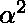
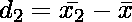
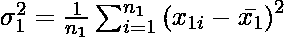
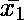
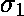
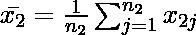

# 求两个序列的组合均值和方差

> 原文:[https://www . geesforgeks . org/find-组合均值-方差-两序列/](https://www.geeksforgeeks.org/find-combined-mean-variance-two-series/)

给定两个不同系列的尺寸 **n** 和 **m** 的 **arr1[n]** 和 **arr2[m]** 。任务是找出组合序列的均值和方差。
**举例:**

```
Input : arr1[] = {3, 5, 1, 7, 8, 5}
        arr2[] = {5, 9, 7, 1, 5, 4, 7, 3}
Output : Mean1: 4.83333   mean2: 5.125
         StandardDeviation1: 5.47222   
         StandardDeviation2: 5.60938
         Combined Mean: 5
         d1_square: 0.0277777  
         d2_square: 0.015625
         Combined Variance: 5.57143

Input : arr1[] = {23, 45, 34, 78, 12, 76, 34}
        arr2[] = {65, 67, 34, 23, 45}
Output : Mean1: 43.1429   mean2: 46.8
         StandardDeviation1: 548.694   
         StandardDeviation2: 294.56
         Combined Mean: 44.6667
         d1_square: 2.32199  
         d2_square: 4.55112
         Combined Variance: 446.056
```

**逼近:**
组合数列的方差由
![\alpha ^{2} = \frac{1}{n_{1} + n_{2}}\left [ n_{1} \left ( \alpha _{1}^{2} + d_{1}^{2} \right ) + n_{2} \left ( \alpha _{2}^{2} + d_{2}^{2} \right ) \right ]  ](img/389388f74822356ca80e69eacd042a69.png "Rendered by QuickLaTeX.com")
给出，其中
为组合数列的均值。


、为平均值，、为两个系列的标准差。


下面是上面公式的实现:

## C++

```
// C++ program to find combined mean
// and variance of two series.
#include <bits/stdc++.h>
using namespace std;

// Function to find mean of series.
float mean(int arr[], int n)
{
    int sum = 0;
    for (int i = 0; i < n; i++)
        sum = sum + arr[i];

    float mean = (float)sum / n;
    return mean;
}

// Function to find the standard
// deviation of series.
float sd(int arr[], int n)
{
    float sum = 0;
    for (int i = 0; i < n; i++)
        sum = sum + (arr[i] - mean(arr, n)) *
              (arr[i] - mean(arr, n));

    float sdd = sum / n;
    return sdd;
}

// Function to find combined variance
// of two different series.
float combinedVariance(int arr1[], int arr2[],
                                int n, int m)
{
    // mean1 and mean2 are the mean
    // of two arrays.
    float mean1 = mean(arr1, n);
    float mean2 = mean(arr2, m);

    cout << "Mean1: " << mean1
         << " mean2: " << mean2 << endl;

    // sd1 and sd2 are the standard
    // deviation of two array.
    float sd1 = sd(arr1, n);
    float sd2 = sd(arr2, m);

    cout << "StandardDeviation1: " << sd1
         << " StandardDeviation2: " << sd2
         << endl;

    // combinedMean is variable to store
    // the combined mean of both array.
    float combinedMean = (float)(n * mean1 +
                         m * mean2) / (n + m);

    cout << "Combined Mean: " << combinedMean
         << endl;

    // d1_square and d2_square are
    // the combined mean deviation.
    float d1_square = (mean1 - combinedMean) *
                      (mean1 - combinedMean);
    float d2_square = (mean2 - combinedMean) *
                      (mean2 - combinedMean);

    cout << "d1 square: " << d1_square
         << " d2_square: " << d2_square
         << endl;

    // combinedVar is variable to store
    // combined variance of both array.
    float combinedVar = (n * (sd1 + d1_square) + m *
                       (sd2 + d2_square)) / (n + m);
    return combinedVar;
}

// Driver function.
int main()
{
    int arr1[] = { 23, 45, 34, 78, 12, 76, 34 };
    int arr2[] = { 65, 67, 34, 23, 45 };
    int n = sizeof(arr1) / sizeof(arr1[0]);
    int m = sizeof(arr2) / sizeof(arr2[0]);

    // Function call to combined mean.
    cout << "Combined Variance: "
         << combinedVariance(arr1, arr2, n, m);
    return 0;
}
```

## Java 语言(一种计算机语言，尤用于创建网站)

```
// Java program to find combined mean
// and variance of two series.

import java.io.*;

class GFG {

    // Function to find mean of series.
    static float mean(int arr[], int n)
    {
        int sum = 0;

        for (int i = 0; i < n; i++)
            sum = sum + arr[i];

        float mean = (float)sum / n;

        return mean;
    }

    // Function to find the standard
    // deviation of series.
    static float sd(int arr[], int n)
    {
        float sum = 0;
        for (int i = 0; i < n; i++)
            sum = sum + (arr[i] - mean(arr, n)) *
                            (arr[i] - mean(arr, n));

        float sdd = sum / n;

        return sdd;
    }

    // Function to find combined variance
    // of two different series.
    static float combinedVariance(int arr1[],
                        int arr2[], int n, int m)
    {
        // mean1 and mean2 are the mean
        // of two arrays.
        float mean1 = mean(arr1, n);
        float mean2 = mean(arr2, m);

        System.out.print("Mean1: " + mean1 + " ") ;
        System.out.println("Mean2: " + mean2) ;

        // sd1 and sd2 are the standard
        // deviation of two array.
        float sd1 = sd(arr1, n);
        float sd2 = sd(arr2, m);

        System.out.print("StandardDeviation1: "
                                   + sd1 + " ") ;

        System.out.println("StandardDeviation2: "
                                    + sd2 + " ");

        // combinedMean is variable to store
        // the combined mean of both array.
        float combinedMean = (float)(n * mean1 +
                                m * mean2) / (n + m);

        System.out.println( "Combined Mean: "
                            + combinedMean + " ");

        // d1_square and d2_square are
        // the combined mean deviation.
        float d1_square = (mean1 - combinedMean) *
                            (mean1 - combinedMean);

        float d2_square = (mean2 - combinedMean) *
                            (mean2 - combinedMean);

        System.out.print("d1 square: " + d1_square + " " );
        System.out.println("d2_square: " + d2_square);

        // combinedVar is variable to store
        // combined variance of both array.
        float combinedVar = (n * (sd1 + d1_square)
                    + m * (sd2 + d2_square)) / (n + m);

        return combinedVar;
    }

       // Driver function.
        public static void main (String[] args) {

        int arr1[] = { 23, 45, 34, 78, 12, 76, 34 };
        int arr2[] = { 65, 67, 34, 23, 45 };
        int n = arr1.length;
        int m = arr2.length;

        // Function call to combined mean.
            System.out.println("Combined Variance: "
                + combinedVariance(arr1, arr2, n, m));
        }
}

// This code is contributed by vt_m.
```

## 蟒蛇 3

```
# Python3 program to find
# combined mean and variance
# of two series.

# Function to find
# mean of series.
def mean(arr, n):
    sum = 0;
    for i in range(n):
        sum = sum + arr[i];
    mean = sum / n;
    return mean;

# Function to find the
# standard deviation
# of series.
def sd(arr, n):
    sum = 0;
    for i in range(n):
        sum = sum + ((arr[i] - mean(arr, n)) *
                     (arr[i] - mean(arr, n)));
    sdd = sum / n;
    return sdd;

# Function to find combined
# variance of two different
# series.
def combinedVariance(arr1, arr2, n, m):

    # mean1 and mean2 are
    # the mean of two arrays.
    mean1 = mean(arr1, n);
    mean2 = mean(arr2, m);

    print("Mean1: ", round(mean1, 2),
          " mean2: ", round(mean2, 2));

    # sd1 and sd2 are the standard
    # deviation of two array.
    sd1 = sd(arr1, n);
    sd2 = sd(arr2, m);

    print("StandardDeviation1: ", round(sd1, 2),
          " StandardDeviation2: ", round(sd2, 2));

    # combinedMean is variable
    # to store the combined
    # mean of both array.
    combinedMean = (n * mean1 +
                    m * mean2) / (n + m);
    print("Combined Mean: ",
           round(combinedMean, 2));

    # d1_square and d2_square are
    # the combined mean deviation.
    d1_square = ((mean1 - combinedMean) *
                 (mean1 - combinedMean));
    d2_square = ((mean2 - combinedMean) *
                 (mean2 - combinedMean));
    print("d1 square: ", round(d1_square, 2),
          " d2_square: ", round(d2_square, 2));

    # combinedVar is variable to
    # store combined variance of
    # both array.
    combinedVar = (n * (sd1 + d1_square) +
                   m * (sd2 + d2_square)) / (n + m);
    print("Combined Variance: ",
         round(combinedVar, 2));

# Driver Code
arr1 = [ 23, 45, 34, 78, 12, 76, 34 ];
arr2 = [ 65, 67, 34, 23, 45 ];
n = len(arr1);
m = len(arr2);

# Function call to combined mean.
combinedVariance(arr1, arr2, n ,m);

# This code is contributed by mits
```

## C#

```
// C# program to find combined mean
// and variance of two series.
using System;

class GFG {

    // Function to find mean of series.
    static float mean(int []arr, int n)
    {
        int sum = 0;

        for (int i = 0; i < n; i++)
            sum = sum + arr[i];

        float mean = (float)sum / n;

        return mean;
    }

    // Function to find the standard
    // deviation of series.
    static float sd(int []arr, int n)
    {
        float sum = 0;
        for (int i = 0; i < n; i++)
            sum = sum + (arr[i] - mean(arr, n)) *
                        (arr[i] - mean(arr, n));

        float sdd = sum / n;
        return sdd;
    }

    // Function to find combined variance
    // of two different series.
    static float combinedVariance(int []arr1,
                                     int []arr2,
                                     int n, int m)
    {

        // mean1 and mean2 are the
        // mean of two arrays.
        float mean1 = mean(arr1, n);
        float mean2 = mean(arr2, m);

        Console.Write("Mean1: " + mean1 + " ") ;
        Console.WriteLine("Mean2: " + mean2) ;

        // sd1 and sd2 are the standard
        // deviation of two array.
        float sd1 = sd(arr1, n);
        float sd2 = sd(arr2, m);

        Console.Write("StandardDeviation1: "
                                + sd1 + " ") ;

        Console.WriteLine("StandardDeviation2: "
                                + sd2 + " ");

        // combinedMean is variable to store
        // the combined mean of both array.
        float combinedMean = (float)(n * mean1 +
                              m * mean2) / (n + m);

        Console.WriteLine("Combined Mean: "
                           + combinedMean + " ");

        // d1_square and d2_square are
        // the combined mean deviation.
        float d1_square = (mean1 - combinedMean) *
                             (mean1 - combinedMean);

        float d2_square = (mean2 - combinedMean) *
                          (mean2 - combinedMean);

        Console.Write("d1 square: " +
                       d1_square + " " );
        Console.WriteLine("d2_square: " +
                           d2_square);

        // combinedVar is variable to store
        // combined variance of both array.
        float combinedVar = (n * (sd1 + d1_square)    +
                             m * (sd2 + d2_square)) /
                            (n + m);

        return combinedVar;
    }

// Driver code
public static void Main ()
{
        int []arr1 = {23, 45, 34, 78, 12, 76, 34};
        int []arr2 = {65, 67, 34, 23, 45};
        int n = arr1.Length;
        int m = arr2.Length;

        // Function call to combined mean.
        Console.WriteLine("Combined Variance: " +
                           combinedVariance(arr1, arr2,
                           n, m));
        }
}

// This code is contributed by vt_m.
```

## 服务器端编程语言（Professional Hypertext Preprocessor 的缩写）

```
<?php
// PHP program to find combined mean
// and variance of two series.

// Function to find mean of series.
function mean($arr, $n)
{
    $sum = 0;
    for ($i = 0; $i < $n; $i++)
        $sum = $sum + $arr[$i];

    $mean = (float)($sum / $n);
    return $mean;
}

// Function to find the standard
// deviation of series.
function sd($arr, $n)
{
    $sum = 0;
    for ($i = 0; $i < $n; $i++)
        $sum = $sum + ($arr[$i] - mean($arr, $n)) *
                      ($arr[$i] - mean($arr, $n));

    $sdd = $sum / $n;
    return $sdd;
}

// Function to find combined variance
// of two different series.
function combinedVariance($arr1, $arr2,
                                 $n, $m)
{
    // mean1 and mean2 are the mean
    // of two arrays.
    $mean1 = mean($arr1, $n);
    $mean2 = mean($arr2, $m);

    echo("Mean1: " . round($mean1, 2) . " " .
         " mean2: " . round($mean2, 2));

    // sd1 and sd2 are the standard
    // deviation of two array.
    $sd1 = sd($arr1, $n);
    $sd2 = sd($arr2, $m);

    echo("\nStandardDeviation1: " . round($sd1, 2) . " "
        . " StandardDeviation2: " . round($sd2, 2));

    // combinedMean is variable to store
    // the combined mean of both array.
    $combinedMean = (float)($n * $mean1 + $m *
                            $mean2) / ($n + $m);

    echo("\nCombined Mean: " .
          round($combinedMean, 2));

    // d1_square and d2_square are
    // the combined mean deviation.
    $d1_square = ($mean1 - $combinedMean) *
                 ($mean1 - $combinedMean);
    $d2_square = ($mean2 - $combinedMean) *
                 ($mean2 - $combinedMean);

    echo("\nd1 square: " . round($d1_square, 2) . " "
        . " d2_square: " . round($d2_square, 2));

    // combinedVar is variable to store
    // combined variance of both array.
    $combinedVar = ($n * ($sd1 + $d1_square) +
                    $m * ($sd2 + $d2_square)) /
                                     ($n + $m);
    return $combinedVar;
}

// Driver Code
$arr1 = array( 23, 45, 34,
               78, 12, 76, 34 );
$arr2 = array( 65, 67, 34, 23, 45 );
$n = sizeof($arr1);
$m = sizeof($arr2);

// Function call to combined mean.
echo("\nCombined Variance: "
        . round(combinedVariance($arr1, $arr2,
                                 $n, $m), 2));

// This code is contributed by Ajit.
?>
```

## java 描述语言

```
<script>

// JavaScript program to find combined mean
// and variance of two series.

    // Function to find mean of series.
    function mean(arr,  n)
    {
        var sum = 0;

        for (var i = 0; i < n; i++)
            sum = sum + arr[i];

         var mean = sum / n;

        return mean;
    }

    // Function to find the standard
    // deviation of series.

    function sd(arr, n)
    {
        var sum = 0;
        for (var i = 0; i < n; i++)
            sum = sum + (arr[i] - mean(arr, n)) *
            (arr[i] - mean(arr, n));

        var sdd = sum / n;
        return sdd;
    }

    // Function to find combined variance
    // of two different series.
    function combinedVariance(arr1,arr2,n,m)
    {

        // mean1 and mean2 are the
        // mean of two arrays.

        var mean1 = mean(arr1, n);
        var mean2 = mean(arr2, m);

        document.write("Mean1: " + mean1.toFixed(4) + " ") ;
        document.write("Mean2: " + mean2 + "<br>") ;

        // sd1 and sd2 are the standard
        // deviation of two array.
        var sd1 = sd(arr1, n);
        var sd2 = sd(arr2, m);

        document.write("StandardDeviation1: " +
        sd1.toFixed(3) + " ") ;

        document.write("StandardDeviation2: " +
        sd2 + " " + "<br>");

        // combinedMean is variable to store
        // the combined mean of both array.

        var combinedMean = (n * mean1 + m * mean2) / (n + m);

        document.write("Combined Mean: " +
        combinedMean.toFixed(4) + " " + "<br>");

        // d1_square and d2_square are
        // the combined mean deviation.
        var d1_square = (mean1 - combinedMean) *
        (mean1 - combinedMean);

        var d2_square = (mean2 - combinedMean) * 
        (mean2 - combinedMean);

        document.write("d1 square: " + 
        d1_square.toFixed(3) + " " );

        document.write("d2_square: " + 
        d2_square.toFixed(4) + "<br>");

        // combinedVar is variable to store
        // combined variance of both array.

        var combinedVar = (n * (sd1 + d1_square)  + 
        m * (sd2 + d2_square)) / (n + m);

        return combinedVar;
    }

// Driver code

        var arr1 = [23, 45, 34, 78, 12, 76, 34 ]
        var arr2 = [65, 67, 34, 23, 45 ]
        var n = arr1.length;
        var m = arr2.length;

        // Function call to combined mean.
   document.write("Combined Variance: " + 
   combinedVariance(arr1, arr2,n, m).toFixed(3));

</script>

```

**输出:**

```
Mean1: 43.1429 mean2: 46.8
StandardDeviation1: 548.694 StandardDeviation2: 294.56
Combined Mean: 44.6667
d1 square: 2.322 d2_square: 4.5511
Combined Variance: 446.056
```