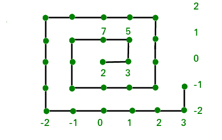
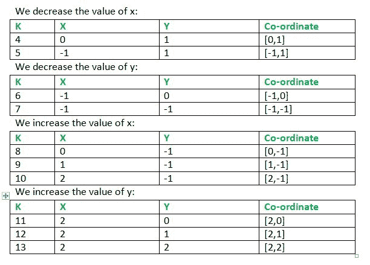
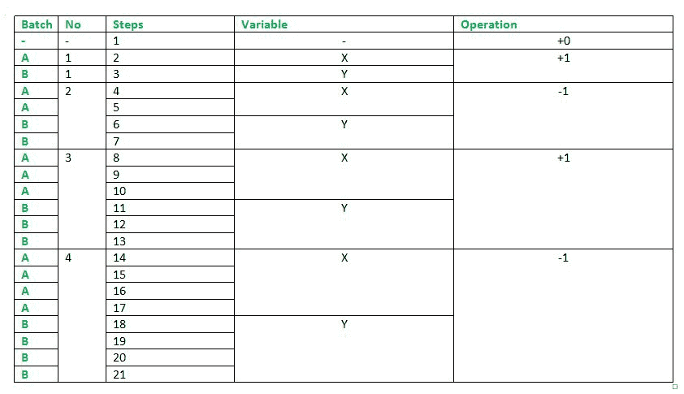
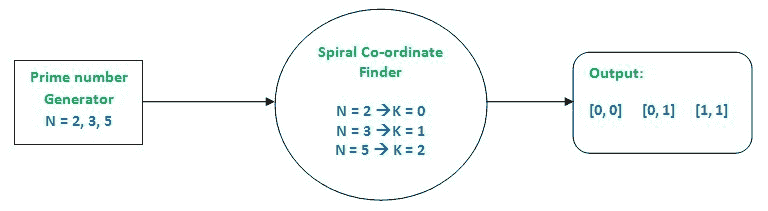

# 求质数螺旋中质数的坐标

> 原文:[https://www . geesforgeks . org/find-坐标-质数-质数-螺旋/](https://www.geeksforgeeks.org/find-coordinates-prime-number-prime-spiral/)

**引言**
乌兰螺旋是数学家斯坦尼斯瓦夫·乌兰设计的素数集合的图形描述。它是通过将正整数写成一个方形螺旋，并特别标记素数来构造的。[你可以在这里了解更多。](https://en.wikipedia.org/wiki/Ulam_spiral)
但是我们将计算这个螺旋的另一个版本，在这个版本中，质数排列在螺旋中，而不是像最初的乌兰螺旋那样的自然数。



质数从原点(0，0)开始以螺旋形式书写，并如上图所示移动。右列和底行显示的数字分别是列号和行号(即 y 和 x 坐标)
目标是找到给定素数的位置(x 和 y 坐标)。
**例:**

```
Input : 5
Output : 1 1 
As per the diagram above 5 corresponds to 
the column 1 and row 1.

Input : 11
Output : -1 1 
Similarly, 11 will correspond to column -1
and row 1\. 
```

**方法:**该问题的一般解决方案是创建一个算法来预测移动螺旋点在每一步的位置，并将螺旋中的每一步引用为一个素数(例如，步骤 0–>2；步骤 1–>3；步骤 2–>5 以此类推)。使用这个质数，我们可以追溯到坐标，这就是我们的解决方案(2–>[0，0]，3–>[1，0]，5–>[1，1])。
我们从保持 x 和 y 的计数开始，对于步骤 k = 1 : x = y = 0。k = 2 导致 x 增加 1 (x = 1 ),接下来是 k = 3，前提是 y = 1。现在，随着螺旋的旋转，我们要把数值减少 2。连续运动如下所示:



从上面的计算中，我们观察到一批步骤的操作是相同的，例如，首先 K = 2 & 3，然后 x 增加 1，然后 y 增加 1。接下来，在 K= 4，5，6，7 中，对于 4 和 5，x 减小，y 减小。再次从 K = 8、9 和 10 开始，x 在重复的步骤中增加，11、12、13 由减少的 y 组成。
每个步骤可以被分类为一个批次，并且批次的大小在两次运行后增加 1。运行后，操作从 y 切换到 x，反之亦然，每两批运行后，加法操作切换到减法，反之亦然。下表对此进行了解释。



最后，我们还需要创建一个质数生成器，它将继续为上述算法提供一个质数，该质数将被引用到相应的步骤中，并且它将为我们提供所需的坐标。



以下是上述思路的实现:
**输入限制:** 2 < N < 1000000
**假设:**质数是程序的唯一输入。

## C++

```
// C++ Program to find coordinates of a
// prime number in a Prime Spiral
#include <bits/stdc++.h>

using namespace std;

// The main algorithm that keeps track of
// coordinates
void spiralSplicer(int input)
{
    // Batch size tracker
    int step_count = 1;

    // Batch size limiter
    int step_limit = 2;

    // switches between -1 and +1
    int adder = 1;

    // Co-ordinates of step K
    int x = 0, y = 0;

    for (int n = 2; n != input + 1; n++,
                       step_count++) {

        // Keeps track of steps
        // Checks on the current batch
        if (step_count <= .5 * step_limit)
            x += adder; // Switch to operating on x

        else if (step_count <= step_limit)
            y += adder; // Switch to operating on x

        if (step_count == step_limit) {

            // Changes adder to -1 and vice versa
            adder *= -1;

           // Keeps on updating 'step_limit'
           step_limit += 2;

           // Resets count
           step_count = 0;
        }
    }
    cout << x << " " << y;
}

int primeIndex(int input)
{
    int j, cnt, prime_c = 0;
    for (int i = 2; i <= 1000000; i++) {
        cnt = 0;
        for (j = 2; j <= i; j++) {
            if (i % j == 0)
                cnt++;
        }

        if (cnt == 1) {
            prime_c++;

            if (input == i) {

           /* Replaces the prime number with
              Step K which will be fed into
              the main algorithm*/
                input = prime_c;
                break;
            }
        }
    }
    return input;
}

// driver code
int main()
{
    int input = 113;

    // Prime Index Finder Output ported
    // to final algorithm
    spiralSplicer(primeIndex(input));
}
```

## Java 语言(一种计算机语言，尤用于创建网站)

```
// java Program to find coordinates of a
// prime number in a Prime Spiral
public class GFG {

    // The main algorithm that keeps track of
    // coordinates
    static void spiralSplicer(int input)
    {

        // Batch size tracker
        int step_count = 1;

        // Batch size limiter
        int step_limit = 2;

        // switches between -1 and +1
        int adder = 1;

        // Co-ordinates of step K
        int x = 0, y = 0;

        for (int n = 2; n != input + 1;
                    n++, step_count++)
        {

            // Keeps track of steps
            // Checks on the current batch
            if (step_count <= .5 * step_limit)

                // Switch to operating on x
                x += adder;

            else if (step_count <= step_limit)

                // Switch to operating on x
                y += adder;

            if (step_count == step_limit)
            {

                // Changes adder to -1 and
                // vice versa
                adder *= -1;

                // Keeps on updating 'step_limit'
                step_limit += 2;

                // Resets count
                step_count = 0;
            }
        }

        System.out.print( x + " " + y);
    }

    static int primeIndex(int input)
    {
        int j, cnt, prime_c = 0;
        for (int i = 2; i <= 1000000; i++)
        {
            cnt = 0;
            for (j = 2; j <= i; j++)
            {
                if (i % j == 0)
                    cnt++;
            }

            if (cnt == 1)
            {
                prime_c++;

                if (input == i)
                {

                    /* Replaces the prime
                    number with Step K which
                    will be fed into
                    the main algorithm*/
                    input = prime_c;
                    break;
                }
            }
        }

        return input;
    }    

    // Driver code
    public static void main(String args[]) {

        int input = 113;

        // Prime Index Finder Output ported
        // to final algorithm
        spiralSplicer(primeIndex(input));

    }
}

// This code is contributed by Sam007.
```

## 计算机编程语言

```
# Python Program to find coordinates of a
# prime number in a Prime Spiral

# The main algorithm that keeps track of
# coordinates
def spiralSplicer(inp):

    # Batch size tracker
    step_count = 1

    # Batch size limiter
    step_limit = 2

    # switches between -1 and +1
    adder = 1

    # Co-ordinates of step K
    x, y = 0, 0

    for n in range(2, inp + 1):

        # Keeps track of steps
        # Checks on the current batch
        if (step_count <= .5 * step_limit):
            x += adder # Switch to operating on x

        elif (step_count <= step_limit):
            y += adder # Switch to operating on x

        if (step_count == step_limit):
            # Changes adder to -1 and vice versa
            adder *= -1

            # Keeps on updating 'step_limit'
            step_limit += 2

            # Resets count
            step_count = 0
        step_count += 1
    print x, y

def primeIndex(inp):
    cnt, prime_c = 0, 0
    for i in range(2, 1000000 + 1):
        cnt = 0
        for j in range(2, i + 1):
            if (i % j == 0):
                cnt += 1

        if (cnt == 1):
            prime_c += 1

            if (inp == i):

                """ Replaces the prime number with
                    Step K which will be fed into
                    the main algorithm """
                inp = prime_c
                break
    return inp

# driver code
inp = 113

# Prime Index Finder Output ported
# to final algorithm
temp = primeIndex(inp)

spiralSplicer(temp)

#This code is contributed by Sachin Bisht
```

## C#

```
// C# Program to find coordinates of a
// prime number in a Prime Spiral
using System;

class GFG {

    // The main algorithm that keeps track of
    // coordinates
    static void spiralSplicer(int input)
    {

        // Batch size tracker
        int step_count = 1;

        // Batch size limiter
        int step_limit = 2;

        // switches between -1 and +1
        int adder = 1;

        // Co-ordinates of step K
        int x = 0, y = 0;

        for (int n = 2; n != input + 1;
                     n++, step_count++)
        {

            // Keeps track of steps
            // Checks on the current batch
            if (step_count <= .5 * step_limit)

                // Switch to operating on x
                x += adder;

            else if (step_count <= step_limit)

                // Switch to operating on x
                y += adder;

            if (step_count == step_limit)
            {

                // Changes adder to -1 and
                // vice versa
                adder *= -1;

                // Keeps on updating 'step_limit'
                step_limit += 2;

                // Resets count
                step_count = 0;
            }
        }

        Console.Write( x + " " + y);
    }

    static int primeIndex(int input)
    {
        int j, cnt, prime_c = 0;
        for (int i = 2; i <= 1000000; i++)
        {
            cnt = 0;
            for (j = 2; j <= i; j++)
            {
                if (i % j == 0)
                    cnt++;
            }

            if (cnt == 1)
            {
                prime_c++;

                if (input == i)
                {

                    /* Replaces the prime
                    number with Step K which
                    will be fed into
                    the main algorithm*/
                    input = prime_c;
                    break;
                }
            }
        }

        return input;
    }    

    // Driver code
    public static void Main ()
    {
        int input = 113;

        // Prime Index Finder Output ported
        // to final algorithm
        spiralSplicer(primeIndex(input));
    }       
}

// This code is contributed by Sam007.
```

## 服务器端编程语言（Professional Hypertext Preprocessor 的缩写）

```
<?php
// PHP Program to find coordinates of a
// prime number in a Prime Spiral

// The main algorithm that
// keeps track of
// coordinates
function spiralSplicer($input)
{

    // Batch size tracker
    $step_count = 1;

    // Batch size limiter
    $step_limit = 2;

    // switches between -1 and +1
    $adder = 1;

    // Co-ordinates of step K
    $x = 0; $y = 0;

    for ($n = 2; $n != $input + 1; $n++,
                           $step_count++)
    {

        // Keeps track of steps
        // Checks on the current batch
        if ($step_count <= .5 * $step_limit)

            // Switch to operating on x
            $x += $adder;

        else if ($step_count <= $step_limit)

            // Switch to operating on x
            $y += $adder;

        if ($step_count == $step_limit)
        {

            // Changes adder to -1
            // and vice versa
            $adder *= -1;

        // Keeps on updating
        // 'step_limit'
        $step_limit += 2;

        // Resets count
        $step_count = 0;
        }
    }
    echo $x, " ", $y;
}

function primeIndex($input)
{
    $j;
    $cnt;
    $prime_c = 0;
    for ($i = 2; $i <= 1000000; $i++)
    {
        $cnt = 0;
        for ($j = 2; $j <= $i; $j++)
        {
            if ($i % $j == 0)
                $cnt++;
        }

        if ($cnt == 1)
        {
            $prime_c++;

            if ($input == $i)
            {

                // Replaces the prime
                // number with Step K
                // which will be fed into
                // the main algorithm
                    $input = $prime_c;
                    break;
            }
        }
    }
    return $input;
}

    // Driver Code
    $input = 113;

    // Prime Index Finder Output ported
    // to final algorithm
    spiralSplicer(primeIndex($input));

// This Code is contributed by ajit
?>
```

## java 描述语言

```
<script>
    // Javascript Program to find coordinates of a
    // prime number in a Prime Spiral

    // The main algorithm that keeps track of
    // coordinates
    function spiralSplicer(input)
    {

        // Batch size tracker
        let step_count = 1;

        // Batch size limiter
        let step_limit = 2;

        // switches between -1 and +1
        let adder = 1;

        // Co-ordinates of step K
        let x = 0, y = 0;

        for (let n = 2; n != input + 1; n++, step_count++)
        {

            // Keeps track of steps
            // Checks on the current batch
            if (step_count <= .5 * step_limit)

                // Switch to operating on x
                x += adder;

            else if (step_count <= step_limit)

                // Switch to operating on x
                y += adder;

            if (step_count == step_limit)
            {

                // Changes adder to -1 and
                // vice versa
                adder *= -1;

                // Keeps on updating 'step_limit'
                step_limit += 2;

                // Resets count
                step_count = 0;
            }
        }

        document.write( x + " " + y);
    }

    function primeIndex(input)
    {
        let j, cnt, prime_c = 0;
        for (let i = 2; i <= 1000000; i++)
        {
            cnt = 0;
            for (j = 2; j <= i; j++)
            {
                if (i % j == 0)
                    cnt++;
            }

            if (cnt == 1)
            {
                prime_c++;

                if (input == i)
                {

                    /* Replaces the prime
                    number with Step K which
                    will be fed into
                    the main algorithm*/
                    input = prime_c;
                    break;
                }
            }
        }

        return input;
    }

    let input = 113;

    // Prime Index Finder Output ported
    // to final algorithm
    spiralSplicer(primeIndex(input));

</script>
```

输出:

```
3 2
```

本文由**Pritom gogogoi**投稿。如果你喜欢 GeeksforGeeks 并想投稿，你也可以使用[write.geeksforgeeks.org](https://write.geeksforgeeks.org)写一篇文章或者把你的文章邮寄到 contribute@geeksforgeeks.org。看到你的文章出现在极客博客主页上，帮助其他极客。
如果你发现任何不正确的地方，或者你想分享更多关于上面讨论的话题的信息，请写评论。