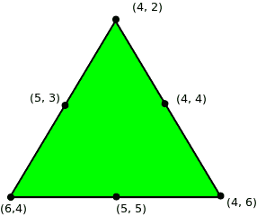

# 求给定每边中点的三角形坐标

> 原文:[https://www . geesforgeks . org/find-坐标-三角形-给定-中点-边/](https://www.geeksforgeeks.org/find-coordinates-triangle-given-midpoint-side/)

给定三个坐标(x，y)，它们是三角形边的中点。任务是找到三角形的坐标。

**示例:**

```
Input : midx1 = 5, midy1 = 3
        midx2 = 4, midy2 = 4
        midx3 = 5, midy3 = 5

Output : x1 = 4 y1 = 2
         x2 = 4 y2 = 6
         x3 = 6 y3 = 4
```



```
Solution can be verified by the figure.
```

让我们分别求解 X 坐标和 Y 坐标。顶点的 X 坐标为 x <sub>1</sub> ，x <sub>2</sub> ，x <sub>3</sub> 。那么，中间点的 X 坐标将是(x <sub>1</sub> + x <sub>2</sub> )/2、(x <sub>2</sub> + x <sub>3</sub> )/2、(x <sub>3</sub> + x <sub>1</sub> )/2。注意，这三个表达式之和等于 X 坐标之和。现在，我们有 3 个变量的和，每对变量和的 3 个表达式，通过解方程求出坐标的值。
同样，我们求解 Y 坐标。

下面是该方法的实现:

## C++

```
// C++ program to find coordinate of the
// triangle given midpoint of each side
#include<bits/stdc++.h>
#define N 3
using namespace std;

// Return after solving the equations and
// finding the vertices coordinate.
vector<int> solve(int v[])
{
    vector<int> res;

    // Finding sum of all three coordinate.
    int all3 = v[0] + v[1] + v[2];

    // Solving the equation.
    res.push_back(all3 - v[1]*2);
    res.push_back(all3 - v[2]*2);
    res.push_back(all3 - v[0]*2);

    return res;
}

// Finds vertices of a triangles from given
// middle vertices.
void findVertex(int xmid[], int ymid[])
{
    // Find X coordinates of vertices.
    vector<int> V1 = solve(xmid);

    // Find Y coordinates of vertices.
    vector<int> V2 = solve(ymid);

    // Output the solution.
    for (int i = 0; i < 3; i++)
        cout << V1[i] << " "
             << V2[i] <<endl;
}

// Driver code
int main()
{
    int xmid[N] = { 5, 4, 5 };
    int ymid[N] = { 3, 4, 5 };
    findVertex(xmid, ymid);
    return 0;
}
```

## Java 语言(一种计算机语言，尤用于创建网站)

```
import java.util.Vector;

// Java program to find coordinate of the 
// triangle given midpoint of each side 
class GFG {

//static final int N = 3; 
// Return after solving the equations and 
// finding the vertices coordinate. 
    static Vector<Integer> solve(int v[]) {
        Vector<Integer> res = new Vector<Integer>();

        // Finding sum of all three coordinate. 
        int all3 = v[0] + v[1] + v[2];

        // Solving the equation. 
        res.add(all3 - v[1] * 2);
        res.add(all3 - v[2] * 2);
        res.add(all3 - v[0] * 2);

        return res;
    }

// Finds vertices of a triangles from given 
// middle vertices. 
    static void findVertex(int xmid[], int ymid[]) {
        // Find X coordinates of vertices. 
        Vector<Integer> V1 = solve(xmid);

        // Find Y coordinates of vertices. 
        Vector<Integer> V2 = solve(ymid);

        // Output the solution. 
        for (int i = 0; i < 3; i++) {
            System.out.println(V1.get(i) + " " + V2.get(i));
        }

    }

// Driver code 
    public static void main(String[] args) {
        int xmid[] = {5, 4, 5};
        int ymid[] = {3, 4, 5};
        findVertex(xmid, ymid);
    }
}
// This code is contributed by
// PrinciRaj1992
```

## 蟒蛇 3

```
# Python3 program to find coordinate of the
# triangle given midpoint of each side

N = 3

# Return after solving the equations and
# finding the vertices coordinate.
def solve(v):

    res = []

    # Finding sum of all three coordinate.
    all3 = v[0] + v[1] + v[2]

    # Solving the equation.
    res.append(all3 - v[1] * 2)
    res.append(all3 - v[2] * 2)
    res.append(all3 - v[0] * 2)
    return res

# Finds vertices of a triangles from given
# middle vertices.
def findVertex(xmid, ymid):

    # Find X coordinates of vertices.
    V1 = solve(xmid)

    # Find Y coordinates of vertices.
    V2 = solve(ymid)

    # Output the solution.
    for i in range(0, 3):
        print(V1[i], end=" ")
        print(V2[i])

# Driver code
if __name__=='__main__':
    xmid = [5, 4, 5]
    ymid = [3, 4, 5]
    findVertex(xmid, ymid)

# This code is contributed by
# Sanjit_Prasad
```

## C#

```
// C# program to find coordinate of the 
// triangle given midpoint of each side 
using System;
using System.Collections;

class GFG 
{ 

    //static final int N = 3; 
    // Return after solving the equations and 
    // finding the vertices coordinate. 
    static ArrayList solve(int []v)
    { 
        ArrayList res = new ArrayList(); 

        // Finding sum of all three coordinate. 
        int all3 = v[0] + v[1] + v[2]; 

        // Solving the equation. 
        res.Add(all3 - v[1] * 2); 
        res.Add(all3 - v[2] * 2); 
        res.Add(all3 - v[0] * 2); 

        return res; 
    } 

    // Finds vertices of a triangles from given 
    // middle vertices. 
    static void findVertex(int []xmid, int []ymid)
    { 
        // Find X coordinates of vertices. 
        ArrayList V1 = solve(xmid); 

        // Find Y coordinates of vertices. 
        ArrayList V2 = solve(ymid); 

        // Output the solution. 
        for (int i = 0; i < 3; i++)
        { 
            Console.WriteLine(V1[i] + " " + V2[i]); 
        } 

    } 

    // Driver code 
    public static void Main() 
    { 
        int []xmid = {5, 4, 5}; 
        int []ymid = {3, 4, 5}; 
        findVertex(xmid, ymid); 
    } 
} 

// This code is contributed by mits
```

## 服务器端编程语言（Professional Hypertext Preprocessor 的缩写）

```
<?php
// PHP program to find coordinate of the 
// triangle given midpoint of each side 

$N = 3;

// Return after solving the equations and 
// finding the vertices coordinate. 
function solve($v) 
{
    $res = array(); 

    // Finding sum of all three coordinate. 
    $all3 = $v[0] + $v[1] + $v[2]; 

    // Solving the equation. 
    array_push($res, $all3 - $v[1] * 2); 
    array_push($res, $all3 - $v[2] * 2); 
    array_push($res, $all3 - $v[0] * 2); 
    return $res; 
}

// Finds vertices of a triangles from 
// given middle vertices. 
function findVertex($xmid, $ymid) 
{
    // Find X coordinates of vertices. 
    $V1 = solve($xmid); 

    // Find Y coordinates of vertices. 
    $V2 = solve($ymid); 

    // Output the solution. 
    for ($i = 0; $i < 3; $i++) 
        print($V1[$i] . " " .   
              $V2[$i] . "\n");
}

// Driver code 
$xmid = array(5, 4, 5); 
$ymid = array(3, 4, 5); 
findVertex($xmid, $ymid) 

// This code is contributed by mits
?>
```

## java 描述语言

```
<script>
      // JavaScript program to find coordinate of the
      // triangle given midpoint of each side
      // Return after solving the equations and
      // finding the vertices coordinate.
      function solve(v) {
        var res = [];

        // Finding sum of all three coordinate.
        var all3 = v[0] + v[1] + v[2];

        // Solving the equation.
        res.push(all3 - v[1] * 2);
        res.push(all3 - v[2] * 2);
        res.push(all3 - v[0] * 2);

        return res;
      }

      // Finds vertices of a triangles from given
      // middle vertices.
      function findVertex(xmid, ymid) {
        // Find X coordinates of vertices.
        var V1 = solve(xmid);

        // Find Y coordinates of vertices.
        var V2 = solve(ymid);

        // Output the solution.
        for (var i = 0; i < 3; i++) {
          document.write(V1[i] + " " + V2[i] + "<br>");
        }
      }

      // Driver code
      var xmid = [5, 4, 5];
      var ymid = [3, 4, 5];
      findVertex(xmid, ymid);
    </script>
```

**输出:**

```
6 4
4 2
4 6
```

**时间复杂度:** O(1)

本文由 **Anuj Chauhan** 供稿。如果你喜欢 GeeksforGeeks 并想投稿，你也可以使用[write.geeksforgeeks.org](http://www.write.geeksforgeeks.org)写一篇文章或者把你的文章邮寄到 review-team@geeksforgeeks.org。看到你的文章出现在极客博客主页上，帮助其他极客。
如果你发现任何不正确的地方，或者你想分享更多关于上面讨论的话题的信息，请写评论。