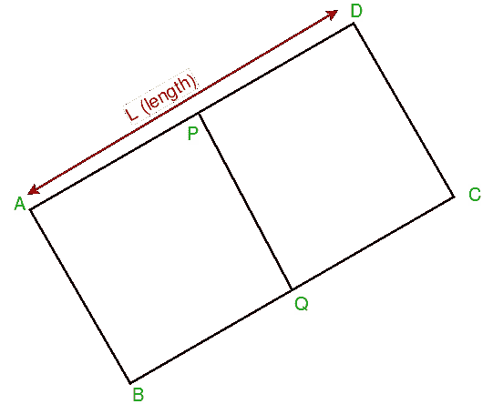

# 使用中点找到矩形的角

> 原文:[https://www . geeksforgeeks . org/find-使用中点的矩形角/](https://www.geeksforgeeks.org/find-corners-of-rectangle-using-mid-points/)

考虑一个矩形 ABCD，我们给出了边 AD 和 BC(分别为 p 和 q)中点的坐标以及它们的长度 L (AD = BC = L)。现在给定参数，我们需要打印 4 个点 A、B、C、d 的坐标



示例:

```
Input : p = (1, 0)
        q = (1, 2)
        L = 2
Output : (0, 0), (0, 2), (2, 2), (2, 0)
Explanation:
The printed points form a rectangle which
satisfy the input constraints.

Input : p = (1, 1)
        q = (-1, -1)
        L = 2*sqrt(2)
Output : (0, 2), (-2, 0), (0, -2), (2, 0)
```

根据问题陈述，可能会出现 3 种情况:

1.  矩形是水平的，即公元和公元前平行于 X 轴
2.  矩形是垂直的，即公元和公元前平行于 Y 轴
3.  矩形与轴成一定角度倾斜

前两种情况是微不足道的，可以很容易地用基本几何来解决。对于第三种情况，我们需要应用一些数学概念来寻找点。

为了清楚起见，请考虑上面的图表。我们有 p 和 q 的坐标，因此我们可以找到 AD 和 BC 的斜率(因为 pq 垂直于 AD)。一旦我们有了 AD 的斜率，就可以求出直线通过 AD 的方程。现在我们可以应用距离公式来获得沿 X 轴和 Y 轴的位移。

```
If slope of AD = m, then
m = (p.x- q.x)/(q.y - p.y)

and displacement along X axis, dx =  
   L/(2*sqrt(1+m*m))

Similarly, dy = m*L/(2*sqrt(1+m*m))
```

现在，我们可以简单地通过简单地加减相应获得的位移来简单地找到 4 个角的坐标。

下面是实现。

## C++

```
// C++ program to find corner points of
// a rectangle using given length and middle
// points.
#include <bits/stdc++.h>
using namespace std;

// Structure to represent a co-ordinate point
struct Point
{
    float x, y;
    Point()
    {
        x = y = 0;
    }
    Point(float a, float b)
    {
        x = a, y = b;
    }
};

// This function receives two points and length
// of the side of rectangle and prints the 4
// corner points of the rectangle
void printCorners(Point p, Point q, float l)
{
    Point a, b, c, d;

    // horizontal rectangle
    if (p.x == q.x)
    {
        a.x = p.x - (l/2.0);
        a.y = p.y;

        d.x = p.x + (l/2.0);
        d.y = p.y;

        b.x = q.x - (l/2.0);
        b.y = q.y;

        c.x = q.x + (l/2.0);
        c.y = q.y;
    }

    // vertical rectangle
    else if (p.y == q.y)
    {
        a.y = p.y - (l/2.0);
        a.x = p.x;

        d.y = p.y + (l/2.0);
        d.x = p.x;

        b.y = q.y - (l/2.0);
        b.x = q.x;

        c.y = q.y + (l/2.0);
        c.x = q.x;
    }

    // slanted rectangle
    else
    {
        // calculate slope of the side
        float m = (p.x-q.x)/float(q.y-p.y);

        // calculate displacements along axes
        float dx = (l /sqrt(1+(m*m))) *0.5 ;
        float dy = m*dx;

        a.x = p.x - dx;
        a.y = p.y - dy;

        d.x = p.x + dx;
        d.y = p.y + dy;

        b.x = q.x - dx;
        b.y = q.y - dy;

        c.x = q.x + dx;
        c.y = q.y + dy;
    }

    cout << a.x << ", " << a.y << " n"
         << b.x << ", " << b.y << "n";
         << c.x << ", " << c.y << " n"
         << d.x << ", " << d.y << "nn";
}

// Driver code
int main()
{
    Point p1(1, 0), q1(1, 2);
    printCorners(p1, q1, 2);

    Point p(1, 1), q(-1, -1);
    printCorners(p, q, 2*sqrt(2));

    return 0;
}
```

## Java 语言(一种计算机语言，尤用于创建网站)

```
// Java program to find corner points of
// a rectangle using given length and middle
// points.

class GFG
{

    // Structure to represent a co-ordinate point
    static class Point
    {

        float x, y;

        Point()
        {
            x = y = 0;
        }

        Point(float a, float b)
        {
            x = a;
            y = b;
        }
    };

    // This function receives two points and length
    // of the side of rectangle and prints the 4
    // corner points of the rectangle
    static void printCorners(Point p, Point q, float l)
    {
        Point a = new Point(), b = new Point(),
                c = new Point(), d = new Point();

        // horizontal rectangle
        if (p.x == q.x)
        {
            a.x = (float) (p.x - (l / 2.0));
            a.y = p.y;

            d.x = (float) (p.x + (l / 2.0));
            d.y = p.y;

            b.x = (float) (q.x - (l / 2.0));
            b.y = q.y;

            c.x = (float) (q.x + (l / 2.0));
            c.y = q.y;
        }
        // vertical rectangle
        else if (p.y == q.y)
        {
            a.y = (float) (p.y - (l / 2.0));
            a.x = p.x;

            d.y = (float) (p.y + (l / 2.0));
            d.x = p.x;

            b.y = (float) (q.y - (l / 2.0));
            b.x = q.x;

            c.y = (float) (q.y + (l / 2.0));
            c.x = q.x;
        }
        // slanted rectangle
        else
        {
            // calculate slope of the side
            float m = (p.x - q.x) / (q.y - p.y);

            // calculate displacements along axes
            float dx = (float) ((l / Math.sqrt(1 + (m * m))) * 0.5);
            float dy = m * dx;

            a.x = p.x - dx;
            a.y = p.y - dy;

            d.x = p.x + dx;
            d.y = p.y + dy;

            b.x = q.x - dx;
            b.y = q.y - dy;

            c.x = q.x + dx;
            c.y = q.y + dy;
        }

        System.out.print((int)a.x + ", " + (int)a.y + " \n"
                + (int)b.x + ", " + (int)b.y + "\n"
                + (int)c.x + ", " + (int)c.y + " \n"
                + (int)d.x + ", " + (int)d.y + "\n");
    }

    // Driver code
    public static void main(String[] args)
    {
        Point p1 = new Point(1, 0), q1 = new Point(1, 2);
        printCorners(p1, q1, 2);

        Point p = new Point(1, 1), q = new Point(-1, -1);
        printCorners(p, q, (float) (2 * Math.sqrt(2)));
    }
}

// This code contributed by Rajput-Ji
```

## 蟒蛇 3

```
# Python3 program to find corner points of
# a rectangle using given length and middle
# points.
import math

# Structure to represent a co-ordinate point
class Point:

    def __init__(self, a = 0, b = 0):

        self.x = a
        self.y = b

# This function receives two points and length
# of the side of rectangle and prints the 4
# corner points of the rectangle
def printCorners(p, q, l):

    a, b, c, d = Point(), Point(), Point(), Point()

    # Horizontal rectangle
    if (p.x == q.x):
        a.x = p.x - (l / 2.0)
        a.y = p.y

        d.x = p.x + (l / 2.0)
        d.y = p.y

        b.x = q.x - (l / 2.0)
        b.y = q.y

        c.x = q.x + (l / 2.0)
        c.y = q.y

    # Vertical rectangle
    elif (p.y == q.y):
        a.y = p.y - (l / 2.0)
        a.x = p.x

        d.y = p.y + (l / 2.0)
        d.x = p.x

        b.y = q.y - (l / 2.0)
        b.x = q.x

        c.y = q.y + (l / 2.0)
        c.x = q.x

    # Slanted rectangle
    else:

        # Calculate slope of the side
        m = (p.x - q.x) / (q.y - p.y)

        # Calculate displacements along axes
        dx = (l / math.sqrt(1 + (m * m))) * 0.5
        dy = m * dx

        a.x = p.x - dx
        a.y = p.y - dy

        d.x = p.x + dx
        d.y = p.y + dy

        b.x = q.x - dx
        b.y = q.y - dy

        c.x = q.x + dx
        c.y = q.y + dy

    print(int(a.x), ", ", int(a.y), sep = "")
    print(int(b.x), ", ", int(b.y), sep = "")
    print(int(c.x), ", ", int(c.y), sep = "")
    print(int(d.x), ", ", int(d.y), sep = "")
    print()

# Driver code
p1 = Point(1, 0)
q1 = Point(1, 2)
printCorners(p1, q1, 2)

p = Point(1, 1)
q = Point(-1, -1)
printCorners(p, q, 2 * math.sqrt(2))

# This code is contributed by shubhamsingh10
```

## C#

```
// C# program to find corner points of
// a rectangle using given length and middle
// points.
using System;

class GFG
{

    // Structure to represent a co-ordinate point
    public class Point
    {

        public float x, y;

        public Point()
        {
            x = y = 0;
        }

        public Point(float a, float b)
        {
            x = a;
            y = b;
        }
    };

    // This function receives two points and length
    // of the side of rectangle and prints the 4
    // corner points of the rectangle
    static void printCorners(Point p, Point q, float l)
    {
        Point a = new Point(), b = new Point(),
                c = new Point(), d = new Point();

        // horizontal rectangle
        if (p.x == q.x)
        {
            a.x = (float) (p.x - (l / 2.0));
            a.y = p.y;

            d.x = (float) (p.x + (l / 2.0));
            d.y = p.y;

            b.x = (float) (q.x - (l / 2.0));
            b.y = q.y;

            c.x = (float) (q.x + (l / 2.0));
            c.y = q.y;
        }

        // vertical rectangle
        else if (p.y == q.y)
        {
            a.y = (float) (p.y - (l / 2.0));
            a.x = p.x;

            d.y = (float) (p.y + (l / 2.0));
            d.x = p.x;

            b.y = (float) (q.y - (l / 2.0));
            b.x = q.x;

            c.y = (float) (q.y + (l / 2.0));
            c.x = q.x;
        }

        // slanted rectangle
        else
        {
            // calculate slope of the side
            float m = (p.x - q.x) / (q.y - p.y);

            // calculate displacements along axes
            float dx = (float) ((l / Math.Sqrt(1 + (m * m))) * 0.5);
            float dy = m * dx;

            a.x = p.x - dx;
            a.y = p.y - dy;

            d.x = p.x + dx;
            d.y = p.y + dy;

            b.x = q.x - dx;
            b.y = q.y - dy;

            c.x = q.x + dx;
            c.y = q.y + dy;
        }

        Console.Write((int)a.x + ", " + (int)a.y + " \n"
                + (int)b.x + ", " + (int)b.y + "\n"
                + (int)c.x + ", " + (int)c.y + " \n"
                + (int)d.x + ", " + (int)d.y + "\n");
    }

    // Driver code
    public static void Main(String[] args)
    {
        Point p1 = new Point(1, 0), q1 = new Point(1, 2);
        printCorners(p1, q1, 2);

        Point p = new Point(1, 1), q = new Point(-1, -1);
        printCorners(p, q, (float) (2 * Math.Sqrt(2)));
    }
}

// This code has been contributed by 29AjayKumar
```

## java 描述语言

```
<script>
// Javascript program to find corner points of
// a rectangle using given length and middle
// points.

// Structure to represent a co-ordinate point
class Point
{
    constructor(a,b)
    {
        this.x=a;
        this.y=b;
    }
}

// This function receives two points and length
    // of the side of rectangle and prints the 4
    // corner points of the rectangle
function printCorners(p,q,l)
{
    let a = new Point(), b = new Point(),
                c = new Point(), d = new Point();

        // horizontal rectangle
        if (p.x == q.x)
        {
            a.x =  (p.x - (l / 2.0));
            a.y = p.y;

            d.x =  (p.x + (l / 2.0));
            d.y = p.y;

            b.x =  (q.x - (l / 2.0));
            b.y = q.y;

            c.x =  (q.x + (l / 2.0));
            c.y = q.y;
        }
        // vertical rectangle
        else if (p.y == q.y)
        {
            a.y = (p.y - (l / 2.0));
            a.x = p.x;

            d.y = (p.y + (l / 2.0));
            d.x = p.x;

            b.y = (q.y - (l / 2.0));
            b.x = q.x;

            c.y = (q.y + (l / 2.0));
            c.x = q.x;
        }
        // slanted rectangle
        else
        {
            // calculate slope of the side
            let m = (p.x - q.x) / (q.y - p.y);

            // calculate displacements along axes
            let dx =  ((l / Math.sqrt(1 + (m * m))) * 0.5);
            let dy = m * dx;

            a.x = p.x - dx;
            a.y = p.y - dy;

            d.x = p.x + dx;
            d.y = p.y + dy;

            b.x = q.x - dx;
            b.y = q.y - dy;

            c.x = q.x + dx;
            c.y = q.y + dy;
        }

        document.write(a.x + ", " + a.y + " <br>"
                + b.x + ", " + b.y + "<br>"
                + c.x + ", " + c.y + " <br>"
                + d.x + ", " + d.y + "<br>");
}

// Driver code
let p1 = new Point(1, 0), q1 = new Point(1, 2);
printCorners(p1, q1, 2);

let p = new Point(1, 1), q = new Point(-1, -1);
printCorners(p, q,  (2 * Math.sqrt(2)));

// This code is contributed by rag2127
</script>
```

**输出:**

```
0, 0 
0, 2
2, 2 
2, 0

0, 2 
-2, 0
0, -2 
2, 0
```

**参考:**
[StackOverflow](https://stackoverflow.com/questions/2219108/knowing-two-points-of-a-rectangle-how-can-i-figure-out-the-other-two)
本文由 [**Ashutosh Kumar**](https://in.linkedin.com/in/ashutosh-kumar-9527a7105) 供稿😀如果你喜欢 GeeksforGeeks 并想投稿，你也可以使用[write.geeksforgeeks.org](https://write.geeksforgeeks.org)写一篇文章或者把你的文章邮寄到 review-team@geeksforgeeks.org。看到你的文章出现在极客博客主页上，帮助其他极客。
如果发现有不正确的地方，或者想分享更多关于上述话题的信息，请写评论。