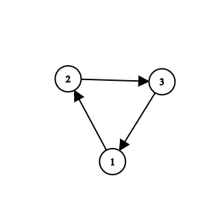
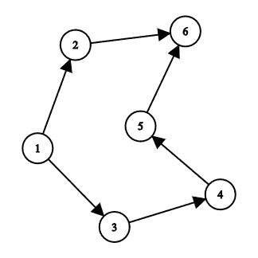

# 找到有向图中每个顶点的依赖关系

> 原文:[https://www . geesforgeks . org/find-有向图中每个顶点的依赖关系/](https://www.geeksforgeeks.org/find-dependencies-of-each-vertex-in-a-directed-graph/)

给定一个包含 **N** 个顶点和 **M** 条边的有向图，任务是找出图中每个顶点的所有依赖关系和依赖关系最小的顶点。

> 有向图(或有向图)是由边连接的一组节点，其中边有一个与之相关的方向。
> 例如，一个弧(x，y)被认为是从 x 指向 y，而弧(y，x)是反向链接。y 是 x 的直接后继者，x 是 y 的直接前驱者。
> 依赖关系是指依赖于当前顶点的不同顶点的连接数。

**例:**

> **输入:**
> 
> 
> 
> **输出:**
> 顶点 1 依赖项- > 2- > 3
> 顶点 2 依赖项- > 3- > 1
> 顶点 3 依赖项- > 1- > 2
> 节点 1 的最小依赖项数为 2。
> **说明:**
> 顶点 1 依赖于 2 和 3。
> 同样，顶点 2 和 3 分别在(3，1)和(1，2)上。
> 因此，所有顶点之间的最小依赖数为 2。
> **输入:**
> 
> 
> 
> **输出:**
> 顶点 1 依赖->2->3->4->5->6
> 顶点 2 依赖- > 6
> 顶点 3 依赖- > 4- > 5- > 6
> 顶点 4 依赖- > 5- > 6
> 顶点 5 依赖- > 6
> 顶点 6 不依赖任何顶点。
> 节点 6 的最小依赖度为 0
> **说明:**
> 顶点 1 依赖于(3，4，5，6，7)。类似地，(6)上的顶点 2，(4，5，6)上的顶点 3，(5，6)上的顶点 4，(6)上的顶点 5 和顶点 6 不依赖于任何。
> 因此，所有顶点之间的最小依赖数为 0。

**方法:**思路是用[深度优先搜索](https://www.geeksforgeeks.org/depth-first-search-or-dfs-for-a-graph/) (DFS)来解决这个问题。

*   获取有向图作为输入。
*   对图形执行 DFS，并探索图形的所有节点。
*   在探索节点的邻居时，加 1 进行计数，最后返回表示依赖项数量的计数。
*   最后，找到依赖项数量最少的节点。

以下是上述方法的实现:

## 卡片打印处理机（Card Print Processor 的缩写）

```
// C++ program to find the
// dependency of each node

#include <bits/stdc++.h>
using namespace std;

// Defining the graph
class Graph {

    // Variable to store the
    // number of vertices
    int V;

    // Adjacency list
    list<int>* adjList;

    // Initializing the graph
public:
    Graph(int v)
    {
        V = v;
        adjList = new list<int>[V];
    }

    // Adding edges
    void addEdge(int u, int v,
                 bool bidir = true)
    {
        adjList[u].push_back(v);
        if (bidir) {
            adjList[u].push_back(v);
        }
    }

    // Performing DFS on each node
    int dfs(int src)
    {
        // Map is used to mark
        // the current node as visited
        map<int, bool> visited;
        vector<int> dependent;
        int count = 0;

        stack<int> s;

        // Push the current vertex
        // to the stack which
        // stores the result
        s.push(src);

        visited[src] = true;

        // Traverse through the vertices
        // until the stack is empty
        while (!s.empty()) {
            int n = s.top();
            s.pop();

            // Recur for all the vertices
            // adjacent to this vertex
            for (auto i : adjList[n]) {

                // If the vertices are
                // not visited
                if (!visited[i]) {
                    dependent.push_back(i + 1);
                    count++;

                    // Mark the vertex as
                    // visited
                    visited[i] = true;

                    // Push the current vertex to
                    // the stack which stores
                    // the result
                    s.push(i);
                }
            }
        }

        // If the vertex has 0 dependency
        if (!count) {
            cout << "Vertex " << src + 1
                 << " is not dependent on any vertex.\n";
            return count;
        }

        cout << "Vertex " << src + 1 << " dependency ";
        for (auto i : dependent) {
            cout << "-> " << i;
        }
        cout << "\n";
        return count;
    }
};

// Function to find the
// dependency of each node
void operations(int arr[][2],
                int n, int m)
{
    // Creating a new graph
    Graph g(n);

    for (int i = 0; i < m; i++) {
        g.addEdge(arr[i][0],
                  arr[i][1], false);
    }

    int ans = INT_MAX;
    int node = 0;

    // Iterating through the graph
    for (int i = 0; i < n; i++) {
        int c = g.dfs(i);

        // Finding the node with
        // minimum number of
        // dependency
        if (c < ans) {
            ans = c;
            node = i + 1;
        }
    }
    cout << "Node " << node
         << "has minimum dependency of "
         << ans;
}

// Driver code
int main()
{
    int n, m;

    n = 6, m = 6;

    // Defining the edges of the
    // graph
    int arr[][2] = { { 0, 1 },
                     { 0, 2 },
                     { 2, 3 },
                     { 4, 5 },
                     { 3, 4 },
                     { 1, 5 } };

    operations(arr, n, m);

    return 0;
}
```

## 蟒蛇 3

```
# Python3 program to find the
# dependency of each node

# Adding edges
def addEdge(u, v, bidir = True):
    global adjList
    adjList[u].append(v)
    if (bidir):
        adjList[u].append(v)

# Performing DFS on each node
def dfs(src):
    global adjList, V

    # Map is used to mark
    # the current node as visited
    visited = [False for i in range(V+1)]
    dependent = []
    count = 0
    s = []

    # Push the current vertex
    # to the stack which
    # stores the result
    s.append(src)
    visited[src] = True

    # Traverse through the vertices
    # until the stack is empty
    while (len(s) > 0):
        n = s[-1]
        del s[-1]

        # Recur for all the vertices
        # adjacent to this vertex
        for i in adjList[n]:

            # If the vertices are
            # not visited
            if (not visited[i]):
                dependent.append(i + 1)
                count += 1

                # Mark the vertex as
                # visited
                visited[i] = True

                # Push the current vertex to
                # the stack which stores
                # the result
                s.append(i)

    # If the vertex has 0 dependency
    if (not count):
        print("Vertex ", src + 1,
              " is not dependent on any vertex.")
        return count

    print("Vertex ",src + 1," dependency ",end="")
    for i in dependent:
        print("-> ", i, end = "")
    print()
    return count

# Function to find the
# dependency of each node
def operations(arr, n, m):

    # Creating a new graph
    global adjList
    for i in range(m):
        addEdge(arr[i][0], arr[i][1], False)
    ans = 10**18
    node = 0

    # Iterating through the graph
    for i in range(n):
        c = dfs(i)

        # Finding the node with
        # minimum number of
        # dependency
        if (c < ans):
            ans = c
            node = i + 1
    print("Node", node, "has minimum dependency of ", ans)

# Driver code
if __name__ == '__main__':
    V = 6
    adjList = [[] for i in range(V+1)]
    n, m = 6, 6

    # Defining the edges of the
    # graph
    arr = [ [ 0, 1 ],
             [ 0, 2 ],
             [ 2, 3 ],
             [ 4, 5 ],
             [ 3, 4 ],
             [ 1, 5 ] ]

    operations(arr, n, m)

    # This code is contributed by mohit kumar 29.
```

**Output:** 

```
Vertex 1 dependency -> 2-> 3-> 4-> 5-> 6
Vertex 2 dependency -> 6
Vertex 3 dependency -> 4-> 5-> 6
Vertex 4 dependency -> 5-> 6
Vertex 5 dependency -> 6
Vertex 6 is not dependent on any vertex.
Node 6has minimum dependency of 0
```