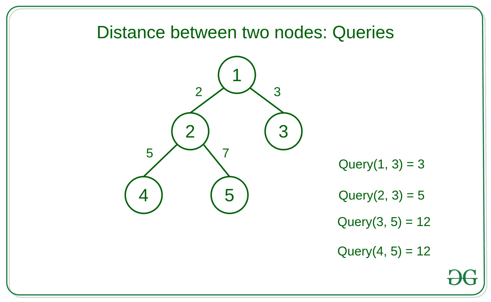

# 为 Q 查询找到给定二叉树中两个节点之间的距离

> 原文:[https://www . geeksforgeeks . org/find-给定二进制查询树中两个节点之间的距离/](https://www.geeksforgeeks.org/find-distance-between-two-nodes-in-the-given-binary-tree-for-q-queries/)

给定具有 **N** 节点和 **N-1** 边权重的[二叉树](https://www.geeksforgeeks.org/binary-tree-data-structure/)。两个节点之间的距离是两个节点之间的路径上的边的权重之和。每个查询包含两个整数 **U** 和 **V** ，任务是找到节点 **U** 和 **V** 之间的**距离**。

**示例:**

> **输入:**
> 
> 
> 
> **输出:** 3 5 12 12
> **说明:**
> 节点 1 到 3 之间的距离=权重(1，3) = 2
> 节点 2 到 3 之间的距离=权重(1，2) +权重(1，3) = 5
> 节点 3 到 5 之间的距离=权重(1，3) +权重(1，2) +权重(2，5) = 12
> 节点 4 到 5 之间的距离=权重(4，2) +权重(2，5) = 12

**方法:**想法是使用[二元提升技术](https://www.geeksforgeeks.org/lca-in-a-tree-using-binary-lifting-technique/)在树中使用[T3】LCA。](https://www.geeksforgeeks.org/lca-in-a-tree-using-binary-lifting-technique/)

*   二进制提升是一种[动态编程](https://www.geeksforgeeks.org/dynamic-programming/)方法，其中我们预先计算一个数组 **lca[i][j]** ，其中 i = [1，n]，j = [1，log(n)]，lca[i][j]包含节点 I 的第 2 个祖先 <sup>j</sup> 。
    *   为了计算 lca[][]的值，可以使用以下递归

![lca[i][j] =\begin{cases} parent[i] & \text{ ;if } j=0 \\ lca[lca[i][j - 1]][j - 1] & \text{ ;if } j>0 \end{cases} ](img/fc02d834caa195d1a0d9b96dd521c4ac.png "Rendered by QuickLaTeX.com")

*   在计算 lca[][]数组时，我们还将计算**距离[][]** ，其中距离[i][j]包含从节点 I 到其第 2 个 <sup>j</sup> 祖先的距离
    *   为了计算 dist[][]的值，可以使用以下递归。

![dist[i][j] =\begin{cases} cost(i, parent[i]) & \text{ ;if } j=0 \\ dist[i][j] = dist[i][j - 1] + dist[lca[i][j - 1]][j - 1]; & \text{ ;if } j>0 \end{cases}](img/0d877fdbef3caa8483e62f314095e7aa.png "Rendered by QuickLaTeX.com")

*   经过预计算，我们找到了 **(u，v)** 之间的距离，就像我们找到了(u，v)的最小共同祖先一样。

下面是上述方法的实现:

## C++

```
// C++ Program to find distance
// between two nodes using LCA

#include <bits/stdc++.h>
using namespace std;

#define MAX 1000

#define log 10 // log2(MAX)

// Array to store the level
// of each node
int level[MAX];

int lca[MAX][log];
int dist[MAX][log];

// Vector to store tree
vector<pair<int, int> > graph[MAX];

void addEdge(int u, int v, int cost)
{
    graph[u].push_back({ v, cost });
    graph[v].push_back({ u, cost });
}

// Pre-Processing to calculate
// values of lca[][], dist[][]
void dfs(int node, int parent,
         int h, int cost)
{
    // Using recursion formula to
    // calculate the values
    // of lca[][]
    lca[node][0] = parent;

    // Storing the level of
    // each node
    level[node] = h;
    if (parent != -1) {
        dist[node][0] = cost;
    }

    for (int i = 1; i < log; i++) {
        if (lca[node][i - 1] != -1) {

            // Using recursion formula to
            // calculate the values of
            // lca[][] and dist[][]
            lca[node][i]
                = lca[lca[node]
                         [i - 1]]
                     [i - 1];

            dist[node][i]
                = dist[node][i - 1]
                  + dist[lca[node][i - 1]]
                        [i - 1];
        }
    }

    for (auto i : graph[node]) {
        if (i.first == parent)
            continue;
        dfs(i.first, node,
h + 1, i.second);
    }
}

// Function to find the distance
// between given nodes u and v
void findDistance(int u, int v)
{

    int ans = 0;

    // The node which is present
    // farthest from the root node
    // is taken as v. If u is
    // farther from root node
    // then swap the two
    if (level[u] > level[v])
        swap(u, v);

    // Finding the ancestor of v
    // which is at same level as u
    for (int i = log - 1; i >= 0; i--) {

        if (lca[v][i] != -1
            && level[lca[v][i]]
                   >= level[u]) {

            // Adding distance of node
            // v till its 2^i-th ancestor
            ans += dist[v][i];
            v = lca[v][i];
        }
    }

    // If u is the ancestor of v
    // then u is the LCA of u and v
    if (v == u) {

        cout << ans << endl;
    }

    else {

        // Finding the node closest to the
        // root which is not the common
        // ancestor of u and v i.e. a node
        // x such that x is not the common
        // ancestor of u and v but lca[x][0] is
        for (int i = log - 1; i >= 0; i--) {

            if (lca[v][i] != lca[u][i]) {

                // Adding the distance
                // of v and u to
                // its 2^i-th ancestor
                ans += dist[u][i] + dist[v][i];

                v = lca[v][i];
                u = lca[u][i];
            }
        }

        // Adding the distance of u and v
        // to its first ancestor
        ans += dist[u][0] + dist[v][0];

        cout << ans << endl;
    }
}

// Driver Code
int main()
{

    // Number of nodes
    int n = 5;

    // Add edges with their cost
    addEdge(1, 2, 2);
    addEdge(1, 3, 3);
    addEdge(2, 4, 5);
    addEdge(2, 5, 7);

    // Initialising lca and dist values
    // with -1 and 0 respectively
    for (int i = 1; i <= n; i++) {
        for (int j = 0; j < log; j++) {
            lca[i][j] = -1;
            dist[i][j] = 0;
        }
    }

    // Perform DFS
    dfs(1, -1, 0, 0);

    // Query 1: {1, 3}
    findDistance(1, 3);

    // Query 2: {2, 3}
    findDistance(2, 3);

    // Query 3: {3, 5}
    findDistance(3, 5);

    return 0;
}
```

## Java 语言(一种计算机语言，尤用于创建网站)

```
// Java program to find distance
// between two nodes using LCA
import java.io.*;
import java.util.*;

class GFG{

static final int MAX = 1000;
// log2(MAX)
static final int log = 10;

// Array to store the level
// of each node
static int[] level = new int[MAX];

static int[][] lca = new int[MAX][log];
static int[][] dist = new int[MAX][log];

// Vector to store tree
@SuppressWarnings("unchecked")
static List<List<int[]> > graph = new ArrayList();

static void addEdge(int u, int v, int cost)
{
    graph.get(u).add(new int[]{ v, cost });
    graph.get(v).add(new int[]{ u, cost });
}

// Pre-Processing to calculate
// values of lca[][], dist[][]
static void dfs(int node, int parent,
                int h, int cost)
{

    // Using recursion formula to
    // calculate the values
    // of lca[][]
    lca[node][0] = parent;

    // Storing the level of
    // each node
    level[node] = h;

    if (parent != -1)
    {
        dist[node][0] = cost;
    }

    for(int i = 1; i < log; i++)
    {
        if (lca[node][i - 1] != -1)
        {

            // Using recursion formula to
            // calculate the values of
            // lca[][] and dist[][]
            lca[node][i] = lca[lca[node][i - 1]][i - 1];

            dist[node][i] = dist[node][i - 1] +
                            dist[lca[node][i - 1]][i - 1];
        }
    }

    for(int[] i : graph.get(node))
    {
        if (i[0] == parent)
            continue;

        dfs(i[0], node, h + 1, i[1]);
    }
}

// Function to find the distance
// between given nodes u and v
static void findDistance(int u, int v)
{
    int ans = 0;

    // The node which is present
    // farthest from the root node
    // is taken as v. If u is
    // farther from root node
    // then swap the two
    if (level[u] > level[v])
    {
        int temp = u;
        u = v;
        v = temp;
    }

    // Finding the ancestor of v
    // which is at same level as u
    for(int i = log - 1; i >= 0; i--)
    {
        if (lca[v][i] != -1 &&
      level[lca[v][i]] >= level[u])
        {

            // Adding distance of node
            // v till its 2^i-th ancestor
            ans += dist[v][i];
            v = lca[v][i];
        }
    }

    // If u is the ancestor of v
    // then u is the LCA of u and v
    if (v == u)
    {
        System.out.println(ans);
    }

    else
    {

        // Finding the node closest to the
        // root which is not the common
        // ancestor of u and v i.e. a node
        // x such that x is not the common
        // ancestor of u and v but lca[x][0] is
        for(int i = log - 1; i >= 0; i--)
        {
            if (lca[v][i] != lca[u][i])
            {

                // Adding the distance
                // of v and u to
                // its 2^i-th ancestor
                ans += dist[u][i] + dist[v][i];

                v = lca[v][i];
                u = lca[u][i];
            }
        }

        // Adding the distance of u and v
        // to its first ancestor
        ans += dist[u][0] + dist[v][0];

        System.out.println(ans);
    }
}

// Driver Code
public static void main(String[] args)
{

    // Number of nodes
    int n = 5;

    for(int i = 0; i < MAX; i++)
    {
        graph.add(new ArrayList<int[]>());
    }

    // Add edges with their cost
    addEdge(1, 2, 2);
    addEdge(1, 3, 3);
    addEdge(2, 4, 5);
    addEdge(2, 5, 7);

    // Initialising lca and dist values
    // with -1 and 0 respectively
    for(int i = 1; i <= n; i++)
    {
        for(int j = 0; j < log; j++)
        {
            lca[i][j] = -1;
            dist[i][j] = 0;
        }
    }

    // Perform DFS
    dfs(1, -1, 0, 0);

    // Query 1: {1, 3}
    findDistance(1, 3);

    // Query 2: {2, 3}
    findDistance(2, 3);

    // Query 3: {3, 5}
    findDistance(3, 5);
}
}

// This code is contributed by jithin
```

## 蟒蛇 3

```
# Python3 Program to find
# distance between two nodes
# using LCA
MAX = 1000

# lg2(MAX)
lg = 10

# Array to store the level
# of each node
level = [0 for i in range(MAX)]

lca = [[0 for i in range(lg)]
          for j in range(MAX)]
dist = [[0 for i in range(lg)]
           for j in range(MAX)]

# Vector to store tree
graph = [[] for i in range(MAX)]

def addEdge(u, v, cost):

    global graph

    graph[u].append([v, cost])
    graph[v].append([u, cost])

# Pre-Processing to calculate
# values of lca[][], dist[][]
def dfs(node, parent, h, cost):

    # Using recursion formula to
    # calculate the values
    # of lca[][]
    lca[node][0] = parent

    # Storing the level of
    # each node
    level[node] = h

    if (parent != -1):
        dist[node][0] = cost

    for i in range(1, lg):
        if (lca[node][i - 1] != -1):

            # Using recursion formula to
            # calculate the values of
            # lca[][] and dist[][]
            lca[node][i] = lca[lca[node][i - 1]][i - 1]

            dist[node][i] = (dist[node][i - 1] +
                             dist[lca[node][i - 1]][i - 1])

    for i in graph[node]:
        if (i[0] == parent):
            continue
        dfs(i[0], node, h + 1, i[1])

# Function to find the distance
# between given nodes u and v
def findDistance(u, v):

    ans = 0

    # The node which is present
    # farthest from the root node
    # is taken as v. If u is
    # farther from root node
    # then swap the two
    if (level[u] > level[v]):
        temp = u
        u = v
        v = temp

    # Finding the ancestor of v
    # which is at same level as u
    i = lg - 1

    while(i >= 0):
        if (lca[v][i] != -1 and
            level[lca[v][i]] >= level[u]):

            # Adding distance of node
            # v till its 2^i-th ancestor
            ans += dist[v][i]
            v = lca[v][i]

        i -= 1

    # If u is the ancestor of v
    # then u is the LCA of u and v
    if (v == u):
        print(ans)

    else:
        # Finding the node closest to the
        # root which is not the common
        # ancestor of u and v i.e. a node
        # x such that x is not the common
        # ancestor of u and v but lca[x][0] is
        i = lg - 1

        while(i >= 0):
            if (lca[v][i] != lca[u][i]):
                # Adding the distance
                # of v and u to
                # its 2^i-th ancestor
                ans += dist[u][i] + dist[v][i]

                v = lca[v][i]
                u = lca[u][i]
            i -= 1

        # Adding the distance of u and v
        # to its first ancestor
        ans += (dist[u][0] +
                dist[v][0])

        print(ans)

# Driver Code
if __name__ == '__main__':

    # Number of nodes
    n = 5

    # Add edges with their cost
    addEdge(1, 2, 2)
    addEdge(1, 3, 3)
    addEdge(2, 4, 5)
    addEdge(2, 5, 7)

    # Initialising lca and dist values
    # with -1 and 0 respectively
    for i in range(1, n + 1):
        for j in range(lg):
            lca[i][j] = -1
            dist[i][j] = 0

    # Perform DFS
    dfs(1, -1, 0, 0)
    # Query 1: {1, 3}
    findDistance(1, 3)
    # Query 2: {2, 3}
    findDistance(2, 3)
    # Query 3: {3, 5}
    findDistance(3, 5)

# This code is contributed by SURENDRA_GANGWAR
```

## C#

```
// C# program to find distance
// between two nodes using LCA
using System;
using System.Collections.Generic;
class GFG
{

  static readonly int MAX = 1000;

  // log2(MAX)
  static readonly int log = 10;

  // Array to store the level
  // of each node
  static int[] level = new int[MAX];
  static int[,] lca = new int[MAX,log];
  static int[,] dist = new int[MAX,log];

  // List to store tree
  static List<List<int[]> > graph = new List<List<int[]>>();

  static void addEdge(int u, int v, int cost)
  {
    graph[u].Add(new int[]{ v, cost });
    graph[v].Add(new int[]{ u, cost });
  }

  // Pre-Processing to calculate
  // values of lca[,], dist[,]
  static void dfs(int node, int parent,
                  int h, int cost)
  {

    // Using recursion formula to
    // calculate the values
    // of lca[,]
    lca[node, 0] = parent;

    // Storing the level of
    // each node
    level[node] = h;

    if (parent != -1)
    {
      dist[node, 0] = cost;
    }

    for(int i = 1; i < log; i++)
    {
      if (lca[node, i - 1] != -1)
      {

        // Using recursion formula to
        // calculate the values of
        // lca[,] and dist[,]
        lca[node, i] = lca[lca[node, i - 1], i - 1];

        dist[node, i] = dist[node, i - 1] +
          dist[lca[node, i - 1], i - 1];
      }
    }

    foreach(int[] i in graph[node])
    {
      if (i[0] == parent)
        continue;           
      dfs(i[0], node, h + 1, i[1]);
    }
  }

  // Function to find the distance
  // between given nodes u and v
  static void findDistance(int u, int v)
  {
    int ans = 0;

    // The node which is present
    // farthest from the root node
    // is taken as v. If u is
    // farther from root node
    // then swap the two
    if (level[u] > level[v])
    {
      int temp = u;
      u = v;
      v = temp;
    }

    // Finding the ancestor of v
    // which is at same level as u
    for(int i = log - 1; i >= 0; i--)
    {
      if (lca[v, i] != -1 &&
          level[lca[v, i]] >= level[u])
      {

        // Adding distance of node
        // v till its 2^i-th ancestor
        ans += dist[v, i];
        v = lca[v, i];
      }
    }

    // If u is the ancestor of v
    // then u is the LCA of u and v
    if (v == u)
    {
      Console.WriteLine(ans);
    }

    else
    {

      // Finding the node closest to the
      // root which is not the common
      // ancestor of u and v i.e. a node
      // x such that x is not the common
      // ancestor of u and v but lca[x,0] is
      for(int i = log - 1; i >= 0; i--)
      {
        if (lca[v, i] != lca[u, i])
        {

          // Adding the distance
          // of v and u to
          // its 2^i-th ancestor
          ans += dist[u, i] + dist[v, i];

          v = lca[v, i];
          u = lca[u, i];
        }
      }

      // Adding the distance of u and v
      // to its first ancestor
      ans += dist[u, 0] + dist[v, 0];
      Console.WriteLine(ans);
    }
  }

  // Driver Code
  public static void Main(String[] args)
  {

    // Number of nodes
    int n = 5;
    for(int i = 0; i < MAX; i++)
    {
      graph.Add(new List<int[]>());
    }

    // Add edges with their cost
    addEdge(1, 2, 2);
    addEdge(1, 3, 3);
    addEdge(2, 4, 5);
    addEdge(2, 5, 7);

    // Initialising lca and dist values
    // with -1 and 0 respectively
    for(int i = 1; i <= n; i++)
    {
      for(int j = 0; j < log; j++)
      {
        lca[i, j] = -1;
        dist[i, j] = 0;
      }
    }

    // Perform DFS
    dfs(1, -1, 0, 0);

    // Query 1: {1, 3}
    findDistance(1, 3);

    // Query 2: {2, 3}
    findDistance(2, 3);

    // Query 3: {3, 5}
    findDistance(3, 5);
  }
}

// This code is contributed by aashish1995
```

## java 描述语言

```
<script>
    // Javascript program to find distance
    // between two nodes using LCA

    let MAX = 1000;
    // log2(MAX)
    let log = 10;

    // Array to store the level
    // of each node
    let level = new Array(MAX);

    let lca = new Array(MAX);
    let dist = new Array(MAX);

    // Vector to store tree
    let graph = [];

    function addEdge(u, v, cost)
    {
        graph[u].push([ v, cost ]);
        graph[v].push([ u, cost ]);
    }

    // Pre-Processing to calculate
    // values of lca[][], dist[][]
    function dfs(node, parent, h, cost)
    {

        // Using recursion formula to
        // calculate the values
        // of lca[][]
        lca[node][0] = parent;

        // Storing the level of
        // each node
        level[node] = h;

        if (parent != -1)
        {
            dist[node][0] = cost;
        }

        for(let i = 1; i < log; i++)
        {
            if (lca[node][i - 1] != -1)
            {

                // Using recursion formula to
                // calculate the values of
                // lca[][] and dist[][]
                lca[node][i] = lca[lca[node][i - 1]][i - 1];

                dist[node][i] = dist[node][i - 1] +
                                dist[lca[node][i - 1]][i - 1];
            }
        }

        for(let i = 0; i < graph[node].length; i++)
        {
            if (graph[node][i][0] == parent)
                continue;

            dfs(graph[node][i][0], node, h + 1, graph[node][i][1]);
        }
    }

    // Function to find the distance
    // between given nodes u and v
    function findDistance(u, v)
    {
        let ans = 0;

        // The node which is present
        // farthest from the root node
        // is taken as v. If u is
        // farther from root node
        // then swap the two
        if (level[u] > level[v])
        {
            let temp = u;
            u = v;
            v = temp;
        }

        // Finding the ancestor of v
        // which is at same level as u
        for(let i = log - 1; i >= 0; i--)
        {
            if (lca[v][i] != -1 && level[lca[v][i]] >= level[u])
            {

                // Adding distance of node
                // v till its 2^i-th ancestor
                ans += dist[v][i];
                v = lca[v][i];
            }
        }

        // If u is the ancestor of v
        // then u is the LCA of u and v
        if (v == u)
        {
            document.write(ans + "</br>");
        }

        else
        {

            // Finding the node closest to the
            // root which is not the common
            // ancestor of u and v i.e. a node
            // x such that x is not the common
            // ancestor of u and v but lca[x][0] is
            for(let i = log - 1; i >= 0; i--)
            {
                if (lca[v][i] != lca[u][i])
                {

                    // Adding the distance
                    // of v and u to
                    // its 2^i-th ancestor
                    ans += dist[u][i] + dist[v][i];

                    v = lca[v][i];
                    u = lca[u][i];
                }
            }

            // Adding the distance of u and v
            // to its first ancestor
            ans += dist[u][0] + dist[v][0];

            document.write(ans + "</br>");
        }
    }

    // Number of nodes
    let n = 5;

    for(let i = 0; i < MAX; i++)
    {
        graph.push([]);
    }

    // Add edges with their cost
    addEdge(1, 2, 2);
    addEdge(1, 3, 3);
    addEdge(2, 4, 5);
    addEdge(2, 5, 7);

    // Initialising lca and dist values
    // with -1 and 0 respectively
    for(let i = 1; i <= n; i++)
    {
        lca[i] = new Array(log);
        dist[i] = new Array(log);
        for(let j = 0; j < log; j++)
        {
            lca[i][j] = -1;
            dist[i][j] = 0;
        }
    }

    // Perform DFS
    dfs(1, -1, 0, 0);

    // Query 1: {1, 3}
    findDistance(1, 3);

    // Query 2: {2, 3}
    findDistance(2, 3);

    // Query 3: {3, 5}
    findDistance(3, 5);

// This code is contributed by decode2207.
</script>
```

**Output:** 

```
3
5
12
```

**时间复杂度:**预处理花费的时间为 **O(N logN)** ，每次查询花费 **O(logN)** 时间。因此，解的整体时间复杂度为 ***O(N logN)*** 。