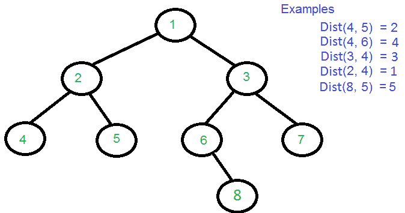
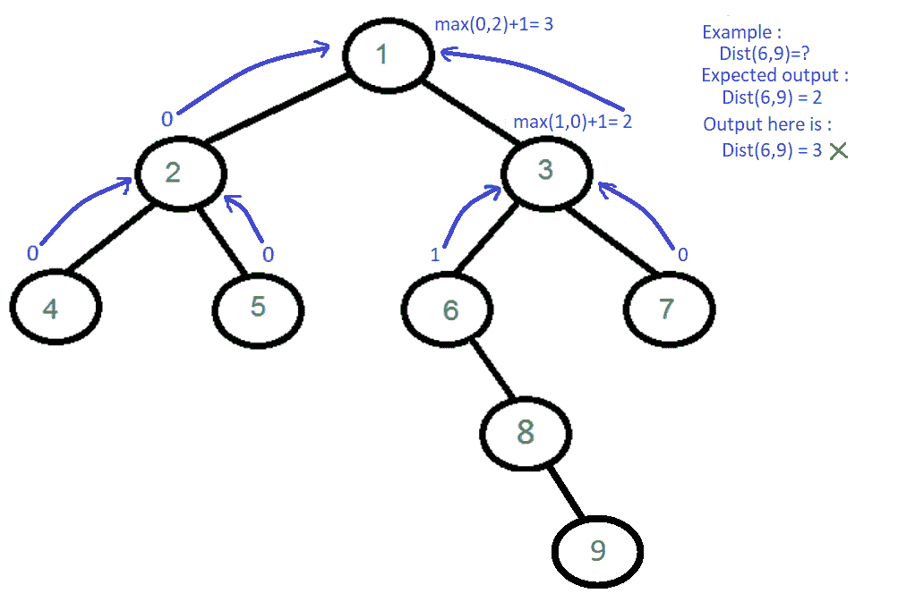

# 求二叉树两个节点之间的距离

> 原文:[https://www . geesforgeks . org/find-二叉树的两个节点之间的距离/](https://www.geeksforgeeks.org/find-distance-between-two-nodes-of-a-binary-tree/)

求二叉树中两个键之间的距离，没有给出父指针。两个节点之间的距离是从一个节点到达另一个节点所需经过的最小边数。



两个节点之间的距离可以用[最低共同祖先](https://www.geeksforgeeks.org/lowest-common-ancestor-binary-tree-set-1/)来表示。下面是公式。

```
Dist(n1, n2) = Dist(root, n1) + Dist(root, n2) - 2*Dist(root, lca) 
'n1' and 'n2' are the two given keys
'root' is root of given Binary Tree.
'lca' is lowest common ancestor of n1 and n2
Dist(n1, n2) is the distance between n1 and n2.
```

下面是上述方法的实现。实现采用了[最低共同祖先帖](https://www.geeksforgeeks.org/lowest-common-ancestor-binary-tree-set-1/)中提供的最后一个代码。

## C++

```
/* C++ program to find distance between n1 and n2 using
   one traversal */
#include <iostream>
using namespace std;

// A Binary Tree Node
struct Node
{
    struct Node *left, *right;
    int key;
};

// Utility function to create a new tree Node
Node* newNode(int key)
{
    Node *temp = new Node;
    temp->key = key;
    temp->left = temp->right = NULL;
    return temp;
}

// Returns level of key k if it is present in tree,
// otherwise returns -1
int findLevel(Node *root, int k, int level)
{
    // Base Case
    if (root == NULL)
        return -1;

    // If key is present at root, or in left subtree
    // or right subtree, return true;
    if (root->key == k)
        return level;

    int l = findLevel(root->left, k, level+1);
    return (l != -1)? l : findLevel(root->right, k, level+1);
}

// This function returns pointer to LCA of two given
// values n1 and n2\. It also sets d1, d2 and dist if
// one key is not ancestor of other
// d1 --> To store distance of n1 from root
// d2 --> To store distance of n2 from root
// lvl --> Level (or distance from root) of current node
// dist --> To store distance between n1 and n2
Node *findDistUtil(Node* root, int n1, int n2, int &d1,
                            int &d2, int &dist, int lvl)
{
    // Base case
    if (root == NULL) return NULL;

    // If either n1 or n2 matches with root's key, report
    // the presence by returning root (Note that if a key is
    // ancestor of other, then the ancestor key becomes LCA
    if (root->key == n1)
    {
         d1 = lvl;
         return root;
    }
    if (root->key == n2)
    {
         d2 = lvl;
         return root;
    }

    // Look for n1 and n2 in left and right subtrees
    Node *left_lca  = findDistUtil(root->left, n1, n2,
                                   d1, d2, dist, lvl+1);
    Node *right_lca = findDistUtil(root->right, n1, n2,
                                   d1, d2, dist, lvl+1);

    // If both of the above calls return Non-NULL, then
    // one key is present in once subtree and other is
    // present in other. So this node is the LCA
    if (left_lca && right_lca)
    {
        dist = d1 + d2 - 2*lvl;
        return root;
    }

    // Otherwise check if left subtree or right subtree
    // is LCA
    return (left_lca != NULL)? left_lca: right_lca;
}

// The main function that returns distance between n1
// and n2\. This function returns -1 if either n1 or n2
// is not present in Binary Tree.
int findDistance(Node *root, int n1, int n2)
{
    // Initialize d1 (distance of n1 from root), d2
    // (distance of n2 from root) and dist(distance
    // between n1 and n2)
    int d1 = -1, d2 = -1, dist;
    Node *lca = findDistUtil(root, n1, n2, d1, d2,
                                          dist, 1);

    // If both n1 and n2 were present in Binary
    // Tree, return dist
    if (d1 != -1 && d2 != -1)
        return dist;

    // If n1 is ancestor of n2, consider n1 as root
    // and find level of n2 in subtree rooted with n1
    if (d1 != -1)
    {
        dist = findLevel(lca, n2, 0);
        return dist;
    }

    // If n2 is ancestor of n1, consider n2 as root
    // and find level of n1 in subtree rooted with n2
    if (d2 != -1)
    {
        dist = findLevel(lca, n1, 0);
        return dist;
    }

    return -1;
}

// Driver program to test above functions
int main()
{
    // Let us create binary tree given in the
    // above example
    Node * root = newNode(1);
    root->left = newNode(2);
    root->right = newNode(3);
    root->left->left = newNode(4);
    root->left->right = newNode(5);
    root->right->left = newNode(6);
    root->right->right = newNode(7);
    root->right->left->right = newNode(8);
    cout << "Dist(4, 5) = " << findDistance(root, 4, 5);
    cout << "nDist(4, 6) = " << findDistance(root, 4, 6);
    cout << "nDist(3, 4) = " << findDistance(root, 3, 4);
    cout << "nDist(2, 4) = " << findDistance(root, 2, 4);
    cout << "nDist(8, 5) = " << findDistance(root, 8, 5);
    return 0;
}
```

## Java 语言(一种计算机语言，尤用于创建网站)

```
// A Java Program to find distance between
// n1 and n2 using one traversal
class GFG
{

// (To the moderator) in Java solution these
// variables are declared as pointers hence
//changes made to them reflects in the whole program

// Global static variable
 static int d1 = -1;
 static int d2 = -1;
 static int dist = 0;

// A Binary Tree Node
static class Node
{
     Node left, right;
     int key;

    // constructor
     Node(int key)
    {
        this.key = key;
        left = null;
        right = null;
    }
}

// Returns level of key k if it is present
// in tree, otherwise returns -1
 static int findLevel(Node root, int k,
                                   int level)
{

    // Base Case
    if (root == null)
    {
        return -1;
    }

    // If key is present at root, or in left
    // subtree or right subtree, return true;
    if (root.key == k)
    {
        return level;
    }

    int l = findLevel(root.left, k, level + 1);
    return (l != -1)? l : findLevel(root.right, k,
                                        level + 1);
}

// This function returns pointer to LCA of
// two given values n1 and n2\. It also sets
// d1, d2 and dist if one key is not ancestor of other
// d1 -. To store distance of n1 from root
// d2 -. To store distance of n2 from root
// lvl -. Level (or distance from root) of current node
// dist -. To store distance between n1 and n2
public static Node findDistUtil(Node root, int n1,
                                   int n2, int lvl)
{

    // Base case
    if (root == null)
    {
        return null;
    }

    // If either n1 or n2 matches with root's
    // key, report the presence by returning
    // root (Note that if a key is ancestor of
    // other, then the ancestor key becomes LCA
    if (root.key == n1)
    {
        d1 = lvl;
        return root;
    }
    if (root.key == n2)
    {
        d2 = lvl;
        return root;
    }

    // Look for n1 and n2 in left and right subtrees
    Node left_lca = findDistUtil(root.left, n1,
                                   n2, lvl + 1);
    Node right_lca = findDistUtil(root.right, n1,
                                     n2, lvl + 1);

    // If both of the above calls return Non-null,
    // then one key is present in once subtree and
    // other is present in other, So this node is the LCA
    if (left_lca != null && right_lca != null)
    {
        dist = (d1 + d2) - 2 * lvl;
        return root;
    }

    // Otherwise check if left subtree
    // or right subtree is LCA
    return (left_lca != null)? left_lca : right_lca;
}

// The main function that returns distance
// between n1 and n2\. This function returns -1
// if either n1 or n2 is not present in
// Binary Tree.
public static int findDistance(Node root, int n1, int n2)
{
    d1 = -1;
    d2 = -1;
    dist = 0;
    Node lca = findDistUtil(root, n1, n2, 1);

    // If both n1 and n2 were present
    // in Binary Tree, return dist
    if (d1 != -1 && d2 != -1)
    {
        return dist;
    }

    // If n1 is ancestor of n2, consider
    // n1 as root and find level
    // of n2 in subtree rooted with n1
    if (d1 != -1)
    {
        dist = findLevel(lca, n2, 0);
        return dist;
    }

    // If n2 is ancestor of n1, consider
    // n2 as root and find level
    // of n1 in subtree rooted with n2
    if (d2 != -1)
    {
        dist = findLevel(lca, n1, 0);
        return dist;
    }
    return -1;
}

// Driver Code
public static void main(String[] args)
{

    // Let us create binary tree given
    // in the above example
    Node root = new Node(1);
    root.left = new Node(2);
    root.right = new Node(3);
    root.left.left = new Node(4);
    root.left.right = new Node(5);
    root.right.left = new Node(6);
    root.right.right = new Node(7);
    root.right.left.right = new Node(8);
    System.out.println("Dist(4, 5) = " +
                       findDistance(root, 4, 5));
    System.out.println("Dist(4, 6) = " +
                       findDistance(root, 4, 6));
    System.out.println("Dist(3, 4) = " +
                       findDistance(root, 3, 4));
    System.out.println("Dist(2, 4) = " +
                       findDistance(root, 2, 4));
    System.out.println("Dist(8, 5) = " +
                       findDistance(root, 8, 5));
}
}

// This code is contributed by gauravrajput1
```

## 计算机编程语言

```
# Python Program to find distance between
# n1 and n2 using one traversal

class Node:
    def __init__(self, data):
        self.data = data
        self.right = None
        self.left = None

def pathToNode(root, path, k):

    # base case handling
    if root is None:
        return False

     # append the node value in path
    path.append(root.data)

    # See if the k is same as root's data
    if root.data == k :
        return True

    # Check if k is found in left or right
    # sub-tree
    if ((root.left != None and pathToNode(root.left, path, k)) or
            (root.right!= None and pathToNode(root.right, path, k))):
        return True

    # If not present in subtree rooted with root,
    # remove root from path and return False
    path.pop()
    return False

def distance(root, data1, data2):
    if root:
        # store path corresponding to node: data1
        path1 = []
        pathToNode(root, path1, data1)

        # store path corresponding to node: data2
        path2 = []
        pathToNode(root, path2, data2)

        # iterate through the paths to find the
        # common path length
        i=0
        while i<len(path1) and i<len(path2):
            # get out as soon as the path differs
            # or any path's length get exhausted
            if path1[i] != path2[i]:
                break
            i = i+1

        # get the path length by deducting the
        # intersecting path length (or till LCA)
        return (len(path1)+len(path2)-2*i)
    else:
        return 0

# Driver Code to test above functions
root = Node(1)
root.left = Node(2)
root.right = Node(3)
root.left.left = Node(4)
root.right.right= Node(7)
root.right.left = Node(6)
root.left.right = Node(5)
root.right.left.right = Node(8)

dist = distance(root, 4, 5)
print "Distance between node {} & {}: {}".format(4, 5, dist)

dist = distance(root, 4, 6)
print "Distance between node {} & {}: {}".format(4, 6, dist)

dist = distance(root, 3, 4)
print "Distance between node {} & {}: {}".format(3, 4, dist)

dist = distance(root, 2, 4)
print "Distance between node {} & {}: {}".format(2, 4, dist)

dist = distance(root, 8, 5)
print "Distance between node {} & {}: {}".format(8, 5, dist)

# This program is contributed by Aartee
```

## C#

```
// A C# Program to find distance between
// n1 and n2 using one traversal
using System;

class GFG
{
// (To the moderator) in c++ solution these
// variables are declared as pointers hence
//changes made to them reflects in the whole program

// Global static variable
public static int d1 = -1;
public static int d2 = -1;
public static int dist = 0;

// A Binary Tree Node
public class Node
{
    public Node left, right;
    public int key;

    // constructor
    public Node(int key)
    {
        this.key = key;
        left = null;
        right = null;
    }
}

// Returns level of key k if it is present
// in tree, otherwise returns -1
public static int findLevel(Node root, int k,
                                   int level)
{
    // Base Case
    if (root == null)
    {
        return -1;
    }

    // If key is present at root, or in left
    // subtree or right subtree, return true;
    if (root.key == k)
    {
        return level;
    }

    int l = findLevel(root.left, k, level + 1);
    return (l != -1)? l : findLevel(root.right, k,
                                        level + 1);
}

// This function returns pointer to LCA of
// two given values n1 and n2\. It also sets
// d1, d2 and dist if one key is not ancestor of other
// d1 --> To store distance of n1 from root
// d2 --> To store distance of n2 from root
// lvl --> Level (or distance from root) of current node
// dist --> To store distance between n1 and n2
public static Node findDistUtil(Node root, int n1,
                                   int n2, int lvl)
{

    // Base case
    if (root == null)
    {
        return null;
    }

    // If either n1 or n2 matches with root's
    // key, report the presence by returning
    // root (Note that if a key is ancestor of
    // other, then the ancestor key becomes LCA
    if (root.key == n1)
    {
        d1 = lvl;
        return root;
    }
    if (root.key == n2)
    {
        d2 = lvl;
        return root;
    }

    // Look for n1 and n2 in left and right subtrees
    Node left_lca = findDistUtil(root.left, n1,
                                   n2, lvl + 1);
    Node right_lca = findDistUtil(root.right, n1,
                                     n2, lvl + 1);

    // If both of the above calls return Non-NULL,
    // then one key is present in once subtree and
    // other is present in other, So this node is the LCA
    if (left_lca != null && right_lca != null)
    {
        dist = (d1 + d2) - 2 * lvl;
        return root;
    }

    // Otherwise check if left subtree
    // or right subtree is LCA
    return (left_lca != null)? left_lca : right_lca;
}

// The main function that returns distance
// between n1 and n2\. This function returns -1
// if either n1 or n2 is not present in
// Binary Tree.
public static int findDistance(Node root, int n1, int n2)
{
    d1 = -1;
    d2 = -1;
    dist = 0;
    Node lca = findDistUtil(root, n1, n2, 1);

    // If both n1 and n2 were present
    // in Binary Tree, return dist
    if (d1 != -1 && d2 != -1)
    {
        return dist;
    }

    // If n1 is ancestor of n2, consider
    // n1 as root and find level
    // of n2 in subtree rooted with n1
    if (d1 != -1)
    {
        dist = findLevel(lca, n2, 0);
        return dist;
    }

    // If n2 is ancestor of n1, consider
    // n2 as root and find level
    // of n1 in subtree rooted with n2
    if (d2 != -1)
    {
        dist = findLevel(lca, n1, 0);
        return dist;
    }

    return -1;
}

// Driver Code
public static void Main(string[] args)
{

    // Let us create binary tree given
    // in the above example
    Node root = new Node(1);
    root.left = new Node(2);
    root.right = new Node(3);
    root.left.left = new Node(4);
    root.left.right = new Node(5);
    root.right.left = new Node(6);
    root.right.right = new Node(7);
    root.right.left.right = new Node(8);

    Console.WriteLine("Dist(4, 5) = " +
                       findDistance(root, 4, 5));
    Console.WriteLine("Dist(4, 6) = " +
                       findDistance(root, 4, 6));
    Console.WriteLine("Dist(3, 4) = " +
                       findDistance(root, 3, 4));
    Console.WriteLine("Dist(2, 4) = " +
                       findDistance(root, 2, 4));
    Console.WriteLine("Dist(8, 5) = " +
                       findDistance(root, 8, 5));
}
}

// This code is contributed by Shrikant13
```

## java 描述语言

```
<script>
    // A Javascript Program to find distance between
    // n1 and n2 using one traversal

    // (To the moderator) in Java solution these
    // variables are declared as pointers hence
    //changes made to them reflects in the whole program

    // Global static variable
     let d1 = -1;
     let d2 = -1;
     let dist = 0;

    class Node
    {
        constructor(key) {
           this.left = null;
           this.right = null;
           this.key = key;
        }
    }

    // Returns level of key k if it is present
    // in tree, otherwise returns -1
    function findLevel(root, k, level)
    {

        // Base Case
        if (root == null)
        {
            return -1;
        }

        // If key is present at root, or in left
        // subtree or right subtree, return true;
        if (root.key == k)
        {
            return level;
        }

        let l = findLevel(root.left, k, level + 1);
        return (l != -1)? l : findLevel(root.right, k, level + 1);
    }

    // This function returns pointer to LCA of
    // two given values n1 and n2\. It also sets
    // d1, d2 and dist if one key is not ancestor of other
    // d1 -. To store distance of n1 from root
    // d2 -. To store distance of n2 from root
    // lvl -. Level (or distance from root) of current node
    // dist -. To store distance between n1 and n2
    function findDistUtil(root, n1, n2, lvl)
    {

        // Base case
        if (root == null)
        {
            return null;
        }

        // If either n1 or n2 matches with root's
        // key, report the presence by returning
        // root (Note that if a key is ancestor of
        // other, then the ancestor key becomes LCA
        if (root.key == n1)
        {
            d1 = lvl;
            return root;
        }
        if (root.key == n2)
        {
            d2 = lvl;
            return root;
        }

        // Look for n1 and n2 in left and right subtrees
        let left_lca = findDistUtil(root.left, n1,
                                       n2, lvl + 1);
        let right_lca = findDistUtil(root.right, n1,
                                         n2, lvl + 1);

        // If both of the above calls return Non-null,
        // then one key is present in once subtree and
        // other is present in other, So this node is the LCA
        if (left_lca != null && right_lca != null)
        {
            dist = (d1 + d2) - 2 * lvl;
            return root;
        }

        // Otherwise check if left subtree
        // or right subtree is LCA
        return (left_lca != null)? left_lca : right_lca;
    }

    // The main function that returns distance
    // between n1 and n2\. This function returns -1
    // if either n1 or n2 is not present in
    // Binary Tree.
    function findDistance(root, n1, n2)
    {
        d1 = -1;
        d2 = -1;
        dist = 0;
        let lca = findDistUtil(root, n1, n2, 1);

        // If both n1 and n2 were present
        // in Binary Tree, return dist
        if (d1 != -1 && d2 != -1)
        {
            return dist;
        }

        // If n1 is ancestor of n2, consider
        // n1 as root and find level
        // of n2 in subtree rooted with n1
        if (d1 != -1)
        {
            dist = findLevel(lca, n2, 0);
            return dist;
        }

        // If n2 is ancestor of n1, consider
        // n2 as root and find level
        // of n1 in subtree rooted with n2
        if (d2 != -1)
        {
            dist = findLevel(lca, n1, 0);
            return dist;
        }
        return -1;
    }

    // Let us create binary tree given
    // in the above example
    let root = new Node(1);
    root.left = new Node(2);
    root.right = new Node(3);
    root.left.left = new Node(4);
    root.left.right = new Node(5);
    root.right.left = new Node(6);
    root.right.right = new Node(7);
    root.right.left.right = new Node(8);
    document.write("Dist(4, 5) = " +
                       findDistance(root, 4, 5) + "</br>");
    document.write("Dist(4, 6) = " +
                       findDistance(root, 4, 6) + "</br>");
    document.write("Dist(3, 4) = " +
                       findDistance(root, 3, 4) + "</br>");
    document.write("Dist(2, 4) = " +
                       findDistance(root, 2, 4) + "</br>");
    document.write("Dist(8, 5) = " +
                       findDistance(root, 8, 5) + "</br>");

</script>
```

**输出:**

```
Dist(4, 5) = 2
Dist(4, 6) = 4
Dist(3, 4) = 3
Dist(2, 4) = 1
Dist(8, 5) = 5
```

***时间复杂度:*** 上述解决方案的时间复杂度为 O(n)，因为该方法进行单棵树遍历。
感谢**阿图尔·辛格**为本岗位提供了初步解决方案。

**更好的解决方案:**
我们首先找到两个节点的 LCA。然后我们求出 LCA 到两个节点的距离。

## C++

```
/* C++ Program to find distance between n1 and n2
   using one traversal */
#include <iostream>
using namespace std;

// A Binary Tree Node
struct Node {
    struct Node *left, *right;
    int key;
};

// Utility function to create a new tree Node
Node* newNode(int key)
{
    Node* temp = new Node;
    temp->key = key;
    temp->left = temp->right = NULL;
    return temp;
}
Node* LCA(Node* root, int n1, int n2)
{
    // Your code here
    if (root == NULL)
        return root;
    if (root->key == n1 || root->key == n2)
        return root;

    Node* left = LCA(root->left, n1, n2);
    Node* right = LCA(root->right, n1, n2);

    if (left != NULL && right != NULL)
        return root;
    if (left == NULL && right == NULL)
        return NULL;
    if (left != NULL)
        return LCA(root->left, n1, n2);

    return LCA(root->right, n1, n2);
}

// Returns level of key k if it is present in
// tree, otherwise returns -1
int findLevel(Node* root, int k, int level)
{
    if (root == NULL)
        return -1;
    if (root->key == k)
        return level;

    int left = findLevel(root->left, k, level + 1);
    if (left == -1)
        return findLevel(root->right, k, level + 1);
    return left;
}

int findDistance(Node* root, int a, int b)
{
    // Your code here
    Node* lca = LCA(root, a, b);

    int d1 = findLevel(lca, a, 0);
    int d2 = findLevel(lca, b, 0);

    return d1 + d2;
}

// Driver program to test above functions
int main()
{
    // Let us create binary tree given in
    // the above example
    Node* root = newNode(1);
    root->left = newNode(2);
    root->right = newNode(3);
    root->left->left = newNode(4);
    root->left->right = newNode(5);
    root->right->left = newNode(6);
    root->right->right = newNode(7);
    root->right->left->right = newNode(8);
    cout << "Dist(4, 5) = " << findDistance(root, 4, 5);
    cout << "\nDist(4, 6) = " << findDistance(root, 4, 6);
    cout << "\nDist(3, 4) = " << findDistance(root, 3, 4);
    cout << "\nDist(2, 4) = " << findDistance(root, 2, 4);
    cout << "\nDist(8, 5) = " << findDistance(root, 8, 5);
    return 0;
}
```

## Java 语言(一种计算机语言，尤用于创建网站)

```
/* Java Program to find distance between n1 and n2
   using one traversal */
public class GFG {

    public static class Node {
        int value;
        Node left;
        Node right;

        public Node(int value) { this.value = value; }
    }

    public static Node LCA(Node root, int n1, int n2)
    {
        if (root == null)
            return root;
        if (root.value == n1 || root.value == n2)
            return root;

        Node left = LCA(root.left, n1, n2);
        Node right = LCA(root.right, n1, n2);

        if (left != null && right != null)
            return root;
        if (left == null && right == null)
            return null;
        if (left != null)
            return LCA(root.left, n1, n2);
        else
            return LCA(root.right, n1, n2);
    }

    // Returns level of key k if it is present in
    // tree, otherwise returns -1
    public static int findLevel(Node root, int a, int level)
    {
        if (root == null)
            return -1;
        if (root.value == a)
            return level;
        int left = findLevel(root.left, a, level + 1);
        if (left == -1)
            return findLevel(root.right, a, level + 1);
        return left;
    }

    public static int findDistance(Node root, int a, int b)
    {
        Node lca = LCA(root, a, b);

        int d1 = findLevel(lca, a, 0);
        int d2 = findLevel(lca, b, 0);

        return d1 + d2;
    }

    // Driver program to test above functions
    public static void main(String[] args)
    {

        // Let us create binary tree given in
        // the above example
        Node root = new Node(1);
        root.left = new Node(2);
        root.right = new Node(3);
        root.left.left = new Node(4);
        root.left.right = new Node(5);
        root.right.left = new Node(6);
        root.right.right = new Node(7);
        root.right.left.right = new Node(8);
        System.out.println("Dist(4, 5) = "
                           + findDistance(root, 4, 5));

        System.out.println("Dist(4, 6) = "
                           + findDistance(root, 4, 6));

        System.out.println("Dist(3, 4) = "
                           + findDistance(root, 3, 4));

        System.out.println("Dist(2, 4) = "
                           + findDistance(root, 2, 4));

        System.out.println("Dist(8, 5) = "
                           + findDistance(root, 8, 5));
    }
}

// This code is contributed by Srinivasan Jayaraman.
```

## 蟒蛇 3

```
"""
A python program to find distance between n1
and n2 in binary tree
"""
# binary tree node

class Node:
    # Constructor to create new node
    def __init__(self, data):
        self.data = data
        self.left = self.right = None

# This function returns pointer to LCA of
# two given values n1 and n2.
def find_least_common_ancestor(root: Node, n1: int, n2: int) -> Node:

    # Base case
    if root is None:
        return root

    # If either n1 or n2 matches with root's
    # key, report the presence by returning root
    if root.data == n1 or root.data == n2:
        return root

    # Look for keys in left and right subtrees
    left = find_least_common_ancestor(root.left, n1, n2)
    right = find_least_common_ancestor(root.right, n1, n2)

    if left and right:
        return root

    # Otherwise check if left subtree or
    # right subtree is Least Common Ancestor
    if left:
        return left
    else:
        return right

# function to find distance of any node
# from root

def find_distance_from_ancestor_node(root: Node, data: int) -> int:

    # case when we reach a beyon leaf node
    # or when tree is empty
    if root is None:
        return -1

    # Node is found then return 0
    if root.data == data:
        return 0

    left = find_distance_from_ancestor_node(root.left, data)
    right = find_distance_from_ancestor_node(root.right, data)
    distance = max(left, right)
    return distance+1 if distance >= 0 else -1

# function to find distance between two
# nodes in a binary tree

def find_distance_between_two_nodes(root: Node, n1: int, n2: int):

    least_common_ancestor = find_least_common_ancestor(root, n1, n2)

    return findLevel(lca, n1) + findLevel(lca, n2) if least_common_ancestor else -1

# Driver program to test above function
root = Node(1)
root.left = Node(2)
root.right = Node(3)
root.left.left = Node(4)
root.left.right = Node(5)
root.right.left = Node(6)
root.right.right = Node(7)
root.right.left.right = Node(8)

print("Dist(4,5) = ", findDistance(root, 4, 5))
print("Dist(4,6) = ", findDistance(root, 4, 6))
print("Dist(3,4) = ", findDistance(root, 3, 4))
print("Dist(2,4) = ", findDistance(root, 2, 4))
print("Dist(8,5) = ", findDistance(root, 8, 5))

# This article is contributed by Shweta Singh.
# This article is improved by Sreeramachandra
```

## C#

```
using System;

/* C# Program to find distance between n1 and n2
   using one traversal */
public class GFG {

    public class Node {
        public int value;
        public Node left;
        public Node right;

        public Node(int value) { this.value = value; }
    }

    public static Node LCA(Node root, int n1, int n2)
    {
        if (root == null) {
            return root;
        }
        if (root.value == n1 || root.value == n2) {
            return root;
        }

        Node left = LCA(root.left, n1, n2);
        Node right = LCA(root.right, n1, n2);

        if (left != null && right != null) {
            return root;
        }
        if (left == null && right == null) {
            return null;
        }

        if (left != null) {
            return LCA(root.left, n1, n2);
        }
        else {
            return LCA(root.right, n1, n2);
        }
    }

    // Returns level of key k if it is present in
    // tree, otherwise returns -1
    public static int findLevel(Node root, int a, int level)
    {
        if (root == null) {
            return -1;
        }
        if (root.value == a) {
            return level;
        }
        int left = findLevel(root.left, a, level + 1);
        if (left == -1) {
            return findLevel(root.right, a, level + 1);
        }
        return left;
    }

    public static int findDistance(Node root, int a, int b)
    {
        Node lca = LCA(root, a, b);

        int d1 = findLevel(lca, a, 0);
        int d2 = findLevel(lca, b, 0);

        return d1 + d2;
    }

    // Driver program to test above functions
    public static void Main(string[] args)
    {

        // Let us create binary tree given in
        // the above example
        Node root = new Node(1);
        root.left = new Node(2);
        root.right = new Node(3);
        root.left.left = new Node(4);
        root.left.right = new Node(5);
        root.right.left = new Node(6);
        root.right.right = new Node(7);
        root.right.left.right = new Node(8);
        Console.WriteLine("Dist(4, 5) = "
                          + findDistance(root, 4, 5));

        Console.WriteLine("Dist(4, 6) = "
                          + findDistance(root, 4, 6));

        Console.WriteLine("Dist(3, 4) = "
                          + findDistance(root, 3, 4));

        Console.WriteLine("Dist(2, 4) = "
                          + findDistance(root, 2, 4));

        Console.WriteLine("Dist(8, 5) = "
                          + findDistance(root, 8, 5));
    }
}

//  This code is contributed by Shrikant13
```

## java 描述语言

```
<script>

// JavaScript Program to find distance
// between n1 and n2 using one traversal
class Node
{
    constructor(value)
    {
        this.value = value;
        this.left = null;
        this.right = null;
    }
}

function LCA(root, n1, n2)
{
    if (root == null)
    {
        return root;
    }
    if (root.value == n1 || root.value == n2)
    {
        return root;
    }

    var left = LCA(root.left, n1, n2);
    var right = LCA(root.right, n1, n2);

    if (left != null && right != null)
    {
        return root;
    }
    if (left == null && right == null)
    {
        return null;
    }

    if (left != null)
    {
        return LCA(root.left, n1, n2);
    }
    else
    {
        return LCA(root.right, n1, n2);
    }
}

// Returns level of key k if it is present in
// tree, otherwise returns -1
function findLevel(root, a, level)
{
    if (root == null)
    {
        return -1;
    }
    if (root.value == a)
    {
        return level;
    }
    var left = findLevel(root.left, a, level + 1);

    if (left == -1)
    {
        return findLevel(root.right, a, level + 1);
    }
    return left;
}

function findDistance(root, a, b)
{
    var lca = LCA(root, a, b);
    var d1 = findLevel(lca, a, 0);
    var d2 = findLevel(lca, b, 0);

    return d1 + d2;
}

// Driver code

// Let us create binary tree given in
// the above example
var root = new Node(1);
root.left = new Node(2);
root.right = new Node(3);
root.left.left = new Node(4);
root.left.right = new Node(5);
root.right.left = new Node(6);
root.right.right = new Node(7);
root.right.left.right = new Node(8);

document.write("Dist(4, 5) = " +
              findDistance(root, 4, 5) + "<br>");
document.write("Dist(4, 6) = " +
              findDistance(root, 4, 6) + "<br>");
document.write("Dist(3, 4) = " +
              findDistance(root, 3, 4) + "<br>");

document.write("Dist(2, 4) = " +
              findDistance(root, 2, 4) + "<br>");

document.write("Dist(8, 5) = " +
              findDistance(root, 8, 5) + "<br>");

// This code is contributed by rdtank

</script>
```

**Output**

```
Dist(4, 5) = 2
Dist(4, 6) = 4
Dist(3, 4) = 3
Dist(2, 4) = 1
Dist(8, 5) = 5
```

感谢 NILMADHAB MONDAL 提出这个解决方案。

**另一个更好的解决方案(一遍):**

我们知道两个节点之间距离(假设 n1 和 n2)= LCA 和 n1 之间的距离+LCA 和 N2 之间的距离。

您可能想到的使用上述公式的一般解决方案是:

> int findDistance(Node* root，int n1，int N2){ 0
> 
> if(！root)返回 0；
> 
> if(root-> data = = n1 | | root-> data = = N2)
> 
> 返回 1；
> 
> int left = find distance(root-> left，n1，N2)；
> 
> int right = find distance(root-> right，n1，N2)；
> 
> 如果(左&&右)
> 
> 返回左+右；
> 
> else if(左||右)
> 
> 返回最大值(左、右)+1；
> 
> 返回 0；
> 
> }

但是当 n2 是 n1 的后代或者 n1 是 n2 的后代时，这个解决方案有一个缺陷(缺少边的情况)。

下面是上面代码的模拟运行，带有边缘案例示例:



在上面的二叉树中，预期的输出是 2，但是函数给出的输出是 3。下面给出的解决方案代码克服了这种情况:

**注意:**n1 和 n2 都应该出现在二叉树中。

## C++

```
/* C++ Program to find distance between n1 and n2
   using one traversal */
#include <iostream>
using namespace std;

// A Binary Tree Node
struct Node {
    struct Node *left, *right;
    int key;
};

// Utility function to create a new tree Node
Node* newNode(int key)
{
    Node* temp = new Node;
    temp->key = key;
    temp->left = temp->right = NULL;
    return temp;
}
//Global variable to store distance
//between n1 and n2.
int ans;
//Function that finds distance between two node.
int _findDistance(Node* root, int n1, int n2)
{
    if (!root) return 0;
    int left = _findDistance(root->left, n1, n2);
    int right = _findDistance(root->right, n1, n2);
      //if any node(n1 or n2) is found
    if (root->key == n1 || root->key == n2)
    {   
          //check if their is any descendant(n1 or n2)
          //if decendant exist then distance between descendant
          //and current root will be our answer.
        if (left || right)
        {
            ans = max(left, right);
            return 0;
        }
        else
            return 1;
    }
      //if current root is LCA of n1 and n2.
    else if (left && right)
    {   
        ans = left + right;
        return 0;
    }
      //if their is a descendent(n1 or n2).
    else if (left || right)
          //increment its distance
        return max(left, right) + 1;
    //if neither n1 nor n2 exist as descendant.
    return 0;
}
// The main function that returns distance between n1
// and n2.
int findDistance(Node* root, int n1, int n2)
{
    ans = 0;
    _findDistance(root, n1, n2);
    return ans;
}

// Driver program to test above functions
int main()
{
    // Let us create binary tree given in
    // the above example
    Node* root = newNode(1);
    root->left = newNode(2);
    root->right = newNode(3);
    root->left->left = newNode(4);
    root->left->right = newNode(5);
    root->right->left = newNode(6);
    root->right->right = newNode(7);
    root->right->left->right = newNode(8);
    cout << "Dist(4, 5) = " << findDistance(root, 4, 5);
    cout << "\nDist(4, 6) = " << findDistance(root, 4, 6);
    cout << "\nDist(3, 4) = " << findDistance(root, 3, 4);
    cout << "\nDist(2, 4) = " << findDistance(root, 2, 4);
    cout << "\nDist(8, 5) = " << findDistance(root, 8, 5);
    return 0;
}
```

## Java 语言(一种计算机语言，尤用于创建网站)

```
/* Java Program to find distance between n1 and n2
   using one traversal */
public class Main {

    public static class Node {
        int value;
        Node left;
        Node right;

        public Node(int value) { this.value = value; }
    }
    //variable to store distance
    //between n1 and n2.
    public static int ans;
    //Function that finds distance between two node.
    public static int _findDistance(Node root, int n1, int n2)
    {
        if (root == null) return 0;
        int left = _findDistance(root.left, n1, n2);
        int right = _findDistance(root.right, n1, n2);
        //if any node(n1 or n2) is found
        if (root.value == n1 || root.value == n2)
        {   
              //check if their is any descendant(n1 or n2)
            //if decendant exist then distance between descendant
            //and current root will be our answer.
            if (left != 0 || right != 0)
            {
                ans = Math.max(left, right);
                return 0;
            }
            else
                return 1;
        }
          //if current root is LCA of n1 and n2.
        else if (left != 0 && right != 0)
        {
            ans = left + right;
            return 0;
        }
          //if their is a descendent(n1 or n2).
        else if (left != 0 || right != 0)
              //increment its distance
            return Math.max(left, right) + 1;
        //if neither n1 nor n2 exist as descendant.
        return 0;
    }
    // The main function that returns distance between n1
    // and n2.
    public static int findDistance(Node root, int n1, int n2)
    {
        ans = 0;
        _findDistance(root, n1, n2);
        return ans;
    }

    // Driver program to test above functions
    public static void main(String[] args)
    {

        // Let us create binary tree given in
        // the above example
        Node root = new Node(1);
        root.left = new Node(2);
        root.right = new Node(3);
        root.left.left = new Node(4);
        root.left.right = new Node(5);
        root.right.left = new Node(6);
        root.right.right = new Node(7);
        root.right.left.right = new Node(8);
        System.out.println("Dist(4, 5) = "
                           + findDistance(root, 4, 5));

        System.out.println("Dist(4, 6) = "
                           + findDistance(root, 4, 6));

        System.out.println("Dist(3, 4) = "
                           + findDistance(root, 3, 4));

        System.out.println("Dist(2, 4) = "
                           + findDistance(root, 2, 4));

        System.out.println("Dist(8, 5) = "
                           + findDistance(root, 8, 5));
    }
}
```

**Output**

```
Dist(4, 5) = 2
Dist(4, 6) = 4
Dist(3, 4) = 3
Dist(2, 4) = 1
Dist(8, 5) = 5
```

感谢[古鲁德夫·辛格](https://auth.geeksforgeeks.org/user/gurudev620gs/)提出这个解决方案。
如发现任何不正确的地方，请写评论，或者您想分享更多关于上述话题的信息