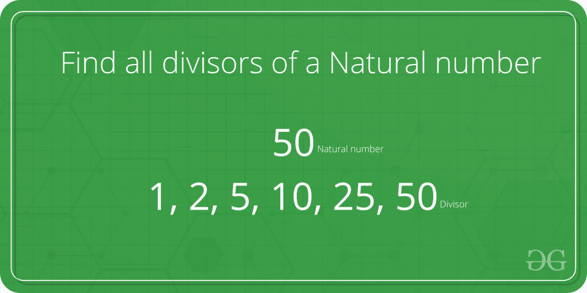

# 求自然数的所有因子|集合 1

> 原文:[https://www . geesforgeks . org/find-divisioners-自然数-set-1/](https://www.geeksforgeeks.org/find-divisors-natural-number-set-1/)

给定一个自然数 n，打印它的所有不同除数。



**示例:**

```
 Input : n = 10       
 Output: 1 2 5 10

 Input: n = 100
 Output: 1 2 4 5 10 20 25 50 100

 Input: n = 125
 Output: 1 5 25 125
```

注意这个问题不同于[求所有质因数](https://www.geeksforgeeks.org/print-all-prime-factors-of-a-given-number/)。

一个简单的解决方案是从 1 到 n 迭代所有的数字，检查那个数字是否除以 n 并打印出来。下面是同样的程序:

## C++

```
// C++ implementation of Naive method to print all
// divisors
#include <iostream>
using namespace std;

// function to print the divisors
void printDivisors(int n)
{
    for (int i = 1; i <= n; i++)
        if (n % i == 0)
            cout <<" " << i;
}

/* Driver program to test above function */
int main()
{
    cout <<"The divisors of 100 are: \n";
    printDivisors(100);
    return 0;
}

// this code is contributed by shivanisinghss2110
```

## C

```
// C implementation of Naive method to print all
// divisors
#include<stdio.h>

// function to print the divisors
void printDivisors(int n)
{
    for (int i=1;i<=n;i++)
        if (n%i==0)
            printf("%d ",i);
}

/* Driver program to test above function */
int main()
{
    printf("The divisors of 100 are: \n");
    printDivisors(100);
    return 0;
}
```

## Java 语言(一种计算机语言，尤用于创建网站)

```
// Java implementation of Naive method to print all
// divisors

class Test
{
    // method to print the divisors
    static void printDivisors(int n)
    {
        for (int i=1;i<=n;i++)
            if (n%i==0)
                System.out.print(i+" ");
    }

    // Driver method
    public static void main(String args[])
    {
        System.out.println("The divisors of 100 are: ");
        printDivisors(100);;
    }
}
```

## 计算机编程语言

```
# Python implementation of Naive method
# to print all divisors

# method to print the divisors
def printDivisors(n) :
    i = 1
    while i <= n :
        if (n % i==0) :
            print i,
        i = i + 1

# Driver method
print "The divisors of 100 are: "
printDivisors(100)

#This code is contributed by Nikita Tiwari.
```

## C#

```
// C# implementation of Naive method 
// to print all divisors
using System;

class GFG {

    // method to print the divisors
    static void printDivisors(int n)
    {
        for (int i = 1; i <= n; i++)
            if (n % i == 0)
                Console.Write( i + " ");
    }

    // Driver method
    public static void Main()
    {
        Console.Write("The divisors of",
                          " 100 are: ");
        printDivisors(100);;
    }
}

// This code is contributed by nitin mittal.
```

## 服务器端编程语言（Professional Hypertext Preprocessor 的缩写）

```
<?php
// PHP implementation of Naive 
// method to print all divisors

// function to print the divisors
function printDivisors($n)
{
    for ($i = 1; $i <= $n; $i++)
        if ($n % $i == 0)
            echo $i," ";
}

// Driver Code
echo "The divisors of 100 are:\n";
printDivisors(100);

// This code is contributed by ajit
?>
```

## java 描述语言

```
<script>

// Javascript implementation of Naive method to print all 
// divisors 

// function to print the divisors 
function printDivisors(n) 
{ 
    for (i=1;i<=n;i++) 
        if (n%i==0) 
            document.write(i+ " "); 
} 

/* Driver program to test above function */

    document.write("The divisors of 100 are:" + "<br>"); 
    printDivisors(100);

// This code is contributed by Mayank Tyagi

</script>
```

**输出:**

```
The divisors of 100 are: 
1 2 4 5 10 20 25 50 100
```

**时间复杂度:**O(n)
T3】辅助空间: O(1)

**能否对上述解决方案进行改进？**
如果我们仔细看，所有的除数都是成对出现的。例如，如果 n = 100，那么各种除数对是:(1，100)、(2，50)、(4，25)、(5，20)、(10，10)
利用这个事实，我们可以大大加快我们的程序。
然而，如果像(10，10)那样有两个相等的约数，我们就要小心了。在这种情况下，我们只会打印其中一个。

下面是其实现:

## C++

```
// A Better (than Naive) Solution to find all divisiors
#include <iostream>
#include <math.h>
using namespace std;

// Function to print the divisors
void printDivisors(int n)
{
    // Note that this loop runs till square root
    for (int i=1; i<=sqrt(n); i++)
    {
        if (n%i == 0)
        {
            // If divisors are equal, print only one
            if (n/i == i)
                cout <<" "<< i;

            else // Otherwise print both
                cout << " "<< i << " " << n/i;
        }
    }
}

/* Driver program to test above function */
int main()
{
    cout <<"The divisors of 100 are: \n";
    printDivisors(100);
    return 0;
}

// this code is contributed by shivanisinghss2110
```

## C

```
// A Better (than Naive) Solution to find all divisiors
#include <stdio.h>
#include <math.h>

// Function to print the divisors
void printDivisors(int n)
{
    // Note that this loop runs till square root
    for (int i=1; i<=sqrt(n); i++)
    {
        if (n%i == 0)
        {
            // If divisors are equal, print only one
            if (n/i == i)
                printf("%d ", i);

            else // Otherwise print both
                printf("%d %d ", i, n/i);
        }
    }
}

/* Driver program to test above function */
int main()
{
    printf("The divisors of 100 are: \n");
    printDivisors(100);
    return 0;
}
```

## Java 语言(一种计算机语言，尤用于创建网站)

```
// A Better (than Naive) Solution to find all divisors

class Test
{
    // method to print the divisors
    static void printDivisors(int n)
    {
        // Note that this loop runs till square root
        for (int i=1; i<=Math.sqrt(n); i++)
        {
            if (n%i==0)
            {
                // If divisors are equal, print only one
                if (n/i == i)
                    System.out.print(" "+ i);

                else // Otherwise print both
                    System.out.print(i+" " + n/i + " " );
            }
        }
    }

    // Driver method
    public static void main(String args[])
    {
        System.out.println("The divisors of 100 are: ");
        printDivisors(100);;
    }
}
```

## 计算机编程语言

```
# A Better (than Naive) Solution to find all divisiors
import math 

# method to print the divisors
def printDivisors(n) :

    # Note that this loop runs till square root
    i = 1
    while i <= math.sqrt(n):

        if (n % i == 0) :

            # If divisors are equal, print only one
            if (n / i == i) :
                print i,
            else :
                # Otherwise print both
                print i , n/i,
        i = i + 1

# Driver method
print "The divisors of 100 are: "
printDivisors(100)

#This code is contributed by Nikita Tiwari.
```

## C#

```
// A Better (than Naive) Solution to
// find all divisors
using System;

class GFG {

    // method to print the divisors
    static void printDivisors(int n)
    {

        // Note that this loop runs 
        // till square root
        for (int i = 1; i <= Math.Sqrt(n);
                                      i++)
        {
            if (n % i == 0)
            {

                // If divisors are equal,
                // print only one
                if (n / i == i)
                    Console.Write(i + " ");

                // Otherwise print both
                else 
                    Console.Write(i + " " 
                            + n / i + " ");
            }
        }
    }

    // Driver method
    public static void Main()
    {
        Console.Write("The divisors of "
                          + "100 are: \n");
        printDivisors(100);
    }
}

// This code is contributed by Smitha
```

## 服务器端编程语言（Professional Hypertext Preprocessor 的缩写）

```
<?php
// A Better (than Naive) Solution
// to find all divisiors

// Function to print the divisors
function printDivisors($n)
{

    // Note that this loop
    // runs till square root
    for ($i = 1; $i <= sqrt($n); $i++)
    {
        if ($n%$i == 0)
        {

            // If divisors are equal,
            // print only one
            if ($n / $i == $i)
                echo $i," ";

            // Otherwise print both
            else 
                echo $i," ", $n/$i," ";
        }
    }
}

    // Driver Code
    echo "The divisors of 100 are: \n";
    printDivisors(100);

// This code is contributed by anuj_67.

?>
```

## java 描述语言

```
<script>

// A Better (than Naive) Solution to find all divisiors

// Function to print the divisors
function printDivisors(n)
{

    // Note that this loop runs till square root
    for(let i = 1; i <= Math.sqrt(n); i++)
    {
        if (n % i == 0)
        {

            // If divisors are equal, print only one
            if (parseInt(n / i, 10) == i)
                document.write(i);

            // Otherwise print both
            else 
                document.write(i + " " + 
                      parseInt(n / i, 10) + " ");
        }
    }
}

// Driver code 
document.write("The divisors of 100 are: </br>");
printDivisors(100);

// This code is contributed by divyesh072019

</script>
```

**输出:**

```
The divisors of 100 are: 
1 100 2 50 4 25 5 20 10
```

时间复杂度:O(sqrt(n))
辅助空间:O(1)

然而，解决方案中还有一个小问题，你能猜到吗？
对！输出不是我们使用暴力技术得到的有序方式。请参考下面的 O(sqrt(n))时间解决方案，它按排序顺序打印除数。
[求自然数的所有约数|集合 2](https://www.geeksforgeeks.org/find-all-divisors-of-a-natural-number-set-2/)
本文由[阿舒托什·库马尔](https://www.linkedin.com/in/ashutosh-kumar-9527a7105?trk=nav_responsive_tab_profile)供稿。如果您发现任何不正确的地方，或者您想分享更多关于上面讨论的主题的信息，请写评论