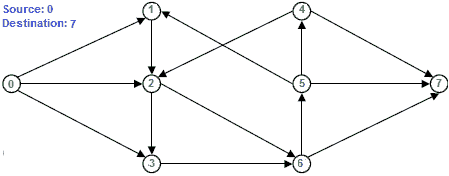
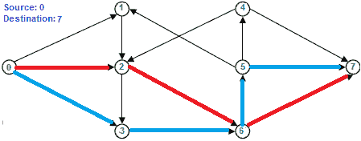

# 求两个顶点间最大边不相交路径数

> 原文:[https://www . geeksforgeeks . org/find-edge-disjoint-path-two-顶点/](https://www.geeksforgeeks.org/find-edge-disjoint-paths-two-vertices/)

给定一个有向图和其中的两个顶点，源‘s’和目的地‘t’，找出从 s 到 t 的最大边不相交路径数。如果两条路径不共享任何边，则称它们是边不相交的。



在上图中，从源 0 到目的地 7 最多可以有两条边缘不相交的路径。两条边缘不相交的路径在下面用红色突出显示，蓝色为 0-2-6-7 和 0-3-6-5-7。



请注意，路径可能不同，但最大数量相同。例如，在上图中，另一组可能的路径分别是 0-1-2-6-7 和 0-3-6-5-7。

这个问题可以通过减少到[最大流量问题](https://www.geeksforgeeks.org/ford-fulkerson-algorithm-for-maximum-flow-problem/)来解决。以下是步骤。
**1)** 将给定的源和目的地视为流量网络中的源和汇。为每条边分配单位容量。
**2)** 运行 Ford-Fulkerson 算法，寻找从源到汇的最大流量。
**3)** 最大流量等于最大边不相交路径数。

当我们运行福特-富尔克森时，我们减少了一个单位的产能。因此，边缘不能再次使用。所以最大流量等于边不相交路径的最大数量。

下面是上述算法的实现。大部分代码取自[这里](https://www.geeksforgeeks.org/ford-fulkerson-algorithm-for-maximum-flow-problem/)。

## C++

```
// C++ program to find maximum number of edge disjoint paths
#include <iostream>
#include <limits.h>
#include <string.h>
#include <queue>
using namespace std;

// Number of vertices in given graph
#define V 8

/* Returns true if there is a path from source 's' to sink 't' in
residual graph. Also fills parent[] to store the path */
bool bfs(int rGraph[V][V], int s, int t, int parent[])
{
    // Create a visited array and mark all vertices as not visited
    bool visited[V];
    memset(visited, 0, sizeof(visited));

    // Create a queue, enqueue source vertex and mark source vertex
    // as visited
    queue <int> q;
    q.push(s);
    visited[s] = true;
    parent[s] = -1;

    // Standard BFS Loop
    while (!q.empty())
    {
        int u = q.front();
        q.pop();

        for (int v=0; v<V; v++)
        {
            if (visited[v]==false && rGraph[u][v] > 0)
            {
                q.push(v);
                parent[v] = u;
                visited[v] = true;
            }
        }
    }

    // If we reached sink in BFS starting from source, then return
    // true, else false
    return (visited[t] == true);
}

// Returns tne maximum number of edge-disjoint paths from s to t.
// This function is copy of forFulkerson() discussed at http://goo.gl/wtQ4Ks
int findDisjointPaths(int graph[V][V], int s, int t)
{
    int u, v;

    // Create a residual graph and fill the residual graph with
    // given capacities in the original graph as residual capacities
    // in residual graph
    int rGraph[V][V]; // Residual graph where rGraph[i][j] indicates
                    // residual capacity of edge from i to j (if there
                    // is an edge. If rGraph[i][j] is 0, then there is not)
    for (u = 0; u < V; u++)
        for (v = 0; v < V; v++)
            rGraph[u][v] = graph[u][v];

    int parent[V]; // This array is filled by BFS and to store path

    int max_flow = 0; // There is no flow initially

    // Augment the flow while there is path from source to sink
    while (bfs(rGraph, s, t, parent))
    {
        // Find minimum residual capacity of the edges along the
        // path filled by BFS. Or we can say find the maximum flow
        // through the path found.
        int path_flow = INT_MAX;

        for (v=t; v!=s; v=parent[v])
        {
            u = parent[v];
            path_flow = min(path_flow, rGraph[u][v]);
        }

        // update residual capacities of the edges and reverse edges
        // along the path
        for (v=t; v != s; v=parent[v])
        {
            u = parent[v];
            rGraph[u][v] -= path_flow;
            rGraph[v][u] += path_flow;
        }

        // Add path flow to overall flow
        max_flow += path_flow;
    }

    // Return the overall flow (max_flow is equal to maximum
    // number of edge-disjoint paths)
    return max_flow;
}

// Driver program to test above functions
int main()
{
    // Let us create a graph shown in the above example
    int graph[V][V] = { {0, 1, 1, 1, 0, 0, 0, 0},
                        {0, 0, 1, 0, 0, 0, 0, 0},
                        {0, 0, 0, 1, 0, 0, 1, 0},
                        {0, 0, 0, 0, 0, 0, 1, 0},
                        {0, 0, 1, 0, 0, 0, 0, 1},
                        {0, 1, 0, 0, 0, 0, 0, 1},
                        {0, 0, 0, 0, 0, 1, 0, 1},
                        {0, 0, 0, 0, 0, 0, 0, 0}
                    };

    int s = 0;
    int t = 7;
    cout << "There can be maximum " << findDisjointPaths(graph, s, t)
        << " edge-disjoint paths from " << s <<" to "<< t ;

    return 0;
}
```

## Java 语言(一种计算机语言，尤用于创建网站)

```
// Java program to find maximum number
// of edge disjoint paths
import java.util.*;

class GFG
{

// Number of vertices in given graph
static int V = 8;

/* Returns true if there is a path from
source 's' to sink 't' in residual graph.
Also fills parent[] to store the path */
static boolean bfs(int rGraph[][], int s,
                   int t, int parent[])
{
    // Create a visited array and
    // mark all vertices as not visited
    boolean []visited = new boolean[V];

    // Create a queue, enqueue source vertex and
    // mark source vertex as visited
    Queue <Integer> q = new LinkedList<>();
    q.add(s);
    visited[s] = true;
    parent[s] = -1;

    // Standard BFS Loop
    while (!q.isEmpty())
    {
        int u = q.peek();
        q.remove();

        for (int v = 0; v < V; v++)
        {
            if (visited[v] == false &&
                rGraph[u][v] > 0)
            {
                q.add(v);
                parent[v] = u;
                visited[v] = true;
            }
        }
    }

    // If we reached sink in BFS
    // starting from source, then
    // return true, else false
    return (visited[t] == true);
}

// Returns tne maximum number of edge-disjoint
// paths from s to t. This function is copy of
// forFulkerson() discussed at http://goo.gl/wtQ4Ks
static int findDisjointPaths(int graph[][], int s, int t)
{
    int u, v;

    // Create a residual graph and fill the
    // residual graph with given capacities
    // in the original graph as residual capacities
    // in residual graph

    // Residual graph where rGraph[i][j] indicates
    // residual capacity of edge from i to j (if there
    // is an edge. If rGraph[i][j] is 0, then there is not)
    int [][]rGraph = new int[V][V];
    for (u = 0; u < V; u++)
        for (v = 0; v < V; v++)
            rGraph[u][v] = graph[u][v];

    // This array is filled by BFS and to store path
    int []parent = new int[V];

    int max_flow = 0; // There is no flow initially

    // Augment the flow while there is path
    // from source to sink
    while (bfs(rGraph, s, t, parent))
    {
        // Find minimum residual capacity of the edges
        // along the path filled by BFS. Or we can say
        // find the maximum flow through the path found.
        int path_flow = Integer.MAX_VALUE;

        for (v = t; v != s; v = parent[v])
        {
            u = parent[v];
            path_flow = Math.min(path_flow, rGraph[u][v]);
        }

        // update residual capacities of the edges and
        // reverse edges along the path
        for (v = t; v != s; v = parent[v])
        {
            u = parent[v];
            rGraph[u][v] -= path_flow;
            rGraph[v][u] += path_flow;
        }

        // Add path flow to overall flow
        max_flow += path_flow;
    }

    // Return the overall flow (max_flow is equal to
    // maximum number of edge-disjoint paths)
    return max_flow;
}

// Driver Code
public static void main(String[] args)
{
    // Let us create a graph shown in the above example
    int graph[][] = {{0, 1, 1, 1, 0, 0, 0, 0},
                     {0, 0, 1, 0, 0, 0, 0, 0},
                     {0, 0, 0, 1, 0, 0, 1, 0},
                     {0, 0, 0, 0, 0, 0, 1, 0},
                     {0, 0, 1, 0, 0, 0, 0, 1},
                     {0, 1, 0, 0, 0, 0, 0, 1},
                      {0, 0, 0, 0, 0, 1, 0, 1},
                     {0, 0, 0, 0, 0, 0, 0, 0}};

    int s = 0;
    int t = 7;
    System.out.println("There can be maximum " +
                findDisjointPaths(graph, s, t) +
                  " edge-disjoint paths from " +
                                 s + " to "+ t);
}
}

// This code is contributed by PrinciRaj1992
```

## 计算机编程语言

```
# Python program to find maximum number of edge disjoint paths
# Complexity : (E*(V^3))
# Total augmenting path = VE
# and BFS with adj matrix takes :V^2 times

from collections import defaultdict

#This class represents a directed graph using
# adjacency matrix representation
class Graph:

    def __init__(self,graph):
        self.graph = graph # residual graph
        self. ROW = len(graph)

    '''Returns true if there is a path from source 's' to sink 't' in
    residual graph. Also fills parent[] to store the path '''
    def BFS(self,s, t, parent):

        # Mark all the vertices as not visited
        visited =[False]*(self.ROW)

        # Create a queue for BFS
        queue=[]

        # Mark the source node as visited and enqueue it
        queue.append(s)
        visited[s] = True

         # Standard BFS Loop
        while queue:

            #Dequeue a vertex from queue and print it
            u = queue.pop(0)

            # Get all adjacent vertices of the dequeued vertex u
            # If a adjacent has not been visited, then mark it
            # visited and enqueue it
            for ind, val in enumerate(self.graph[u]):
                if visited[ind] == False and val > 0 :
                    queue.append(ind)
                    visited[ind] = True
                    parent[ind] = u

        # If we reached sink in BFS starting from source, then return
        # true, else false
        return True if visited[t] else False

    # Returns tne maximum number of edge-disjoint paths from
    #s to t in the given graph
    def findDisjointPaths(self, source, sink):

        # This array is filled by BFS and to store path
        parent = [-1]*(self.ROW)

        max_flow = 0 # There is no flow initially

        # Augment the flow while there is path from source to sink
        while self.BFS(source, sink, parent) :

            # Find minimum residual capacity of the edges along the
            # path filled by BFS. Or we can say find the maximum flow
            # through the path found.
            path_flow = float("Inf")
            s = sink
            while(s !=  source):
                path_flow = min (path_flow, self.graph[parent[s]][s])
                s = parent[s]

            # Add path flow to overall flow
            max_flow +=  path_flow

            # update residual capacities of the edges and reverse edges
            # along the path
            v = sink
            while(v !=  source):
                u = parent[v]
                self.graph[u][v] -= path_flow
                self.graph[v][u] += path_flow
                v = parent[v]

        return max_flow

# Create a graph given in the above diagram

graph = [[0, 1, 1, 1, 0, 0, 0, 0],
        [0, 0, 1, 0, 0, 0, 0, 0],
        [0, 0, 0, 1, 0, 0, 1, 0],
        [0, 0, 0, 0, 0, 0, 1, 0],
        [0, 0, 1, 0, 0, 0, 0, 1],
        [0, 1, 0, 0, 0, 0, 0, 1],
        [0, 0, 0, 0, 0, 1, 0, 1],
        [0, 0, 0, 0, 0, 0, 0, 0]]

g = Graph(graph)

source = 0; sink = 7

print ("There can be maximum %d edge-disjoint paths from %d to %d" %
            (g.findDisjointPaths(source, sink), source, sink))

# This code is contributed by Neelam Yadav
```

## C#

```
// C# program to find maximum number
// of edge disjoint paths
using System;
using System.Collections.Generic;

class GFG
{

// Number of vertices in given graph
static int V = 8;

/* Returns true if there is a path from
source 's' to sink 't' in residual graph.
Also fills parent[] to store the path */
static bool bfs(int [,]rGraph, int s,
                int t, int []parent)
{
    // Create a visited array and
    // mark all vertices as not visited
    bool []visited = new bool[V];

    // Create a queue, enqueue source vertex
    // and mark source vertex as visited
    Queue <int> q = new Queue <int>();
    q.Enqueue(s);
    visited[s] = true;
    parent[s] = -1;

    // Standard BFS Loop
    while (q.Count != 0)
    {
        int u = q.Peek();
        q.Dequeue();

        for (int v = 0; v < V; v++)
        {
            if (visited[v] == false &&
                rGraph[u, v] > 0)
            {
                q.Enqueue(v);
                parent[v] = u;
                visited[v] = true;
            }
        }
    }

    // If we reached sink in BFS
    // starting from source, then
    // return true, else false
    return (visited[t] == true);
}

// Returns tne maximum number of edge-disjoint
// paths from s to t. This function is copy of
// forFulkerson() discussed at http://goo.gl/wtQ4Ks
static int findDisjointPaths(int [,]graph,
                             int s, int t)
{
    int u, v;

    // Create a residual graph and fill the
    // residual graph with given capacities
    // in the original graph as residual capacities
    // in residual graph

    // Residual graph where rGraph[i,j] indicates
    // residual capacity of edge from i to j (if there
    // is an edge. If rGraph[i,j] is 0, then there is not)
    int [,]rGraph = new int[V, V];
    for (u = 0; u < V; u++)
        for (v = 0; v < V; v++)
            rGraph[u, v] = graph[u, v];

    // This array is filled by BFS and
    // to store path
    int []parent = new int[V];

    int max_flow = 0; // There is no flow initially

    // Augment the flow while there is path
    // from source to sink
    while (bfs(rGraph, s, t, parent))
    {
        // Find minimum residual capacity of the edges
        // along the path filled by BFS. Or we can say
        // find the maximum flow through the path found.
        int path_flow = int.MaxValue;

        for (v = t; v != s; v = parent[v])
        {
            u = parent[v];
            path_flow = Math.Min(path_flow,
                                 rGraph[u, v]);
        }

        // update residual capacities of the edges
        // and reverse edges along the path
        for (v = t; v != s; v = parent[v])
        {
            u = parent[v];
            rGraph[u, v] -= path_flow;
            rGraph[v, u] += path_flow;
        }

        // Add path flow to overall flow
        max_flow += path_flow;
    }

    // Return the overall flow (max_flow is equal to
    // maximum number of edge-disjoint paths)
    return max_flow;
}

// Driver Code
public static void Main(String[] args)
{
    // Let us create a graph shown
    // in the above example
    int [,]graph = {{0, 1, 1, 1, 0, 0, 0, 0},
                    {0, 0, 1, 0, 0, 0, 0, 0},
                    {0, 0, 0, 1, 0, 0, 1, 0},
                    {0, 0, 0, 0, 0, 0, 1, 0},
                    {0, 0, 1, 0, 0, 0, 0, 1},
                    {0, 1, 0, 0, 0, 0, 0, 1},
                    {0, 0, 0, 0, 0, 1, 0, 1},
                    {0, 0, 0, 0, 0, 0, 0, 0}};

    int s = 0;
    int t = 7;
    Console.WriteLine("There can be maximum " +
               findDisjointPaths(graph, s, t) +
                 " edge-disjoint paths from " +
                                s + " to "+ t);
}
}

// This code is contributed by Rajput-Ji
```

## java 描述语言

```
<script>

// Javascript program to find maximum number
// of edge disjoint paths

// Number of vertices in given graph
let V = 8;

/* Returns true if there is a path from
source 's' to sink 't' in residual graph.
Also fills parent[] to store the path */
function bfs(rGraph, s, t, parent)
{

    // Create a visited array and
    // mark all vertices as not visited
    let visited = new Array(V);
      for(let i = 0; i < V; i++)
        visited[i] = false;

    // Create a queue, enqueue source vertex and
    // mark source vertex as visited
    let q = [];
    q.push(s);
    visited[s] = true;
    parent[s] = -1;

    // Standard BFS Loop
    while (q.length != 0)
    {
        let u = q[0];
        q.shift();

        for(let v = 0; v < V; v++)
        {
            if (visited[v] == false &&
                rGraph[u][v] > 0)
            {
                q.push(v);
                parent[v] = u;
                visited[v] = true;
            }
        }
    }

    // If we reached sink in BFS
    // starting from source, then
    // return true, else false
    return (visited[t] == true);
}

// Returns tne maximum number of edge-disjoint
// paths from s to t. This function is copy of
// forFulkerson() discussed at http://goo.gl/wtQ4Ks
function findDisjointPaths(graph, s, t)
{
    let u, v;

    // Create a residual graph and fill the
    // residual graph with given capacities
    // in the original graph as residual capacities
    // in residual graph

    // Residual graph where rGraph[i][j] indicates
    // residual capacity of edge from i to j (if
    // there is an edge. If rGraph[i][j] is 0,
    // then there is not)
    let rGraph = new Array(V);
    for(u = 0; u < V; u++)
    {
        rGraph[u] = new Array(V);
        for(v = 0; v < V; v++)
            rGraph[u][v] = graph[u][v];
     }

    // This array is filled by BFS and to store path
    let parent = new Array(V);

    // There is no flow initially
    let max_flow = 0;

    // Augment the flow while there is path
    // from source to sink
    while (bfs(rGraph, s, t, parent))
    {

        // Find minimum residual capacity of the edges
        // along the path filled by BFS. Or we can say
        // find the maximum flow through the path found.
        let path_flow = Number.MAX_VALUE;

        for(v = t; v != s; v = parent[v])
        {
            u = parent[v];
            path_flow = Math.min(path_flow,
                                 rGraph[u][v]);
        }

        // Update residual capacities of the edges and
        // reverse edges along the path
        for(v = t; v != s; v = parent[v])
        {
            u = parent[v];
            rGraph[u][v] -= path_flow;
            rGraph[v][u] += path_flow;
        }

        // Add path flow to overall flow
        max_flow += path_flow;
    }

    // Return the overall flow (max_flow is equal
    // to maximum number of edge-disjoint paths)
    return max_flow;
}

// Driver Code
let graph = [ [ 0, 1, 1, 1, 0, 0, 0, 0 ],
              [ 0, 0, 1, 0, 0, 0, 0, 0 ],
              [ 0, 0, 0, 1, 0, 0, 1, 0 ],
              [ 0, 0, 0, 0, 0, 0, 1, 0 ],
              [ 0, 0, 1, 0, 0, 0, 0, 1 ],
              [ 0, 1, 0, 0, 0, 0, 0, 1 ],
              [ 0, 0, 0, 0, 0, 1, 0, 1 ],
              [ 0, 0, 0, 0, 0, 0, 0, 0 ] ];
let s = 0;
let t = 7;

document.write("There can be maximum " +
               findDisjointPaths(graph, s, t) +
               " edge-disjoint paths from " +
               s + " to " + t + "<br>");

// This code is contributed by avanitrachhadiya2155

</script>
```

**输出:**

```
There can be maximum 2 edge-disjoint paths from 0 to 7 
```

**时间复杂度:**与福特-富尔克森的埃德蒙兹-卡普实现的时间复杂度相同(参见这里讨论的时间复杂度)

**参考文献:**
[http://www . win . tue . nl/~ nikhil/courses/2012/2wo 08/max-flow-applications-4up . pdf](http://www.win.tue.nl/~nikhil/courses/2012/2WO08/max-flow-applications-4up.pdf)
如有不正确之处请写评论，或想分享更多关于以上讨论话题的信息