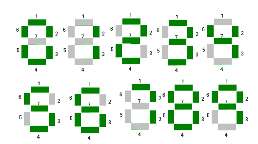

# 在七段显示中使用最小段查找元素

> 原文:[https://www . geesforgeks . org/find-element-use-minimum-segments-segments-segments-display/](https://www.geeksforgeeks.org/find-element-using-minimum-segments-seven-segment-display/)

一个[七段显示](https://en.wikipedia.org/wiki/Seven-segment_display)可以用来显示数字。给定一组 **n** 个自然数。任务是找到数组中使用最小线段来显示数字的数字。如果多个数字具有最小数量的段，则输出具有最小索引的数字。



**示例:**

```
Input : arr[] = { 1, 2, 3, 4, 5 }.
Output : 1
1 uses on 2 segments to display.

Input : arr[] = { 489, 206, 745, 123, 756 }.
Output : 745
```

预计算从 0 到 9 的数字所使用的段数并存储。现在，对于数组的每个元素，求和每个数字所使用的段数。然后找到使用最少线段数的元素。
数字所使用的段号:
0->6
1->2
2->5
3->5
4->4
5->5
6->6
7->3
8->7
9->6
以下是本办法的实施情况:

## C++

```
// C++ program to find minimum number of segments
// required
#include<bits/stdc++.h>
using namespace std;

// Precomputed values of segment used by digit 0 to 9.
const int seg[10] = { 6, 2, 5, 5, 4, 5, 6, 3, 7, 6};

// Return the number of segments used by x.
int computeSegment(int x)
{
    if (x == 0)
        return seg[0];

    int count = 0;

    // Finding sum of the segment used by
    // each digit of a number.
    while (x)
    {
        count += seg[x%10];
        x /= 10;
    }

    return count;
}

int elementMinSegment(int arr[], int n)
{
    // Initialising the minimum segment and minimum
    // number index.
    int minseg = computeSegment(arr[0]);
    int minindex = 0;

    // Finding and comparing segment used
    // by each number arr[i].
    for (int i = 1; i < n; i++)
    {
        int temp = computeSegment(arr[i]);

        // If arr[i] used less segment then update
        // minimum segment and minimum number.
        if (temp < minseg)
        {
            minseg   = temp;
            minindex = i;
        }
    }

    return arr[minindex];
}

// Driven Program
int main()
{
    int arr[] = {489, 206, 745, 123, 756};
    int n = sizeof(arr)/sizeof(arr[0]);
    cout << elementMinSegment(arr, n) << endl;
    return 0;
}
```

## Java 语言(一种计算机语言，尤用于创建网站)

```
// Java program to find minimum
// number of segments required
import java.io.*;

class GFG {

// Precomputed values of segment
// used by digit 0 to 9.
static int []seg = { 6, 2, 5, 5, 4, 5, 6, 3, 7, 6};

// Return the number of segments used by x.
static int computeSegment(int x)
{
    if (x == 0)
        return seg[0];

    int count = 0;

    // Finding sum of the segment used by
    // each digit of a number.
    while (x > 0)
    {
        count += seg[x % 10];
        x /= 10;
    }

    return count;
}

static int elementMinSegment(int []arr, int n)
{
    // Initialising the minimum segment
    // and minimum number index.
    int minseg = computeSegment(arr[0]);
    int minindex = 0;

    // Finding and comparing segment used
    // by each number arr[i].
    for (int i = 1; i < n; i++)
    {
        int temp = computeSegment(arr[i]);

        // If arr[i] used less segment then update
        // minimum segment and minimum number.
        if (temp < minseg)
        {
            minseg = temp;
            minindex = i;
        }
    }

    return arr[minindex];
}

    // Driver program
    static public void main (String[] args)
    {
       int []arr = {489, 206, 745, 123, 756};
       int n = arr.length;
       System.out.println(elementMinSegment(arr, n));
    }
}

//This code is contributed by vt_m.
```

## 蟒蛇 3

```
# Python implementation of
# the above approach

# Precomputed values of segment
# used by digit 0 to 9.
seg = [6, 2, 5, 5, 4,
       5, 6, 3, 7, 6]

# Return the number of
# segments used by x.
def computeSegment(x):
    if(x == 0):
        return seg[0]

    count = 0

    # Finding sum of the segment
    # used by each digit of a number.
    while(x):
        count += seg[x % 10]
        x = x // 10

    return count

# function to return minimum sum index
def elementMinSegment(arr, n):

    # Initialising the minimum
    # segment and minimum number index.
    minseg = computeSegment(arr[0])
    minindex = 0

    # Finding and comparing segment
    # used by each number arr[i].
    for i in range(1, n):
        temp = computeSegment(arr[i])

        # If arr[i] used less segment
        # then update minimum segment
        # and minimum number.
        if(temp < minseg):

            minseg = temp
            minindex = i

    return arr[minindex]

# Driver Code
arr = [489, 206, 745, 123, 756]
n = len(arr)

# function print required answer
print(elementMinSegment(arr, n))

# This code is contributed by
# Sanjit_Prasad
```

## C#

```
// C# program to find minimum
// number of segments required
using System;

class GFG{

// Precomputed values of segment
// used by digit 0 to 9.
static int []seg = new int[10]{ 6, 2, 5, 5, 4,
                               5, 6, 3, 7, 6};

// Return the number of segments used by x.
static int computeSegment(int x)
{
    if (x == 0)
        return seg[0];

    int count = 0;

    // Finding sum of the segment used by
    // each digit of a number.
    while (x > 0)
    {
        count += seg[x % 10];
        x /= 10;
    }

    return count;
}

static int elementMinSegment(int []arr, int n)
{
    // Initialising the minimum segment
    // and minimum number index.
    int minseg = computeSegment(arr[0]);
    int minindex = 0;

    // Finding and comparing segment used
    // by each number arr[i].
    for (int i = 1; i < n; i++)
    {
        int temp = computeSegment(arr[i]);

        // If arr[i] used less segment then update
        // minimum segment and minimum number.
        if (temp < minseg)
        {
            minseg = temp;
            minindex = i;
        }
    }

    return arr[minindex];
}

    // Driver program
    static public void Main()
    {
       int []arr = {489, 206, 745, 123, 756};
       int n = arr.Length;
       Console.WriteLine(elementMinSegment(arr, n));
    }
}

//This code is contributed by vt_m.
```

## 服务器端编程语言（Professional Hypertext Preprocessor 的缩写）

```
<?php
// PHP program to find minimum
// number of segments required

// Precomputed values of segment
// used by digit 0 to 9.

$seg = array(6, 2, 5, 5, 4,
             5, 6, 3, 7, 6);

// Return the number of
// segments used by x.
function computeSegment($x)
{
    global $seg;
    if ($x == 0)
        return $seg[0];

    $count = 0;

    // Finding sum of the segment
    // used by each digit of a number.
    while ($x)
    {
        $count += $seg[$x % 10];
        $x = (int)$x / 10;
    }

    return $count;
}

function elementMinSegment($arr, $n)
{
    // Initialising the minimum segment
    // and minimum number index.
    $minseg = computeSegment($arr[0]);
    $minindex = 0;

    // Finding and comparing segment
    // used by each number arr[i].
    for ($i = 1; $i < $n; $i++)
    {
        $temp = computeSegment($arr[$i]);

        // If arr[i] used less segment
        // then update minimum segment
        // and minimum number.
        if ($temp < $minseg)
        {
            $minseg = $temp;
            $minindex = $i;
        }
    }

    return $arr[$minindex];
}

// Driver Code
$arr = array (489, 206, 745, 123, 756);
$n = sizeof($arr);
echo elementMinSegment($arr, $n) ,"\n";

// This code is contributed by ajit
?>
```

## java 描述语言

```
<script>

// Javascript program to find minimum
// number of segments required

// Precomputed values of segment
// used by digit 0 to 9.
let seg = [ 6, 2, 5, 5, 4, 5, 6, 3, 7, 6];

// Return the number of segments used by x.
function computeSegment(x)
{
    if (x == 0)
        return seg[0];

    let count = 0;

    // Finding sum of the segment used by
    // each digit of a number.
    while (x > 0)
    {
        count += seg[x % 10];
        x = parseInt(x / 10, 10);
    }
    return count;
}

function elementMinSegment(arr, n)
{

    // Initialising the minimum segment
    // and minimum number index.
    let minseg = computeSegment(arr[0]);
    let minindex = 0;

    // Finding and comparing segment used
    // by each number arr[i].
    for(let i = 1; i < n; i++)
    {
        let temp = computeSegment(arr[i]);

        // If arr[i] used less segment then update
        // minimum segment and minimum number.
        if (temp < minseg)
        {
            minseg = temp;
            minindex = i;
        }
    }
    return arr[minindex];
}

// Driver code
let arr = [ 489, 206, 745, 123, 756 ];
let n = arr.length;

document.write(elementMinSegment(arr, n));

// This code is contributed by divyesh072019

</script>
```

**输出:**

```
745
```

***时间复杂度:** O(n * log <sub>10</sub> n)*

***辅助空间:** O(10)*
本文由 [**Anuj Chauhan**](https://www.facebook.com/anuj0503) 供稿。如果你喜欢 GeeksforGeeks 并想投稿，你也可以使用[write.geeksforgeeks.org](https://write.geeksforgeeks.org)写一篇文章或者把你的文章邮寄到 review-team@geeksforgeeks.org。看到你的文章出现在极客博客主页上，帮助其他极客。
如果发现有不正确的地方，或者想分享更多关于上述话题的信息，请写评论。