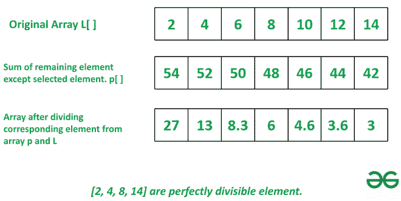

# 找出给定数组中剩余元素总和的因子

> 原文:[https://www . geesforgeks . org/find-给定数组中的元素是剩余元素总和的因子/](https://www.geeksforgeeks.org/find-elements-in-given-array-that-are-a-factor-of-sum-of-remaining-elements/)

给定一个大小为 **N** 的[数组](https://www.geeksforgeeks.org/array-data-structure/) **A[]** ，任务是找出数组中剩余元素之和的因子。所以只要从一个数组中选择一个元素，取剩余元素的和，然后检查这个和是否能被选中的元素完全整除。如果它是可分的，那么返回元素。

**示例:**

> **输入:** A[] = {2，4，6，8，10，12，14}
> **输出:**【2，4，8，14】
> **解释:**
> 1。获取除所选元素之外的其余元素的总和。
> 2。对于元素 2，剩余元素之和为 4+6+8+10+12+14=54
> 3。类似地，对于完整数组:[54，52，50，48，46，44，42]
> 3。54/2，52/4，48/8，42/14 是完全可分的，所以结果元素是[2，4，8，14]
> 
> 
> 
> **输入:** A[]= {3，6，8，10，7，15}
> **输出:**【7】

**天真方法:**取数组中所有元素的和。现在从总和中逐个减去每个元素，并将其附加到新数组中 **p[]。**将每个和除以给定数组中相应的索引元素，并将其附加到新数组中 **q[ ]。**将数组 **A[]** 和数组 **q[]** 中对应的元素相乘，并与数组 **p[]** 中相似的索引元素进行比较。如果它们相等，则将其附加到新数组 **z[ ]** 。如果没有找到这样的元素，返回 **-1。**

下面是上述方法的实现。

## Java 语言(一种计算机语言，尤用于创建网站)

```
// Java program for the above approach
import java.util.ArrayList;

class GFG{

// Function to find element
static ArrayList<Integer> Factor(int[] A)
{

    // Sum of all element
    int s = 0;

    for(int i = 0; i < A.length; i++)
    {
        s += A[i];
    }

    // Subtract each element from sum
    ArrayList<Integer> p = new ArrayList<>();
    for(int i : A)
        p.add(s - i);

    // Divide corresponding element
    // from array p and l
    ArrayList<Integer> q = new ArrayList<Integer>();
    for(int i = 0; i < A.length; i++)
        q.add((int) Math.floor(p.get(i) / A[i]));

    // Check sum is divisible by
    // corrsponding element or not
    ArrayList<Integer> z = new ArrayList<Integer>();
    for(int i = 0; i < q.size(); i++)
    {

        // First we divided element now multiple
        // to check perfect divisibility of element
        if (q.get(i) * A[i] == p.get(i))
            z.add(A[i]);
    }

    // If no such element found return -1
    if (z.size() == 0)
        return new ArrayList<Integer>();

    return z;
}

// Driver code
public static void main(String args[])
{
    int[] A = { 2, 4, 6, 8, 10, 12, 14 };

    // Calling function
    ArrayList<Integer> b = Factor(A);

    // Print required array
    System.out.println(b);
}
}

// This code is contributed by gfgking
```

## 蟒蛇 3

```
# Python program for the above approach

# Function to find element
def Factor(A):

    # Sum of all element
    s = sum(A)

    # Subtract each element from sum
    p =[]
    for i in A:
        p.append(s-i)

    # Divide corresponding element
    # from array p and l
    q =[]
    for i in range(len(A)):
        q.append(p[i]//A[i])

    # Check sum is divisible by
    # corrsponding element or not
    z =[]
    for i in range(len(q)):

          # First we divided element now multiple
        # to check perfect divisibility of element
        if q[i]*A[i]== p[i]:
            z.append(A[i])

    # If no such element found return -1
    if len(z)== 0:
      return -1
    return z

A = [2, 4, 6, 8, 10, 12, 14]

# Calling function
b = Factor(A)

# Print required array
print(b)
```

## java 描述语言

```
  <script>
      // JavaScript code for the above approach

      // Function to find element
      function Factor(A) {

          // Sum of all element
          let s = 0;

          for (let i = 0; i < A.length; i++) {
              s += A[i]
          }

          // Subtract each element from sum
          p = []
          for (i of A)
              p.push(s - i)

          // Divide corresponding element
          // from array p and l
          q = []
          for (i = 0; i < A.length; i++)
              q.push(Math.floor(p[i] / A[i]))

          // Check sum is divisible by
          // corrsponding element or not
          z = []
          for (let i = 0; i < q.length; i++) {

              // First we divided element now multiple
              // to check perfect divisibility of element
              if (q[i] * A[i] == p[i])
                  z.push(A[i])
          }
          // If no such element found return -1
          if (z.length == 0)
              return -1
          return z
      }
      A = [2, 4, 6, 8, 10, 12, 14]

      // Calling function
      b = Factor(A)

      // Print required array
      document.write(b)

// This code is contributed by Potta Lokesh
  </script>
```

**Output**

```
[2, 4, 8, 14]
```

***时间复杂度:**O(N)*
T5**辅助空间:** O(N)

**高效方法:**在这种方法中，不需要使用多个循环和多个数组。因此空间复杂度和时间复杂度将会降低。在这种情况下，所有的减法、除法、乘法运算都在一个循环中执行。按照以下步骤解决问题:

*   将变量 **s** 初始化为数组 **A[]的和。**
*   初始化数组 **z[]** 存储结果。
*   [使用变量 **i** 迭代范围](https://www.geeksforgeeks.org/loops-in-python/)**【0，伦(A))** ，并执行以下任务:
    *   将变量 **a** 初始化为**s-l【I】，b** 初始化为**A/A【I】。**
    *   如果 **b*A[i]** 等于 **a** ，则将 **A[i]** 追加到 **z[]。**
*   执行上述步骤后，如果结果数组为空，则打印 **-1** ，否则打印数组的元素 **z[]** 作为答案。

下面是上述方法的实现。

## C++

```
// C++ program for the above approach
#include <bits/stdc++.h>
using namespace std;

// Function to find sum of all elements of an array
int sum(vector<int>& A)
{
  int res = 0;
  for (auto it : A)
    res += it;
  return res;
}

// Function to find element
vector<int> Factor(vector<int>& A)
{

  // Sum of all element
  int s = sum(A);
  vector<int> z;

  // Loop to find the factors of sum.
  for (int i = 0; i < A.size(); ++i) {

    // a is sum of remaining elements.
    int a = s - A[i];

    // b is integer value or factor of b.
    int b = a / A[i];

    // Check the divisibility
    if (b * A[i] == a)
      z.push_back(A[i]);
  }

  // If no element found return -1
  if (z.size() == 0)
    return { -1 };

  return z;
}

// Drive Code

int main()
{
  vector<int> A = { 2, 4, 6, 8, 10, 12, 14 };

  // Calling function
  vector<int> b = Factor(A);

  // Print resultant element
  for (auto it : b)
    cout << it << " ";

  return 0;
}

// This code is contributed by rakeshsahni
```

## 蟒蛇 3

```
# Python program for the above approach

# Function to find element
def Factor(A):

    # Sum of all element
    s = sum(A)
    z = []

    # Loop to find the factors of sum.
    for i in range(len(A)):

        # a is sum of remaining elements.
        a = s-A[i]

        # b is integer value or factor of b.
        b = a//A[i]

        # Check the divisibility
        if b * A[i] == a:
            z.append(A[i])

    # If no element found return -1
    if len(z) == 0:
        return -1

    return z

A = [2, 4, 6, 8, 10, 12, 14]

# Calling function
b = Factor(A)

# Print resultant element
print(b)
```

## C#

```
// C# program for the above approach
using System;
using System.Collections.Generic;
class GFG {

  // Function to find sum of all elements of an array
  static int sum(List<int> A)
  {
    int res = 0;
    foreach(int it in A) res += it;
    return res;
  }

  // Function to find element
  static List<int> Factor(List<int> A)
  {

    // Sum of all element
    int s = sum(A);
    List<int> z = new List<int>();

    // Loop to find the factors of sum.
    for (int i = 0; i < A.Count; ++i) {

      // a is sum of remaining elements.
      int a = s - A[i];

      // b is integer value or factor of b.
      int b = a / A[i];

      // Check the divisibility
      if (b * A[i] == a)
        z.Add(A[i]);
    }

    // If no element found return -1
    if (z.Count == 0)
      return new List<int>() { -1 };

    return z;
  }

  // Drive Code

  public static void Main()
  {
    List<int> A
      = new List<int>() { 2, 4, 6, 8, 10, 12, 14 };

    // Calling function
    List<int> b = Factor(A);

    // Print resultant element
    Console.Write("[ ");
    int it;
    for (it = 0; it < b.Count - 1; it++) {
      Console.Write(b[it] + ", ");
    }
    Console.Write(b[it] + " ]");
  }
}

// This code is contributed by ukasp.
```

**Output**

```
[2, 4, 8, 14]
```

***时间复杂度:**O(N)*
T5**辅助空间:** O(1)