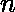

# 使用连续元素的异或运算找到数组的元素

> 原文:[https://www . geeksforgeeks . org/使用连续元素异或查找数组元素/](https://www.geeksforgeeks.org/find-elements-of-array-using-xor-of-consecutive-elements/)

给定一个数组 **arr[]** ，其中给定了原始数组中每 2 个连续元素的异或，即如果原始数组中元素的总数是，那么这个异或数组的大小将是 n-1。还给出了原始数组中的第一个元素。任务是找出原阵的剩余 **n-1** 元素。

*   让 **a、b、c、d、e、f** 为原始元素，并给出每 2 个连续元素的异或，即 **a^b = k1** 、 **b ^ c = k2** 、 **c ^ d = k3** 、 **d ^ e = k4** 、 **e ^ f = k5** (其中 k1、k2、k3、k4、k5 为与第一个元素一起给我们的元素】

**示例:**

```
Input : arr[] = {13, 2, 6, 1}, a = 5
Output : 5 8 10 12 13
5^8=13, 8^10=2, 10^12=6, 12^13=1

Input : arr[] = {12, 5, 26, 7}, a = 6
Output : 6 10 15 21 18 
```

**方法:**我们可以借助(第一个元素)逐个找到所有元素，要找到下一个元素即我们必须用 arr[0]异或 a，类似于用 b 异或 arr[1]等等。

这通过遵循如下所述的异或特性来工作:

*   一个数与自身的异或等于零。
*   给定一个数本身，该数与零进行异或运算。

因此，由于 arr[0]包含 **a^b** 。因此，

```
a ^ arr[0] = a ^ a ^ b
           = 0 ^ b
           = b
```

类似地，arr[i]包含一个 <sub>i</sub> 和一个 <sub>i+1</sub> 的异或。因此，

```
ai ^ arr[i] = ai ^ ai ^ ai+1
            = 0 ^ ai+1
            = ai+1
```

下面是上述方法的实现

## C++

```
// C++ program to find the array elements
// using XOR of consecutive elements

#include <bits/stdc++.h>
using namespace std;

// Function to find the array elements
// using XOR of consecutive elements
void getElements(int a, int arr[], int n)
{
    // array to store the original
    // elements
    int elements[n + 1];

    // first element a i.e elements[0]=a
    elements[0] = a;

    for (int i = 0; i < n; i++) {

        /*  To get the next elements we have to calculate
            xor of previous elements with given xor of 2
            consecutive elements.
            e.g. if a^b=k1 so to get b xor a both side.
            b = k1^a
        */
        elements[i + 1] = arr[i] ^ elements[i];
    }

    // Printing the original array elements
    for (int i = 0; i < n + 1; i++)
        cout << elements[i] << " ";
}

// Driver Code
int main()
{
    int arr[] = { 13, 2, 6, 1 };

    int n = sizeof(arr) / sizeof(arr[0]);

    int a = 5;

    getElements(a, arr, n);

    return 0;
}
```

## Java 语言(一种计算机语言，尤用于创建网站)

```
// Java  program to find the array elements
// using XOR of consecutive elements

import java.io.*;

class GFG {

// Function to find the array elements
// using XOR of consecutive elements
static void getElements(int a, int arr[], int n)
{
    // array to store the original
    // elements
    int elements[] = new int[n + 1];

    // first element a i.e elements[0]=a
    elements[0] = a;

    for (int i = 0; i < n; i++) {

        /* To get the next elements we have to calculate
            xor of previous elements with given xor of 2
            consecutive elements.
            e.g. if a^b=k1 so to get b xor a both side.
            b = k1^a
        */
        elements[i + 1] = arr[i] ^ elements[i];
    }

    // Printing the original array elements
    for (int i = 0; i < n + 1; i++)
        System.out.print( elements[i] + " ");
}

// Driver Code

    public static void main (String[] args) {
            int arr[] = { 13, 2, 6, 1 };

    int n = arr.length;

    int a = 5;

    getElements(a, arr, n);
    }
}
// This code is contributed by anuj_67..
```

## 蟒蛇 3

```
# Python3 program to find the array
# elements using xor of consecutive elements

# Function to find the array elements
# using XOR of consecutive elements

def getElements(a, arr, n):

    # array to store the original elements
    elements = [1 for i in range(n + 1)]

    # first elements a i.e elements[0]=a
    elements[0] = a

    for i in range(n):

        # To get the next elements we have to
        # calculate xor of previous elements
        # with given xor of 2 consecutive elements.
        # e.g. if a^b=k1 so to get b xor a both side.
        # b = k1^a
        elements[i + 1] = arr[i] ^ elements[i]

    # Printing the original array elements
    for i in range(n + 1):
        print(elements[i], end = " ")

# Driver code
arr = [13, 2, 6, 1]
n = len(arr)
a = 5
getElements(a, arr, n)

# This code is contributed by Mohit Kumar
```

## C#

```
// C# program to find the array elements
// using XOR of consecutive elements

using System;

class GFG {
    // Function to find the array elements
    // using XOR of consecutive elements
    static void getElements(int a, int []arr, int n)
    {
        // array to store the original
        // elements
        int []elements = new int[n + 1];

        // first element a i.e elements[0]=a
        elements[0] = a;

        for (int i = 0; i < n; i++) {

            /* To get the next elements we have to calculate
                xor of previous elements with given xor of 2
                consecutive elements.
                e.g. if a^b=k1 so to get b xor a both side.
                b = k1^a
            */
            elements[i + 1] = arr[i] ^ elements[i];
        }

        // Printing the original array elements
        for (int i = 0; i < n + 1; i++)
            Console.Write( elements[i] + " ");
    }

    // Driver Code
    public static void Main () {
            int []arr = { 13, 2, 6, 1 };

            int n = arr.Length;

            int a = 5;

            getElements(a, arr, n);
    }
        // This code is contributed by Ryuga
}
```

## 服务器端编程语言（Professional Hypertext Preprocessor 的缩写）

```
<?php
// PHP program to find the array elements
// using XOR of consecutive elements

// Function to find the array elements
// using XOR of consecutive elements
function getElements($a, &$arr, &$n)
{
    // array to store the original
    // elements

    // first element a i.e elements[0]=a
    $elements[0] = $a;

    for ($i = 0; $i < $n; $i++)
    {

        /*  To get the next elements we have to
            calculate xor of previous elements
            with given xor of 2 consecutive elements.
            e.g. if a^b=k1 so to get b xor a both side.
            b = k1^a
        */
        $elements[$i + 1] = $arr[$i] ^ $elements[$i];
    }

    // Printing the original array elements
    for ($i = 0; $i < $n + 1; $i++)
    {
        echo($elements[$i] . " ");
    }
}

// Driver Code
$arr = array(13, 2, 6, 1);

$n = sizeof($arr);

$a = 5;

getElements($a, $arr, $n);

// This code is contributed by Shivi_Aggarwal
?>
```

## java 描述语言

```
<script>

// Javascript program to find the array elements
// using XOR of consecutive elements

// Function to find the array elements
// using XOR of consecutive elements
function getElements(a, arr, n)
{

    // Array to store the original
    // elements
    let elements = new Array(n + 1);
    for(let i = 0; i < n + 1; i++)
    {
        elements[i] = 0;
    }

    // first element a i.e elements[0]=a
    elements[0] = a;

    for(let i = 0; i < n; i++)
    {

        /* To get the next elements we have to calculate
            xor of previous elements with given xor of 2
            consecutive elements.
            e.g. if a^b=k1 so to get b xor a both side.
            b = k1^a
        */
        elements[i + 1] = arr[i] ^ elements[i];
    }

    // Printing the original array elements
    for(let i = 0; i < n + 1; i++)
        document.write( elements[i] + " ");
}

// Driver Code
let arr = [ 13, 2, 6, 1 ];
let n = arr.length;
let a = 5;

getElements(a, arr, n);

// This code is contributed by unknown2108

</script>
```

**Output:** 

```
5 8 10 12 13
```

**时间复杂度:**O(N)
T3】辅助空间: O(N)