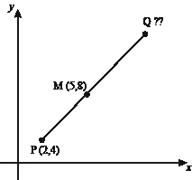

# 找到给定一端和中间的线的另一个端点

> 原文:[https://www . geesforgeks . org/find-end-point-line-given-one-end-mid/](https://www.geeksforgeeks.org/find-end-point-line-given-one-end-mid/)

给定直线的中点(m1，m2)和直线的一个坐标(x1，y1)，求直线的另一个端点(x2，y2)。

示例:

```
Input  : x1 = –1, y1 = 2, and 
         m1 = 3, m2 = –6
Output : x2 = 7, y2 = 10

Input  : x1 = 6.4, y1 = 3 and 
         m1 = –10.7, m2 = 4
Output : x2 = 3, y2 = 4
```



中点公式:两点的中点，(x1，y2)和(x2，y2)是用:
M=((x1+x2)/2，(y1+y2)/2 找到的点 M，

我们需要 a (x2，y2)，所以我们修改了公式

```
          m1 = ((x1+x2)/2),  m2 = ((y1+y2)/2)
          2*m1 = (x1+x2),  2*m2 = (y1+y2)
          x2 = (2*m1 - x1),  y2 = (2*m2 - y1)
```

## C++

```
// CPP program to find the end point of a line
#include <iostream>
using namespace std;

// CPP function to find the end point of a line
void otherEndPoint(int x1, int y1, int m1, int m2)
{
    // find end point for x coordinates
    float x2 = (float)(2 * m1 - x1);

    // find end point for y coordinates
    float y2 = (float)(2 * m2 - y1);

    cout << "x2 = " << x2 << ", "
         << "y2 = " << y2;
}

// Driven Program
int main()
{
    int x1 = -4, y1 = -1, m1 = 3, m2 = 5;
    otherEndPoint(x1, y1, m1, m2);
    return 0;
}
```

## Java 语言(一种计算机语言，尤用于创建网站)

```
// Java program to find the end point of a line
class GFG {

    // CPP function to find the end point
    // of a line
    static void otherEndPoint(int x1, int y1,
                               int m1, int m2)
    {
        // find end point for x coordinates
        float x2 = (float)(2 * m1 - x1);

        // find end point for y coordinates
        float y2 = (float)(2 * m2 - y1);

        System.out.println("x2 = " + x2 + ", "
                               + "y2 = " + y2);
    }

    // Driven Program
    public static void main(String args[])
    {
        int x1 = -4, y1 = -1, m1 = 3, m2 = 5;
        otherEndPoint(x1, y1, m1, m2);
    }
}

// This code is contributed by JaideepPyne.
```

## 蟒蛇 3

```
# Python3 program to find the end
# point of a line

# function to find the end point
# of a line
def otherEndPoint(x1, y1, m1, m2):

    # find end point for x coordinates
    x2 = (2 * m1 - x1)

    # find end point for y coordinates
    y2 = (2 * m2 - y1)

    print ("x2 = {}, y2 = {}"
               . format(x2, y2))

# Driven Program
x1 = -4
y1 = -1
m1 = 3
m2 = 5
otherEndPoint(x1, y1, m1, m2)

# This code is contributed by
# Manish Shaw (manishshaw1)
```

## C#

```
// C# program to find the
// end point of a line
using System;

class GFG {

    // function to find the
    // end pointof a line
    static void otherEndPoint(int x1, int y1,
                              int m1, int m2)
    {

        // find end point for x coordinates
        float x2 = (float)(2 * m1 - x1);

        // find end point for y coordinates
        float y2 = (float)(2 * m2 - y1);

        Console.WriteLine("x2 = " + x2 + ", "
                          + "y2 = " + y2);
    }

    // Driver Program
    public static void Main(String []args)
    {
        int x1 = -4, y1 = -1, m1 = 3, m2 = 5;
        otherEndPoint(x1, y1, m1, m2);
    }
}

// This code is contributed by nitin mittal.
```

## 服务器端编程语言（Professional Hypertext Preprocessor 的缩写）

```
<?php
// php program to find the end point of a line

// PHP function to find the end point of a line
function otherEndPoint($x1, $y1, $m1, $m2)
{

    // find end point for x coordinates
    $x2 = (2 * $m1 - $x1);

    // find end point for y coordinates
    $y2 = (2 * $m2 - $y1);

    echo "x2 = " . $x2 . ", y2 = " . $y2 ;
}

// Driven Program
    $x1 = -4; $y1 = -1; $m1 = 3; $m2 = 5;
    otherEndPoint($x1, $y1, $m1, $m2);

// This code is contributed by nitin mittal.
?>
```

## java 描述语言

```
<script>

// Javascript program to find the
// end point of a line

// Function to find
// the end point of a line
function otherEndPoint(x1, y1, m1, m2)
{

    // Find end point for x coordinates
    let x2 = 2 * m1 - x1;

    // Find end point for y coordinates
    let y2 = 2 * m2 - y1;

    document.write("x2 = " + x2 + ", " +
                   "y2 = " + y2);
}

// Driver code
let x1 = -4, y1 = -1, m1 = 3, m2 = 5;

otherEndPoint(x1, y1, m1, m2);

// This code is contributed by jana_sayantan

</script>
```

**Output:** 

```
x2 = 10, y2 = 11
```

**时间复杂度:** O(1)

**辅助空间:** O(1)