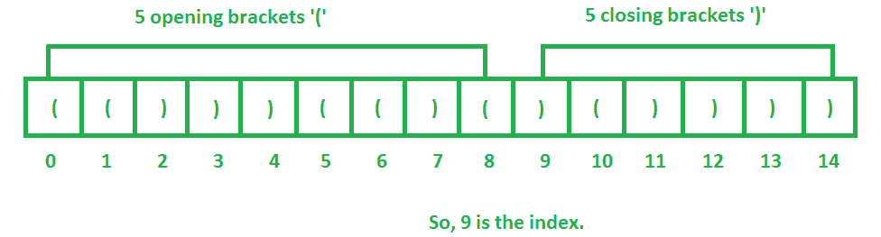

# 在一串括号中找到一个相等的点

> 原文:[https://www . geesforgeks . org/find-等点数-字符串-括号/](https://www.geeksforgeeks.org/find-equal-point-string-brackets/)

给定一串括号，任务是找到一个索引 k，它决定左括号的数量等于右括号的数量。
字符串必须仅由左括号和右括号组成，即“(”和“)”。

一个**相等点**是一个索引，使得它之前的左括号的数量等于从它开始和之后的右括号的数量。

示例:

```
Input : str = "(())))("
Output:   4
After index 4, string splits into (())
and ))(. Number of opening brackets in the 
first part is equal to number of closing 
brackets in the second part.

Input : str = "))"
Output: 2
As after 2nd position i.e. )) and "empty"
string will be split into these two parts:
So, in this number of opening brackets i.e.
0 in the first part is equal to number of 
closing brackets in the second part i.e. 
also 0.
```



问于:亚马逊

1.  存储出现在字符串中的左括号的数量直到每个索引，它必须从起始索引开始。
2.  类似地，存储每个索引前的字符串中出现的结束括号的数量，但是应该从最后一个索引开始。
3.  检查是否有任何索引具有相同的左括号和右括号值。

## C++

```
// C++ program to find an index k which
// decides the number of opening brackets
// is equal to the number of closing brackets
#include<bits/stdc++.h>
using namespace std;

// Function to find an equal index
int findIndex(string str)
{
    int len = str.length();
    int open[len+1], close[len+1];
    int index = -1;
    memset(open, 0, sizeof (open));
    memset(close, 0, sizeof (close));

    open[0] = 0;
    close[len] = 0;
    if (str[0]=='(')
        open[1] = 1;
    if (str[len-1] == ')')
        close[len-1] = 1;

    // Store the number of opening brackets
    // at each index
    for (int i = 1; i < len; i++)
    {
        if ( str[i] == '(' )
            open[i+1] = open[i] + 1;
        else
            open[i+1] = open[i];
    }

    // Store the number of closing brackets
    // at each index
    for (int i = len-2; i >= 0; i--)
    {
        if ( str[i] == ')' )
            close[i] = close[i+1] + 1;
        else
            close[i] = close[i+1];
    }

    // check if there is no opening or closing
    // brackets
    if (open[len] == 0)
        return len;
    if (close[0] == 0)
        return 0;

    // check if there is any index at which
    // both brackets are equal
    for (int i=0; i<=len; i++)
        if (open[i] == close[i])
            index = i;

    return index;
}

// Driver code
int main()
{
    string str = "(()))(()()())))";
    cout << findIndex(str);
    return 0;
}
```

## Java 语言(一种计算机语言，尤用于创建网站)

```
// Java program to find an index k which
// decides the number of opening brackets
// is equal to the number of closing brackets

public class GFG
{
    // Method to find an equal index
    static int findIndex(String str)
    {
        int len = str.length();
        int open[] = new int[len+1];
        int    close[] = new int[len+1];
        int index = -1;

        open[0] = 0;
        close[len] = 0;
        if (str.charAt(0)=='(')
            open[1] = 1;
        if (str.charAt(len-1) == ')')
            close[len-1] = 1;

        // Store the number of opening brackets
        // at each index
        for (int i = 1; i < len; i++)
        {
            if ( str.charAt(i) == '(' )
                open[i+1] = open[i] + 1;
            else
                open[i+1] = open[i];
        }

        // Store the number of closing brackets
        // at each index
        for (int i = len-2; i >= 0; i--)
        {
            if ( str.charAt(i) == ')' )
                close[i] = close[i+1] + 1;
            else
                close[i] = close[i+1];
        }

        // check if there is no opening or closing
        // brackets
        if (open[len] == 0)
            return len;
        if (close[0] == 0)
            return 0;

        // check if there is any index at which
        // both brackets are equal
        for (int i=0; i<=len; i++)
            if (open[i] == close[i])
                index = i;

        return index;
    }

    // Driver Method
    public static void main(String[] args)
    {
        String str = "(()))(()()())))";
        System.out.println(findIndex(str));
    }
}
```

## 蟒蛇 3

```
# Method to find an equal index
def findIndex(str):
    l = len(str)
    open = [0] * (l + 1)
    close = [0] * (l + 1)
    index = -1

    open[0] = 0
    close[l] = 0
    if (str[0]=='('):
        open[1] = 1
    if (str[l - 1] == ')'):
        close[l - 1] = 1

    # Store the number of
    # opening brackets
    # at each index
    for i in range(1, l):
        if (str[i] == '('):
            open[i + 1] = open[i] + 1
        else:
            open[i + 1] = open[i]

    # Store the number
    # of closing brackets
    # at each index
    for i in range(l - 2, -1, -1):
        if ( str[i] == ')'):
            close[i] = close[i + 1] + 1
        else:
            close[i] = close[i + 1]

    # check if there is no
    # opening or closing brackets
    if (open[l] == 0):
        return len
    if (close[0] == 0):
        return 0

    # check if there is any
    # index at which both
    # brackets are equal
    for i in range(l + 1):
        if (open[i] == close[i]):
            index = i

    return index

# Driver Code
str = "(()))(()()())))"
print(findIndex(str))

# This code is contributed
# by ChitraNayal
```

## C#

```
// C# program to find an index
// k which decides the number
// of opening brackets is equal
// to the number of closing brackets
using System;

class GFG
{
// Method to find an equal index
static int findIndex(string str)
{
    int len = str.Length;
    int[] open = new int[len + 1];
    int[] close = new int[len + 1];
    int index = -1;

    open[0] = 0;
    close[len] = 0;
    if (str[0] == '(')
        open[1] = 1;
    if (str[len - 1] == ')')
        close[len - 1] = 1;

    // Store the number of
    // opening brackets
    // at each index
    for (int i = 1; i < len; i++)
    {
        if (str[i] == '(')
            open[i + 1] = open[i] + 1;
        else
            open[i + 1] = open[i];
    }

    // Store the number
    // of closing brackets
    // at each index
    for (int i = len - 2; i >= 0; i--)
    {
        if (str[i] == ')')
            close[i] = close[i + 1] + 1;
        else
            close[i] = close[i + 1];
    }

    // check if there is no
    // opening or closing
    // brackets
    if (open[len] == 0)
        return len;
    if (close[0] == 0)
        return 0;

    // check if there is any
    // index at which both
    // brackets are equal
    for (int i = 0; i <= len; i++)
        if (open[i] == close[i])
            index = i;

    return index;
}

// Driver Code
public static void Main()
{
    string str = "(()))(()()())))";
    Console.Write(findIndex(str));
}
}

// This code is contributed
// by ChitraNayal
```

## 服务器端编程语言（Professional Hypertext Preprocessor 的缩写）

```
<?php
// Method to find an equal index
function findIndex($str)
{
    $len = strlen($str);
    $open = array(0, $len + 1, NULL);
    $close = array(0, $len + 1, NULL);
    $index = -1;

    $open[0] = 0;
    $close[$len] = 0;
    if ($str[0] == '(')
    $open[1] = 1;
    if ($str[$len - 1] == ')')
    $close[$len - 1] = 1;

    // Store the number
    // of opening brackets
    // at each index
    for ($i = 1; $i < $len; $i++)
    {
        if ($str[$i] == '(')
            $open[$i + 1] = $open[$i] + 1;
        else
            $open[$i + 1] = $open[$i];
    }

    // Store the number
    // of closing brackets
    // at each index
    for ($i = $len - 2; $i >= 0; $i--)
    {
        if ($str[$i] == ')')
        $close[$i] = $close[$i + 1] + 1;
        else
        $close[$i] = $close[$i + 1];
    }

    // check if there is no
    // opening or closing
    // brackets
    if ($open[$len] == 0)
        return $len;
    if ($close[0] == 0)
        return 0;

    // check if there is any
    // index at which both
    // brackets are equal
    for ($i = 0; $i <= $len; $i++)
        if ($open[$i] == $close[$i])
            $index = $i;

    return $index;
}

// Driver Code
$str = "(()))(()()())))";
echo (findIndex($str));

// This code is contributed
// by ChitraNayal
?>
```

## java 描述语言

```
<script>

// Javascript program to find an index k which
// decides the number of opening brackets
// is equal to the number of closing brackets

// Method to find an equal index
function findIndex(str)
{
    let len = str.length;
    let open = new Array(len + 1);
    let close = new Array(len + 1);
    for(let i = 0; i < len + 1; i++)
    {
        open[i] = 0;
        close[i] = 0;
    }
    let index = -1;

    open[0] = 0;
    close[len] = 0;

    if (str[0] == '(')
        open[1] = 1;
    if (str[len - 1] == ')')
        close[len - 1] = 1;

    // Store the number of opening brackets
    // at each index
    for(let i = 1; i < len; i++)
    {
        if (str[i] == '(')
            open[i + 1] = open[i] + 1;
        else
            open[i + 1] = open[i];
    }

    // Store the number of closing brackets
    // at each index
    for(let i = len - 2; i >= 0; i--)
    {
        if (str[i] == ')')
            close[i] = close[i + 1] + 1;
        else
            close[i] = close[i + 1];
    }

    // Check if there is no opening or closing
    // brackets
    if (open[len] == 0)
        return len;
    if (close[0] == 0)
        return 0;

    // Check if there is any index at which
    // both brackets are equal
    for(let i = 0; i <= len; i++)
        if (open[i] == close[i])
            index = i;

    return index;
}

// Driver Code
let str = "(()))(()()())))";

document.write(findIndex(str));

// This code is contributed by avanitrachhadiya2155

</script>
```

**输出:**

```
9
```

**时间复杂度:** O(n)

本文由 [**萨希尔·查布拉(akku)**](https://www.facebook.com/sahil.chhabra.965) 供稿。如果你喜欢 GeeksforGeeks 并想投稿，你也可以使用[contribute.geeksforgeeks.org](http://www.contribute.geeksforgeeks.org)写一篇文章或者把你的文章邮寄到 contribute@geeksforgeeks.org。看到你的文章出现在极客博客主页上，帮助其他极客。
如果发现有不正确的地方，或者想分享更多关于上述话题的信息，请写评论。