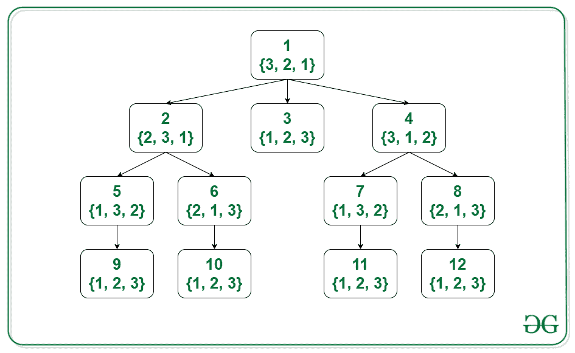

# 查找预期交换以对给定数组进行排序，其中交换任何反转对的概率相等

> 原文:[https://www . geeksforgeeks . org/find-expected-swaps-to-sort-给定数组-其中交换任意反转对的概率相等/](https://www.geeksforgeeks.org/find-expected-swaps-to-sort-given-array-where-probability-of-swapping-any-inversion-pair-is-equal/)

给定一个由第一个 **N** [自然数](https://www.geeksforgeeks.org/natural-numbers/)的排列组成的[数组](https://www.geeksforgeeks.org/introduction-to-arrays/)**arr【】**，任务是找到交换的[期望数](https://www.geeksforgeeks.org/expected-value/)，对给定数组进行排序，其中交换任何[反转对](https://www.geeksforgeeks.org/counting-inversions/)的概率相等，交换任何非反转对的概率为 0。

**示例:**

> **输入:** arr[] = {3，2，1}
> **输出:** 2.3333
> **说明:**如下图所示，给定数组可以使用交换序列以非递减顺序排序。
> 
> 
> 
> 每个节点的预期交换次数可以用 1 +(所有子节点的预期交换次数的平均值)来计算。
> 由于节点 3、9、10、11 和 12 已经排序，因此对它们进行排序的预期交换数为 0。
> 节点 5、6、7 和 8 的预期交换次数将为 1。
> 同样，节点 2 和节点 4 的预期交换次数将为 2。
> 因此，节点 1 的预期交换次数是 1 + (2 + 2 + 0)/3 = 1 + 1.3333 = 2.3333
> 
> **输入:** arr[] = {1，3，2}
> **输出:** 1.0
> **解释:**由于只有 1 个反转对(arr[1]，arr[2])，预期的互换数量为 1。

**方法:**给定的问题可以借助[递归](https://www.geeksforgeeks.org/recursion/)和[回溯](https://www.geeksforgeeks.org/backtracking-algorithms/)使用[记忆](https://www.geeksforgeeks.org/memoization-1d-2d-and-3d/)来解决，记忆基于以下观察:

*   阵列中的[反转被定义为两个指数 **(i，j)** ，使得 **i < j 和 arr【I】>arr【j】**。每次交换一个有效反转的整数，并在交换后递归调用置换，直到整个置换被排序后，交换的](https://www.geeksforgeeks.org/counting-inversions/)[期望数](https://www.geeksforgeeks.org/expected-value/)可以递归计算。
*   假设当前排列中有 **K** 个反转，在交换了 **i <sup>第</sup>T5】个反转之后，对排列进行排序的预期交换次数由 **P <sub>i</sub>** 表示。因此，在交换所有可能的反转后，预期的互换数量将是**(P<sub>1</sub>+P<sub>2</sub>+…+P<sub>K</sub>)/K**。**

利用上述观察，可以通过以下步骤解决给定的问题:

*   创建一个[图](https://www.geeksforgeeks.org/map-associative-containers-the-c-standard-template-library-stl/)，比如说**备忘录**，存储给定置换的预期置换次数。
*   创建一个[递归函数](https://www.geeksforgeeks.org/recursive-functions/) **expectedSwaps()** ，该函数以一个置换作为参数，返回期望的交换次数。
*   在 **expectedSwaps()** 函数中，如果已经计算出当前置换的预期置换，则返回答案。否则，迭代每个有效的反转，交换当前反转的索引，[递归调用](https://www.geeksforgeeks.org/recursion/)进行交换后的排列。
*   在一个变量中找到每次有效交换后预期交换的总和，比如说 **res** ，在一个变量中找到倒计数，比如说 **K** 。
*   完成上述步骤后，打印 **res / K** 的值作为结果。

下面是上述方法的实现:

## C++

```
// C++ program for the above approach

#include <bits/stdc++.h>
using namespace std;

// Stores result of each state of the
// array in a memoization table
map<vector<int>, double> memo;

// Recursive function to find expected
// number of swaps to sort given array
double expectedSwaps(vector<int> a)
{
    // The value for the given permutation
    // is already calculated
    if (memo.count(a)) {
        return memo[a];
    }

    // Stores the expected number of ways
    double res = 0;

    // Stores the total operations done
    int K = 0;

    // Iterate for all possible pairs of
    // Inversions
    for (int i = 0; i < a.size(); i++) {
        for (int j = i + 1; j < a.size(); j++) {

            // For the current inversion
            // find the expected value
            if (a[i] > a[j]) {
                swap(a[i], a[j]);

                // Recursively Call
                res += 1 + expectedSwaps(a);

                // Backtrack
                swap(a[i], a[j]);
                K++;
            }
        }
    }

    // If permutation is already sorted
    if (K == 0)
        res = 0;

    // Calculate expected swaps for
    // current permutation
    else
        res /= K;

    // Return answer
    return memo[a] = res;
}

// Driver Code
int main()
{
    int N = 3;
    vector<int> arr = { 3, 2, 1 };

    cout << expectedSwaps(arr);

    return 0;
}
```

## 蟒蛇 3

```
# Python program for the above approach
# Stores result of each state of the
# array in a memoization table
memo = {}

# Recursive function to find expected
# number of swaps to sort given array
def expectedSwaps(a):

  # The value for the given permutation
  # is already calculated
  if (tuple(a) in memo):
    return memo[tuple(a)]

  # Stores the expected number of ways
  res = 0

  # Stores the total operations done
  K = 0

  # Iterate for all possible pairs of
  # Inversions
  for i in range(len(a)):
    for j in range(i + 1,len(a)):

      # For the current inversion
      # find the expected value
      if (a[i] > a[j]):
        temp = a[i]
        a[i] = a[j]
        a[j] = temp

        # Recursively Call
        res += 1 + expectedSwaps(a)

        #Backtrack
        temp = a[i]
        a[i] = a[j]
        a[j] = temp
        K += 1

  # If permutation is already sorted
  if (K == 0):
    res = 0

  # Calculate expected swaps for
  # current permutation
  else:
    res /= K;

  # Return answer
  memo[tuple(a)] = res
  return res

# Driver Code
N = 3
arr = [ 3, 2, 1 ]
print(expectedSwaps(arr))

# This code is contributed by rohitsingh07052.
```

## java 描述语言

```
<script>
// JavaScript program for the above approach
// Stores result of each state of the
// array in a memoization table

var dict = {};

// Recursive function to find expected
// number of swaps to sort given array
function expectedSwaps(a)
{

  // The value for the given permutation
  // is already calculated
  if (dict.hasOwnProperty(a)) {
    return dict[a];
  }

  // Stores the expected number of ways
  var res = 0;

  // Stores the total operations done
  var K = 0;

  // Iterate for all possible pairs of
  // Inversions
  for (let i = 0; i < a.length; i++)
  {
    for (let j = i + 1; j < a.length; j++)
    {

      // For the current inversion
      // find the expected value
      if (a[i] > a[j]) {
        var temp = a[i];
        a[i] = a[j];
        a[j] = temp;

        // Recursively Call
        res += 1 + expectedSwaps(a);

        // Backtrack
        var temp2 = a[i];
        a[i] = a[j];
        a[j] = temp2;
        K++;
      }
    }
  }

  // If permutation is already sorted
  if (K == 0) {
    res = 0;
  }

  // Calculate expected swaps for
  // current permutation
  else {
    res /= K;
  }

  // Return answer
  dict[a] = res;
  return res;
}

// Driver Code
var N = 3;
var arr = [3, 2, 1];
document.write(expectedSwaps(arr).toFixed(5));

// This code is contributed by rdtank.
</script>
```

**Output**

```
2.33333
```

***时间复杂度:** O(N <sup>2</sup> N！)*
***辅助空间:** O(N！)*