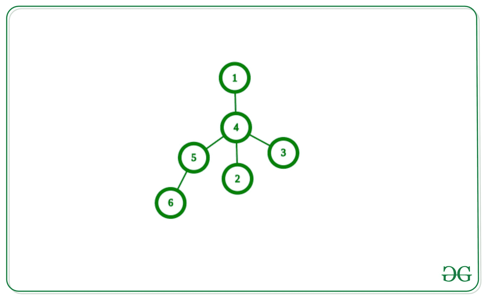
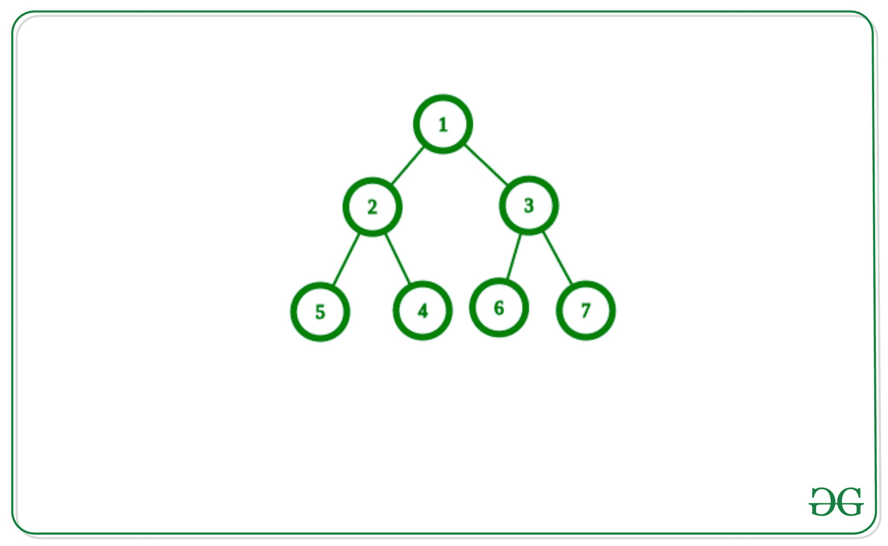

# 在树中找到离每个节点最远的节点

> 原文:[https://www . geeksforgeeks . org/find-距离树中每个节点最远的节点/](https://www.geeksforgeeks.org/find-farthest-node-from-each-node-in-tree/)

给定一个**树**，任务是找到从这个树的每个节点到另一个节点的最远节点。

**示例:**

> **输入:**给定下方树的邻接表:
> 
> 
> 
> **输出:**
> 离节点 1: 6 最远的节点
> 离节点 2: 6 最远的节点
> 离节点 3: 6 最远的节点
> 离节点 4: 6 最远的节点
> 离节点 5: 1 最远的节点
> 离节点 6: 1 最远的节点
> 
> **输入:**
> 
> 
> 
> **输出:**
> 离节点 1: 4 最远的节点
> 离节点 2: 7 最远的节点
> 离节点 3: 4 最远的节点
> 离节点 4: 7 最远的节点
> 离节点 5: 7 最远的节点
> 离节点 6: 4 最远的节点
> 离节点 7: 4 最远的节点

**逼近:**
首先，我们要找到直径的两个端点，为了找到这个端点，我们将选择一个任意顶点，找到离这个任意顶点最远的节点，这个节点将是直径的一端，然后使它成为根，找到离它最远的节点，这将是直径的另一端。现在对于每个节点，最远的节点将是树直径的这两个端点之一。

**为什么管用？**
设 x 和 y 是树直径的两个端点，一个随机顶点是 u，设离 u 最远的顶点是 v，而不是 x 或 y，由于 v 离 u 最远，那么就会形成一个新的直径，其端点为 x、v 或 y，v 具有更大的长度，但树具有直径的唯一长度，所以不可能，离 u 最远的顶点必须是 x 或 y。

下面是上述方法的实现:

## C++

```
// C++ implementation to find the
// farthest node from each vertex
// of the tree

#include <bits/stdc++.h>

using namespace std;

#define N 10000

// Adjacency list to store edges
vector<int> adj[N];

int lvl[N], dist1[N], dist2[N];

// Add edge between
// U and V in tree
void AddEdge(int u, int v)
{
    // Edge from U to V
    adj[u].push_back(v);

    // Edge from V to U
    adj[v].push_back(u);
}

int end1, end2, maxi;

// DFS to find the first
// End Node of diameter
void findFirstEnd(int u, int p)
{
    // Calculating level of nodes
    lvl[u] = 1 + lvl[p];
    if (lvl[u] > maxi) {
        maxi = lvl[u];
        end1 = u;
    }

    for (int i = 0; i < adj[u].size(); i++) {

        // Go in opposite
        // direction of parent
        if (adj[u][i] != p) {
            findFirstEnd(adj[u][i], u);
        }
    }
}

// Function to clear the levels
// of the nodes
void clear(int n)
{
    // set all value of lvl[]
    // to 0 for next dfs
    for (int i = 0; i <= n; i++) {
        lvl[i] = 0;
    }

    // Set maximum with 0
    maxi = 0;
    dist1[0] = dist2[0] = -1;
}

// DFS will calculate second
// end of the diameter
void findSecondEnd(int u, int p)
{
    // Calculating level of nodes
    lvl[u] = 1 + lvl[p];
    if (lvl[u] > maxi) {
        maxi = lvl[u];

        // Store the node with
        // maximum depth from end1
        end2 = u;
    }

    for (int i = 0; i < adj[u].size(); i++) {
        // Go in opposite
        // direction of parent
        if (adj[u][i] != p) {
            findSecondEnd(adj[u][i], u);
        }
    }
}

// Function to find the distance
// of the farthest distant node
void findDistancefromFirst(int u, int p)
{
    // Storing distance from
    // end1 to node u
    dist1[u] = 1 + dist1[p];
    for (int i = 0; i < adj[u].size(); i++) {
        if (adj[u][i] != p) {
            findDistancefromFirst(adj[u][i], u);
        }
    }
}

// Function to find the distance
// of nodes from second end of diameter
void findDistancefromSecond(int u, int p)
{
    // storing distance from end2 to node u
    dist2[u] = 1 + dist2[p];
    for (int i = 0; i < adj[u].size(); i++) {
        if (adj[u][i] != p) {
            findDistancefromSecond(adj[u][i], u);
        }
    }
}

void findNodes(){
    int n = 5;

    // Joining Edge between two
    // nodes of the tree
    AddEdge(1, 2);
    AddEdge(1, 3);
    AddEdge(3, 4);
    AddEdge(3, 5);

    // Find the one end of
    // the diameter of tree
    findFirstEnd(1, 0);
    clear(n);

    // Find the other end
    // of the diameter of tree
    findSecondEnd(end1, 0);

    // Find the distance
    // to each node from end1
    findDistancefromFirst(end1, 0);

    // Find the distance to
    // each node from end2
    findDistancefromSecond(end2, 0);

    for (int i = 1; i <= n; i++) {
        int x = dist1[i];
        int y = dist2[i];

        // Comparing distance between
        // the two ends of diameter
        if (x >= y) {
            cout << end1 << ' ';
        }
        else {
            cout << end2 << ' ';
        }
    }
}

// Driver code
int main()
{
    // Function Call
    findNodes();

    return 0;
}
```

## Java 语言(一种计算机语言，尤用于创建网站)

```
// Java implementation to find the
// farthest node from each vertex
// of the tree
import java.util.*;

class GFG{

static int N = 10000;

// Adjacency list to store edges
@SuppressWarnings("unchecked")
static Vector<Integer>[] adj = new Vector[N];

static int[] lvl = new int[N],
           dist1 = new int[N],
           dist2 = new int[N];

// Add edge between
// U and V in tree
static void AddEdge(int u, int v)
{

    // Edge from U to V
    adj[u].add(v);

    // Edge from V to U
    adj[v].add(u);
}

static int end1, end2, maxi;

// DFS to find the first
// End Node of diameter
static void findFirstEnd(int u, int p)
{

    // Calculating level of nodes
    lvl[u] = 1 + lvl[p];
    if (lvl[u] > maxi)
    {
        maxi = lvl[u];
        end1 = u;
    }

    for(int i = 0; i < adj[u].size(); i++)
    {

        // Go in opposite
        // direction of parent
        if (adj[u].elementAt(i) != p)
        {
            findFirstEnd(adj[u].elementAt(i), u);
        }
    }
}

// Function to clear the levels
// of the nodes
static void clear(int n)
{

    // Set all value of lvl[]
    // to 0 for next dfs
    for(int i = 0; i <= n; i++)
    {
        lvl[i] = 0;
    }

    // Set maximum with 0
    maxi = 0;
    dist1[0] = dist2[0] = -1;
}

// DFS will calculate second
// end of the diameter
static void findSecondEnd(int u, int p)
{

    // Calculating level of nodes
    lvl[u] = 1 + lvl[p];
    if (lvl[u] > maxi)
    {
        maxi = lvl[u];

        // Store the node with
        // maximum depth from end1
        end2 = u;
    }

    for(int i = 0; i < adj[u].size(); i++)
    {

        // Go in opposite
        // direction of parent
        if (adj[u].elementAt(i) != p)
        {
            findSecondEnd(adj[u].elementAt(i), u);
        }
    }
}

// Function to find the distance
// of the farthest distant node
static void findDistancefromFirst(int u, int p)
{

    // Storing distance from
    // end1 to node u
    dist1[u] = 1 + dist1[p];
    for(int i = 0; i < adj[u].size(); i++)
    {
        if (adj[u].elementAt(i) != p)
        {
            findDistancefromFirst(
                adj[u].elementAt(i), u);
        }
    }
}

// Function to find the distance
// of nodes from second end of diameter
static void findDistancefromSecond(int u, int p)
{

    // Storing distance from end2 to node u
    dist2[u] = 1 + dist2[p];
    for(int i = 0; i < adj[u].size(); i++)
    {
        if (adj[u].elementAt(i) != p)
        {
            findDistancefromSecond(
                adj[u].elementAt(i), u);
        }
    }
}

static void findNodes()
{
    int n = 5;

    // Joining Edge between two
    // nodes of the tree
    AddEdge(1, 2);
    AddEdge(1, 3);
    AddEdge(3, 4);
    AddEdge(3, 5);

    // Find the one end of
    // the diameter of tree
    findFirstEnd(1, 0);
    clear(n);

    // Find the other end
    // of the diameter of tree
    findSecondEnd(end1, 0);

    // Find the distance
    // to each node from end1
    findDistancefromFirst(end1, 0);

    // Find the distance to
    // each node from end2
    findDistancefromSecond(end2, 0);

    for(int i = 1; i <= n; i++)
    {
        int x = dist1[i];
        int y = dist2[i];

        // Comparing distance between
        // the two ends of diameter
        if (x >= y)
        {
            System.out.print(end1 + " ");
        }
        else
        {
            System.out.print(end2 + " ");
        }
    }
}

// Driver Code
public static void main(String[] args)
{
    for(int i = 0; i < N; i++)
    {
        adj[i] = new Vector<>();
    }

    // Function call
    findNodes();
}
}

// This code is contributed by sanjeev2552
```

## 蟒蛇 3

```
# Python3 implementation to find the
# farthest node from each vertex
# of the tree

# Add edge between
# U and V in tree
def AddEdge(u, v):

    global adj

    # Edge from U to V
    adj[u].append(v)

    # Edge from V to U
    adj[v].append(u)

# DFS to find the first
# End Node of diameter
def findFirstEnd(u, p):

    global lvl, adj, end1, maxi

    # Calculating level of nodes
    lvl[u] = 1 + lvl[p]

    if (lvl[u] > maxi):
        maxi = lvl[u]
        end1 = u

    for i in range(len(adj[u])):

        # Go in opposite
        # direction of parent
        if (adj[u][i] != p):
            findFirstEnd(adj[u][i], u)

# Function to clear the levels
# of the nodes
def clear(n):

    global lvl, dist1, dist2

    # Set all value of lvl[]
    # to 0 for next dfs
    for i in range(n + 1):
        lvl[i] = 0

    # Set maximum with 0
    maxi = 0
    dist1[0] = dist2[0] = -1

# DFS will calculate second
# end of the diameter
def findSecondEnd(u, p):

    global lvl, adj, maxi, end2

    # Calculating level of nodes
    lvl[u] = 1 + lvl[p]

    if (lvl[u] > maxi):
        maxi = lvl[u]

        # Store the node with
        # maximum depth from end1
        end2 = u

    for i in range(len(adj[u])):

        # Go in opposite
        # direction of parent
        if (adj[u][i] != p):
            findSecondEnd(adj[u][i], u)

# Function to find the distance
# of the farthest distant node
def findDistancefromFirst(u, p):

    global dist1, adj

    # Storing distance from
    # end1 to node u
    dist1[u] = 1 + dist1[p]

    for i in range(len(adj[u])):
        if (adj[u][i] != p):
            findDistancefromFirst(adj[u][i], u)

# Function to find the distance
# of nodes from second end of diameter
def findDistancefromSecond(u, p):

    global dist2, adj

    # Storing distance from end2 to node u
    dist2[u] = 1 + dist2[p]

    for i in range(len(adj[u])):
        if (adj[u][i] != p):
            findDistancefromSecond(adj[u][i], u)

def findNodes():

    global adj, lvl, dist1, dist2, end1, end2, maxi
    n = 5

    # Joining Edge between two
    # nodes of the tree
    AddEdge(1, 2)
    AddEdge(1, 3)
    AddEdge(3, 4)
    AddEdge(3, 5)

    # Find the one end of
    # the diameter of tree
    findFirstEnd(1, 0)
    clear(n)

    # Find the other end
    # of the diameter of tree
    findSecondEnd(end1, 0)

    # Find the distance
    # to each node from end1
    findDistancefromFirst(end1, 0)

    # Find the distance to
    # each node from end2
    findDistancefromSecond(end2, 0)

    for i in range(1, n + 1):
        x = dist1[i]
        y = dist2[i]

        # Comparing distance between
        # the two ends of diameter
        if (x >= y):
            print(end1, end = " ")
        else:
            print(end2, end = " ")

# Driver code
if __name__ == '__main__':

    adj = [[] for i in range(10000)]
    lvl = [0 for i in range(10000)]
    dist1 = [-1 for i in range(10000)]
    dist2 = [-1 for i in range(10000)]
    end1, end2, maxi = 0, 0, 0

    # Function Call
    findNodes()

# This code is contributed by mohit kumar 29
```

## C#

```
// C# implementation to find the
// farthest node from each vertex
// of the tree
using System;
using System.Collections.Generic;

class GFG{

static int N = 10000;

// Adjacency list to store edges
static List<int>[] adj = new List<int>[N];

static int[] lvl = new int[N],
           dist1 = new int[N],
           dist2 = new int[N];

// Add edge between
// U and V in tree
static void AddEdge(int u, int v)
{

    // Edge from U to V
    adj[u].Add(v);

    // Edge from V to U
    adj[v].Add(u);
}

static int end1, end2, maxi;

// DFS to find the first
// End Node of diameter
static void findFirstEnd(int u, int p)
{

    // Calculating level of nodes
    lvl[u] = 1 + lvl[p];

    if (lvl[u] > maxi)
    {
        maxi = lvl[u];
        end1 = u;
    }

    for(int i = 0; i < adj[u].Count; i++)
    {

        // Go in opposite
        // direction of parent
        if (adj[u][i] != p)
        {
            findFirstEnd(adj[u][i], u);
        }
    }
}

// Function to clear the levels
// of the nodes
static void clear(int n)
{

    // Set all value of lvl[]
    // to 0 for next dfs
    for(int i = 0; i <= n; i++)
    {
        lvl[i] = 0;
    }

    // Set maximum with 0
    maxi = 0;
    dist1[0] = dist2[0] = -1;
}

// DFS will calculate second
// end of the diameter
static void findSecondEnd(int u, int p)
{

    // Calculating level of nodes
    lvl[u] = 1 + lvl[p];

    if (lvl[u] > maxi)
    {
        maxi = lvl[u];

        // Store the node with
        // maximum depth from end1
        end2 = u;
    }

    for(int i = 0; i < adj[u].Count; i++)
    {

        // Go in opposite
        // direction of parent
        if (adj[u][i] != p)
        {
            findSecondEnd(adj[u][i], u);
        }
    }
}

// Function to find the distance
// of the farthest distant node
static void findDistancefromFirst(int u, int p)
{

    // Storing distance from
    // end1 to node u
    dist1[u] = 1 + dist1[p];

    for(int i = 0; i < adj[u].Count; i++)
    {
        if (adj[u][i] != p)
        {
            findDistancefromFirst(adj[u][i], u);
        }
    }
}

// Function to find the distance
// of nodes from second end of diameter
static void findDistancefromSecond(int u, int p)
{

    // Storing distance from end2 to node u
    dist2[u] = 1 + dist2[p];

    for(int i = 0; i < adj[u].Count; i++)
    {
        if (adj[u][i] != p)
        {
            findDistancefromSecond(adj[u][i], u);
        }
    }
}

static void findNodes()
{
    int n = 5;

    // Joining Edge between two
    // nodes of the tree
    AddEdge(1, 2);
    AddEdge(1, 3);
    AddEdge(3, 4);
    AddEdge(3, 5);

    // Find the one end of
    // the diameter of tree
    findFirstEnd(1, 0);
    clear(n);

    // Find the other end
    // of the diameter of tree
    findSecondEnd(end1, 0);

    // Find the distance
    // to each node from end1
    findDistancefromFirst(end1, 0);

    // Find the distance to
    // each node from end2
    findDistancefromSecond(end2, 0);

    for(int i = 1; i <= n; i++)
    {
        int x = dist1[i];
        int y = dist2[i];

        // Comparing distance between
        // the two ends of diameter
        if (x >= y)
        {
            Console.Write(end1 + " ");
        }
        else
        {
            Console.Write(end2 + " ");
        }
    }
}

// Driver Code
public static void Main(String[] args)
{
    for(int i = 0; i < N; i++)
    {
        adj[i] = new List<int>();
    }

    // Function call
    findNodes();
}
}

// This code is contributed by gauravrajput1
```

## java 描述语言

```
<script>
// Javascript implementation to find the
// farthest node from each vertex
// of the tree
let N = 10000;

// Adjacency list to store edges
let adj = new Array(N);
let lvl = new Array(N);
let dist1 = new Array(N);
let dist2 = new Array(N);
let end = 0, end2 = 0, maxi = 0;

for(let i = 0; i < N; i++)
{
    lvl[i] = 0;
    dist1[i] = -1;
    dist2[i] = -1;
}

// Add edge between
// U and V in tree
function AddEdge(u,v)
{
    // Edge from U to V
    adj[u].push(v);

    // Edge from V to U
    adj[v].push(u);
}

// DFS to find the first
// End Node of diameter
function findFirstEnd(u,p)
{
    // Calculating level of nodes
    lvl[u] = 1 + lvl[p];
    if (lvl[u] > maxi)
    {
        maxi = lvl[u];
        end1 = u;
    }

    for(let i = 0; i < adj[u].length; i++)
    {

        // Go in opposite
        // direction of parent
        if (adj[u][i] != p)
        {
            findFirstEnd(adj[u][i], u);
        }
    }
}

// Function to clear the levels
// of the nodes
function clear(n)
{
    // Set all value of lvl[]
    // to 0 for next dfs
    for(let i = 0; i <= n; i++)
    {
        lvl[i] = 0;
    }

    // Set maximum with 0
    maxi = 0;
    dist1[0] = dist2[0] = -1;
}

// DFS will calculate second
// end of the diameter
function findSecondEnd(u,p)
{
    // Calculating level of nodes
    lvl[u] = 1 + lvl[p];
    if (lvl[u] > maxi)
    {
        maxi = lvl[u];

        // Store the node with
        // maximum depth from end1
        end2 = u;
    }

    for(let i = 0; i < adj[u].length; i++)
    {

        // Go in opposite
        // direction of parent
        if (adj[u][i] != p)
        {
            findSecondEnd(adj[u][i], u);
        }
    }
}

// Function to find the distance
// of the farthest distant node
function findDistancefromFirst(u,p)
{
    // Storing distance from
    // end1 to node u
    dist1[u] = 1 + dist1[p];
    for(let i = 0; i < adj[u].length; i++)
    {
        if (adj[u][i] != p)
        {
            findDistancefromFirst(
                adj[u][i], u);
        }
    }
}

// Function to find the distance
// of nodes from second end of diameter
function findDistancefromSecond(u,p)
{
    // Storing distance from end2 to node u
    dist2[u] = 1 + dist2[p];
    for(let i = 0; i < adj[u].length; i++)
    {
        if (adj[u][i] != p)
        {
            findDistancefromSecond(
                adj[u][i], u);
        }
    }
}

function findNodes()
{
    let n = 5;

    // Joining Edge between two
    // nodes of the tree
    AddEdge(1, 2);
    AddEdge(1, 3);
    AddEdge(3, 4);
    AddEdge(3, 5);

    // Find the one end of
    // the diameter of tree
    findFirstEnd(1, 0);
    clear(n);

    // Find the other end
    // of the diameter of tree
    findSecondEnd(end1, 0);

    // Find the distance
    // to each node from end1
    findDistancefromFirst(end1, 0);

    // Find the distance to
    // each node from end2
    findDistancefromSecond(end2, 0);

    for(let i = 1; i <= n; i++)
    {
        let x = dist1[i];
        let y = dist2[i];

        // Comparing distance between
        // the two ends of diameter
        if (x >= y)
        {
            document.write(end1 + " ");
        }
        else
        {
            document.write(end2 + " ");
        }
    }
}

// Driver Code
for(let i = 0; i < N; i++)
    {
        adj[i] = [];
    }

    // Function call
    findNodes();

// This code is contributed by patel2127
</script>
```

**Output:** 

```
4 4 2 2 2
```

**时间复杂度:** O(V+E)，其中 V 为顶点数，E 为边数。
**辅助空间:** O(V + E)。