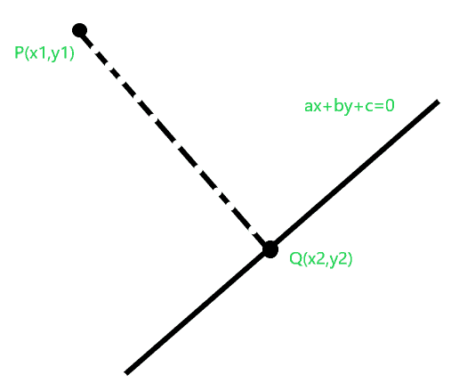
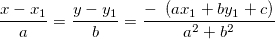

# 找到从二维平面中的一点到直线的垂直距离

> 原文:[https://www . geesforgeks . org/find-foot-of-vertical-from-in-a-point-in-2-d-plane-to-a-line/](https://www.geeksforgeeks.org/find-foot-of-perpendicular-from-a-point-in-2-d-plane-to-a-line/)

给定二维平面上的点 P 和直线方程，任务是找到从 P 到直线的垂线的脚。

**注**:直线方程形式为 ax+乘+c=0。

**示例:**

```
Input :  P=(1, 0), a = -1, b = 1, c = 0
Output : Q = (0.5, 0.5)
The foot of perpendicular from point (1, 0) 
to line *-x + y = 0* is (0.5, 0.5)

Input :  P=(3, 3), a = 0, b = 1, c = -2
Output : Q = (3, 2)
The foot of perpendicular from point (3, 3) 
to line *y-2 = 0* is (3, 2) 
```



因为线的方程被给出为形式 ***ax + by + c = 0*** 。直线通过 P 并垂直于直线的方程。因此通过 P 和 Q 的直线方程变成***ay–bx+d = 0***。另外，P 穿过穿过 P 和 Q 的直线，所以我们把 P 的坐标放在上面的等式中:

```
ay1 - bx1 + d = 0 
or, d = bx1 - ay1
```

另外，Q 是给定直线与通过 P 和 Q 的直线的交点。因此，我们可以求出:

```
ax + by + c = 0
and,
ay - bx + (bx1-ay1) = 0
```

因为 a、b、c、d 都是已知的，所以我们可以在这里找到 x 和 y:



下面是上述方法的实现:

## C++

```
// C++ program for implementation of
// the above approach
#include <iostream>
using namespace std;

// Function to find foot of perpendicular from
// a point in 2 D plane to a Line
pair<double, double> findFoot(double a, double b, double c,
                              double x1, double y1)
{
    double temp = -1 * (a * x1 + b * y1 + c) / (a * a + b * b);
    double x = temp * a + x1;
    double y = temp * b + y1;
    return make_pair(x, y);
}

// Driver Code
int main()
{
    // Equation of line is
    // ax + by + c = 0
    double a = 0.0;
    double b = 1.0;
    double c = -2;

    // Coordinates of point p(x1, y1).
    double x1 = 3.0;
    double y1 = 3.0;

    pair<double, double> foot = findFoot(a, b, c, x1, y1);
    cout << foot.first << " " << foot.second;

    return 0;
}
```

## Java 语言(一种计算机语言，尤用于创建网站)

```
import javafx.util.Pair;

// Java program for implementation of
// the above approach
class GFG
{

// Function to find foot of perpendicular from
// a point in 2 D plane to a Line
static Pair<Double, Double> findFoot(double a, double b, double c,
                            double x1, double y1)
{
    double temp = -1 * (a * x1 + b * y1 + c) / (a * a + b * b);
    double x = temp * a + x1;
    double y = temp * b + y1;
    return new Pair(x, y);
}

// Driver Code
public static void main(String[] args)
{
    // Equation of line is
    // ax + by + c = 0
    double a = 0.0;
    double b = 1.0;
    double c = -2;

    // Coordinates of point p(x1, y1).
    double x1 = 3.0;
    double y1 = 3.0;

    Pair<Double, Double> foot = findFoot(a, b, c, x1, y1);
    System.out.println(foot.getKey() + " " + foot.getValue());
    }
}

// This code contributed by Rajput-Ji
```

## 蟒蛇 3

```
# Python3 implementation of the approach

# Function to find foot of perpendicular
# from a point in 2 D plane to a Line
def findFoot(a, b, c, x1, y1):

    temp = (-1 * (a * x1 + b * y1 + c) //
                  (a * a + b * b))
    x = temp * a + x1
    y = temp * b + y1
    return (x, y)

# Driver Code
if __name__ == "__main__":

    # Equation of line is
    # ax + by + c = 0
    a, b, c = 0.0, 1.0, -2

    # Coordinates of point p(x1, y1).
    x1, y1 = 3.0, 3.0

    foot = findFoot(a, b, c, x1, y1)
    print(int(foot[0]), int(foot[1]))

# This code is contributed
# by Rituraj Jain
```

## C#

```
// C# program for implementation of
// the above approach
using System;

class GFG
{
    // Pair class
    public class Pair
    {
        public double first,second;
        public Pair(double a,double b)
        {
            first = a;
            second = b;
        }
    }

// Function to find foot of perpendicular from
// a point in 2 D plane to a Line
static Pair findFoot(double a, double b, double c,
                            double x1, double y1)
{
    double temp = -1 * (a * x1 + b * y1 + c) / (a * a + b * b);
    double x = temp * a + x1;
    double y = temp * b + y1;
    return new Pair(x, y);
}

// Driver Code
public static void Main(String []args)
{
    // Equation of line is
    // ax + by + c = 0
    double a = 0.0;
    double b = 1.0;
    double c = -2;

    // Coordinates of point p(x1, y1).
    double x1 = 3.0;
    double y1 = 3.0;

    Pair foot = findFoot(a, b, c, x1, y1);
    Console.WriteLine(foot.first + " " + foot.second);
    }
}

// This code contributed by Arnab Kundu
```

## 服务器端编程语言（Professional Hypertext Preprocessor 的缩写）

```
<?php
// PHP implementation of the approach

// Function to find foot of perpendicular
// from a point in 2 D plane to a Line
function findFoot($a, $b, $c, $x1, $y1)
{

    $temp = floor((-1 * ($a * $x1 + $b * $y1 + $c) /
                        ($a * $a + $b * $b)));
    $x = $temp * $a + $x1;
    $y = $temp * $b + $y1;
    return array($x, $y);

}

// Driver Code

// Equation of line is
// ax + by + c = 0
$a = 0.0;
$b = 1.0 ;
$c = -2 ;

// Coordinates of point p(x1, y1).
$x1 = 3.0 ;
$y1 = 3.0 ;

$foot = findFoot($a, $b, $c, $x1, $y1);
echo floor($foot[0]), " ", floor($foot[1]);

// This code is contributed by Ryuga
?>
```

## java 描述语言

```
<script>
      // JavaScript implementation of the approach

      // Function to find foot of perpendicular
      // from a point in 2 D plane to a Line
      function findFoot(a, b, c, x1, y1) {
        var temp = (-1 * (a * x1 + b * y1 + c)) / (a * a + b * b);
        var x = temp * a + x1;
        var y = temp * b + y1;
        return [x, y];
      }

      // Driver Code
      // Equation of line is
      // ax + by + c = 0
      var a = 0.0;
      var b = 1.0;
      var c = -2;

      // Coordinates of point p(x1, y1).
      var x1 = 3.0;
      var y1 = 3.0;

      var foot = findFoot(a, b, c, x1, y1);
      document.write(parseInt(foot[0]) + " " + parseInt(foot[1]));
    </script>
```

**Output:** 

```
3 2
```