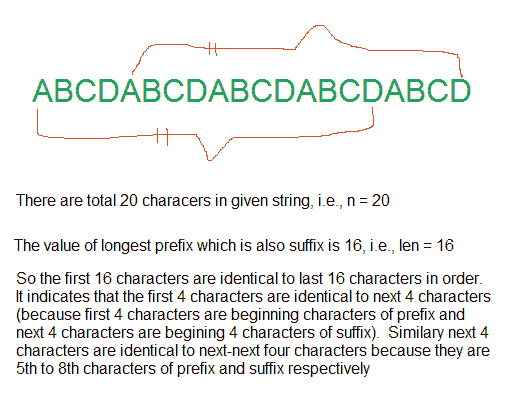

# 通过将子串“n”次迭代

，找出给定的字符串是否可以由子串表示

> 原文:[https://www . geesforgeks . org/find-given-string-can-presented-substring-itering-substring-n-times/](https://www.geeksforgeeks.org/find-given-string-can-represented-substring-iterating-substring-n-times/)

给定一个字符串“str”，检查它是否可以通过获取它的子字符串并将子字符串的多个副本附加在一起来构造。

示例:

```
Input: str = "abcabcabc"
Output: true
The given string is 3 times repetition of "abc"

Input: str = "abadabad"
Output: true
The given string is 2 times repetition of "abad"

Input: str = "aabaabaabaab"
Output: true
The given string is 4 times repetition of "aab"

Input: str = "abcdabc"
Output: false
```

来源:[谷歌面试问题](https://www.geeksforgeeks.org/forums/topic/google-interview-question-for-software-engineerdeveloper-fresher-about-strings/)

## [我们强烈建议您点击此处进行练习，然后再进入解决方案。](https://practice.geeksforgeeks.org/problems/string-formation-from-substring2734/1)

这个问题可以有很多解决办法。挑战部分是在 O(n)时间内解决问题。下面是一个 O(n)算法。

让给定字符串为“str”，给定字符串的长度为“n”。
1)求“str”的最长适当前缀的长度，该前缀也是后缀。让最长的适当前缀后缀的长度为“len”。这可以使用 [KMP 字符串匹配算法](https://www.geeksforgeeks.org/searching-for-patterns-set-2-kmp-algorithm/)的预处理步骤在 0(n)时间内计算。
2)如果‘n–len’的值除以 n(或‘n %(n-len)’为 0)，则返回真，否则返回假。
在“真”的情况下，子字符串“字符串[0..n-len-1]是重复 n/(n-len)次的子字符串。

让我们举几个例子。
输入:str =“ABCDABCD”，n = 8(在‘str’中的字符数)
len 的值是 4(“ABCD”是最长的子串，它既是前缀又是后缀)
既然(n-len)除以 n，答案就是真的。
输入:str = " ABCDABC "，n = 7(' str '中的字符数)
len 的值为 3(“ABC”是最长的子串，既是前缀也是后缀)
由于(n-len)不除 n，所以答案为假。
输入:str =“abcbabc ababc”，n = 15(' str '中的字符数)
len 的值为 12(“abcbabc”是最长的子串，既是前缀也是后缀)
既然(n-len)除以 n，那么答案就是真的。

**这是如何工作的？**
长度最长的适当前缀-后缀(或 len)总是在 0 到 n-1 之间。如果 len 是 n-1，那么字符串中的所有字符都是相同的。例如，len 为 3 表示“AAAA”。如果 len 是 n-2，n 是偶数，那么字符串中的两个字符重复 n/2 次。比如“ABABABAB”，lps 的长度是 6。原因是如果前 n-2 个字符与最后 n-2 个字符相同，则从第一对开始，每对字符都与下一对相同。下图演示了长度为 4 的子字符串的情况。



以下是上述算法的实现:

## C++

```
// A C++ program to check if a string is 'n' times
// repetition of one of its substrings
#include<iostream>
#include<cstring>
using namespace std;

// A utility function to fill lps[] or compute prefix function
// used in KMP string matching algorithm. Refer
// https://www.geeksforgeeks.org/archives/11902 for details
void computeLPSArray(char str[], int M, int lps[])
{
    int len = 0; //length of the previous longest prefix suffix
    int i;

    lps[0] = 0; //lps[0] is always 0
    i = 1;

    // the loop calculates lps[i] for i = 1 to M-1
    while (i < M)
    {
       if (str[i] == str[len])
       {
           len++;
           lps[i] = len;
           i++;
       }
       else // (pat[i] != pat[len])
       {
          if (len != 0)
          {
             // This is tricky. Consider the example AAACAAAA
             // and i = 7.
             len = lps[len-1];

             // Also, note that we do not increment i here
          }
          else // if (len == 0)
          {
             lps[i] = 0;
             i++;
          }
       }
    }
}

// Returns true if str is repetition of one of its substrings
// else return false.
bool isRepeat(char str[])
{
    // Find length of string and create an array to
    // store lps values used in KMP
    int n = strlen(str);
    int lps[n];

    // Preprocess the pattern (calculate lps[] array)
    computeLPSArray(str, n, lps);

    // Find length of longest suffix which is also
    // prefix of str.
    int len = lps[n-1];

    // If there exist a suffix which is also prefix AND
    // Length of the remaining substring divides total
    // length, then str[0..n-len-1] is the substring that
    // repeats n/(n-len) times (Readers can print substring
    // and value of n/(n-len) for more clarity.
    return (len > 0 && n%(n-len) == 0)? true: false;
}

// Driver program to test above function
int main()
{
   char txt[][100] = {"ABCABC", "ABABAB", "ABCDABCD", "GEEKSFORGEEKS",
                      "GEEKGEEK", "AAAACAAAAC", "ABCDABC"};
   int n = sizeof(txt)/sizeof(txt[0]);
   for (int i=0; i<n; i++)
      isRepeat(txt[i])? cout << "True\n" : cout << "False\n";
   return 0;
}
```

## Java 语言(一种计算机语言，尤用于创建网站)

```
// Java program to check if a string is 'n'
// times repetition of one of its substrings
import java.io.*;
class GFG {

// A utility function to fill lps[] or compute
// prefix funcrion used in KMP string matching
// algorithm. Refer
// https://www.geeksforgeeks.org/archives/11902
// for details
static void computeLPSArray(String str, int M,
                                     int lps[])
{  
    // length of the previous
    // longest prefix suffix
    int len = 0;

    int i;

    lps[0] = 0; // lps[0] is always 0
    i = 1;

    // the loop calculates lps[i]
    // for i = 1 to M-1
    while (i < M)
    {
    if (str.charAt(i) == str.charAt(len))
    {
        len++;
        lps[i] = len;
        i++;
    }
    else // (pat[i] != pat[len])
    {
        if (len != 0)
        {
            // This is tricky. Consider the
            // example AAACAAAA and i = 7.
            len = lps[len-1];

            // Also, note that we do
            // not increment i here
        }
        else // if (len == 0)
        {
            lps[i] = 0;
            i++;
        }
    }
    }
}

// Returns true if str is repetition of
// one of its substrings else return false.
static boolean isRepeat(String str)
{
    // Find length of string and create
    // an array to store lps values used in KMP
    int n = str.length();
    int lps[] = new int[n];

    // Preprocess the pattern (calculate lps[] array)
    computeLPSArray(str, n, lps);

    // Find length of longest suffix
    // which is also prefix of str.
    int len = lps[n-1];

    // If there exist a suffix which is also
    // prefix AND Length of the remaining substring
    // divides total length, then str[0..n-len-1]
    // is the substring that repeats n/(n-len) 
    // times (Readers can print substring and
    // value of n/(n-len) for more clarity.
    return (len > 0 && n%(n-len) == 0)? true: false;
}

// Driver program to test above function
public static void main(String[] args)
{
String txt[] = {"ABCABC", "ABABAB", "ABCDABCD",
                "GEEKSFORGEEKS", "GEEKGEEK",
                "AAAACAAAAC", "ABCDABC"};
int n = txt.length;
for (int i = 0; i < n; i++) {
    if(isRepeat(txt[i]) == true)
    System.out.println("True");
    else
    System.out.println("False");
}
}
}

// This code is contributed by Prerna Saini
```

## 计算机编程语言

```
# A Python program to check if a string is 'n' times
# repetition of one of its substrings

# A utility function to fill lps[] or compute prefix funcrion
# used in KMP string matching algorithm. Refer
# https://www.geeksforgeeks.org/archives/11902 for details
def computeLPSArray(string, M, lps):
    length = 0        # length of the previous longest prefix suffix
    i = 1

    lps[0] = 0    # lps[0] is always 0

    # the loop calculates lps[i] for i = 1 to M-1
    while i < M:
        if string[i] == string[length]:
            length += 1
            lps[i] = length
            i += 1
        else:
            if length != 0:           
                # This is tricky. Consider the example AAACAAAA
                # and i = 7.
                length = lps[length-1]

                # Also, note that we do not increment i here
            else:
                lps[i] = 0
                i += 1

# Returns true if string is repetition of one of its substrings
# else return false.
def isRepeat(string):
    # Find length of string and create an array to
    # store lps values used in KMP
    n = len(string)
    lps = [0] * n

    # Preprocess the pattern (calculate lps[] array)
    computeLPSArray(string, n, lps)

    # Find length of longest suffix which is also
    # prefix of str.
    length = lps[n-1]

    # If there exist a suffix which is also prefix AND
    # Length of the remaining substring divides total
    # length, then str[0..n-len-1] is the substring that
    # repeats n/(n-len) times (Readers can print substring
    # and value of n/(n-len) for more clarity.
    if len > 0 and n%(n-length) == 0:
        return True
    else:
        False

# Driver program
txt = ["ABCABC", "ABABAB", "ABCDABCD", "GEEKSFORGEEKS",
        "GEEKGEEK", "AAAACAAAAC", "ABCDABC"]
n = len(txt)
for i in xrange(n):
    if isRepeat(txt[i]):
        print "True"
    else:
        print "False"

# This code is contributed by BHAVYA JAIN
```

## C#

```
// C# program to check if a string is 'n'
// times repetition of one of its substrings
using System;

class GFG {

    // A utility function to fill lps[] or
    // compute prefix funcrion used in KMP
    // string matching algorithm. Refer
    // https://www.geeksforgeeks.org/archives/11902
    // for details
    static void computeLPSArray(String str, int M,
                                         int []lps)
    {

        // length of the previous
        // longest prefix suffix
        int len = 0;

        int i;

        lps[0] = 0; // lps[0] is always 0
        i = 1;

        // the loop calculates lps[i]
        // for i = 1 to M-1
        while (i < M)
        {
            if (str[i] == str[len])
            {
                len++;
                lps[i] = len;
                i++;
            }
            else // (pat[i] != pat[len])
            {
                if (len != 0)
                {

                    // This is tricky. Consider the
                    // example AAACAAAA and i = 7.
                    len = lps[len-1];

                    // Also, note that we do
                    // not increment i here
                }
                else // if (len == 0)
                {
                    lps[i] = 0;
                    i++;
                }
            }
        }
    }

    // Returns true if str is repetition of
    // one of its substrings else return false.
    static bool isRepeat(String str)
    {

        // Find length of string and create
        // an array to store lps values used
        // in KMP
        int n = str.Length;
        int[] lps = new int[n];

        // Preprocess the pattern (calculate
        // lps[] array)
        computeLPSArray(str, n, lps);

        // Find length of longest suffix
        // which is also prefix of str.
        int len = lps[n-1];

        // If there exist a suffix which is also
        // prefix AND Length of the remaining
        // substring divides total length, then
        // str[0..n-len-1] is the substring that
        // repeats n/(n-len) times (Readers can
        // print substring and value of n/(n-len)
        // for more clarity.
        return (len > 0 && n % (n - len) == 0)
                               ? true : false;
    }

    // Driver program to test above function
    public static void Main()
    {
        String[] txt = {"ABCABC", "ABABAB",
                    "ABCDABCD", "GEEKSFORGEEKS",
                       "GEEKGEEK", "AAAACAAAAC",
                                     "ABCDABC"};
        int n = txt.Length;

        for (int i = 0; i < n; i++)
        {
            if(isRepeat(txt[i]) == true)
                Console.WriteLine("True");
            else
                Console.WriteLine("False");
        }
    }
}

// This code is contributed by Sam007.
```

## java 描述语言

```
<script>

    // Javascript program to check if a string is 'n'
    // times repetition of one of its substrings

    // A utility function to fill lps[] or
    // compute prefix funcrion used in KMP
    // string matching algorithm. Refer
    // https://www.geeksforgeeks.org/archives/11902
    // for details
    function computeLPSArray(str, M, lps)
    {

        // length of the previous
        // longest prefix suffix
        let len = 0;

        let i;

        lps[0] = 0; // lps[0] is always 0
        i = 1;

        // the loop calculates lps[i]
        // for i = 1 to M-1
        while (i < M)
        {
            if (str[i] == str[len])
            {
                len++;
                lps[i] = len;
                i++;
            }
            else // (pat[i] != pat[len])
            {
                if (len != 0)
                {

                    // This is tricky. Consider the
                    // example AAACAAAA and i = 7.
                    len = lps[len-1];

                    // Also, note that we do
                    // not increment i here
                }
                else // if (len == 0)
                {
                    lps[i] = 0;
                    i++;
                }
            }
        }
    }

    // Returns true if str is repetition of
    // one of its substrings else return false.
    function isRepeat(str)
    {

        // Find length of string and create
        // an array to store lps values used
        // in KMP
        let n = str.length;
        let lps = new Array(n);
        lps.fill(0);

        // Preprocess the pattern (calculate
        // lps[] array)
        computeLPSArray(str, n, lps);

        // Find length of longest suffix
        // which is also prefix of str.
        let len = lps[n-1];

        // If there exist a suffix which is also
        // prefix AND Length of the remaining
        // substring divides total length, then
        // str[0..n-len-1] is the substring that
        // repeats n/(n-len) times (Readers can
        // print substring and value of n/(n-len)
        // for more clarity.
        return (len > 0 && n % (n - len) == 0)
                               ? true : false;
    }

    let txt = ["ABCABC", "ABABAB",
                    "ABCDABCD", "GEEKSFORGEEKS",
                       "GEEKGEEK", "AAAACAAAAC",
                                     "ABCDABC"];
    let n = txt.length;

    for (let i = 0; i < n; i++)
    {
      if(isRepeat(txt[i]) == true)
        document.write("True" + "</br>");
      else
        document.write("False" + "</br>");
    }

</script>
```

**输出:**

```
True
True
True
False
True
True
False 
```

时间复杂度:以上解的时间复杂度为 O(n)，因为它使用的是 [KMP 预处理算法](https://www.geeksforgeeks.org/searching-for-patterns-set-2-kmp-algorithm/)，是线性时间算法。

本文由 **Harshit Agrawal** 供稿。如果你发现任何不正确的地方，或者你想分享更多关于上面讨论的话题的信息，请写评论。