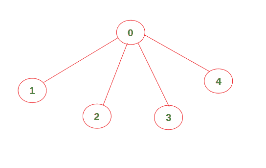
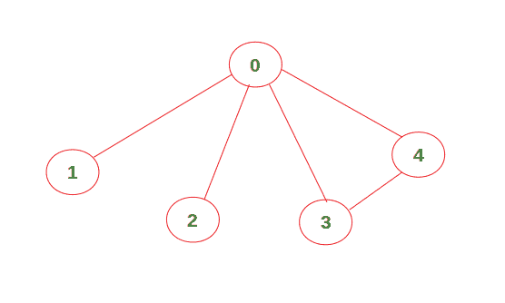

# 查找无向图是否包含给定大小的独立集合

> 原文:[https://www . geesforgeks . org/find-if-an-directed-graph-contains-独立的给定大小的集合/](https://www.geeksforgeeks.org/find-if-an-undirected-graph-contains-an-independent-set-of-a-given-size/)

给定一个无向图，检查它是否包含一组独立的尺寸 **k** 。如果存在一套独立的尺寸 **k** ，则打印“是”。否则打印“否”。

**独立集:**图中的独立集是彼此不直接相连的一组顶点。

**例 1:**

```
Input : K = 4,
        graph = [[1, 1, 0, 0, 0],
                 [1, 1, 1, 1, 1],
                 [0, 1, 1, 0, 0],
                 [0, 1, 0, 1, 0],
                 [0, 1, 0, 0, 1]]
Output : Yes 
```



上面的图包含一个独立的大小为 4 的集合(顶点 1、2、3、4 没有直接相互连接)。因此，输出是“是”。

**例 2:**

```
Input : K = 4,
        graph = [[1, 1, 0, 0, 0],
                 [1, 1, 1, 1, 1],
                 [0, 1, 1, 0, 0],
                 [0, 1, 0, 1, 1],
                 [0, 1, 0, 1, 1]]
Output : No
```



上面的图不包含大小为 4 的独立集合。因此，输出为“否”。

**进场:**

*   初始化一个变量**用布尔*假*值求解**。
*   从给定的图中找到所有可能的顶点集合 **K** 。
*   如果找到一组独立的尺寸 **k** ，将 **sol** 的值更改为真并返回。
*   否则继续检查其他可能的集合。
*   最后，如果 **sol** 为真，则打印“是”，否则打印“否”。

下面是上述方法的实现:

## C++14

```
// C++ code to check if a given graph
// contains an independent set of size k
#include <bits/stdc++.h>
using namespace std;

// Function prototype
bool check(int[][5], vector<int> &, int);

// Function to construct a set of given size k
bool func(int graph[][5], vector<int> &arr,
          int k, int index, bool sol[])
{
    // Check if the selected set is independent or not.
    // Change the value of sol to True and return
    // if it is independent
    if (k == 0)
    {
        if (check(graph, arr, arr.size()))
        {
            sol[0] = true;
            return true;
        }
    }
    else
    {
        // Set of size k can be formed even if we don't
        // include the vertex at current index.
        if (index >= k)
        {
            vector<int> newvec(arr.begin(), arr.end());
            newvec.push_back(index);
            return (func(graph, newvec, k - 1,
                                index - 1, sol) or
                    func(graph, arr, k, index - 1, sol));
        }

        // Set of size k cannot be formed if we don't
        // include the vertex at current index.
        else
        {
            arr.push_back(index);
            return func(graph, arr, k - 1,
                          index - 1, sol);
        }
    }
}

// Function to check if the given set is
// independent or not
// arr --> set of size k (contains the
// index of included vertex)
bool check(int graph[][5], vector<int> &arr, int n)
{
    // Check if each vertex is connected to any other
    // vertex in the set or not
    for (int i = 0; i < n; i++)
        for (int j = i + 1; j < n; j++)
            if (graph[arr[i]][arr[j]] == 1)
                return false;
    return true;
}

// Driver Code
int main()
{
    int graph[][5] = {{1, 1, 0, 0, 0},
                      {1, 1, 1, 1, 1},
                      {0, 1, 1, 0, 0},
                      {0, 1, 0, 1, 0},
                      {0, 1, 0, 0, 1}};
    int k = 4;
    vector<int> arr; // Empty set
    bool sol[] = {false};
    int n = sizeof(graph) /
            sizeof(graph[0]);
    func(graph, arr, k, n - 1, sol);

    if (sol[0])
        cout << "Yes" << endl;
    else
        cout << "No" << endl;
    return 0;
}

// This code is contributed by
// sanjeev2552
```

## Java 语言(一种计算机语言，尤用于创建网站)

```
// Java code to check if a
// given graph contains an
// independent set of size k
import java.util.*;
class GFG{

static  Vector<Integer> arr =
        new Vector<>();

// Function to cona set of
// given size k
static boolean func(int graph[][],
                    int k, int index,
                    boolean sol[])
{
  // Check if the selected set is
  // independent or not. Change the
  // value of sol to True and return
  // if it is independent
  if (k == 0)
  {
    if (check(graph,
              arr.size()))
    {
      sol[0] = true;
      return true;
    }
  }
  else
  {
    // Set of size k can be
    // formed even if we don't
    // include the vertex at
    // current index.
    if (index >= k)
    {
      Vector<Integer> newvec =
             new Vector<>();
      newvec.add(index);
      return (func(graph, k - 1,
                   index - 1, sol) ||
              func(graph, k,
                   index - 1, sol));
    }

    // Set of size k cannot be
    // formed if we don't include
    // the vertex at current index.
    else
    {
      arr.add(index);
      return func(graph, k - 1,
                  index - 1, sol);
    }
  }
  return true;
}

// Function to check if the
// given set is independent
// or not arr -. set of size
// k (contains the index of
// included vertex)
static boolean check(int graph[][],
                     int n)
{
  // Check if each vertex is
  // connected to any other
  // vertex in the set or not
  for (int i = 0; i < n; i++)
    for (int j = i + 1; j < n; j++)
      if (graph[arr.get(i)][arr.get(j)] == 1)
        return false;
  return true;
}

// Driver Code
public static void main(String[] args)
{
  int graph[][] = {{1, 1, 0, 0, 0},
                   {1, 1, 1, 1, 1},
                   {0, 1, 1, 0, 0},
                   {0, 1, 0, 1, 0},
                   {0, 1, 0, 0, 1}};
  int k = 4;
  boolean []sol = new boolean[1];
  int n = graph.length;
  func(graph, k, n - 1, sol);

  if (sol[0])
    System.out.print("Yes" + "\n");
  else
    System.out.print("No" + "\n");
}
}

// This code is contributed by Amit Katiyar
```

## 蟒蛇 3

```
# Python3 code to check if a given graph
# contains an independent set of size k

# Function to construct a set of given size k
def func(graph, arr, k, index, sol):

    # Check if the selected set is independent or not.
    # Change the value of sol to True and return
    # if it is independent
    if k == 0:
        if check(graph, arr) == True:
            sol[0] = True
            return

    else:
        # Set of size k can be formed even if we don't
        # include the vertex at current index.
        if index >= k:
            return (func(graph, arr[:] + [index], k-1, index-1, sol) or
                    func(graph, arr[:], k, index-1, sol))

        # Set of size k cannot be formed if we don't
        # include the vertex at current index.
        else:
            return func(graph, arr[:] + [index], k-1, index-1, sol)

# Function to check if the given set is
# independent or not
# arr --> set of size k (contains the
# index of included vertex)
def check(graph, arr):

    # Check if each vertex is connected to any other
    # vertex in the set or not
    for i in range(len(arr)):
        for j in range(i + 1, len(arr)):

            if graph[arr[i]][arr[j]] == 1:
                return False

    return True

# Driver Code   
graph = [[1, 1, 0, 0, 0],
         [1, 1, 1, 1, 1],
         [0, 1, 1, 0, 0],
         [0, 1, 0, 1, 0],
         [0, 1, 0, 0, 1]]

k = 4
arr = []     # Empty set
sol = [False]

func(graph, arr[:], k, len(graph)-1, sol)

if sol[0] == True:
    print("Yes")
else:
    print("No")
```

## C#

```
// C# code to check if a
// given graph contains an
// independent set of size k
using System;
using System.Collections.Generic;

class GFG{

static List<int> arr = new List<int>();

// Function to cona set of
// given size k
static bool func(int [,]graph,
                 int k, int index,
                 bool []sol)
{

  // Check if the selected set is
  // independent or not. Change the
  // value of sol to True and return
  // if it is independent
  if (k == 0)
  {
    if (check(graph,
              arr.Count))
    {
      sol[0] = true;
      return true;
    }
  }
  else
  {

    // Set of size k can be
    // formed even if we don't
    // include the vertex at
    // current index.
    if (index >= k)
    {
      List<int> newvec = new List<int>();
      newvec.Add(index);

      return (func(graph, k - 1,
                       index - 1, sol) ||
              func(graph, k,
                   index - 1, sol));
    }

    // Set of size k cannot be
    // formed if we don't include
    // the vertex at current index.
    else
    {
      arr.Add(index);

      return func(graph, k - 1,
                     index - 1, sol);
    }
  }
  return true;
}

// Function to check if the
// given set is independent
// or not arr -. set of size
// k (contains the index of
// included vertex)
static bool check(int [,]graph, int n)
{

  // Check if each vertex is
  // connected to any other
  // vertex in the set or not
  for(int i = 0; i < n; i++)
    for(int j = i + 1; j < n; j++)
      if (graph[arr[i],arr[j]] == 1)
        return false;

  return true;
}

// Driver Code
public static void Main(String[] args)
{
  int [,]graph = { { 1, 1, 0, 0, 0 },
                   { 1, 1, 1, 1, 1 },
                   { 0, 1, 1, 0, 0 },
                   { 0, 1, 0, 1, 0 },
                   { 0, 1, 0, 0, 1 } };
  int k = 4;
  bool []sol = new bool[1];
  int n = graph.GetLength(0);

  func(graph, k, n - 1, sol);

  if (sol[0])
    Console.Write("Yes" + "\n");
  else
    Console.Write("No" + "\n");
}
}

// This code is contributed by Amit Katiyar
```

**Output:** 

```
Yes
```

**时间复杂度:** 其中 **V** 是图中的顶点数， **k** 是集合的给定大小。
**辅助空间:** O(V)