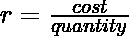

# 从给定的成本和数量范围中找出一个比率是否可能

> 原文:[https://www . geeksforgeeks . org/find-如果有可能从给定的成本和数量范围中获得比率/](https://www.geeksforgeeks.org/find-if-it-is-possible-to-get-a-ratio-from-given-ranges-of-costs-and-quantities/)

给定从**低成本**到**高成本**的成本范围和从**低定量**到**高定量**的数量范围，找出是否有可能在处得到给定的配给比 **r** ，低成本< = **成本** < =高成本，低定量< = **数量** < =高定量。
**举例:**

```
Input : lowCost = 1, upCost = 10, 
        lowQuant = 2, upQuant = 8
        r = 3
Output : Yes
Explanation:
cost / quantity = 6 / 2 = 3
where cost is in [1, 10] and quantity
is in [2, 8]

Input : lowCost = 14, upCost = 30, 
        lowQuant = 5, upQuant = 12
        r = 9
Output : No
```

**方法:**根据给定的公式，可以很容易地推导出以下方程:。
从这个方程，很容易推导出逻辑。用 r 检查每个数量值的乘积，如果乘积的任何值介于低成本和高成本之间，则答案为是，否则为否
以下是上述方法的实施:

## C++

```
// C++ program to find if it is
// possible to get the ratio r
#include <bits/stdc++.h>
using namespace std;

// Returns true if it is
// possible to get ratio r
// from given cost and
// quantity ranges.
bool isRatioPossible(int lowCost, int upCost,
                     int lowQuant, int upQuant,
                     int r)
{
    for (int i = lowQuant; i <= upQuant; i++)
    {

        // Calculating cost corresponding
        // to value of i
        int ans = i * r;
        if (lowCost <= ans && ans <= upCost)
            return true;
    }

    return false;
}

// Driver Code
int main()
{
    int lowCost = 14, upCost = 30,
        lowQuant = 5, upQuant = 12,
        r = 9;

    if (isRatioPossible(lowCost, upCost,
                        lowQuant, upQuant, r))
        cout << "Yes";
    else
        cout << "No";
    return 0;
}
```

## Java 语言(一种计算机语言，尤用于创建网站)

```
// Java program to find if it is
// possible to get the ratio r
import java.io.*;

class Ratio
{

    // Returns true if it is
    // possible to get ratio r
    // from given cost and
    // quantity ranges.
    static boolean isRatioPossible(int lowCost, int upCost,
                                   int lowQuant, int upQuant,
                                   int r)
    {
        for (int i = lowQuant; i <= upQuant; i++)
        {

            // Calculating cost corresponding
            // to value of i
            int ans = i * r;
            if (lowCost <= ans && ans <= upCost)
                return true;
        }

        return false;
    }

    // Driver Code
    public static void main(String args[])
    {
        int lowCost = 14, upCost = 30,
            lowQuant = 5, upQuant = 12, r = 9;

        if (isRatioPossible(lowCost, upCost,
                            lowQuant, upQuant, r))
            System.out.println("Yes");
        else
            System.out.println("No");
    }
}
```

## 蟒蛇 3

```
# Python 3 program to find if it
# is possible to get the ratio r

# Returns true if it is
# possible to get ratio r
# from given cost and
# quantity ranges.
def isRatioPossible(lowCost, upCost,
                    lowQuant, upQuant, r) :

    for i in range(lowQuant, upQuant + 1) :

        # Calculating cost corresponding
        # to value of i
        ans = i * r

        if (lowCost <= ans and ans <= upCost) :
            return True

    return False

# Driver Code
lowCost = 14; upCost = 30
lowQuant = 5; upQuant = 12; r = 9

if (isRatioPossible(lowCost, upCost,
                    lowQuant,upQuant, r)) :
    print( "Yes" )
else :
    print( "No" )

# This code is contributed
# by Nikita Tiwari.
```

## C#

```
// C# program to find if it is
// possible to get the ratio r
using System;

class Ratio
{

    // Returns true if it is
    // possible to get ratio r
    // from given cost and
    // quantity ranges.
    static bool isRatioPossible(int lowCost, int upCost,
                                int lowQuant, int upQuant,
                                int r)
    {
        for (int i = lowQuant; i <= upQuant; i++)
        {

            // Calculating cost corresponding
            // to value of i
            int ans = i * r;
            if (lowCost <= ans && ans <= upCost)
                return true;
        }

        return false;
    }

    // Driver Code
    public static void Main()
    {
        int lowCost = 14, upCost = 30,
            lowQuant = 5, upQuant = 12, r = 9;

        if (isRatioPossible(lowCost, upCost,
                            lowQuant, upQuant, r))
            Console.WriteLine("Yes");
        else
            Console.WriteLine("No");
    }
}

// This code is contributed by vt_m.
```

## 服务器端编程语言（Professional Hypertext Preprocessor 的缩写）

```
<?php
//PHP program to find if it is
// possible to get the ratio r

// Returns true if it is
// possible to get ratio r
// from given cost and
// quantity ranges.
function isRatioPossible($lowCost, $upCost,
                         $lowQuant, $upQuant,$r)
{
    for ($i = $lowQuant; $i <= $upQuant; $i++)
    {

        // Calculating cost corresponding
        // to value of i
        $ans = $i * $r;
        if ($lowCost <= $ans && $ans <= $upCost)
            return true;
    }

    return false;
}

// Driver Code
$lowCost = 14; $upCost = 30;
$lowQuant = 5; $upQuant = 12; $r = 9;

if (isRatioPossible($lowCost, $upCost,
                    $lowQuant, $upQuant, $r))
    echo "Yes";
else
    echo "No";

# This code is contributed by ajit
?>
```

## java 描述语言

```
<script>

// JavaScript program to find if it is
// possible to get the ratio r

    // Returns true if it is
    // possible to get ratio r
    // from given cost and
    // quantity ranges.
    function isRatioPossible(lowCost, upCost,
                                   lowQuant, upQuant,
                                   r)
    {
        for (let i = lowQuant; i <= upQuant; i++)
        {

            // Calculating cost corresponding
            // to value of i
            let ans = i * r;
            if (lowCost <= ans && ans <= upCost)
                return true;
        }

        return false;
    }

// Driver code

        let lowCost = 14, upCost = 30,
            lowQuant = 5, upQuant = 12, r = 9;

        if (isRatioPossible(lowCost, upCost,
                            lowQuant, upQuant, r))
            document.write("Yes");
        else
            document.write("No");

</script>
```

**输出:**

```
No
```