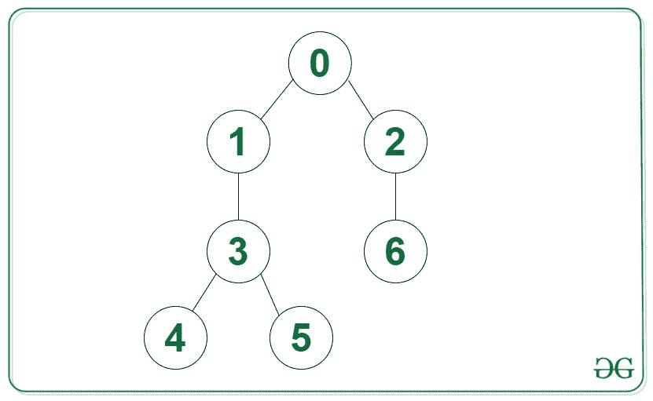

# 查找 Q 查询给定树节点之间的路径长度是偶数还是奇数

> 原文:[https://www . geesforgeks . org/find-if-path-length-is-偶数或奇数-在给定的树节点之间-用于 q-query/](https://www.geeksforgeeks.org/find-if-path-length-is-even-or-odd-between-given-tree-nodes-for-q-queries/)

给定一个由 **N** 节点和**(N–1)**边组成的[类属树](https://www.geeksforgeeks.org/generic-treesn-array-trees/)和一个由类型 **{A，B}** 组成的大小为 **Q** 的查询数组[数组](https://www.geeksforgeeks.org/introduction-to-arrays/)，每个查询的任务是检查两个给定节点 **A** 和 **B** 之间的路径长度是偶数还是奇数。

**示例:**

> **输入:**查询[] = {{2，4}，{4，0}}
> 
> 
> 
> **输出:**
> 奇数
> 偶数
> T5】解释:
> 对于第一个查询 A = 2，B = 4。从 A 到 B 的路径是 2 - > 0 - > 1 - > 3 - > 4，长度为 5，即奇数。
> 对于第二个查询，A = 4，B = 0。从 A 到 B 的路径是 4 - > 3 - > 1 - > 0，长度为 4，即偶数。

**方法:**给定的问题可以通过将树转换成[二部图](https://www.geeksforgeeks.org/bipartite-graph/)来有效地解决。可以观察到，如果查询中的给定节点 **A** 和 **B** 在构造的二分图中处于同一侧，那么 **A** 和 **B** 之间的路径长度一定是奇数，如果 **A** 和 **B** 处于不同侧，那么路径长度一定是奇数。以下是要遵循的步骤:

*   使用 [BFS 遍历](https://www.geeksforgeeks.org/breadth-first-search-or-bfs-for-a-graph/)遍历给定的树。
*   将所有节点分成 2 组，使得树中所有相邻的两个节点都在不同的组中(即 **0** 或 **1** )。为此，在 BFS 遍历期间，通过将当前节点的*集数= 1 与当前节点的父节点数*进行异或运算，为每个级别分配一个交替的集数。
*   完成上述步骤后，[遍历给定的查询数组](https://www.geeksforgeeks.org/c-program-to-traverse-an-array/)**查询【】**，如果两个节点的集合个数相同， **A** 到 **B** 的路径长度为**奇数**。否则就是**甚至**。

下面是上述方法的实现:

## C++

```
// C++ program for the above approach

#include <bits/stdc++.h>
using namespace std;

// Stores the input tree
vector<vector<int> > adj(100000);

// Stores the set number of all nodes
vector<int> setNum(100000);

// Function to add an edge in the tree
void addEdge(int a1, int a2)
{
    adj[a1].push_back(a2);
    adj[a2].push_back(a1);
}

// Function to convert the given tree
// into a bipartite graph using BFS
void toBipartite(int N)
{
    // Set the set number to -1 for
    // all node of the given tree
    setNum.assign(N, -1);

    // Stores the current node during
    // the BFS traversal of the tree
    queue<int> q;

    // Initialize the set number of
    // 1st node and enqueue it
    q.push(0);
    setNum[0] = 0;

    // BFS traversal of the given tree
    while (!q.empty()) {

        // Current node
        int v = q.front();
        q.pop();

        // Traverse over all neighbours
        // of the current node
        for (int u : adj[v]) {

            // If the set is not assigned
            if (setNum[u] == -1) {

                // Assign set number to node u
                setNum[u] = setNum[v] ^ 1;
                q.push(u);
            }
        }
    }
}

// Function to find if the path length
// between node A and B is even or odd
void pathLengthQuery(int A, int B)
{
    // If the set number of both nodes is
    // same, path length is odd else even
    if (setNum[A] == setNum[B]) {
        cout << "Odd" << endl;
    }
    else {
        cout << "Even" << endl;
    }
}

// Driver Code
int main()
{
    int N = 7;
    addEdge(0, 1);
    addEdge(0, 2);
    addEdge(1, 3);
    addEdge(3, 4);
    addEdge(3, 5);
    addEdge(2, 6);

    // Function to convert tree into
    // bipartite
    toBipartite(N);

    pathLengthQuery(4, 2);
    pathLengthQuery(0, 4);

    return 0;
}
```

## Java 语言(一种计算机语言，尤用于创建网站)

```
// Java program for the above approach

import java.io.*;
import java.util.*;

class GFG {

// Stores the input tree
@SuppressWarnings("unchecked")
static Vector<Integer> []adj = new Vector[100000];

// Stores the set number of all nodes
static Vector<Integer> setNum = new Vector<Integer>(100000);

// Function to add an edge in the tree
static void addEdge(int a1, int a2)
{
    adj[a1].add(a2);
    adj[a2].add(a1);
}

// Function to convert the given tree
// into a bipartite graph using BFS
static void toBipartite(int N)
{
    // Set the set number to -1 for
    // all node of the given tree
    for (int i = 0; i < 100000; i++)
       setNum.add(-1);

    // Stores the current node during
    // the BFS traversal of the tree
    Queue<Integer> q
            = new LinkedList<>();

    // Initialize the set number of
    // 1st node and enqueue it
    q.add(0);
    setNum.set(0, 0);

    // BFS traversal of the given tree
    while (!q.isEmpty()) {

        // Current node
        int v = q.peek();
        q.remove();

        // Traverse over all neighbours
        // of the current node
        for (int u : adj[v]) {

            // If the set is not assigned
            if (setNum.get(u) == -1) {

                // Assign set number to node u
                  setNum.set(u, setNum.get(v) ^ 1);
                q.add(u);
            }
        }
    }
}

// Function to find if the path length
// between node A and B is even or odd
static void pathLengthQuery(int A, int B)
{
    // If the set number of both nodes is
    // same, path length is odd else even
    if (setNum.get(A) == setNum.get(B)) {
        System.out.println("Odd");
    }
    else {
        System.out.println("Even");
    }
}

// Driver Code
public static void main (String[] args) {

      for (int i = 0; i < 100000; i++)
       adj[i] = new Vector<Integer>();

    int N = 7;
    addEdge(0, 1);
    addEdge(0, 2);
    addEdge(1, 3);
    addEdge(3, 4);
    addEdge(3, 5);
    addEdge(2, 6);

    // Function to convert tree into
    // bipartite
    toBipartite(N);

    pathLengthQuery(4, 2);
    pathLengthQuery(0, 4);
}
}

// This code is contributed by Dharanendra L V.
```

## 蟒蛇 3

```
# Python program for the above approach
from queue import Queue

# Stores the input tree
adj = [[0] * 100000] * 100000

# Stores the set number of all nodes
setNum = [0] * 100000

# Function to add an edge in the tree
def addEdge(a1, a2):
    adj[a1].append(a2);
    adj[a2].append(a1);

# Function to convert the given tree
# into a bipartite graph using BFS
def toBipartite(N):

    # Set the set number to -1 for
    # all node of the given tree
    for i in range(0, N):
        setNum[i] = -1

    # Stores the current node during
    # the BFS traversal of the tree
    q = Queue();

    # Initialize the set number of
    # 1st node and enqueue it
    q.put(0);
    setNum[0] = 0;

    # BFS traversal of the given tree
    while (not q.empty()):

        # Current node
        v = q.queue[0];
        q.get();

        # Traverse over all neighbours
        # of the current node
        for u in adj[v]:

            # If the set is not assigned
            if (setNum[u] == -1):

                # Assign set number to node u
                setNum[u] = setNum[v] ^ 1;
                q.put(u);

# Function to find if the path length
# between node A and B is even or odd
def pathLengthQuery(A, B):
    # If the set number of both nodes is
    # same, path length is odd else even
    if (setNum[A] == setNum[B]):
        print("Odd");
    else:
        print("Even");

# Driver Code
N = 7;
addEdge(0, 1);
addEdge(0, 2);
addEdge(1, 3);
addEdge(3, 4);
addEdge(3, 5);
addEdge(2, 6);

    # Function to convert tree into
    # bipartite
toBipartite(N);

pathLengthQuery(4, 2);
pathLengthQuery(0, 4);

# This code is contributed by _saurabh_jaiswal.
```

## C#

```
// C# program for the above approach
using System;
using System.Collections.Generic;

public class GFG
{

// Stores the input tree
static List<int> []adj = new List<int>[100000];

// Stores the set number of all nodes
static List<int> setNum = new List<int>(100000);

// Function to add an edge in the tree
static void addEdge(int a1, int a2)
{
    adj[a1].Add(a2);
    adj[a2].Add(a1);
}

// Function to convert the given tree
// into a bipartite graph using BFS
static void toBipartite(int N)
{

    // Set the set number to -1 for
    // all node of the given tree
    for (int i = 0; i < 100000; i++)
       setNum.Add(-1);

    // Stores the current node during
    // the BFS traversal of the tree
    Queue<int> q
            = new Queue<int>();

    // Initialize the set number of
    // 1st node and enqueue it
    q.Enqueue(0);
    setNum[0] =  0;

    // BFS traversal of the given tree
    while (q.Count!=0) {

        // Current node
        int v = q.Peek();
        q.Dequeue();

        // Traverse over all neighbours
        // of the current node
        foreach (int u in adj[v]) {

            // If the set is not assigned
            if (setNum[u] == -1) {

                // Assign set number to node u
                  setNum[u] = ( setNum[v] ^ 1);
                q.Enqueue(u);
            }
        }
    }
}

// Function to find if the path length
// between node A and B is even or odd
static void pathLengthQuery(int A, int B)
{

    // If the set number of both nodes is
    // same, path length is odd else even
    if (setNum[A] == setNum[B])
    {
        Console.WriteLine("Odd");
    }
    else
    {
        Console.WriteLine("Even");
    }
}

// Driver Code
public static void Main(String[] args) {

      for (int i = 0; i < 100000; i++)
       adj[i] = new List<int>();

    int N = 7;
    addEdge(0, 1);
    addEdge(0, 2);
    addEdge(1, 3);
    addEdge(3, 4);
    addEdge(3, 5);
    addEdge(2, 6);

    // Function to convert tree into
    // bipartite
    toBipartite(N);

    pathLengthQuery(4, 2);
    pathLengthQuery(0, 4);
}
}

// This code is contributed by shikhasingrajput
```

**Output:** 

```
Odd
Even
```

***时间复杂度:** O(N + Q)*
***辅助空间:** O(N)*