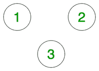

# 查找无向图中两个顶点之间是否有路径

> 原文:[https://www . geeksforgeeks . org/find-如果无向图中两个顶点之间有路径/](https://www.geeksforgeeks.org/find-if-there-is-a-path-between-two-vertices-in-an-undirected-graph/)

给定一个具有 **N** 顶点和 **E** 边以及两个顶点 **(U，V)** 的无向图，任务是检测这两个顶点之间是否存在路径。如果存在路径，则打印*“是”*，否则打印*“否”*。

**示例:**

> 
> 
> U = 1，V = 2
> **输出:**否
> **说明:**
> 两点之间没有边，因此不可能从 1 到 2。
> 
> **输入:**
> 
> 
> 
> U = 1，V = 3
> **输出:**是
> **解释:**顶点 3 从顶点 1 经过顶点 2 或 4。

**天真方法:**
想法是使用[弗洛伊德·沃肖尔算法](https://www.geeksforgeeks.org/dynamic-programming-set-16-floyd-warshall-algorithm/)。为了解决这个问题，我们尝试了范围为**【1，N】**的所有中间顶点，并检查:

1.  如果在两个节点之间已经存在直接边。
2.  或者我们有一条从节点 **i** 到中间节点 **k** 以及从节点 **k** 到节点 **j** 的路径。

下面是上述方法的实现:

## C++

```
// C++ program to check if there is exist a path between
// two vertices of an undirected graph.

#include<bits/stdc++.h>
using namespace std;

vector<vector<int>> adj;

// function to initialise
// the adjacency matrix
void init(int n)
{
    for(int i=1;i<=n;i++)
        adj[i][i]=1;
}

// Function to add edge between nodes
void addEdge(int a,int b)
{
    adj[a][b]=1;
    adj[b][a]=1;
}

// Function to compute the path
void computePaths(int n)
{
    // Use Floyd Warshall algorithm
    // to detect if a path exists
    for(int k = 1; k <= n; k++)
    {
        // Try every vertex as an
        // intermediate vertex
        // to check if a path exists
        for(int i = 1; i <= n; i++)
            for(int j = 1; j <= n; j++)
                adj[i][j] = adj[i][j] | (adj[i][k] && adj[k][j]);
    }
}

// Function to check if nodes are reachable
bool isReachable(int s, int d)
{
    if (adj[s][d] == 1)
        return true;
    else
        return false;
}

// Driver Code
int main()
{
    int n = 4;
    adj = vector<vector<int>>(n+1,vector<int>(n+1,0));

    init(n);

    addEdge(1,2);
    addEdge(2,3);
    addEdge(1,4);

    computePaths(n);

    int u = 4, v = 3;
    if(isReachable(u,v))
        cout << "Yes\n";
    else
        cout << "No\n";
    return 0;
}
```

## Java 语言(一种计算机语言，尤用于创建网站)

```
// Java program to detect if a path
// exists between any two vertices
// for the given undirected graph
import java.util.Arrays;

class GFG{

// Class representing a undirected
// graph using matrix representation
static class Graph
{
    int V;
    int[][] g;

    public Graph(int V)
    {
        this.V = V;

        // Rows may not be contiguous
        g = new int[V + 1][V + 1];
        for(int i = 0; i < V + 1; i++)
        {

            // Initialize all entries
            // as false to indicate
            // that there are
            // no edges initially
            Arrays.fill(g[i], 0);
        }

        // Initializing node to itself
        // as it is always reachable
        for(int i = 1; i <= V; i++)
            g[i][i] = 1;
    }

    // Function to add edge between nodes
    void addEdge(int v, int w)
    {
        g[v][w] = 1;
        g[w][v] = 1;
    }

    // Function to check if nodes are reachable
    boolean isReachable(int s, int d)
    {
        if (g[s][d] == 1)
            return true;
        else
            return false;
    }

    // Function to compute the path
    void computePaths()
    {

        // Use Floyd Warshall algorithm
        // to detect if a path exists
        for(int k = 1; k <= V; k++)
        {

            // Try every vertex as an
            // intermediate vertex
            // to check if a path exists
            for(int i = 1; i <= V; i++)
            {
                for(int j = 1; j <= V; j++)
                    g[i][j] = g[i][j] | ((g[i][k] != 0 &&
                              g[k][j] != 0) ? 1 : 0);
            }
        }
    }
};

// Driver code
public static void main(String[] args)
{
    Graph _g = new Graph(4);
    _g.addEdge(1, 2);
    _g.addEdge(2, 3);
    _g.addEdge(1, 4);
    _g.computePaths();

    int u = 4, v = 3;
    if (_g.isReachable(u, v))
        System.out.println("Yes");
    else
        System.out.println("No");
}
}

// This code is contributed by sanjeev2552
```

## 蟒蛇 3

```
# Python3 program to detect if a path
# exists between any two vertices
# for the given undirected graph

# Class representing a undirected
# graph using matrix
# representation
class Graph:

    def __init__(self, V):

        self.V = V

        # Initialize all entries
        # as false to indicate
        # that there are
        # no edges initially
        self.g = [[0 for j in range(self.V + 1)]
                     for i in range(self.V + 1)]

        # Initializing node to itself
        # as it is always reachable
        for i in range(self.V + 1):
            self.g[i][i] = 1

    # Function to add edge between nodes
    def addEdge(self, v, w):

        self.g[v][w] = 1
        self.g[w][v] = 1

    # Function to compute the path
    def computePaths(self):

        # Use Floyd Warshall algorithm
        # to detect if a path exists
        for k in range(1, self.V + 1):

            # Try every vertex as an
            # intermediate vertex
            # to check if a path exists
            for i in range(1, self.V + 1):
                for j in range(1, self.V + 1):
                    self.g[i][j] = (self.g[i][j] |
                                   (self.g[i][k] and
                                    self.g[k][j]))

    # Function to check if nodes
    # are reachable
    def isReachable(self, s, d):

        if (self.g[s][d] == 1):
            return True
        else:
            return False

# Driver code
if __name__=='__main__':

    _g = Graph(4)
    _g.addEdge(1, 2)
    _g.addEdge(2, 3)
    _g.addEdge(1, 4)
    _g.computePaths()

    u = 4
    v = 3

    if (_g.isReachable(u, v)):
        print('Yes')
    else:
        print('No')

# This code is contributed by rutvik_56
```

## C#

```
// C# program to detect if a path
// exists between any two vertices
// for the given undirected graph
using System;

public class GFG {

    // Class representing a undirected
    // graph using matrix representation
    public

        class Graph {
        public

            int V;
        public

            int[, ] g;

        public Graph(int V)
        {
            this.V = V;

            // Rows may not be contiguous
            g = new int[V + 1, V + 1];
            for (int i = 0; i < V + 1; i++) {

                // Initialize all entries
                // as false to indicate
                // that there are
                // no edges initially
                for (int j = 0; j < V + 1; j++)
                    g[i, j] = 0;
            }

            // Initializing node to itself
            // as it is always reachable
            for (int i = 1; i <= V; i++)
                g[i, i] = 1;
        }

        // Function to add edge between nodes
        public void addEdge(int v, int w)
        {
            g[v, w] = 1;
            g[w, v] = 1;
        }

        // Function to check if nodes are reachable
        public bool isReachable(int s, int d)
        {
            if (g[s, d] == 1)
                return true;
            else
                return false;
        }

        // Function to compute the path
        public void computePaths()
        {

            // Use Floyd Warshall algorithm
            // to detect if a path exists
            for (int k = 1; k <= V; k++) {

                // Try every vertex as an
                // intermediate vertex
                // to check if a path exists
                for (int i = 1; i <= V; i++) {
                    for (int j = 1; j <= V; j++)
                        g[i, j] = g[i, j]
                                  | ((g[i, k] != 0
                                      && g[k, j] != 0)
                                         ? 1
                                         : 0);
                }
            }
        }
    };

    // Driver code
    public static void Main(String[] args)
    {
        Graph _g = new Graph(4);
        _g.addEdge(1, 2);
        _g.addEdge(2, 3);
        _g.addEdge(1, 4);
        _g.computePaths();

        int u = 4, v = 3;
        if (_g.isReachable(u, v))
            Console.WriteLine("Yes");
        else
            Console.WriteLine("No");
    }
}

// This code is contributed by umadevi9616
```

## java 描述语言

```
<script>
// Javascript program to detect if a path
// exists between any two vertices
// for the given undirected graph

// Class representing a undirected
// graph using matrix representation
class Graph
{
    constructor(V)
    {
        this.V = V;

        // Rows may not be contiguous
        this.g = new Array(V + 1);
        for(let i = 0; i < V + 1; i++)
        {
            this.g[i] = new Array(V+1);

            // Initialize all entries
            // as false to indicate
            // that there are
            // no edges initially
            for(let j = 0; j < (V + 1); j++)
            {
                this.g[i][j] = 0;
            }

        }

        // Initializing node to itself
        // as it is always reachable
        for(let i = 1; i <= V; i++)
            this.g[i][i] = 1;
    }

    // Function to add edge between nodes
    addEdge(v, w)
    {
        this.g[v][w] = 1;
        this.g[w][v] = 1;
    }

    // Function to check if nodes are reachable
    isReachable(s, d)
    {
        if (this.g[s][d] == 1)
            return true;
        else
            return false;
    }

    // Function to compute the path
    computePaths()
    {
        // Use Floyd Warshall algorithm
        // to detect if a path exists
        for(let k = 1; k <= this.V; k++)
        {

            // Try every vertex as an
            // intermediate vertex
            // to check if a path exists
            for(let i = 1; i <= this.V; i++)
            {
                for(let j = 1; j <= this.V; j++)
                    this.g[i][j] = this.g[i][j] | ((this.g[i][k] != 0 &&
                              this.g[k][j] != 0) ? 1 : 0);
            }
        }
    }

}

// Driver code
let _g = new Graph(4);
    _g.addEdge(1, 2);
    _g.addEdge(2, 3);
    _g.addEdge(1, 4);
    _g.computePaths();

    let u = 4, v = 3;
    if (_g.isReachable(u, v))
        document.write("Yes<br>");
    else
        document.write("No<br>");

// This code is contributed by unknown2108
</script>
```

**Output:** 

```
Yes
```

***时间复杂度:**O(V<sup>3</sup>)*
***辅助空间:**O(V<sup>2</sup>)*
**高效解决方案**
我们既可以使用 [BFS](https://www.geeksforgeeks.org/breadth-first-traversal-for-a-graph/) 也可以使用 [DFS](https://www.geeksforgeeks.org/depth-first-traversal-for-a-graph/) 来查找是否存在从 u 到 V 的路径下面是基于 BFS 的解决方案

## C++

```
// C++ program to check if there is exist a path between
// two vertices of an undirected graph.

#include<bits/stdc++.h>
using namespace std;

vector<vector<int>> adj;

// function to add an edge to graph
void addEdge(int v,int w)
{
    adj[v].push_back(w);
    adj[w].push_back(v);
}

// A BFS based function to check whether d is reachable from s.
bool isReachable(int s,int d)
{
    // Base case
    if(s == d)
        return true;

    int n= (int)adj.size();

    // Mark all the vertices as not visited
    vector<bool> visited(n,false);

    // Create a queue for BFS
    queue<int> q;

    // Mark the current node as visited and enqueue it
    visited[s]= true;
    q.push(s);

    while(!q.empty())
    {
        // Dequeue a vertex from queue and print it
        s=q.front();
        q.pop();

        // Get all adjacent vertices of the dequeued vertex s
        // If a adjacent has not been visited, then mark it
        // visited  and enqueue it       
        for(auto x:adj[s])
        {

            // If this adjacent node is the destination node,
            // then return true
            if(x == d)
                return true;

            // Else, continue to do BFS           
            if(!visited[x])
            {
                visited[x] = true;
                q.push(x);
            }
        }
    }

 // If BFS is complete without visiting d
    return false;
}

// Driver program to test methods of graph class
int main()
{
    int n = 4;
    // Create a graph in the above diagram
    adj = vector<vector<int>>(n);

    addEdge(0,1);
    addEdge(0,2);
    addEdge(1,2);
    addEdge(2,0);
    addEdge(2,3);
    addEdge(3,3);

    int u = 1, v = 3;
    if (isReachable(u, v))
        cout << "\n There is a path from " << u << " to " << v;
    else
        cout << "\n There is no path from " << u << " to " << v;

    return 0;   
}
```

## Java 语言(一种计算机语言，尤用于创建网站)

```
import java.util.ArrayList;
import java.util.LinkedList;
import java.util.Queue;

// Java program to check if there is exist a path between
// two vertices of an undirected graph.
public class Graph {
    // This class represents an undirected graph
    // using adjacency list representation
    int V; // No. of vertices

    // Pointer to an array containing adjacency lists
    ArrayList<ArrayList<Integer>> adj;

    Graph(int V){
        this.V = V;
        adj = new ArrayList<>();
        for(int i=0;i<V;i++)
            adj.add(new ArrayList<>());
    }

    // function to add an edge to graph
    void addEdge(int v, int w)
    {
        adj.get(v).add(w);
        adj.get(w).add(v);
    }

    // A BFS based function to check whether d is reachable from s.
    boolean isReachable(int s, int d)
    {
        // Base case
        if (s == d)
            return true;

        // Mark all the vertices as not visited
        boolean[] visited = new boolean[V];
        for (int i = 0; i < V; i++)
            visited[i] = false;

        // Create a queue for BFS
        Queue<Integer> queue = new LinkedList<>();

        // Mark the current node as visited and enqueue it
        visited[s] = true;
        queue.add(s);

        while (!queue.isEmpty()) {
            // Dequeue a vertex from queue and print it
            s = queue.remove();

            // Get all adjacent vertices of the dequeued vertex s
            // If a adjacent has not been visited, then mark it
            // visited  and enqueue it
            for (int i=0; i<adj.get(s).size();i++) {

                // If this adjacent node is the destination node,
                // then return true
                if (adj.get(s).get(i) == d)
                return true;

                // Else, continue to do BFS
                if (!visited[adj.get(s).get(i)]) {
                    visited[adj.get(s).get(i)] = true;
                    queue.add(adj.get(s).get(i));
                }
            }
        }

        // If BFS is complete without visiting d
        return false;
    }

    // Driver program to test methods of graph class
    public static void main(String[] args)
    {

        // Create a graph given in the above diagram
        Graph g = new Graph(4);
        g.addEdge(0, 1);
        g.addEdge(0, 2);
        g.addEdge(1, 2);
        g.addEdge(2, 0);
        g.addEdge(2, 3);
        g.addEdge(3, 3);

        int u = 1, v = 3;
        if (g.isReachable(u, v))
            System.out.println("\n There is a path from "+u+" to "+v);
        else
            System.out.println("\n There is no path from "+u+" to "+v);

    }

}

// This code is contributed by hritikrommie.
```

## 蟒蛇 3

```
# Python3 program to check if there is exist a path between
# two vertices of an undirected graph.
from collections import deque
def addEdge(v, w):
    global adj
    adj[v].append(w)
    adj[w].append(v)

# A BFS based function to check whether d is reachable from s.
def isReachable(s, d):

    # Base case
    if (s == d):
        return True

    # Mark all the vertices as not visited
    visited = [False for i in range(V)]

    # Create a queue for BFS
    queue = deque()

    # Mark the current node as visited and enqueue it
    visited[s] = True
    queue.append(s)

    while (len(queue) > 0):

        # Dequeue a vertex from queue and print
        s = queue.popleft()
        # queue.pop_front()

        # Get all adjacent vertices of the dequeued vertex s
        # If a adjacent has not been visited, then mark it
        # visited  and enqueue it
        for i in adj[s]:

            # If this adjacent node is the destination node,
            # then return true
            if (i == d):
                return True

            # Else, continue to do BFS
            if (not visited[i]):
                visited[i] = True
                queue.append(i)
    # If BFS is complete without visiting d
    return False

# Driver program to test methods of graph class
if __name__ == '__main__':

    # Create a graph given in the above diagram
    V = 4
    adj = [[] for i in range(V+1)]
    addEdge(0, 1)
    addEdge(0, 2)
    addEdge(1, 2)
    addEdge(2, 0)
    addEdge(2, 3)
    addEdge(3, 3)
    u,v = 1, 3
    if (isReachable(u, v)):
        print("There is a path from",u,"to",v)
    else:
        print("There is no path from",u,"to",v)

        # This code is contributed by mohit kumar 29.
```

## C#

```
using System;
using System.Collections.Generic;

// C# program to check if there is exist a path between
// two vertices of an undirected graph.
public class Graph
{

    // This class represents an undirected graph
    // using adjacency list representation
    int V; // No. of vertices

    // Pointer to an array containing adjacency lists
    List<List<int>> adj;

    Graph(int V){
        this.V = V;
        adj = new List<List<int>>();
        for(int i = 0; i < V; i++)
            adj.Add(new List<int>());
    }

    // function to add an edge to graph
    void addEdge(int v, int w)
    {
        adj[v].Add(w);
        adj[w].Add(v);
    }

    // A BFS based function to check whether d is reachable from s.
    bool isReachable(int s, int d)
    {
        // Base case
        if (s == d)
            return true;

        // Mark all the vertices as not visited
        bool[] visited = new bool[V];
        for (int i = 0; i < V; i++)
            visited[i] = false;

        // Create a queue for BFS
        Queue<int> queue = new Queue<int>();

        // Mark the current node as visited and enqueue it
        visited[s] = true;
        queue.Enqueue(s);

        while (queue.Count != 0)
        {

            // Dequeue a vertex from queue and print it
            s = queue.Dequeue();

            // Get all adjacent vertices of the dequeued vertex s
            // If a adjacent has not been visited, then mark it
            // visited  and enqueue it
            for (int i = 0; i < adj[s].Count; i++) {

                // If this adjacent node is the destination node,
                // then return true
                if (adj[s][i] == d)
                return true;

                // Else, continue to do BFS
                if (!visited[adj[s][i]]) {
                    visited[adj[s][i]] = true;
                    queue.Enqueue(adj[s][i]);
                }
            }
        }

        // If BFS is complete without visiting d
        return false;
    }

    // Driver program to test methods of graph class
    public static void Main(String[] args)
    {

        // Create a graph given in the above diagram
        Graph g = new Graph(4);
        g.addEdge(0, 1);
        g.addEdge(0, 2);
        g.addEdge(1, 2);
        g.addEdge(2, 0);
        g.addEdge(2, 3);
        g.addEdge(3, 3);

        int u = 1, v = 3;
        if (g.isReachable(u, v))
            Console.WriteLine("\n There is a path from "+u+" to "+v);
        else
            Console.WriteLine("\n There is no path from "+u+" to "+v);
    }
}

// This code is contributed by umadevi9616
```

## java 描述语言

```
<script>
// javascript program to check if there is exist a path between
// two vertices of an undirected graph.

    // This class represents an undirected graph
    // using adjacency list representation
    var V; // No. of vertices

    // Pointer to an array containing adjacency lists
    var adj;
 V = 4;
        adj = new Array();
        for (var i = 0; i < V; i++)
            adj.push(new Array());

    // function to add an edge to graph
    function addEdge(v , w) {
        adj[v].push(w);
        adj[w].push(v);
    }

    // A BFS based function to check whether d is reachable from s.
    function isReachable(s , d) {
        // Base case
        if (s == d)
            return true;

        // Mark all the vertices as not visited
        var visited = new Array(V).fill(false);

        // Create a queue for BFS
        var queue = new Array();

        // Mark the current node as visited and enqueue it
        visited[s] = true;
        queue.push(s);

        while (queue.length != 0)
        {

            // Dequeue a vertex from queue and print it
            s = queue.pop();

            // Get all adjacent vertices of the dequeued vertex s
            // If a adjacent has not been visited, then mark it
            // visited and enqueue it
            for (var i = 0; i < adj[s].length; i++) {

                // If this adjacent node is the destination node,
                // then return true
                if (adj[s][i] == d)
                    return true;

                // Else, continue to do BFS
                if (!visited[adj[s][i]]) {
                    visited[adj[s][i]] = true;
                    queue.push(adj[s][i]);
                }
            }
        }

        // If BFS is complete without visiting d
        return false;
    }

    // Driver program to test methods of graph class

        // Create a graph given in the above diagram
        addEdge(0, 1);
        addEdge(0, 2);
        addEdge(1, 2);
        addEdge(2, 0);
        addEdge(2, 3);
        addEdge(3, 3);

        var u = 1, v = 3;
        if (isReachable(u, v))
            document.write("\n There is a path from " + u + " to " + v);
        else
            document.write("\n There is no path from " + u + " to " + v);

// This code is contributed by gauravrajput1
</script>
```

**Output:** 

```
There is a path from 1 to 3
```

***时间复杂度:** O(V + E)*
***辅助空间:** O(V)*