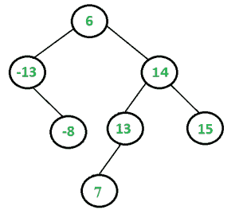

# 查找平衡 BST 中是否有三重态加零

> 原文:[https://www . geesforgeks . org/find-if-if-a-three-in-BST-add-to-0/](https://www.geeksforgeeks.org/find-if-there-is-a-triplet-in-bst-that-adds-to-0/)

给定一个平衡二叉查找树(BST)，编写一个函数 isTripletPresent()，如果给定的 BST 中有一个和等于 0 的三元组，则返回 true，否则返回 false。预期时间复杂度为 O(n^2 ),并且只能使用 O(Logn)个额外空间。你可以修改给定的二叉查找树。请注意，平衡 BST 的高度始终为 O(Logn)
例如，isTripletPresent()应该为后面的 BST 返回 true，因为有一个和为 0 的三元组，该三元组为{-13，6，7}。



**蛮力解**是考虑 BST 中的每个三元组，检查总和是否加起来为零。这个解决方案的时间复杂度将是 O(n^3).
一个**更好的解决方案**是创建一个辅助数组，并在数组中存储 BST 的有序遍历。数组将被排序，因为对 BST 的有序遍历总是产生已排序的数据。一旦我们有了 Inorder 遍历，我们可以使用[这个](https://www.geeksforgeeks.org/find-a-triplet-that-sum-to-a-given-value/)帖子的方法 2 来找到总和等于 0 的三元组。这个解决方案在 O(n^2 时间有效，但是需要 O(n)个辅助空间。
**以下是在 O(n^2 工作的解决方案)时间和使用 O(Logn)额外空间** :
1)将给定的 BST 转换为双链表(DLL)
2)现在迭代 DLL 的每个节点，如果节点的键为负，则在 DLL 中找到一对，其和等于当前节点的键乘以-1。要找到这一对，我们可以使用[这篇](https://www.geeksforgeeks.org/write-a-c-program-that-given-a-set-a-of-n-numbers-and-another-number-x-determines-whether-or-not-there-exist-two-elements-in-s-whose-sum-is-exactly-x/)文章的方法 1 中 hasArrayTwoCandidates()中使用的方法。

## C++

```
// A C++ program to check if there
// is a triplet with sum equal to 0 in
// a given BST
#include <bits/stdc++.h>
using namespace std;

// A BST node has key, and left and right pointers
class node
{
    public:
    int key;
    node *left;
    node *right;
};

// A function to convert given BST to Doubly
// Linked List. left pointer is used
// as previous pointer and right pointer
// is used as next pointer. The function
// sets *head to point to first and *tail
// to point to last node of converted DLL
void convertBSTtoDLL(node* root, node** head, node** tail)
{
    // Base case
    if (root == NULL)
        return;

    // First convert the left subtree
    if (root->left)
        convertBSTtoDLL(root->left, head, tail);

    // Then change left of current root
    // as last node of left subtree
    root->left = *tail;

    // If tail is not NULL, then set right
    // of tail as root, else current
    // node is head
    if (*tail)
        (*tail)->right = root;
    else
        *head = root;

    // Update tail
    *tail = root;

    // Finally, convert right subtree
    if (root->right)
        convertBSTtoDLL(root->right, head, tail);
}

// This function returns true if there
// is pair in DLL with sum equal to given
// sum. The algorithm is similar to hasArrayTwoCandidates()
// in method 1 of http://tinyurl.com/dy6palr
bool isPresentInDLL(node* head, node* tail, int sum)
{
    while (head != tail)
    {
        int curr = head->key + tail->key;
        if (curr == sum)
            return true;
        else if (curr > sum)
            tail = tail->left;
        else
            head = head->right;
    }
    return false;
}

// The main function that returns
// true if there is a 0 sum triplet in
// BST otherwise returns false
bool isTripletPresent(node *root)
{
    // Check if the given BST is empty
    if (root == NULL)
    return false;

    // Convert given BST to doubly linked list. head and tail store the
    // pointers to first and last nodes in DLLL
    node* head = NULL;
    node* tail = NULL;
    convertBSTtoDLL(root, &head, &tail);

    // Now iterate through every node and
    // find if there is a pair with sum
    // equal to -1 * heaf->key where head is current node
    while ((head->right != tail) && (head->key < 0))
    {
        // If there is a pair with sum
        // equal to -1*head->key, then return
        // true else move forward
        if (isPresentInDLL(head->right, tail, -1*head->key))
            return true;
        else
            head = head->right;
    }

    // If we reach here, then
    // there was no 0 sum triplet
    return false;
}

// A utility function to create
// a new BST node with key as given num
node* newNode(int num)
{
    node* temp = new node();
    temp->key = num;
    temp->left = temp->right = NULL;
    return temp;
}

// A utility function to insert a given key to BST
node* insert(node* root, int key)
{
    if (root == NULL)
    return newNode(key);
    if (root->key > key)
        root->left = insert(root->left, key);
    else
        root->right = insert(root->right, key);
    return root;
}

// Driver code
int main()
{
    node* root = NULL;
    root = insert(root, 6);
    root = insert(root, -13);
    root = insert(root, 14);
    root = insert(root, -8);
    root = insert(root, 15);
    root = insert(root, 13);
    root = insert(root, 7);
    if (isTripletPresent(root))
        cout << "Present";
    else
        cout << "Not Present";
    return 0;
}

// This code is contributed by rathbhupendra
```

## C

```
// A C program to check if there is a triplet with sum equal to 0 in
// a given BST
#include<stdio.h>

// A BST node has key, and left and right pointers
struct node
{
    int key;
    struct node *left;
    struct node *right;
};

// A function to convert given BST to Doubly Linked List. left pointer is used
// as previous pointer and right pointer is used as next pointer. The function
// sets *head to point to first and *tail to point to last node of converted DLL
void convertBSTtoDLL(node* root, node** head, node** tail)
{
    // Base case
    if (root == NULL)
        return;

    // First convert the left subtree
    if (root->left)
        convertBSTtoDLL(root->left, head, tail);

    // Then change left of current root as last node of left subtree
    root->left = *tail;

    // If tail is not NULL, then set right of tail as root, else current
    // node is head
    if (*tail)
        (*tail)->right = root;
    else
        *head = root;

    // Update tail
    *tail = root;

    // Finally, convert right subtree
    if (root->right)
        convertBSTtoDLL(root->right, head, tail);
}

// This function returns true if there is pair in DLL with sum equal
// to given sum. The algorithm is similar to hasArrayTwoCandidates()
// in method 1 of http://tinyurl.com/dy6palr
bool isPresentInDLL(node* head, node* tail, int sum)
{
    while (head != tail)
    {
        int curr = head->key + tail->key;
        if (curr == sum)
            return true;
        else if (curr > sum)
            tail = tail->left;
        else
            head = head->right;
    }
    return false;
}

// The main function that returns true if there is a 0 sum triplet in
// BST otherwise returns false
bool isTripletPresent(node *root)
{
    // Check if the given  BST is empty
    if (root == NULL)
       return false;

    // Convert given BST to doubly linked list.  head and tail store the
    // pointers to first and last nodes in DLLL
    node* head = NULL;
    node* tail = NULL;
    convertBSTtoDLL(root, &head, &tail);

    // Now iterate through every node and find if there is a pair with sum
    // equal to -1 * heaf->key where head is current node
    while ((head->right != tail) && (head->key < 0))
    {
        // If there is a pair with sum equal to  -1*head->key, then return
        // true else move forward
        if (isPresentInDLL(head->right, tail, -1*head->key))
            return true;
        else
            head = head->right;
    }

    // If we reach here, then there was no 0 sum triplet
    return false;
}

// A utility function to create a new BST node with key as given num
node* newNode(int num)
{
    node* temp = new node;
    temp->key = num;
    temp->left = temp->right = NULL;
    return temp;
}

// A utility function to insert a given key to BST
node* insert(node* root, int key)
{
    if (root == NULL)
       return newNode(key);
    if (root->key > key)
       root->left = insert(root->left, key);
    else
       root->right = insert(root->right, key);
    return root;
}

// Driver program to test above functions
int main()
{
    node* root = NULL;
    root = insert(root, 6);
    root = insert(root, -13);
    root = insert(root, 14);
    root = insert(root, -8);
    root = insert(root, 15);
    root = insert(root, 13);
    root = insert(root, 7);
    if (isTripletPresent(root))
        printf("Present");
    else
        printf("Not Present");
    return 0;
}
```

## Java 语言(一种计算机语言，尤用于创建网站)

```
// A Java program to check if there
// is a triplet with sum equal to 0 in
// a given BST
import java.util.*;
class GFG
{

  // A BST node has key, and left and right pointers
  static class node
  {
    int key;
    node left;
    node right;
  };
  static node head;
  static node tail;

  // A function to convert given BST to Doubly
  // Linked List. left pointer is used
  // as previous pointer and right pointer
  // is used as next pointer. The function
  // sets *head to point to first and *tail
  // to point to last node of converted DLL
  static void convertBSTtoDLL(node root)
  {

    // Base case
    if (root == null)
      return;

    // First convert the left subtree
    if (root.left != null)
      convertBSTtoDLL(root.left);

    // Then change left of current root
    // as last node of left subtree
    root.left = tail;

    // If tail is not null, then set right
    // of tail as root, else current
    // node is head
    if (tail != null)
      (tail).right = root;
    else
      head = root;

    // Update tail
    tail = root;

    // Finally, convert right subtree
    if (root.right != null)
      convertBSTtoDLL(root.right);
  }

  // This function returns true if there
  // is pair in DLL with sum equal to given
  // sum. The algorithm is similar to hasArrayTwoCandidates()
  // in method 1 of http://tinyurl.com/dy6palr
  static boolean isPresentInDLL(node head, node tail, int sum)
  {
    while (head != tail)
    {
      int curr = head.key + tail.key;
      if (curr == sum)
        return true;
      else if (curr > sum)
        tail = tail.left;
      else
        head = head.right;
    }
    return false;
  }

  // The main function that returns
  // true if there is a 0 sum triplet in
  // BST otherwise returns false
  static boolean isTripletPresent(node root)
  {
    // Check if the given BST is empty
    if (root == null)
      return false;

    // Convert given BST to doubly linked list. head and tail store the
    // pointers to first and last nodes in DLLL
    head = null;
    tail = null;
    convertBSTtoDLL(root);

    // Now iterate through every node and
    // find if there is a pair with sum
    // equal to -1 * heaf.key where head is current node
    while ((head.right != tail) && (head.key < 0))
    {
      // If there is a pair with sum
      // equal to -1*head.key, then return
      // true else move forward
      if (isPresentInDLL(head.right, tail, -1*head.key))
        return true;
      else
        head = head.right;
    }

    // If we reach here, then
    // there was no 0 sum triplet
    return false;
  }

  // A utility function to create
  // a new BST node with key as given num
  static node newNode(int num)
  {
    node temp = new node();
    temp.key = num;
    temp.left = temp.right = null;
    return temp;
  }

  // A utility function to insert a given key to BST
  static node insert(node root, int key)
  {
    if (root == null)
      return newNode(key);
    if (root.key > key)
      root.left = insert(root.left, key);
    else
      root.right = insert(root.right, key);
    return root;
  }

  // Driver code
  public static void main(String[] args)
  {
    node root = null;
    root = insert(root, 6);
    root = insert(root, -13);
    root = insert(root, 14);
    root = insert(root, -8);
    root = insert(root, 15);
    root = insert(root, 13);
    root = insert(root, 7);
    if (isTripletPresent(root))
      System.out.print("Present");
    else
      System.out.print("Not Present");
  }
}

// This code is contributed by aashish1995
```

## C#

```
// A C# program to check if there
// is a triplet with sum equal to 0 in
// a given BST
using System;
public class GFG
{

  // A BST node has key, and left and right pointers
  public class node
  {
    public int key;
    public  node left;
    public  node right;
  };
  static node head;
  static node tail;

  // A function to convert given BST to Doubly
  // Linked List. left pointer is used
  // as previous pointer and right pointer
  // is used as next pointer. The function
  // sets *head to point to first and *tail
  // to point to last node of converted DLL
  static void convertBSTtoDLL(node root)
  {

    // Base case
    if (root == null)
      return;

    // First convert the left subtree
    if (root.left != null)
      convertBSTtoDLL(root.left);

    // Then change left of current root
    // as last node of left subtree
    root.left = tail;

    // If tail is not null, then set right
    // of tail as root, else current
    // node is head
    if (tail != null)
      (tail).right = root;
    else
      head = root;

    // Update tail
    tail = root;

    // Finally, convert right subtree
    if (root.right != null)
      convertBSTtoDLL(root.right);
  }

  // This function returns true if there
  // is pair in DLL with sum equal to given
  // sum. The algorithm is similar to hasArrayTwoCandidates()
  // in method 1 of http://tinyurl.com/dy6palr
  static bool isPresentInDLL(node head, node tail, int sum)
  {
    while (head != tail)
    {
      int curr = head.key + tail.key;
      if (curr == sum)
        return true;
      else if (curr > sum)
        tail = tail.left;
      else
        head = head.right;
    }
    return false;
  }

  // The main function that returns
  // true if there is a 0 sum triplet in
  // BST otherwise returns false
  static bool isTripletPresent(node root)
  {

    // Check if the given BST is empty
    if (root == null)
      return false;

    // Convert given BST to doubly linked list. head and tail store the
    // pointers to first and last nodes in DLLL
    head = null;
    tail = null;
    convertBSTtoDLL(root);

    // Now iterate through every node and
    // find if there is a pair with sum
    // equal to -1 * heaf.key where head is current node
    while ((head.right != tail) && (head.key < 0))
    {
      // If there is a pair with sum
      // equal to -1*head.key, then return
      // true else move forward
      if (isPresentInDLL(head.right, tail, -1*head.key))
        return true;
      else
        head = head.right;
    }

    // If we reach here, then
    // there was no 0 sum triplet
    return false;
  }

  // A utility function to create
  // a new BST node with key as given num
  static node newNode(int num)
  {
    node temp = new node();
    temp.key = num;
    temp.left = temp.right = null;
    return temp;
  }

  // A utility function to insert a given key to BST
  static node insert(node root, int key)
  {
    if (root == null)
      return newNode(key);
    if (root.key > key)
      root.left = insert(root.left, key);
    else
      root.right = insert(root.right, key);
    return root;
  }

  // Driver code
  public static void Main(String[] args)
  {
    node root = null;
    root = insert(root, 6);
    root = insert(root, -13);
    root = insert(root, 14);
    root = insert(root, -8);
    root = insert(root, 15);
    root = insert(root, 13);
    root = insert(root, 7);
    if (isTripletPresent(root))
      Console.Write("Present");
    else
      Console.Write("Not Present");
  }
}

// This code is contributed by aashish1995
```

## java 描述语言

```
<script>

// A JavaScript program to check if there
// is a triplet with sum equal to 0 in
// a given BST

    // A BST node has key,
    // and left and right pointers
     class node {
        constructor(val) {
            this.key = val;
            this.left = null;
            this.right = null;
        }
    }

     var head;
     var tail;

    // A function to convert given BST to Doubly
    // Linked List. left pointer is used
    // as previous pointer and right pointer
    // is used as next pointer. The function
    // sets *head to point to first and *tail
    // to point to last node of converted DLL
    function convertBSTtoDLL( root) {

        // Base case
        if (root == null)
            return;

        // First convert the left subtree
        if (root.left != null)
            convertBSTtoDLL(root.left);

        // Then change left of current root
        // as last node of left subtree
        root.left = tail;

        // If tail is not null, then set right
        // of tail as root, else current
        // node is head
        if (tail != null)
            (tail).right = root;
        else
            head = root;

        // Update tail
        tail = root;

        // Finally, convert right subtree
        if (root.right != null)
            convertBSTtoDLL(root.right);
    }

    // This function returns true if there
    // is pair in DLL with sum equal to given
    // sum. The algorithm is
    // similar to hasArrayTwoCandidates()
    // in method 1 of http://tinyurl.com/dy6palr
    function isPresentInDLL( head,  tail , sum) {
        while (head != tail) {
            var curr = head.key + tail.key;
            if (curr == sum)
                return true;
            else if (curr > sum)
                tail = tail.left;
            else
                head = head.right;
        }
        return false;
    }

    // The main function that returns
    // true if there is a 0 sum triplet in
    // BST otherwise returns false
    function isTripletPresent( root) {
        // Check if the given BST is empty
        if (root == null)
            return false;

        // Convert given BST to doubly
        // linked list. head and tail store the
        // pointers to first and last nodes in DLLL
        head = null;
        tail = null;
        convertBSTtoDLL(root);

        // Now iterate through every node and
        // find if there is a pair with sum
        // equal to -1 * heaf.key where
        // head is current node
        while ((head.right != tail) && (head.key < 0))
        {
            // If there is a pair with sum
            // equal to -1*head.key, then return
            // true else move forward
            if (isPresentInDLL(head.right, tail,
            -1 * head.key))
                return true;
            else
                head = head.right;
        }

        // If we reach here, then
        // there was no 0 sum triplet
        return false;
    }

    // A utility function to create
    // a new BST node with key as given num
     function newNode(num) {
        var temp = new node();
        temp.key = num;
        temp.left = temp.right = null;
        return temp;
    }

    // A utility function to insert a given key to BST
     function insert( root , key) {
        if (root == null)
            return newNode(key);
        if (root.key > key)
            root.left = insert(root.left, key);
        else
            root.right = insert(root.right, key);
        return root;
    }

    // Driver code

        var root = null;
        root = insert(root, 6);
        root = insert(root, -13);
        root = insert(root, 14);
        root = insert(root, -8);
        root = insert(root, 15);
        root = insert(root, 13);
        root = insert(root, 7);
        if (isTripletPresent(root))
            document.write("Present");
        else
            document.write("Not Present");

// This code contributed by gauravrajput1

</script>
```

**输出:**

```
Present
```

请注意，上述解决方案修改了给定的 BST。
时间复杂度:将 BST 转换为 DLL 所花费的时间为 O(n)，在 DLL 中找到三元组所花费的时间为 O(n^2).
辅助空间:递归函数 convertBSTtoDLL()中的函数调用栈只需要辅助空间。由于给定的树是平衡的(高度为 0(Logn))，调用堆栈中的函数数量永远不会超过 0(Logn)。
我们也可以在不修改树的情况下，在相同的时间和额外的空间中找到三元组。见[下一篇](https://www.geeksforgeeks.org/find-a-pair-with-given-sum-in-bst/)帖子。那里讨论的代码也可以用来寻找三元组。
本文由 [Ashish Anand](https://www.facebook.com/aasshishh?fref=ts) 整理，GeeksforGeeks 团队审核。如果你发现任何不正确的地方，或者你想分享更多关于上面讨论的话题的信息，请写评论。