# 判断两个给定的二次方程是否有公共根

> 原文:[https://www . geesforgeks . org/find-if-two-给定二次方程-有-公共根-or-not/](https://www.geeksforgeeks.org/find-if-two-given-quadratic-equations-have-common-roots-or-not/)

给定第一个二次方程的值 **a1** 、 **b1** 和 **c1** 以及第二个二次方程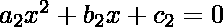的值 **a2** 、 **b2** 和 **c2** ，任务是找出两个二次方程是否有公共根。
**举例:**

> **输入:** a1 = 1，b1 = -5，c1 = 6，a2 = 2，b2 = -10，c2 = 12
> **输出:**是
> T6】解释:
> 两个二次方程的根都是(2，3)
> **输入:** a1 = 1，b1 = -5，c1 = 6，a2 = 1，b2 = -9，c2 = 20
> **输出:**否【T15

**逼近:**
让两个二次方程分别为和T5

*   让我们假设给定的条件为真，即两个方程都有共同的根，比如和T2
*   我们知道
    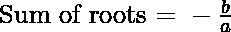和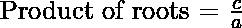
    其中 a、b、c 代表二次方程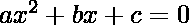

*   因此，
    为第一次二次方程:
    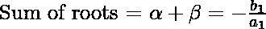
    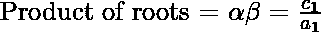
    同理，为第二次二次方程:
    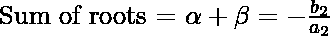
    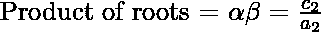

*   现在既然这两个词根都是共同的，
    因此，从上面的方程式
    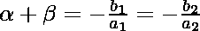
    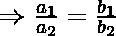

*   还有，
    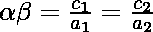
    

*   结合上述等式:

*   这是两个二次方程的两个根为公共的必要条件。

**节目:**

## C++

```
// C++ Program to Find if two given
// Quadratic equations have
// common roots or not

#include <iostream>
using namespace std;

// function to check if 2 quadratic
// equations have common roots or not.
bool checkSolution(float a1, float b1,
                   float c1, float a2,
                   float b2, float c2)
{
    return (a1 / a2) == (b1 / b2)
           && (b1 / b2) == (c1 / c2);
}

// Driver code
int main()
{
    float a1 = 1, b1 = -5, c1 = 6;
    float a2 = 2, b2 = -10, c2 = 12;
    if (checkSolution(a1, b1, c1, a2, b2, c2))
        cout << "Yes";
    else
        cout << "No";
    return 0;
}
```

## Java 语言(一种计算机语言，尤用于创建网站)

```
// Java Program to Find if two given
// quadratic equations have common 
// roots or not
class GFG {

// Function to check if 2 quadratic
// equations have common roots or not.
static boolean checkSolution(float a1, float b1,
                             float c1, float a2,
                             float b2, float c2)
{
    return ((a1 / a2) == (b1 / b2) && 
            (b1 / b2) == (c1 / c2));
}

// Driver code
public static void main (String[] args) 
{
    float a1 = 1, b1 = -5, c1 = 6;
    float a2 = 2, b2 = -10, c2 = 12;

    if (checkSolution(a1, b1, c1, a2, b2, c2))
        System.out.println("Yes");
    else
        System.out.println("No");
}
}

// This code is contributed by AnkitRai01
```

## 蟒蛇 3

```
# Python3 program to find if two given 
# quadratic equations have common  
# roots or not 

# Function to check if 2 quadratic 
# equations have common roots or not. 
def checkSolution(a1, b1, c1, a2, b2, c2): 

    return ((a1 / a2) == (b1 / b2) and 
            (b1 / b2) == (c1 / c2))

# Driver code 
a1, b1, c1 = 1, -5, 6
a2, b2, c2 = 2, -10, 12

if (checkSolution(a1, b1, c1, a2, b2, c2)): 
    print("Yes") 
else:
    print("No") 

# This code is contributed by divyamohan123
```

## C#

```
// C# Program to Find if two given
// quadratic equations have common 
// roots or not
using System;
class GFG{

// Function to check if 2 quadratic
// equations have common roots or not.
static bool checkSolution(float a1, float b1,
                          float c1, float a2,
                          float b2, float c2)
{
    return ((a1 / a2) == (b1 / b2) && 
            (b1 / b2) == (c1 / c2));
}

// Driver code
public static void Main (string[] args) 
{
    float a1 = 1, b1 = -5, c1 = 6;
    float a2 = 2, b2 = -10, c2 = 12;

    if (checkSolution(a1, b1, c1, a2, b2, c2))
        Console.WriteLine("Yes");
    else
        Console.WriteLine("No");
}
}

// This code is contributed by AnkitRai01
```

## java 描述语言

```
<script>

// Javascript Program to Find if two given
// Quadratic equations have
// common roots or not

// function to check if 2 quadratic
// equations have common roots or not.
function checkSolution(a1, b1, c1, a2, b2, c2)
{
    return (a1 / a2) == (b1 / b2)
           && (b1 / b2) == (c1 / c2);
}

// Driver code
a1 = 1, b1 = -5, c1 = 6;
a2 = 2, b2 = -10, c2 = 12;
if (checkSolution(a1, b1, c1, a2, b2, c2))
    document.write("Yes");
else
    document.write("No");

</script>
```

**Output:** 

```
Yes
```

***时间复杂度:** O(1)*

***辅助空间:** O(1)*