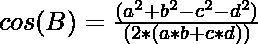

# 求给定循环四边形每条边的内角

> 原文:[https://www . geeksforgeeks . org/find-给定循环四边形每侧的内角/](https://www.geeksforgeeks.org/find-interior-angles-for-each-side-of-a-given-cyclic-quadrilateral/)

给定代表循环四边形边的四个正整数 **A** 、 **B** 、 **C** 和 **D** ，任务是找出循环四边形的所有[内角。](https://www.geeksforgeeks.org/exterior-angle-of-a-cyclic-quadrilateral-when-the-opposite-interior-angle-is-given/)

> [](https://media.geeksforgeeks.org/wp-content/uploads/20210318170611/cyc.png)
> 
> 循环四边形是顶点位于单个圆上的四边形。
> 这个圆叫做外接圆或外接圆，顶点称为共圈(A，B，C，D)。
> (图中 r 为外接圆半径，a、b、c、d 分别为 AB、BC、CD、d a 的长度)。

**示例:**

> **输入:** A = 10，B = 15，C = 20，D = 25
> **输出:**
> ≈A:85.59 度
> ≈B:122.58 度
> ≈C:94.41 度
> ≈D:57.42 度
> 
> **输入:** A = 10，B = 10，C = 10，D = 10
> T3】输出:T5】≈A:90.00 度
> ≈B:90.00 度
> ≈C:90.00 度
> ≈D:90.00 度

**方法:**利用公式计算一个[循环四边形](https://en.wikipedia.org/wiki/Cyclic_quadrilateral)的内角余弦即可解决给定问题。该公式由下式给出:

[](https://media.geeksforgeeks.org/wp-content/uploads/20210318170611/cyc.png)

> 
> 
> 
> 
> 
> 
> 

按照以下步骤解决问题:

*   存储循环四边形各内角的[余弦。](https://www.geeksforgeeks.org/find-angles-given-triangle/)
*   使用 [acos()](https://www.geeksforgeeks.org/acos-function-in-c-stl/) 函数求角度的弧度。
*   [将弧度角度转换为度数](https://www.geeksforgeeks.org/program-convert-radian-degree/)并打印结果。

下面是上述方法的实现:

## C++

```
// C++ program for the above approach
#include <bits/stdc++.h>
using namespace std;

// Function to find the interior angles
// of the cyclic quadrilateral
void findAngles(double a, double b,
                double c, double d)
{
    // Stores the numerator and the
    // denominator to find angle A
    double numerator = a * a + d * d
                       - b * b - c * c;

    double denominator = 2 * (a * b + c * d);

    double x = numerator / denominator;

    cout << fixed << setprecision(2)
         << "A: " << (acos(x) * 180) / 3.141592
         << " degrees";

    // Stores the numerator and the
    // denominator to find angle B
    numerator = a * a + b * b
                - c * c - d * d;

    x = numerator / denominator;

    cout << fixed << setprecision(2)
         << "\nB: " << (acos(x) * 180) / 3.141592
         << " degrees";

    // Stores the numerator and the
    // denominator to find angle C:
    numerator = c * c + b * b
                - a * a - d * d;

    x = numerator / denominator;

    cout << fixed << setprecision(2)
         << "\nC: " << (acos(x) * 180) / 3.141592
         << " degrees";

    // Stores the numerator and the
    // denominator to find angle D:
    numerator = d * d + c * c
                - a * a - b * b;

    x = numerator / denominator;

    cout << fixed << setprecision(2)
         << "\nD: " << (acos(x) * 180) / 3.141592
         << " degrees";
}

// Driver Code
int main()
{
    double A = 10, B = 15, C = 20, D = 25;
    findAngles(A, B, C, D);

    return 0;
}
```

## Java 语言(一种计算机语言，尤用于创建网站)

```
// Java program for the above approach
class GFG{

// Function to find the interior angles
// of the cyclic quadrilateral
static void findAngles(double a, double b,
                       double c, double d)
{

    // Stores the numerator and the
    // denominator to find angle A
    double numerator = a * a + d * d -
                       b * b - c * c;

    double denominator = 2 * (a * b + c * d);

    double x = numerator / denominator;

    System.out.println("A: " +
       Math.round(((Math.acos(x) * 180) /
                       3.141592) * 100.0) /
                       100.0 + " degrees");

    // Stores the numerator and the
    // denominator to find angle B
    numerator = a * a + b * b - c * c - d * d;

    x = numerator / denominator;

    System.out.println("B: " +
       Math.round(((Math.acos(x) * 180) /
                       3.141592) * 100.0) /
                       100.0 + " degrees");

    // Stores the numerator and the
    // denominator to find angle C:
    numerator = c * c + b * b -
                a * a - d * d;

    x = numerator / denominator;

    System.out.println("C: " +
       Math.round(((Math.acos(x) * 180) /
                       3.141592) * 100.0) /
                       100.0 + " degrees");

    // Stores the numerator and the
    // denominator to find angle D:
    numerator = d * d + c * c -
                a * a - b * b;

    x = numerator / denominator;

    System.out.println("D: " +
       Math.round(((Math.acos(x) * 180) /
                       3.141592) * 100.0) /
                       100.0 + " degrees");
}

// Driver Code
public static void main (String[] args)
{
    double A = 10, B = 15, C = 20, D = 25;

    findAngles(A, B, C, D);
}
}

// This code is contributed by AnkThon
```

## 蟒蛇 3

```
# Python3 program for the above approach
import math

# Function to find the interior angles
# of the cyclic quadrilateral
def findAngles(a, b, c, d):

    # Stores the numerator and the
    # denominator to find angle A
    numerator = a * a + d * d - b * b - c * c
    denominator = 2 * (a * b + c * d)
    x = numerator / denominator
    print("A: ", '%.2f' % ((math.acos(x) * 180) /
          3.141592), " degrees")

    # Stores the numerator and the
    # denominator to find angle B
    numerator = a * a + b * b - c * c - d * d
    x = numerator / denominator
    print("B: ", '%.2f' % ((math.acos(x) * 180) /
          3.141592), " degrees")

    # Stores the numerator and the
    # denominator to find angle C:
    numerator = c * c + b * b - a * a - d * d
    x = numerator / denominator
    print("C: ", '%.2f' % ((math.acos(x) * 180) /
          3.141592), " degrees")

    # Stores the numerator and the
    # denominator to find angle D:
    numerator = d * d + c * c - a * a - b * b
    x = numerator / denominator
    print("D: ", '%.2f' % ((math.acos(x) * 180) /
          3.141592), " degrees")

# Driver Code
if __name__ == "__main__":

    A = 10
    B = 15
    C = 20
    D = 25

    findAngles(A, B, C, D)

# This code is contributed by ukasp
```

## C#

```
// C# program for the above approach
using System;

class GFG{

// Function to find the interior angles
// of the cyclic quadrilateral
static void findAngles(double a, double b,
                       double c, double d)
{

    // Stores the numerator and the
    // denominator to find angle A
    double numerator = a * a + d * d -
                       b * b - c * c;

    double denominator = 2 * (a * b + c * d);

    double x = numerator / denominator;

    Console.WriteLine("A: " +
       Math.Round(((Math.Acos(x) * 180) /
                       3.141592) * 100.0) /
                       100.0 + " degrees");

    // Stores the numerator and the
    // denominator to find angle B
    numerator = a * a + b * b - c * c - d * d;

    x = numerator / denominator;

    Console.WriteLine("B: " +
       Math.Round(((Math.Acos(x) * 180) /
                       3.141592) * 100.0) /
                       100.0 + " degrees");

    // Stores the numerator and the
    // denominator to find angle C:
    numerator = c * c + b * b -
                a * a - d * d;

    x = numerator / denominator;

    Console.WriteLine("C: " +
       Math.Round(((Math.Acos(x) * 180) /
                       3.141592) * 100.0) /
                       100.0 + " degrees");

    // Stores the numerator and the
    // denominator to find angle D:
    numerator = d * d + c * c -
                a * a - b * b;

    x = numerator / denominator;

    Console.WriteLine("D: " +
       Math.Round(((Math.Acos(x) * 180) /
                       3.141592) * 100.0) /
                       100.0 + " degrees");
}

// Driver Code
public static void Main(string[] args)
{
    double A = 10, B = 15, C = 20, D = 25;

    findAngles(A, B, C, D);
}
}

// This code is contributed by AnkThon
```

## java 描述语言

```
<script>

// JavaScript program for the above approach

// Function to find the interior angles
// of the cyclic quadrilateral
function findAngles(a, b, c, d){

    // Stores the numerator and the
    // denominator to find angle A
    var numerator = a * a + d * d - b * b - c * c
    var denominator = 2 * (a * b + c * d)
    var x = numerator / denominator
    document.write("A: ", Math.round(((Math.acos(x) * 180) /
                       3.141592) * 100) / 100.0, " degrees");
    document.write("<br>");

    // Stores the numerator and the
    // denominator to find angle B
    numerator = a * a + b * b - c * c - d * d
    x = numerator / denominator
    document.write("B: ",  Math.round(((Math.acos(x) * 180) /
          3.141592) * 100) / 100.0, " degrees");
    document.write("<br>");

    // Stores the numerator and the
    // denominator to find angle C:
    numerator = c * c + b * b - a * a - d * d
    x = numerator / denominator
    document.write("C: ", Math.round(((Math.acos(x) * 180) /
          3.141592)  * 100) / 100.0, " degrees");
    document.write("<br>");

    // Stores the numerator and the
    // denominator to find angle D:
    numerator = d * d + c * c - a * a - b * b
    x = numerator / denominator
    document.write("D: ", Math.round(((Math.acos(x) * 180) /
          3.141592)  * 100) / 100.0, " degrees");
}

// Driver Code   
var A = 10
var B = 15
var C = 20
var D = 25

findAngles(A, B, C, D)

// This code is contributed by AnkThon

</script>
```

**Output:** 

```
A: 85.59 degrees
B: 122.58 degrees
C: 94.41 degrees
D: 57.42 degrees
```

***时间复杂度:**O(1)*
T5**辅助空间:** O(1)