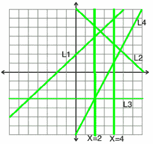

# 求一段内直线的交点

> 原文:[https://www . geesforgeks . org/find-交点-直线-内部-截面/](https://www.geeksforgeeks.org/find-intersection-point-lines-inside-section/)

给定二维空间中 y = mx + b 形式的 N 条线和一个垂直截面。我们需要找出给定截面内是否有交点。
示例:

```
In below diagram four lines are there,
L1 :    y = x + 2
L2 :    y = -x + 7
L3 :    y = -3
L4 :    y = 2x – 7
and vertical section is given from x = 2 to x = 4
```



```
We can see that in above diagram, the 
intersection point of line L1 and L2 
lies between the section.
```

我们可以使用排序来解决这个问题。首先，我们将计算每条线与垂直截面边界的交点，并将其存储为一对。我们只需要将交点的 y 坐标存储为一对，因为 x 坐标等于边界本身。现在我们将根据它们与左边界的交点对这些对进行排序。之后，我们将一个接一个地循环这些对，如果对于任何两个连续的对，当前对的第二个值小于前一对的第二个值，那么在给定的垂直部分中一定有交集。
上图中可以看到 L1 和 L2 连续两对的可能方位。我们可以看到，当第二个值较少时，交点位于垂直截面。
解的总时间复杂度为 0(n logn)

## 卡片打印处理机（Card Print Processor 的缩写）

```
// C++ program to check an intersection point
// inside a given vertical section
#include <bits/stdc++.h>
using namespace std;

// structure to represent a line
struct line {
    int m, b;
    line()  { }
    line(int m, int b) : m(m), b(b)  { }
};

// Utility method to get Y-coordinate 
// corresponding to x in line l
int getYFromLine(line l, int x)
{
    return (l.m * x + l.b);
}

// method returns true if two line cross
// each other between xL and xR range
bool isIntersectionPointInsideSection(line lines[], 
                            int xL, int xR, int N)
{
    pair<int, int> yBoundary[N];

    // first calculating y-values and putting 
    // in boundary pair
    for (int i = 0; i < N; i++) 
        yBoundary[i] = make_pair(getYFromLine(lines[i], xL), 
                               getYFromLine(lines[i], xR));

    // sorting the pair on the basis of first
    // boundary intersection
    sort(yBoundary, yBoundary + N);

    // looping over sorted pairs for comparison
    for (int i = 1; i < N; i++) {

        // if current pair's second value is smaller
        // than previous pair's then return true
        if (yBoundary[i].second < yBoundary[i - 1].second) 
            return true;        
    }

    return false;
}

// Driver code to test above methods
int main()
{
    int N = 4;
    int m[] = { 1, -1, 0, 2 };
    int b[] = { 2, 7, -3, -7 };

    // copy values in line struct
    line lines[N];
    for (int i = 0; i < N; i++) {
        lines[i] = line(m[i], b[i]);

    int xL = 2;
    int xR = 4;

    if (isIntersectionPointInsideSection(lines, xL, xR, N)) {
        cout << "Intersection point lies between " 
             << xL << " and " << xR << endl;
    } else {
        cout << "No Intersection point lies between " 
             << xL << " and " << xR << endl;
    }
}
```

输出:

```
Intersection point lies between 2 and 4
```

本文由 [**乌卡什·特里维迪**](https://in.linkedin.com/in/utkarsh-trivedi-253069a7) 供稿。如果你喜欢 GeeksforGeeks 并想投稿，你也可以使用[write.geeksforgeeks.org](http://www.write.geeksforgeeks.org)写一篇文章或者把你的文章邮寄到 review-team@geeksforgeeks.org。看到你的文章出现在极客博客主页上，帮助其他极客。
如果发现有不正确的地方，或者想分享更多关于上述话题的信息，请写评论。