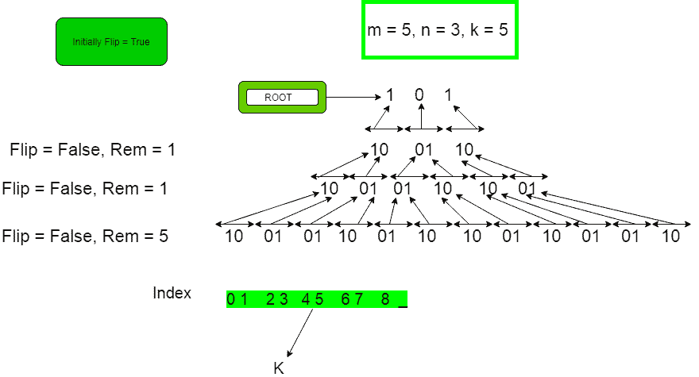

# 在 n 次迭代后得到的二进制字符串中找到第 I 个索引字符|集合 2

> 原文:[https://www . geesforgeks . org/find-with-index-二进制字符串中的字符-n 次迭代后获得-set-2/](https://www.geeksforgeeks.org/find-ith-index-character-in-a-binary-string-obtained-after-n-iterations-set-2/)

给定一个十进制数 m，将其转换为二进制字符串并应用 n 次迭代，在每次迭代中 0 变成“01”，1 变成“10”。在第 n 次迭代后，在字符串中查找第(基于索引的)索引字符。
**例** :

```
Input: m = 5 i = 5 n = 3
Output: 1
Explanation
In the first case m = 5, i = 5, n = 3\. 
Initially, the string is  101  ( binary equivalent of 5 )
After 1st iteration -   100110
After 2nd iteration - 100101101001
After 3rd iteration -   100101100110100110010110 
The character at index 5 is 1, so 1 is the answer

Input: m = 11 i = 6 n = 4
Output: 1
```

这个问题的一种**天真的做法**已经在[之前的](https://www.geeksforgeeks.org/find-ith-index-character-in-a-binary-string-obtained-after-n-iterations/)帖子中讨论过了。
**高效算法**:第一步是进行 N 次迭代后，找出第 I 个字符会在哪个区块。在第 n 次迭代中，任何两个连续字符之间的距离最初总是等于 2^n.，对于一般的数字 m，块的数量将是 ceil(log m)。如果 M 是 3，字符串被分成 3 个块。通过 k / (2^n)找到第 k 个字符所在的块号，其中 n 是迭代次数。考虑 m=5，那么二进制表示为 101。那么任意第 I 次迭代中任意 2 个连续标记字符之间的距离如下
第 0 次迭代:101，距离= 0
第 1 次迭代:**1**0**0**1**1**0，距离= 2
第 2 次迭代:1001**0**110**1**001，距离= 4
第 3 次迭代:**1【t27 距离= 8
在本例中 k = 5，n = 3，因此 Block_number，当 k 为 5 时，将为 0，如 5 / (2^3) = 0
最初，block numbers 将为** 

```
Original String :    1   0    1
Block_number    :    0   1    2
```

不需要生成整个字符串，只有在第 I 个字符所在的块中计算才会给出答案。让这个字符是根**根= s【Block _ number】**，其中 s 是“m”的二进制表示。现在在最后一个字符串中，找到第 k 个字符与块号的距离，将这个距离称为剩余距离。因此**剩余= k % (2^n)** 将是区块中第 I 个字符的索引。如果剩余为 0，根将是答案。现在，为了检查根是否是实际的答案，使用一个布尔变量*翻转*，这决定了我们是否需要翻转我们的答案。遵循下面的算法将给出第 I 个索引处的字符。

```
bool flip = true;
while(remaining > 1){
   if( remaining is odd ) 
        flip = !flip    
   remaining = remaining/2;
}
```



以下是上述方法的实现:

## C++

```
// C++ program to find i’th Index character
// in a binary string obtained after n iterations
#include <bits/stdc++.h>
using namespace std;

// Function to find the i-th character
void KthCharacter(int m, int n, int k)
{
    // distance between two consecutive
    // elements after N iterations
    int distance = pow(2, n);
    int Block_number = k / distance;
    int remaining = k % distance;

    int s[32], x = 0;

    // binary representation of M
    for (; m > 0; x++) {
        s[x] = m % 2;
        m = m / 2;
    }

    // kth digit will be derived from root for sure
    int root = s[x - 1 - Block_number];

    if (remaining == 0) {
        cout << root << endl;
        return;
    }

    // Check whether there is need to
    // flip root or not
    bool flip = true;
    while (remaining > 1) {
        if (remaining & 1) {
            flip = !flip;
        }
        remaining = remaining >> 1;
    }

    if (flip) {
        cout << !root << endl;
    }
    else {
        cout << root << endl;
    }
}

// Driver Code
int main()
{
    int m = 5, k = 5, n = 3;
    KthCharacter(m, n, k);
    return 0;
}
```

## Java 语言(一种计算机语言，尤用于创建网站)

```
// Java program to find ith
// Index character in a binary
// string obtained after n iterations
import java.io.*;

class GFG
{
// Function to find
// the i-th character
static void KthCharacter(int m,
                         int n, int k)
{
    // distance between two
    // consecutive elements
    // after N iterations
    int distance = (int)Math.pow(2, n);
    int Block_number = k / distance;
    int remaining = k % distance;

    int s[] = new int[32];
    int x = 0;

    // binary representation of M
    for (; m > 0; x++)
    {
        s[x] = m % 2;
        m = m / 2;
    }

    // kth digit will be
    // derived from root
    // for sure
    int root = s[x - 1 -
                 Block_number];

    if (remaining == 0)
    {
        System.out.println(root);
        return;
    }

    // Check whether there is
    // need to flip root or not
    Boolean flip = true;
    while (remaining > 1)
    {
        if ((remaining & 1) > 0)
        {
            flip = !flip;
        }
        remaining = remaining >> 1;
    }

    if (flip)
    {
        System.out.println((root > 0)?0:1);
    }
    else
    {
        System.out.println(root);
    }
}

// Driver Code
public static void main (String[] args)
{
    int m = 5, k = 5, n = 3;
    KthCharacter(m, n, k);
}
}

// This code is contributed
// by anuj_67.
```

## 蟒蛇 3

```
# Python3 program to find
# i’th Index character in
# a binary string obtained
# after n iterations

# Function to find
# the i-th character
def KthCharacter(m, n, k):

    # distance between two
    # consecutive elements
    # after N iterations
    distance = pow(2, n)
    Block_number = int(k / distance)
    remaining = k % distance

    s = [0] * 32
    x = 0

    # binary representation of M
    while(m > 0) :
        s[x] = m % 2
        m = int(m / 2)
        x += 1

    # kth digit will be derived
    # from root for sure
    root = s[x - 1 - Block_number]

    if (remaining == 0):
        print(root)
        return

    # Check whether there
    # is need to flip root
    # or not
    flip = True
    while (remaining > 1):
        if (remaining & 1):
            flip = not(flip)

        remaining = remaining >> 1

    if (flip) :
        print(not(root))

    else :
        print(root)

# Driver Code
m = 5
k = 5
n = 3
KthCharacter(m, n, k)

# This code is contributed
# by smita
```

## C#

```
// C# program to find ith
// Index character in a
// binary string obtained
// after n iterations
using System;

class GFG
{
// Function to find
// the i-th character
static void KthCharacter(int m,
                         int n,
                         int k)
{
    // distance between two
    // consecutive elements
    // after N iterations
    int distance = (int)Math.Pow(2, n);
    int Block_number = k / distance;
    int remaining = k % distance;

    int []s = new int[32];
    int x = 0;

    // binary representation of M
    for (; m > 0; x++)
    {
        s[x] = m % 2;
        m = m / 2;
    }

    // kth digit will be
    // derived from root
    // for sure
    int root = s[x - 1 -
                 Block_number];

    if (remaining == 0)
    {
        Console.WriteLine(root);
        return;
    }

    // Check whether there is
    // need to flip root or not
    Boolean flip = true;
    while (remaining > 1)
    {
        if ((remaining & 1) > 0)
        {
            flip = !flip;
        }

        remaining = remaining >> 1;
    }

    if (flip)
    {
        Console.WriteLine(!(root > 0));
    }
    else
    {
        Console.WriteLine(root);
    }
}

// Driver Code
public static void Main ()
{
    int m = 5, k = 5, n = 3;
    KthCharacter(m, n, k);
}
}

// This code is contributed
// by anuj_67.
```

## 服务器端编程语言（Professional Hypertext Preprocessor 的缩写）

```
<?php
// PHP program to find i’th Index character
// in a binary string obtained after n iterations

// Function to find the i-th character
function KthCharacter($m, $n, $k)
{
    // distance between two consecutive
    // elements after N iterations
    $distance = pow(2, $n);
    $Block_number = intval($k / $distance);
    $remaining = $k % $distance;

    $s = array(32);
    $x = 0;

    // binary representation of M
    for (; $m > 0; $x++)
    {
        $s[$x] = $m % 2;
        $m = intval($m / 2);
    }

    // kth digit will be derived from
    // root for sure
    $root = $s[$x - 1 - $Block_number];

    if ($remaining == 0)
    {
        echo $root . "\n";
        return;
    }

    // Check whether there is need to
    // flip root or not
    $flip = true;
    while ($remaining > 1)
    {
        if ($remaining & 1)
        {
            $flip = !$flip;
        }
        $remaining = $remaining >> 1;
    }

    if ($flip)
    {
        echo !$root . "\n";
    }
    else
    {
        echo $root . "\n";
    }
}

// Driver Code
$m = 5;
$k = 5;
$n = 3;
KthCharacter($m, $n, $k);

// This code is contributed by ita_c
?>
```

## java 描述语言

```
<script>

// Javascript program to find ith
// Index character in a binary
// string obtained after n iterations

// Function to find
// the i-th character
function KthCharacter(m, n, k)
{

    // distance between two
    // consecutive elements
    // after N iterations
    let distance = Math.pow(2, n);
    let Block_number = Math.floor(k / distance);
    let remaining = k % distance;

    let s = new Array(32).fill(0);
    let x = 0;

    // binary representation of M
    for (; m > 0; x++)
    {
        s[x] = m % 2;
        m = Math.floor(m / 2);
    }

    // kth digit will be
    // derived from root
    // for sure
    let root = s[x - 1 -
                 Block_number];

    if (remaining == 0)
    {
        document.write(root);
        return;
    }

    // Check whether there is
    // need to flip root or not
    let flip = true;
    while (remaining > 1)
    {
        if ((remaining & 1) > 0)
        {
            flip = !flip;
        }
        remaining = remaining >> 1;
    }

    if (flip)
    {
        document.write((root > 0)?0:1);
    }
    else
    {
        document.write(root);
    }
}

// driver program   
    let m = 5, k = 5, n = 3;
    KthCharacter(m, n, k);

  // This code is contributed by susmitakundugoaldanga.
</script>
```

**Output:** 

```
1
```

**时间复杂度:** O(log Z)，其中 Z 是 N 次迭代后初始连续比特之间的距离
T3】辅助空间: O(1)